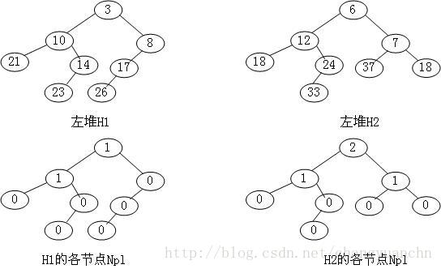

# Leftist Heap左式堆

## 概念

零路径长（null path length）Npl(X)：结点X到一个没有两个儿子的结点的最短路径的长度。这里我们定义没有两个儿子的结点的Npl(x) =0；Npl(NULL) = -1.

对于任意节点的左右两个子节点，右子节点的npl不大于左子节点的npl,这样的堆我们称为左堆

- 定理:在右路径上有r个结点的左式堆必然至少有$2^r - 1$个结点(右路径指从根节点出发一路找右孩子直到找到叶子的路径)
- 一共有n个结点的左式堆的右路径最多有$\lfloor \log{(n+1)\rfloor}$个结点

可以发现左式堆的$merge$操作实际上就是对两个树的右路径根节点**从小到大进行排序**,排序结束之后根节点直接带着左子树接入到新的右路径即可,同时注意每一步还要检查是不是满足左式堆的性质.

Leftist Heap只有在不满足左堆的性质时才会旋转,而Skew Heap每次操作都要旋转

左堆的左子树节点数量往往大于右子树

### 

