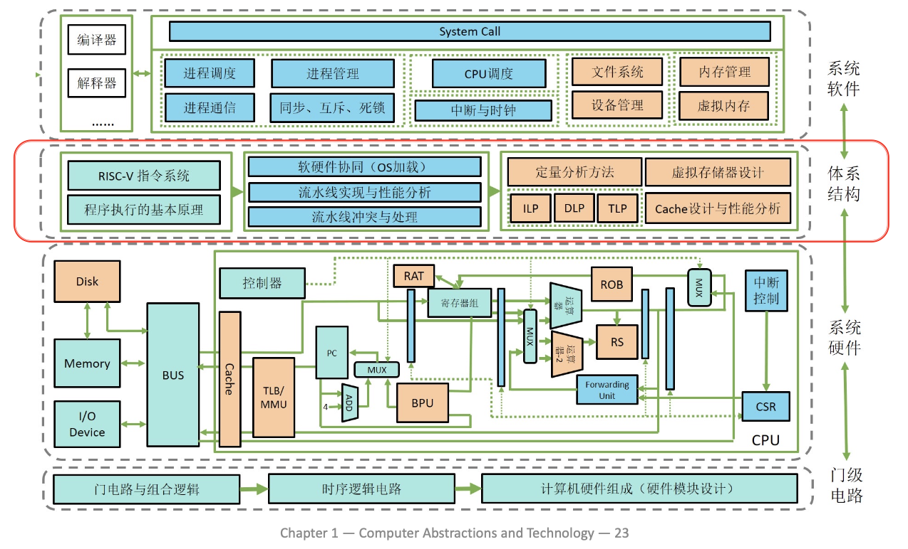
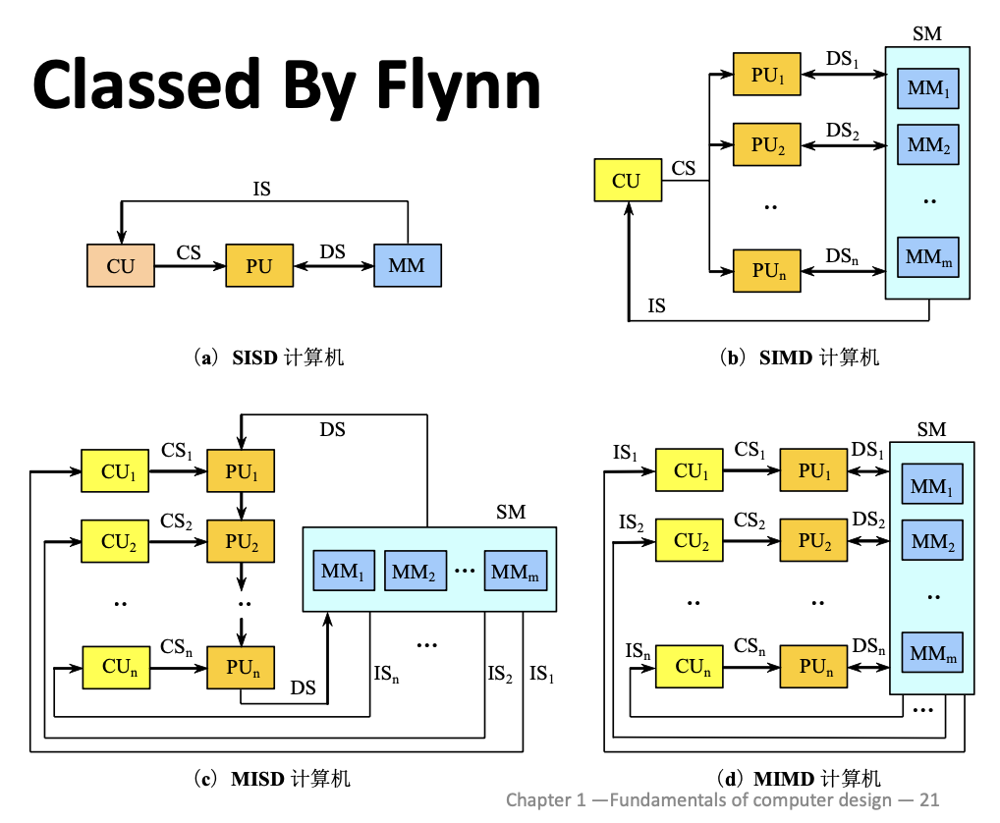

# **计算机设计基础**

<figure markdown="span">

<figcaption>计算机系统的层次结构</figcaption>
</figure>

## **Classes of Computers**

- Desktop computers(or Personal computers)
    - General purpose, variety of software
    - Emphasize good performance for a single user at relatively low cost.
    - Mostly execute third-party software.
- Server computers
    - Emphasize great performance for a few complex applications.
    - Or emphasize reliable performance for many users at once.
    - Greater computing, storage, or network capacity than personal computers.
- Embedded computers
    - Largest class and most diverse.
    - Hidden as components of systems.
    - Stringent power/performance/cost constraints.
- Personal Mobile Devices
    - Smartphones
    - Tablet/iPad
    - generally have the same design requirements as PCs
- Supercomputer
    - Computer cluster
    - High capacity, performance, reliability
    - Range to building sized

### **Classed by Flynn**

- SISD: Single Instruction Stream, Single Data Stream
- SIMD: Single Instruction Stream, Multiple Data Stream
- MISD: Multiple Instruction Stream, Single Data Stream
- MIMD: Multiple Instruction Stream, Multiple Data Stream

!!! note

    IS: Instruction Stream

    DS: Data Stream

    CS: Control Stream

    CU: Control Unit

    PU: Process Unit
    
    MM&SM: Memory

<figure markdown="span">

<figcaption>Classed by Flynn</figcaption>
</figure>

## **Performance**

### **Response Time and Throughput**

- Latency(Response time)
    - Is the time between the start and completion of an event
    - How long it takes to do a take
- Throughput(bandwidth)
    - Is the total amount of work done in a given period of time
    - Total work done per unit time

### **Performance**

- Define Performance = $1 / Execution Time$
- We say that "X is $n$ time faster than Y" means

$$
Performance_X / Performance_Y = n
$$

$$
= \ Execution time_Y / Execution time_X = n
$$

!!! example "time take to run a program"

    - $10s$ on A, $15s$ on B
    - $Execution Time_B \ / \ Execution Time_A = 15s \ / \ 10s = 1.5$
    - So A is $1.5$ times faster than B

### **Measuring Execution Time**

- Elapsed time
    - Total response time, including all aspects
        - Processing, I/O, OS overhead, idle time
    - Determines system performance
- CPU time
    - Time spent processing a given job
        - Discounts I/O time, other job's shares
    - Comprises user CPU time and system CPU time
        - User CPU time: CPU time spent in the program itself
        - System CPU time: CPU time spent in the OS, performing tasks on behalf of the program.
    - Different programs are affected differently by CPU and system performance.

<font color = red><center>**The main goal of architecture improvement is to improve the performance of the system**</center></font>

## **Quantitative approaches**

### **Measuring Data Size**

- kibibyte(KiB): $2^{10}(1024) \ \mathrm{bytes}$
- mebibyte(MiB): $2^{20}(1024^2) \ \mathrm{bytes}$
- gibibyte(GiB): $2^{30}(1024^3) \ \mathrm{bytes}$
- tebibyte(TiB): $2^{40}(1024^4) \ \mathrm{bytes}$
- pebibyte(PiB): $2^{50}(1024^5) \ \mathrm{bytes}$

### **CPU Performance**

In order to determine the effect of a design on the performance experienced by the user, we can use the following relation:

$$
\mathrm{CPU\ Execution\ Time} \ = \ \mathrm{CPU\ Clock\ Cycles} \times \mathrm{Clock\ Period}
$$

Alternatively,

$$
\mathrm{CPU\ Execution\ Time} \ = \ \frac{\mathrm{CPU\ Clock\ Cycles}}{\mathrm{Clock\ Rate}}
$$

### **CPU Clocking**

- Clock period: duration of a clock cycle
- Clock rate: cycles per second

### **CPU Time**

$$
\begin{align*}
\mathrm{CPU\ Time} \ &= \ \mathrm{CPU\ Clock\ Cycles} \times \mathrm{Clock\ Cycle\ Time} \\
\ &= \ \frac{\mathrm{CPU\ Clock\ Cycles}}{\mathrm{Clock\ Rate}}
\end{align*}
$$

!!! example

    - Computer A: $2.0$ GHz clock, $10s$ CPU time
    - Designing Computer B
        - Aim for $6s$ CPU time
        - Can do faster clock, but causes $1.2 \times \mathrm{clock cycles}$
    - How fast must Computer B clock be?

    $$
    \begin{align*}
    \mathrm{Clock\ Rate_B} &= \frac{\mathrm{Clock\ Cycles_B}}{\mathrm{CPU\ Time_B}} \ = \ \frac{1.2 \times \mathrm{Clock\ Cycles_A}}{6s} \\
    \mathrm{Clock\ Cycles_A} &= \mathrm{CPU\ Time_A} \times 
    \mathrm{Clock\ Rate_A} \ = \ 10s \times 2G Hz = 20 \times 10^9 \\
    \mathrm{Clock\ Rate_B} &= \frac{1.2 \times 20 \times 10^9}{6} = 4.0 GHz  
    \end{align*}
    $$

CPI: average cycles per Instruction

$$
\mathrm{CPI} = \frac{\mathrm{CPU\ Clock\ Cycles}}{\mathrm{Instruction\ Count}}
$$

!!! important

    $$
    \begin{align*}
    \mathrm{CPU\ Clock\ Cycles} &= \mathrm{Instructions\ for\ a\ program} \times \mathrm{Average\ Clock\ Cycles\ Per\ Instruction} \\
    \mathrm{CPU\ Time} &= \mathrm{Instruction\ Count} \times \mathrm{CPI} \times \mathrm{Clock\ Period} \\
    \mathrm{CPU\ Time} &= \frac{\mathrm{Instruction\ Count \times CPI}}{\mathrm{Clock\ Rate}}
    \end{align*}
    $$

### **Perofrmance Summary**

The BIG Picture

$$
\mathrm{CPU\ Time} = \frac{\mathrm{Instructions}}{\mathrm{program}} \times \frac{\mathrm{Clock\ Cycles}}{\mathrm{Instruction}} \times \frac{\mathrm{Seconds}}{\mathrm{Clock\ Cycle}}
$$

Performance depends on:

- Algorithm:affects IC, possibly CPI
- Programming language: affects IC, CPI
- Compiler: affects IC, CPI
- Instruction set architecture: affects IC, CPI, T_C

### **Amdahl's Law**
Amdahl's Law states that the performance improvement to be gained from using some faster mode of execution is limited by the fraction of the time faster mode can be used.

Amdahl's Law depends on two factors:

- The fraction of the time the enhancement can be exploited.
- The improvement gained bt the enhancement while it is exploited.

$$
\mathrm{Improved\ Execution\ Time} = \frac{\mathrm{Affected\ Execution\ Time}}{\mathrm{Amount\ of\ Improvement}} + \mathrm{Unaffected\ Execution\ Time}
$$

改进后的总时间等于“被改进的时间除以改进的比例”加上“未被改进的时间”。

可以记为:

$$
T_{\mathrm{improved}} = \frac{T_{\mathrm{affected}}}{\mathrm{Improvement\ factor}} + T_{\mathrm{unaffected}}
$$

!!! example 

    Multiply accounts for 80s/100s

    How much improvement in multiply performance to get $5 \times \mathrel{overall}$?

    $$
    20 = \frac{80}{n} + 20
    $$

    We know that it is impossible!

Based on the basic idea, we get the following formula

If we say the fraction of enhanced time is $f$ and the speedup of enhanced time is $Sp$:

$$
\mathrm{Execution\ time_{new}} = \mathrm{Execution\ time_{old}} \times \left((1 \ - \ f) + \frac{f}{Sp} \right)
$$

$$
\mathrm{Speedup_{overall}} = \frac{\mathrm{Execution\ Time_{old}}}{\mathrm{Execution\ Time_{new}}} = \frac{1}{(1 \ - f) + \frac{f}{Sp}}
$$

- Improved ratio:在原来的系统中，能够被改进的部分所占的比例
    - 永远小于等于1
- Component speedup ratio:通过改进后的系统，改进部分的速度提升比例
    - 永远大于1

!!! note 
    
    如果整个系统只有一部分可以被改进，那么改进后的系统的速度提升是有限的。通常不会超过

    $$
    \frac{1}{1 - \mathrm{Improved\ ratio}}
    $$

## **Great Architecture Ideas**

### **Moore's Law**

- The number of transistors on a chip doubles every 18-24 months.
- Architects have to anticipate where technology will be when the design of a system is completed.

### **Use abstraction to simplify design**

- Abstraction is used to represent the design at different levels of representation.
- Lower-level details can be hidden to provide simpler models at higher levels.

### **Make the common case fast**

- Identify the common case and try to improve it.
- Most cost efficient method to obtain improvement.

### **Improve performance via parallelism**

- Improve performance by performing operations in parallel.
- There are many levels of parallelism - instruction-level, process-level, etc.

### **Improve performance via pipelining**

- Break tasks into stages so that multiple tasks can be simultaneously performed in different stages.
- Commonly used to improve instruction throughput.

### **Improve performance via prediction**

- Sometime faster to assume a particular result than waiting until the result is known.
- Known as speculation and is used to guess results of branches.

### **Use a hierarchy of memories** 

- Make the fastest, smallest, and most expensive per bit memory the first level accessed and the slowest, largest, and cheapest per bit memory the last level accessed.
- Allows most of the accesses to be caught at the first level and be able to retain most of the information at the last level.

### **Improve dependability via redundancy**

- Include redundant components that can both detect and often correct failures.
- Used at many different levels.

## **ISA**

### **ISA: Instruction Set Architecture**

- Instruction Set Design Basic Principles:
    - Compatibility
    - Bersatility
    - High efficiency
    - Security

### **ISA Classes**

- Stack architecture
- Accumulator architecture
- General-purpose register architecture(GPR)

### **ISA Classes: Stack Architecture**

Implicit Operands on the Top Of the Stack(TOS)

!!! example

    === "```C = A + B```"

        Push A

        Push B

        Add

        Pop C

    === "98 * (12 + 45)"

        Push 98

        Push 12

        Push 45

        Add

        Mul

        Pop res

### **ISA Classes: Accumulator Architecture**

One implicit operand: the accumulator

One explicit operand: mem location

!!! example

    === "```C = A + B```"

        Load A

        Add B

        Store C

    === "98 * (12 + 45)"
    
        Load 12

        Add 45

        Mul 98

        Store res

### **ISA Classes: General-purpose Register Architecture(GPR)**

Only explicit operands: registers, memory locations

Operand access: direct memory access, loaded into temporary storage first

Two Classes:

- Register-memory architecture: any instruction can access memory
- Load-store architecture: only load and store instructions can access memory

!!! example "Register-memory architecture"

    ```C = A + B```

        Load R1, A

        Add R3, R1, B

        Store R3, C

!!! example "Load-store architecture"

    ```C = A + B```

        Load R1, A

        Load R2, B

        Add R3, R1, R2

        Store R3, C

For ```D = A * B - ( A + C * B)```

<pre>
<code>
<font color = blue>Stack Architecture</font>
push A
push B
mul     // A * B
push A
push C
push B
mul     // C * B
add     // A + C * B
sub     // A * B - (A + C * B)
pop D
</code>
</pre>

<pre>
<code>
<font color = blue>Accumulator Architecture</font>
load B
mul C   // C * B
add A   // A + C * B
store D // D = A + C * B
push A
mul B   // A * B
sub D   // D = A * B - (A + C * B)
store D
</code>
</pre>

<pre>
<code>
<font color = blue>Register Architecture</font>
Load R1, A      // R1 = A
Load R2, B      // R2 = B
MUL R3, R1, R2  // R3 = A * B
Load R4, C      // R4 = C
MUL R4, R4, R2  // R4 = C * B
ADD R1, R1, R4  // R1 = A + C * B
SUB R1, R3, R1  // R1 = A * B - (A + C * B)
Store R1, D     // D = A * B - (A + C * B)
</code>
</pre>

<pre>
<code>
<font color = blue>Load-store Architecture</font>
load R1, A      // R1 = A
load R2, B      // R2 = B
load R3, C      // R3 = C
mul R4, R2, R3  // R4 = C * B
add R5, R1, R4  // R5 = A + C * B
mul R6, R1, R2  // R6 = A * B
sub R7, R6, R5  // R7 = A * B - (A + C * B)
store R7, D     // D = A * B - (A + C * B)
</code>
</pre>