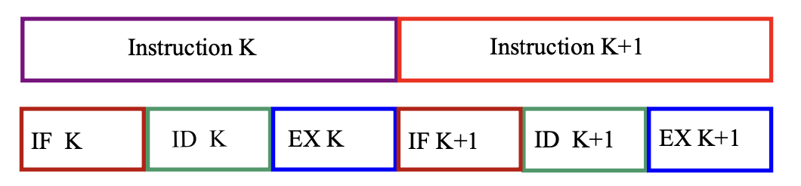
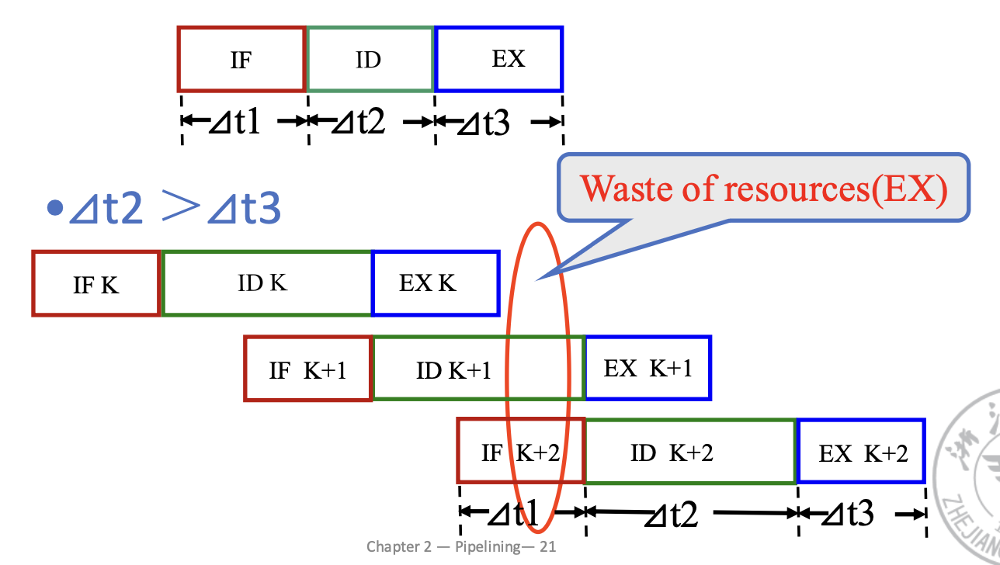
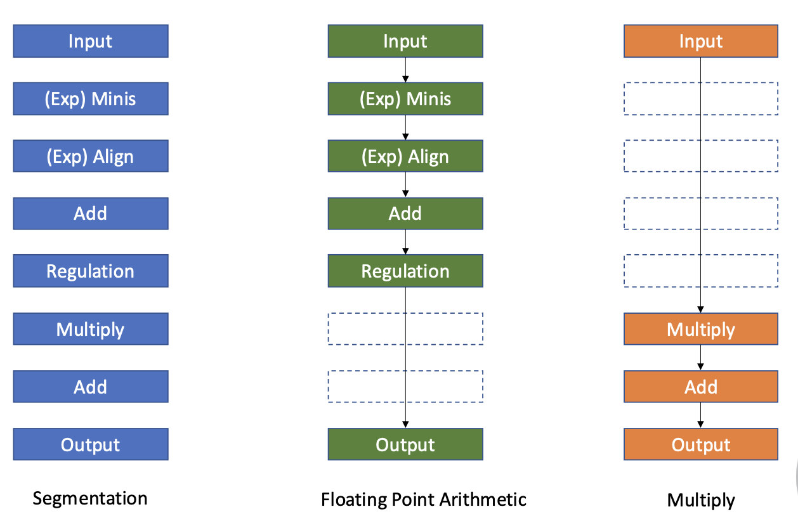

# **Pipeline**

## **What is Pipeline**

Three modes of execution:

- Sequential execution
- Single overlapping execution
- Twice overlapping execution

假设指令的执行被分为三个阶段：

- Instruction fetch (IF)
- Instruction decode (ID)
- Execute (EX)

### **Sequential execution**

如果指令是顺序执行的话，只能等上一条指令执行结束后，才能执行下一条指令。

<figure markdown="span">
{width="400"}
<figurecaption>Sequential execution</figurecaption>
</figure>

那么总的执行时间

$$
T \ = \ \sum_{i=1}^{n}(t_{IFi} + t_{IDi} + t_{EXi}) \ = \ 3n\Delta t
$$

### **Overlapping execution**

每一条指令内部是顺序执行的，但是不同指令之间可以重叠执行。

<figure markdown="span">
{width="400"}
<figurecaption>Overlapping execution</figurecaption>
</figure>

上图是每个阶段时间相同，每个阶段可以很好的重叠执行。

但是，如果每个阶段时间不同的话，就会发生资源的浪费，比如：

<figure markdown="span">
{width="400"}
<figurecaption>Overlapping execution with different time</figurecaption>
</figure>

或者：

<figure markdown="span">
{width="400"}
<figurecaption>Overlapping execution with different time</figurecaption>
</figure>

- Single overlapping execution
    : 可以缩短$\frac{1}{3}$的时间，但是需要额外的硬件开销

    $n$条指令总的执行时间:

    $$
    T \ = \ (2n \ + \ 1)\Delta t
    $$

<figure markdown="span">
{width="400"}
<figurecaption>Single overlapping execution</figurecaption>
</figure>

- Twice overlapping execution
    : 可以缩短$\frac{2}{3}$的时间，但是需要更多的硬件开销，并且需要另外的 FETCH, DECODE, EXECUTE 插件。

    $n$条指令总的执行时间:

    $$
    T \ = \ (n \ + \ 2)\Delta t
    $$

<figure markdown="span">
{width="400"}
<figurecaption>Twice overlapping execution</figurecaption>
</figure>

#### **Adding Instruction Buffer**

Conflict in access memory:

- Instruction memory & data memory
- Instruction cache & data cache (same memory):<font color = red>Harvard architecture</font>
- Multibody cross structure (same memory with limitations)
- Adding instruction buffer between instruction memory and instruction decode unit

<figure markdown="span">
{width="400"}
<figurecaption>Adding instruction buffer</figurecaption>
</figure>

在取指和内存中间加上一个 buffer ，只要这个 buffer 没满，就一直取指令。

添加 buffer 之后，取指的时间变得非常短，因此可以把 IF 和 ID 两个阶段合并，这样 Twice overlapping 就变成了 Single overlapping。

但是如果合并后的 ID 阶段执行时间和 EX 阶段执行时间不同的话，就会浪费资源。

#### **Advanced Control**

<figure markdown="span">
{width="400"}
<figurecaption>Advanced control</figurecaption>
</figure>

可以把 ID 阶段提前执行，然后把结果存到 buffer 中，等到 EX 阶段执行的时候再取出来。

Common features: They work by FIFO, and are composed of a group of serveral storage units that can be accessed quickly and related control logic.

通过 FIFO（先进先出）等方式，提高了指令的执行效率。

## **Classes of Pipeline**

- Single function pipeline: only the fixed function pipelining.
- Multi function pipelining: each section of the pipelining can be connected differently for serveral different functions.

<figure markdown="span">
{width="400"}
<figurecaption>Multi function pipelining</figurecaption>
</figure>

上图中左侧 Segmentation 表示流水线中所有的元件，中间的 FLoating Point Arithmetic 表示浮点运算需要的元件，右侧的 Multiply 表示乘法需要的元件。

而对于 Multi function pipelining，又可以分为两类：

- Static pipelining(静态流水线): 在同一时间，流水线的每个部分只能执行相同类型的操作
这就意味着对于静态流水线，只有输入的是相同类型的指令，它的效率才能最大化。

<figure markdown="span">
{width="400"}
<figurecaption>Static pipelining</figurecaption>
</figure>

从上图可以看出，对于 Floating Point Arithmetic 和 Multiply 部分，静态流水线只能等 Floating Point Arithmetic 部分执行完毕后，才能执行 Multiply 部分。

- Dynamic pipelining(动态流水线): 在同一时间，流水线的每个部分可以执行不同类型的操作
    - 灵活，但是控制信号复杂
    - 提高单元的利用率
<figure markdown="span">
{width="400"}
<figurecaption>Dynamic pipelining</figurecaption>
</figure>

不同于静态流水线，动态流水线可以在同一时间执行不同类型的操作。

根据粒度分类：

- <font color = blue>Component level pipelining(组件级流水线)</font>: 处理器的算数和逻辑组件分成很多段，从而不同种类的操作都可以执行
- <font color = blue>Processor level pipelining</font>: 指令的解释和执行是通过流水线实现的。指令的执行过程被分成很多小部分，每个小部分都是通过独立的功能模块实现的。
- <font color = blue>Inter processor pipelining</font>: 由一系列的处理器串联组成，每个处理器执行一个指令的一个部分，然后把结果传递给下一个处理器。

根据是否线性分类：

- <font color = blue>Linear pipelining</font>: 流水线每个部分串联，没有反馈回路。数据最多流过每个部分一次。
- <font color = blue>Nonlinear pipelining</font>: 串行连接，并且存在反馈回路。

<figure markdown="span">
{width="400"}
<figurecaption>Nonlinear pipelining</figurecaption>
</figure>

分为顺序/乱序：

- <font color = blue>Ordered pipelining</font>: 在流水线中，任务输出顺序与输入顺序完全相同，每个任务按顺序流过流水线。
- <font color = blue>Disordered pipelining</font>: 任务的输出顺序与输入顺序不同，允许后边的任务先完成。

根据是否能处理向量数据分类：

- <font color = blue>Scalar pipelining</font>: 流水线没有向量处理程序，只能处理标量数据。
- <font color = blue>Vector pipelining</font>: 流水线可以处理向量数据。

## **Pipeline Performance**

### **Throughput(TP)**

TP: 每个时钟周期可以完成的指令数

$$
TP \ = \ \frac{n}{T_K}
$$

$n$: 完成的指令数
$T_K$: 完成所有指令所用的时间

<figure markdown="span">
{width="400"}
<figurecaption>Throughput</figurecaption>
</figure>

$$
TP = \frac{n}{T_K} = \frac{n}{(m + n - 1)T_0}
$$

当 $n$ 很大，即指令很多时，$TP$ 可以近似为：

$$
TP_{max} = \frac{n}{(m+n-1)T_0} = \frac{1}{T_0}
$$

就是说流水线的吞吐量只与时钟周期有关，与流水线的级数无关。

那么

$$
TP \ = \ \frac{n}{n + m - 1}TP_{max}
$$

如果流水线每个阶段的时间不一样的话，我们把最长的那个阶段叫做 bottleneck stage(瓶颈阶段).

那么

$$
\begin{align*}
TP &= \frac{n}{\sum_{i=1}^{n}\Delta t_i + (n-1)max(\Delta t_1, \Delta t_2, \cdots, \Delta t_n)} \\
&= \frac{n}{(m-1)+n \ max(\Delta t_1, \Delta t_2, \cdots, \Delta t_n)}
\end{align*}
$$

$$
TP_{max} = \frac{1}{max(\Delta t_1, \Delta t_2, \cdots, \Delta t_n)}
$$

可以看到，$TP_{max}$ 只与瓶颈阶段时间有关。

#### **Common methods to solve pipeline bottleneck**

- Subdivision: 把瓶颈阶段分成几个小阶段，每个阶段时间与其他阶段相等，都是$\Delta t$。

<figure markdown="span">
{width="400"}
<figurecaption>Subdivision</figurecaption>
</figure>

- Repetition: 在瓶颈阶段多用几个部件，这样就可以提高吞吐量。

<figure markdown="span">
{width="400"}
<figurecaption>Repetition</figurecaption>
</figure>

### **Speedup(Sp)**

Speedup(加速比): 一个流水线相对于一个非流水线的性能提升。

<figure markdown="span">
{width="400"}
<figurecaption>Speedup</figurecaption>
</figure>

$$
\begin{align*}
Sp &= \frac{n \times m \times \Delta t}{(m + n - 1)\Delta t} \\
&= \frac{n \times m}{m + n - 1}
\end{align*}
$$

如果 $n \gg m$，那么 $Sp \approx m$。

### **Efficiency**

Efficiency(效率): 从计算机硬件考虑，纵轴代表使用不同的部件，效率指的是我们真正使用这个部件占整个时空的百分比。

<figure markdown="span">
{width="400"}
<figurecaption>Efficiency</figurecaption>
</figure>

总空间为 $m \times (n-m+1)$，因为一共有$m$个部件，每个部件有$n-m+1$个时空。

指令占的空间为 $n \times m$。一共$n$个指令，每个指令占$m$个时空。

则效率

$$
\eta = \frac{n \times m}{m \times (n-m+1)} = \frac{n}{n-m+1}
$$

若 $n \gg m$，那么 $\eta \approx 1$。

!!! question

    === "Static pipeline"

        <font figure markdown="span">
        {width="400"}
        </font>

        注意到这里是<font color = red>静态双功能流水线</font>，必须在乘法做完之后才能做加法。

        <figure markdown="span">
        {width="400"}
        </figure>

        所以:

        $$
        TP = \frac{4 + 3}{15}\Delta t = \frac{7}{15}\Delta t
        $$

        $$
        Sp = \frac{4 \times 3\Delta t + 3 \times 4\Delta t}{15\Delta t} = 1.6
        $$

        $$
        \eta = \frac{3 \times 4\Delta t + 4 \times 3\Delta t}{4 \times 3\Delta t} = 32%
        $$

    === "Dynamic pipeline"

        <font figure markdown="span">
        {width="400"}
        </font>

        注意到这里是<font color = red>动态双功能流水线</font>，可以在乘法做的同时做加法。

        <figure markdown="span">
        {width="400"}
        </figure>
    
既然流水线这么好，那么我们是不是可以把流水线的级数无限加大呢？

实则不然，太多的级数会导致：

- Lots of complications，太复杂了
- 大量的指令同时进行，中间可能存在复杂的依赖关系
- 控制信号太多了
- 需要特别多的流水线寄存器，硬件开销太大

## **Hazards of Pipeline**

更详细的笔记请看计组部分的笔记。

Hazards

- Situations that prevent starting the next instruction in the next cycle
- Structure hazards
    - A required resource is busy
- Data hazard
    - Need to wait for previous instruction to complete its data read/write
- Control hazard
    - Deciding on control action depends on previous instruction

### **Structure Hazards**

对于流水线中结构的冲突

<figure markdown="span">
{width="400"}
<figurecaption>Structure Hazards</figurecaption>
</figure>

上图就是流水线中发生了对 memory 对冲突。

对于结构冲突，一般通过加 bubble 或者硬件的方式解决。

### **Data Hazards**

An instruction depends on completion of data access by a previous instruction

- Read after write(RAW).可以通过 forwarding 解决
```assembly
FADD.D f6, f0, f12
FSUB.D f8, f6, f14
```

- Write after read(WAR)
```assembly
FDIV.D f2, f6, f4
FADD.D f6, f0, f12
```

- Write after write(WAW)
```assembly
FDIV.D f2, f0, f4
FSUB.D f2, f6, f14
```

但是并不是所有的 RAW 都可以通过 forwarding 解决，比如 load-use hazard.

这时候需要在 load 指令后边加一个 bubble, 然后才能 进行 forwarding.

### **Control Hazards**

- Conditional jump: branch
- Unconditional jump: jal, jalr

为了减少分支带来的影响，可以采用预测分支的方式。

- Static branch prediction
    - Always taken
    - Always not taken
    - Delayed branch
- Dynamic branch prediction

## **Control Hazards**

### **Static Branch Prediction**

- Always taken: 永远预测分支会发生
- Always not taken: 永远预测分支不会发生
- Delayed branch: 延时槽

不论我是否跳转，有些指令是一定会执行的，可以把这些指令放在延时槽中。

### **Dynamic Branch Prediction**

Use dynamic prediction

- Branch prediction buffer (aka branch history table)
- Indexed by recent branch instruction addresses
- Stores outcome (taken/not taken)
- To execute a branch
    - Check table, except the same outcome: 把之前的所有跳转结果都记录下来，根据之前的结果预测这次的结果。
    - Start fetching from fall-through or target: 根据预测的结果，开始取指。
    - If wrong, flush pipeline and flip prediction: 如果预测错误，就把之前的指令都清空，重新开始。

#### **Branch History Table(BHT)**

<figure markdown="span">
{width="400"}
<figurecaption>Branch History Table</figurecaption>
</figure>

实际上是一个有限状态机的模式，根据前边的结果，预测后边的结果。

我们有 ```1-bit predictor``` 和 ```2-bit predictor```。

<figure markdown="span">
{width="400"}
<figurecaption>2-bit predictor</figurecaption>
</figure>

#### **Advanced Techniques for Instruction Delivery and Speculation**

- Increasing Instruction Fetch Bandwidth
    - Branch-Target Buffers

<figure markdown="span">
{width="400"}
<figurecaption>Branch-Target Buffers</figurecaption>
</figure>

类似于 TLB , 存放的是跳转的目标地址，如果跳转的分支指令在 BTB 中，就可以直接取出目标地址；如果不跳转的话，就直接把地址去掉。

<figure markdown="span">
{width="400"}
</figure>

- Specialized Branch Predictors: Predicting Procedure Returns, Indirect Jumps, and Loop Branches
    - Integrated Instruction Fetch Units

BTB Cache 的优势：

- 更快地取指
- 可以在分支目标处一次提供多个指令，在多处理器中很有用
- branch folding: 可以在不延迟的情况下实现无条件跳转，或有条件跳转

## **Schedule of Nonlinear Pipeline**

Nonlinear pipeline: In addition to the serial connection, there is also a feedback loop in the pipeline.

<figure markdown="span">
{width="400"}
</figure>

如上图中的非线性流水线，我们可以用一个表来表示元件的占用情况，其中横轴的数字表示拍数（第几拍），纵轴表示元件的编号。

如何进行规划？

- Initial Conflict Vertor: 初始冲突向量，二进制表示
- Conflict Vector
- State transition graph
- Circular queue
- Shortest average interval

首先确定初始冲突向量

<figure markdown="span">
{width="400"}
</figure>

表的结构与之前说的相同，我们需要做的就是如果第 $n$ 拍需要用到元件 $k$, 就在对应位置打勾。

然后就是确定各个部件的冲突情况。从上图中可以看出，元件 1 在第 1 和 9 拍会产生冲突，中间隔了 8 拍。

元件 2 在第 2，3，8 拍产生冲突，中间隔了 $3-2=1, 8-3=5, 8-2=6$ 拍。

其他元件类似。所以我们就得到了总第间隔拍数$\{1, 5, 6, 8\}$。

那么将对应二进制位（1，5，6，8）置为 1，得到冲突向量$10110001$(从右向左)。

然后确定冲突向量

<figure markdown="span">
{width="400"}
</figure>

横轴的数字 2, 2, 7表示隔几拍进下一条指令，我们相应就把冲突向量右移 2, 2, 7 位，然后和本来的冲突向量或运算，得到新的冲突向量。

这里纵轴的"1->" , "2->" 表示右移多少次。

我们发现，循环调度 2-2-7 可以让冲突向量回到最初状态，说明我们找到了一个循环调度。

<figure markdown="span">

</figure>