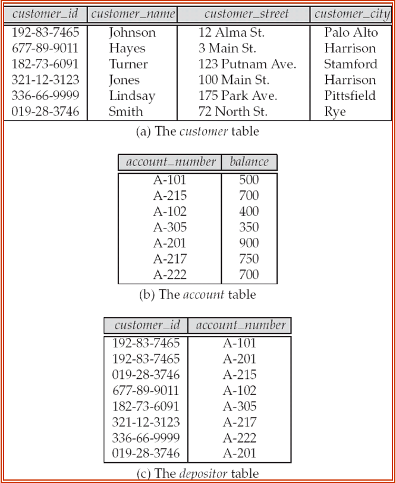
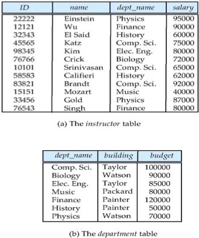
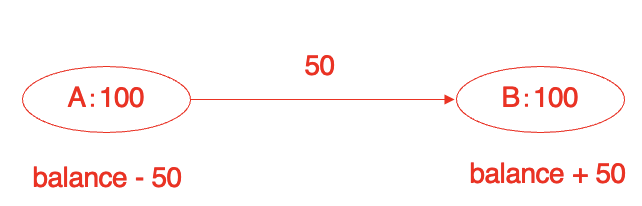
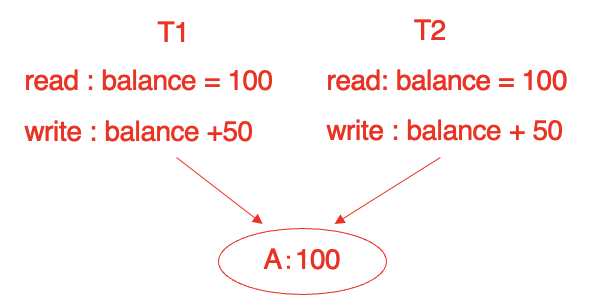
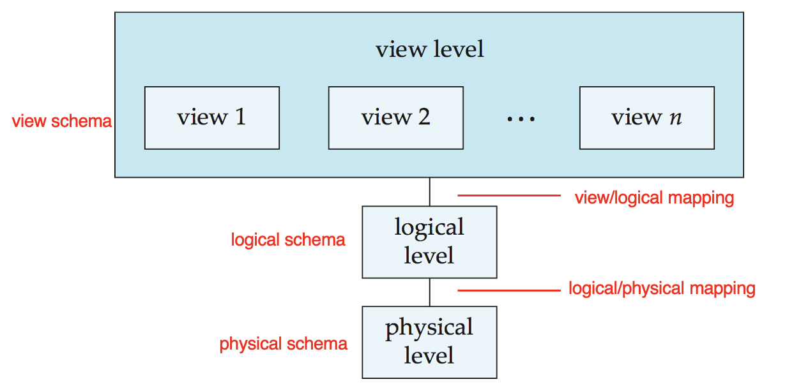
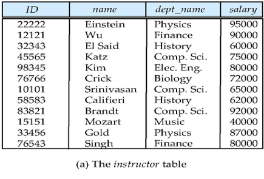
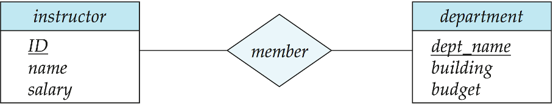
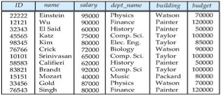
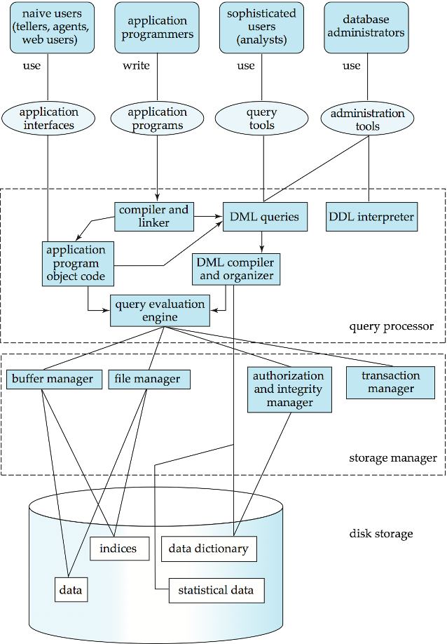
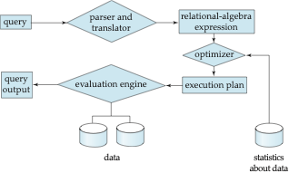

# **Introduction**

## **Database Systems**

- Database is a collection of interrelated data about a enterprise, which is managed by a <font color = "red">Database Management System (DBMS)</font>.
- The primary goal of a DBMS is to provide a way to store and retrieve database information that is both convenient and efficient.
- Management of data involves both **defining structures** for storage of information and providing mechanisms for the **manipulation** of information.
- The database system must ensure the safety of the imformation stored, despite system crashes or attempts at unauthorized access.
- If data is to be shared among serveral users, the system must provide **concurrency control** mechanisms to avoid possible anomalous results.

## **Database Applications**

- Enterprise information
    - Sales:customers, products, purchases.
    - Accounting: payments, receipts, assets.
    - Human Resources: employees, salaries, payroll taxes.
- Manufacturing: production, inventory, orders, supply chain.
- Banking: customers, accounts, loans, credit cards, transactions.
- Universities: instructors, students, courses, registration, grades.
- Airlines: reservations, schedules.
- Web-based services
    - Online retailers:order tracking, customized recommendations.
    - Online advertisements.

Databases can be very large $\to$ Big Data(大数据)

- Volume(容量)
- Variety(种类)
- Velocity(速度)
- Value(价值)

### **Database Example-Banking**

We have four operations in a bank:

- Add customers
- Open accounts
- Save/Withdraw money
- Lend/Repay loans

<figure markdown="span">
{ width="400" }
<figcaption>Banking Database</figcaption>
</figure>

### **Database Example-University**

We have four operations in a university:

- Add new students,instructors, and courses
- Register students for courses, and generate class rosters
- Assign grades to students
- Compute grade point averages(GPA) and generate transcripts

<figure markdown="span">
{ width="400" }
<figcaption>University Database</figcaption>
</figure>

## **Purpose of Database Systems**

In the early days, database applications were built directly on top of <font color = red> file systems</font>, while leads to:

- <font color = blue> Data redundancy(数据冗余)</font> and inconsistency(不一致)
    - For example: If we have more than one copy of the same data, then we have to update all the copies when the data changes.Otherwise the data will be inconsistent.
- <font color = blue> Data isolation(数据孤立,数据孤岛)</font>
    - Data is scattered in various files, and the files may be in different formats.
- Difficulty in <font color = blue> accessing data(存取数据困难)</font>
    - For example: If we want to retrieve data from a file, or we have changed the name of the file, then we have to change the program that accesses the file.
- <font color = blue> Data integrity(数据完整性)</font> problems
    - integrity constraints become "buried" in program code rather that being stated explicitly(显式的)
    - Suppose the university maintains an account for each department, and records the balance amount in each account, the university requires that the account balance of a department may **never fall below zero**.
- <font color = blue>Atomicity</font> problems(原子性问题)
    - Failures may leave in an inconsistent state with partial updates carried out.
    - Example: Transfer of funds from one account to another should either complete or not happen at all.That is to say, if it's interrupted in the middle, then the money should be returned to the original account as if nothing happened.

<figure markdown="span">
{ width="400" }
<figcaption>Atomicity</figcaption>
</figure>

- <font color = blue>Concurrent access anomalies(并发访问异常)</font>
    - Concurrent access needed for performance
    - Uncontrolled concurrent accesses can lead to inconsistencies
    - Example: Two people reading a balance (say 100) and updating it by saving money (say 50 each) at the same time. If the balance is read by both before it is updated, then the balance will be 150 instead of 200.

<figure markdown="span">
{ width="400" }
<figcaption>Concurrent Access</figcaption>
</figure>

- <font color = blue>Security problems(安全问题)</font>
    - Hard to provide user access to some, but note all, data.
    - Authentication(认证)
    - Privildges(权限)
    - Audit trails(审计)

<font color = red><center>**Database systems offer solutions to all the above problems!**</center></font>

## **View of Data**

We have three-level abstraction in database systems:

<figure markdown="span">
{ width="400" }
<figcaption>Three-level Abstraction</figcaption>
</figure>

- **Physical level**: The lowest level of abstraction, related to hardware, describes how data are stored.
- **Logical level**: The next higher level of abstraction, describes what data are stored in the database, and what relationships exist among those data.
- **View level**: The highest level of abstraction, describes only part of the entire database.

!!! example "Three-level abstraction"

    Imaging that we have a database for all our students in the university, then we have three levels of abstraction:

    - **Physical level**: How the data is stored in the database, for example, the data is stored in a table.
    - **Logical level**: What data is stored in the database, for example, the data includes student ID, student name, student age, etc.
    - **View level**: We have many apps in our daily life, such as the exercise app(浙大体艺), the library app(图书馆), etc. These apps only show part of the entire database, exercise app only shows the exercise data, library app only shows the library data.

The benefit is that we can hide the complexities of the database from the users, and we can enhance the adaptation to changes.

### **Schema and Instance**

- Similar to types and variables in programming languages.
- <font color = blue>Schema(模式)</font>: The logical structure of the database.
    - Example: The database consists of information about a set of customers and accounts and the relationship between them.
    - Analogous to <font color = red>type information</font> of a variable in a program.
    - <font color = blue>Physical schema</font>: database design at the physical level.
    - <font color = blue>Logical schema</font>: database design at the logical level.
- <font color = blue>Instance(实例)</font>: The actual content of the database at a particular point in time.
    - Analogous to the <font color = red>value of a variable</font>.

### **Data Independence**

- <font color = blue>Physical data independence(物理数据独立性)</font>: The ability to modify the physical schema without changing the logical schema.
    - Applications depend on the logical schema
    - In general, the interfaces between the various levels and components should be well defined so that changes in some parts do not seriously influence others.
- <font color = blue>Logical data independence(逻辑数据独立性)</font>: The ability to modify the logical schema without changing the view schema.

## **Data Models(数据模型)**

- A collection of tools for describing
    - Data
    - Data relationships(联系)
    - Data semantics(语义)
    - Data constraints(约束)
- <font color = red>Relational model</font>(关系模型): The most widely used data model.
- Entity-Relationship model(实体-关系模型)
- Object-based data Models
    - Object-oriented model(面向对象数据模型)
    - Object-relational model(对象-关系模型)
- Semisturctured data model (XML)(半结构化数据模型)
- Other older Models
    - Network model(网络模型)
    - Hierarchical model(层次模型)

## **Relational Model**

- <font color = red>Covered in Chapter 2</font>
- Divider into Columns/Attributes(列/属性) and Rows/Tuples(行/元组)

<figure markdown="span">
{ width="400" }
<figcaption>Relational Model</figcaption>
</figure>

## **Database Languages**

- Data Definition Language(DDL)
- Data Manipulation Language(DML)
- SQL Query Language
- Application Program Interface(API)
- <font color = red>Covered in Part one - Chapters 3,4,5</font>

### **Data Definition Language(DDL)数据定义语言**

- Specifying the database schema

```sql
cerate table instructor(
    ID char(5),
    name varchar(20),
    dept_name varchar(20),
    salary numeric(8,2)
);
```

- DDL complier generates a set of table templates stored in a <font color = blue>data dictionary(数据字典)</font>
- Data dictionary contains <font color = blue>metadata(元数据, i.e., data about data)</font>
    - We not only store the data we actually need, but also store how the data is stored.
    - Database schema
    - Integrity constraints(完整性约束)
        - Primary key(ID uniquely identifies instructors)(主键)
        - Referential integrity(references constraint in SQL)(参照完整性). ==E.g., dept_name must be one of the department names in the department table.==
    - Authorization(权限)

### **Data Manipulation Language(DML)数据操纵语言**

- Language for accessing and manipulating the data organized by the appropriate data model.
    - DML also knows as query language.
- Two classes of languages
    - <font color = blue>Procedural DMLs(过程式)</font>: require a user to specify what data are needed and how to get those data.
    - 有分支,循环和顺序执行即可称为过程式
    - <font color = blue>Declarative DMLs(陈述式)</font>: require a user to specify what data are needed without specifying how to get those data.
- SQL is the most widely used query language.

### **SQL Query Language**

!!! example "SQL Query Language"

    === "Example 1"

        Find the name of the instructors with ID 22222.

        ```sql
        select name
        from instructor
        where ID = '22222';
        ```

    === "Example 2"

        Find the ID and building of instructors in the Physics dept.

        ```sql
        select instructor.ID, department.building
        from instructor, department
        where instructor.dept_name = department.dept_name and department.dept_name = 'Physics';
        ```

### **Database Access from Application Program**

- Non-procedural query languages such as SQL are not powerful as a universal Turing machine.
- SQL does not support actions such as input from users, output to displays, or communication over the network.
- Such computations and actions must be written in a host language such as C, C++, Java, etc.
- Application programs generally access databases through one of 
    - Language extensions to allow embedded SQL
    - API(e.g., ODBC, JDBC) which allow SQL queries to be sent to a database server.

## **Database Design(数据库设计)**

- <font color = red> Covered in Part Two - Chapters 6,7</font>

### **Entity-Relationship model**

Before we start to implement a database, we need to design the database first.

When designing, we use <font color = red>ER model</font>.可以一对一/一对多/多对多.

- Models an enterprise as a collection of data entities and relationships.
- Represented diagrammatically by an <font color = blue>ER diagram</font>

<figure markdown="span">
{ width="400" }
<figcaption>Entity-Relationship Model</figcaption>
</figure>

### **Normalization Theory(规范化理论)**

Formalize what designs are bad, and test for them.

<figure markdown="span">
{ width="400" }
<figcaption>Normalization Theory</figcaption>
</figure>

??? question "Is there any problem with the above figure?"

    Data redundancy occures in the above figure, because the same department name is stored more than once.

## **Database Engine(数据库引擎)**

- A database system(database engine) is partitioned into modules that deal with each of the responsibilities of the overall system.
- The functional components if a database system can be divided into 
    - The <font color = blue>storage manager</font>
    - The <font color = blue>query processor</font>
    - The <font color = blue>transaction manager</font>

<figure markdown="span">
{ width="400" }
<figcaption>Database Engine</figcaption>
</figure>

### **Storage Manager**

- <font color = red>Covered in Part Five - Chapters 12,13,14</font>

为了使数据持久保存,放在硬盘里,但是数据处理要进入内存,这之间的桥梁就是存储管理器.

- A program module that provides the interface between the low-level data stored in the database and the application programs and queries submitted to the system.
- It's responsible to the following tasks:
    - Interaction with the OS file manager
    - Efficient storing, retrieving, and updating of data
- The storage manager components include:
    - File manager
    - Buffer manager
    - Authorization and integrity manager
    - Transaction manager

数据库里放的是

- data files 真正的数据
- data dictionary 放的是 metadata
- statistical data 数据库的查询处理
- indices 索引

### **Query Processor**

- The query processor components include:
    - DDL interpreter -- interprets DDL statements and records the definitions in the data dictionary.
    - DML compiler -- translates DML statements in a query language into an evaluation plan consisting of low-level instructions that the query evaluation engine understands.
        - The DML complier performs <font color = red>query optimization</font>, which means that it tries to generate an efficient evaluation plan for the query.
    - Query evaluation engine -- executes low-level instructions generated by the DML compiler.
    - <font color = red>Covered in Part Six - Chapters 15,16</font>

<figure markdown="span">
{ width="400" }
<figcaption>Query Processor</figcaption>
</figure>

1. Parsing and translation
2. Optimization
3. Evaluation

### **Transaction Manager(事务管理)**

银行转账,A转账到B,A余额减少,B余额增加.要有隔离性,延迟写回.

- <font color = blue>Recover Manager</font> ensures that the database remains in a consistent state despite system failures and transaction failures.
- <font color = blue>Concurrency Control Manager</font> controls the interaction among the concurrent transactions, to ensure the consistency of the database
- <font color = red>Covered in Part Seven - Chapters 17,18,19</font>

## **Database Users**

<figure markdown="span">
{ width="400" }
<figcaption>Database Users</figcaption>
</figure>

- Database Administrator(DBA) 数据库管理员,要做定义模式,数据库调谐,故障时恢复(备份)等工作.