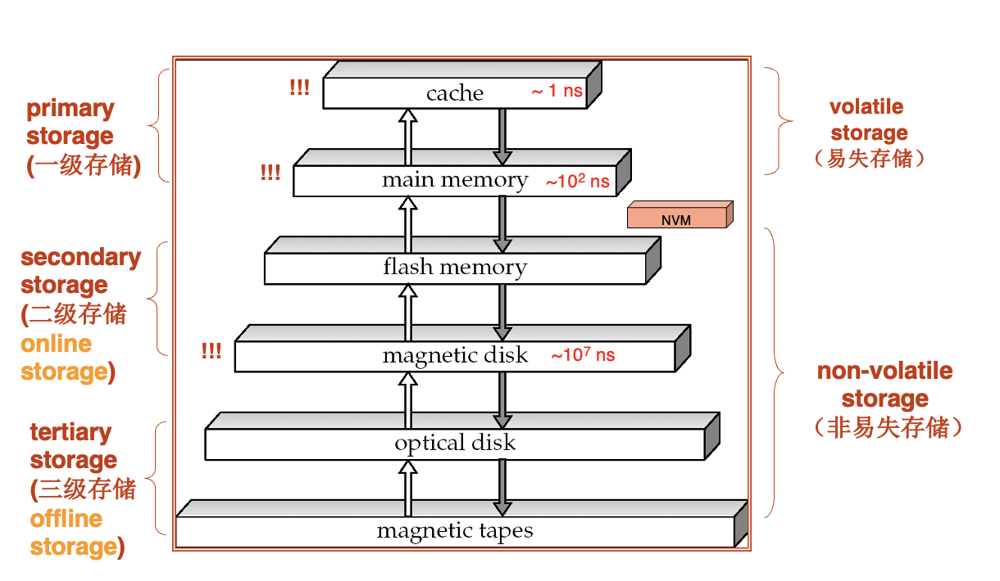
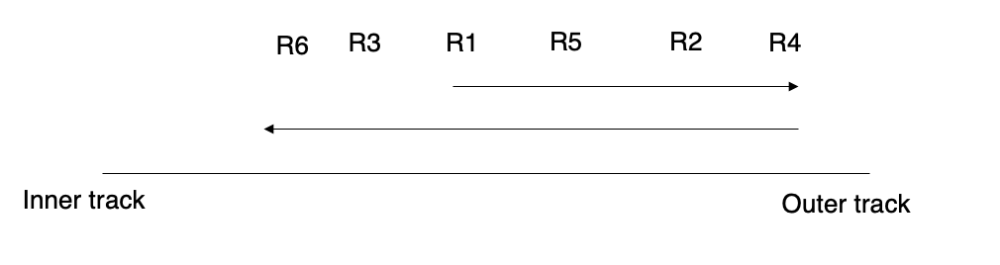
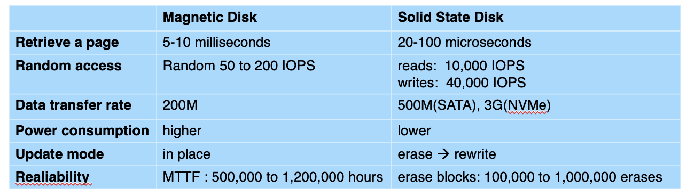
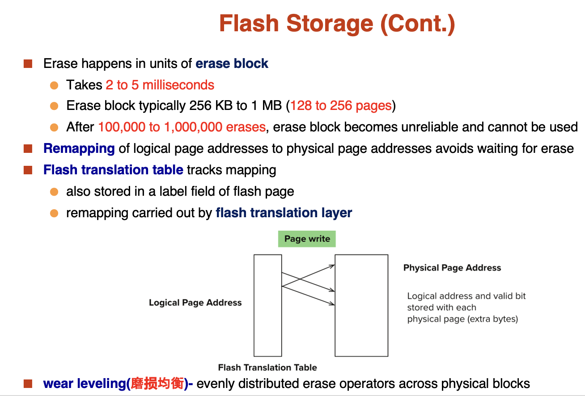
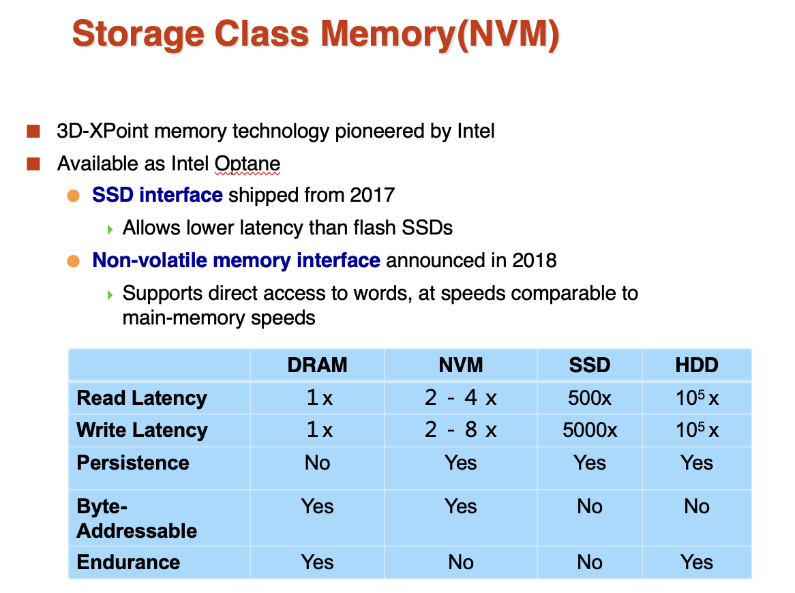

# **Physical Storage Systems**

Outline:

- Classification of Physical Storage Media
- Storage Hierarchy
- Magnetic Disks
    - Disk Interface Standards
    - Performance Measures of Disks
    - Optimization of Disk-Block Access
- Flash Storage & SSD
- Storage Class Memory(NVM)

## **Classification of Physical Storage Media**

可以把存储分为两类：

- volatile storage(易失存储): loses contents when power is switched off
- non-volatile storage(非易失存储):
    - Contents persist even when power is switched off
    - Includes secondary and tertiary storage, as well as batter-backed up main-memory

评价存储的标准：

- Speed with which data can be accessed
- Cost per unit of data
- Reliability
    - data loss on power failure or system crash
    - physical failure of the storage device

## **Storage Hierarchy**

<figure markdown="span">
{width=400}
<figcaption>Storage Hierarchy</figcaption>
</figure>

从上图可以看出，易失存储包括： cache, main memory

非易失存储包括：flash memory, magnetic disk, optical disk, magnetic tapes

还可以把存储分为三级：

- primary storage(一级存储): cache, main memory
    - Fastest media but volatile
- secondary storage(二级存储, online storage): flash memory, magnetic disk
    - non-volatile, moderately fast access time
- tertiary storage(三级存储, offline storage): optical disk, magnetic tapes
    - non-volatile, slow access time

## **Magnetic Disks**

磁头(Read-write head)

  - 磁头非常靠近磁盘表面，几乎接触到磁盘表面
  - 用于读写数据

磁盘表面被划分为多个同心圆，称为track(磁道)

  - 通常一个磁盘每个盘片上有 50K - 100K 个磁道

每个磁道被划分为多个扇区(sector)

  - 扇区是读写数据的最小单位
  - 每个扇区通常为512字节
  - 内圈磁道通常有 500 - 1000 个扇区
  - 外圈磁道通常有 1000 - 2000 个扇区

读写扇区的时候

  - 磁臂(disk arm)会移动以将磁头定位到正确的磁道
  - 盘片持续旋转，扇区从磁头下面经过时，读写数据

Head-disk assemblies

  - 在主轴上通常有 1 到 5 个盘片
  - 一个盘片对应一个磁头

柱面(cylinder) $i$ 包含所有盘片的第 $i$ 个磁道 

磁盘控制器(disk controller) - interfaces between the computer system and the disk drive hardware
  
  - 接受高层次的读写扇区的命令
  - 执行例如移动磁头到指定的磁道，读写扇区等动作
  - 计算校验和，并将其附加到每个扇区，以验证数据是否正确读回
    - 如果数据损坏了，有很大的概率校验和会匹配不上
  - 通过在写入扇区之后再读取一遍来确保正确的写入操作
  - 对于损坏的扇区，执行重新映射(remapping)

### **Disk Interface Standards**

- SATA(Serial ATA)
    - SATA 3 supports data transfer speeds of up to 6 gigabits/second
- SAS(Serial Attached SCSI)
    - SAS Version 3 supports 12 gigabits/second
- NVMe(Non-Volatile Memory Express) interface
    - Works with PCIe connectors to support lower latency and higher transfer rates
    - Supports data transfer speeds of up to 24 gigabits/second

### **Performance Measures of Disks**

- Access time(访问时间) - the time it takes from when a read or write request is issued to when data transfer begins. Consists of:
    - Seek time(寻道时间) - time it takes to reposition the arm over the correct track
        - Average seek time is 1/2 the worst case seek time
        - 4 to 10 milliseconds on typical disks
    - Rotational latency(旋转延迟) - time it takes for the sector to be accessed to appear under the head
        - Average rotational latency is 1/2 of the worst case latency
        - 4 to 11 milliseconds on typical disks(5400 to 15000 r.p.m)
- Data-transfer rate(数据传输率) - the rate at which data can be retrieved from or stored to the disk
    - 25 to 100 MB per second max rate, lower for inner tracks
    - Multiple disks may share a controller, so rate the controller can handle is also important
        - E.g. SATA: 150 MB/sec, SATA-II 3Gb(300 MB/sec)
        - Ultra 320 SCSI: 320 MB/sec, SAS (3 to 6 Gb/sec)
        - Fiber Channel(FC2Gb or 4Gb): 256 to 512 MB/sec

访问模式：

Sequential access pattern(顺序访问模式)

  - Successive requests are for successive disk blocks
  - Disk seek required only for first block

Random access pattern(随机访问模式)

  - Successive requests are for blocks that can be anywhere on disk 
  - Each access requires a seek
  - Transfer rates are low since a lot of time is wasted in seeks

!!! NOTE 

    === "IOPS"

        I/O operations per second, 每秒 I/O 操作数

        - Number of random block reads that a disk can support per second. 磁盘每秒可以支持的随机块读取数
        - 50 to 200 IOPS on current generation magnetic disks

    === "MTTF"

        Mean time to failure, 平均故障时间

        - The average time the disk is expected to run continuously without any failure. 磁盘在没有任何故障的情况下，预计可以连续运行的平均时间
        - Typically 3 to 5 years
        - 新磁盘的平均故障时间很低，大约在 57 到 136年之间
        - 随着时间的推移，MTTF 会减少（故障频率上升）

### **Optimization of Disk-Block Access**

**Buffering**: in-memory buffer to cache disk blocks

**Read-ahead(Prefetch)**: Read extra blocks from a track in anticipation that they will be requested soon

**Disk-arm-scheduling**: algorithms re-order block requests so that disk arm movement is minimized
    
  - Elevator algorithm

<figure markdown="span">

</figure>

**File organization**:

  - Allocate blocks of a file in as contiguous a manner as possible
  - Allocation in units of extents(盘区)
  - Files may get fragmented

**Nonvolatile write buffers(非易失性写缓存)** - 通过把块写入非易失性 RAM 缓冲区来加速磁盘写入

  - 非易失性 RAM: 电池供电的 RAM 或者闪存
  - 当磁盘没有别的请求或者请求已经等待了一段时间后，控制器才会写入磁盘
  - 数据库中的操作不需要等到数据写入磁盘后在执行
  - 写入操作可以重新调整顺序来最小化磁臂的移动

**Log disk(日志磁盘)** - 一块用来写入块更新日志的磁盘

  - 写入非常快，因为不需要寻道
  - 不需要特殊硬件(NV-RAM)

## **Flash Storage**

NAND flash: 广泛应用于存储，比 NOR flash 更便宜

  - 需要整页读取（一页大概是 512 byte 到 4 KB）
      - 顺序访问和随机访问没有太大的区别
  - 页只能被写入一次，如果需要重新写入，需要把整页擦除

SSD(Solid State Disks): use standard block-oriented disk interfaces, but store data on multiple flash storage devices internally

<figure markdown="span">
{width=400}
</figure>

<figure markdown="span">
{width = 400}
</figure>

## **Storage Class Memory(NVM)**

<figure markdown="span">

</figure>