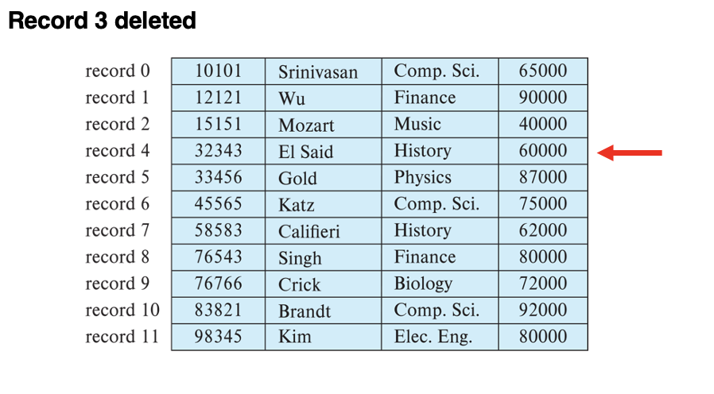
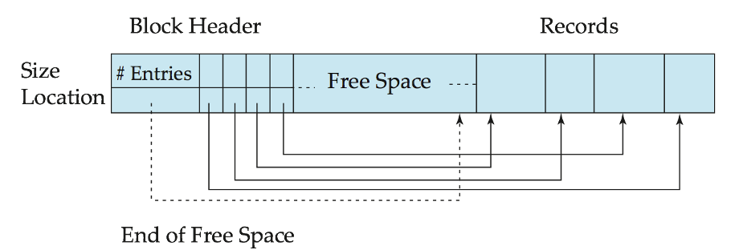
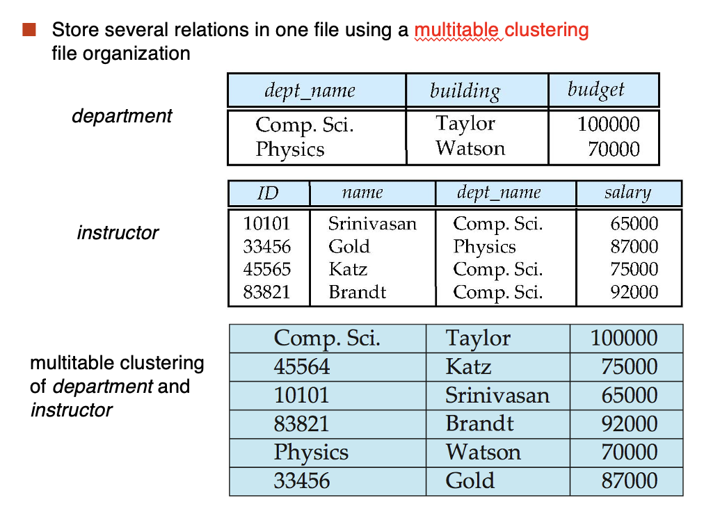

# **Data Storage Structures**

Outline:

- File Organization
    - Fixed-length Records
    - Variable-Length Records
- Organization of Records in Files
    - Heap File Organization
    - Sequential File Organization
    - Multitable Clustering File Organization
    - Table Partition
- Data-Dictionary Storage
    - LRU Strategy
    - Clock algorithm
- Columnar Repersentation

## **File Organization**

The database is stored as a collection of files.

  - Each file is a sequential of records
  - A record is a sequential of fields
  - One approach
      - assume record size is fixed
      - each file has records of one particular type only
      - different files are used for different relations

### **Fixed-Length Records**

从第 $n \times (i - 1)$ 个字节开始存储第 $i$ 条记录，$n$ 是每条记录的大小。

记录访问很简单，但是记录可能会跨越块。可以规定不让记录跨越块边界来进行修正。

<figure markdown="span">

</figure>

删除记录 $i$ 的三种方法：

1. 把记录 $i+1, \cdots, n$ 移动到 $i, \cdots, n-1$ 的位置
2. 把记录 $n$ 移动到 $i$ 的位置
3. 不移动记录，而是把所有空的记录都链接到一个 free list 中。

<figure markdown="span">
{width=400}
<figurecaption>方法一：删除记录三</figurecaption>
</figure>

<figure markdown="span">
{width=400}
<figurecaption>方法二：删除记录三，用记录十一代替</figurecaption>
</figure>

<figure markdown="span">
{width=400}
<figurecaption>方法三：free list</figurecaption>
</figure>

### **Variable-Length Records**

变长记录在数据库中有以下几种出现方式：

  - 一个文件中存储多种记录类型
  - 允许一个或多个字段的数据类型，如 strings(varchar)
  - 允许重复字段的记录类型（用于某些过去的数据类型）

属性按顺序存储

所有的变长属性以固定大小来表示(offset, length), 实际的数据存储在所有定长属性之后。

空值用空位图(null-value bitmap)来表示。

!!! Example

    <figure markdown="span">
    {width=400}
    <figurecaption>变长记录的存储方式</figurecaption>
    </figure>

#### **Slotted Page Structure**

<figure markdown="span">
{width=400}
<figurecaption>Slotted Page Structure</figurecaption>
</figure>

Slotted page(分槽页) header contains:

  - number of record entries
  - end of tree space in the block
  - location and size of each record

记录可以在页中移动，来保持它们之间的连续性，并且它们之间没有空白区域。

记录指针不能直接指向记录，它们应该指向页头中的记录条目。

## **Organization of Records in Files**

Heap - record can be placed anywhere in the file where there is space. 只要有空间，记录可以放在任意位置。

Sequential - store records in sequential order, based on the value of the search key of each record. 顺序存储，基于每条记录的搜索键值。

In a multitable clustering file organization records of serveral different relations can be stored in the same file. 聚集文件组织，几个不同的关系可以存储在同一个文件中。

B+ tree file organization: ordered storage even with inserts/deletes.

Hashing - a hash function computed on search key; the result specifies in which block of the file the record is to be stored. 哈希函数计算搜索键，结果指定记录存储在文件的哪个块中。

### **Heap File Organization**

<figure markdown="span">
{width=400}
<figurecaption>Heap File Organization</figurecaption>
</figure>

### **Sequential File Organization**

<figure markdown="span">
{width=400}
<figurecaption>Sequential File Organization</figurecaption>
</figure>

适用于需要对文件进行顺序处理的场景。文件中的记录按照搜索键的顺序存储。

操作：

- Deletion - use pointer chains
- Insertion - locate the position where the record is to be inserted
  - If there is free space insert there
  - If no free space, insert the record in an overflow block
  - In either case, pointer chain must be updated

随着记录的插入和删除，文件的顺序可能会被打乱。需要使用排序算法来重新排序文件。

### **Multitable Clustering File Organization**

<figure markdown="span">
{width=400}
<figurecaption>Multitable Clustering File Organization</figurecaption>
</figure>

优势：适用于多表连接查询以及查询一个部门的所有教师

劣势：不适用于只包括 department 的查询

### **Table Partition**

<figure markdown="span">
{width=400}
<figurecaption>Table Partition</figurecaption>
</figure>

## **Data Dictionary Storage**

The data dictionary (also called system catalog) stores metadata; that is, data about data, such as

- information about relations
    - names of relations
    - names, types and lengths of attributes of each relation
    - names and definitions of views
    - integrity constraints
- User and accounting information, including passwords
- Statistical and descriptive data
    - number of tuples in each relation
- Physical file organization information
    - How relation is stored(sequential/hash/...)
    - Physical location of the relation
- Information about indices

### **Relational Repersentation of System Metadata**

<figure markdown="span">
{width=400}
<figurecaption>Relational Repersentation of System Metadata</figurecaption>
</figure>

## **Storage Access & Buffer Manager**

<font color = blue>Blocks</font> are units of both storage allocation and data transfer.

<font color = blue>Buffer</font> - portion of main memory available to store copies of disk blocks.

<font color = blue>Buffer manager</font> - subsystem responsible for allocating buffer space in main memory.

<figure markdown="span">
{width=400}
<figurecaption>Buffer Manager</figurecaption>
</figure>

### **LRU Strategy**

LRU 策略已经学过很多次了，基本思路是用一个栈或者队列来存储最近使用的块，最少使用的块会被替换掉。

<figure markdown="span">
{width=400}
<figurecaption>LRU Strategy</figurecaption>
</figure>

Programs call on the buffer manager when they need a block from disk.

- If the block is already in the buffer, buffer manager returns the address of the block in main memory.
- If the block is not in the buffer, the buffer manager
    - Allocates space in the buffer for the block
        - Replacing(throwing out) some other block, if required, to make space for the new block
        - Replaced block written back to disk only if it was modified since the most recent time that it was written to/refetched from the disk.
    - Reads the block from the disk to the buffer and returns the address of the block in main memory to requester.

<figure markdown="span">
{width=400}
</figure>

### **Buffer-Replacement Policies**

<font color = blue>LRU strategy</font> - replace the block least recently used.

<font color = blue>Toss-immediate strategy</font> - frees the space occupied by a block as soon as the final tuple of that block has been processed.

<font color= blue>Most recently used(MRU) strategy</font> - system must pin the block currently begin processed. After the final tuple of that block has been processed, the block is unpinned, and it becomes the most recently used block.

Buffer managers also support forced output of blocks for the purpose of recovery.

### **Clock Algorithm**

<figure markdown="span">
{width=400}
<figurecaption>Clock Algorithm</figurecaption>
</figure>

Arrange block into a cycle, store one ```reference_bit``` per block.

When ```pin_count``` reduces to 0, set ```reference_bit = 1```

```reference_bit``` as the 2nd chance bit.

把所有的块都放在一个环中，指针指向当前块。每次访问一个块的时候，如果这个块的标记位为 1，就把 1 设置为 0，然后指针指向下一个块。如果标记位为 0，就把这个块替换掉，指针指向下一个块。

```cpp
do for each block in cycle {
    if(reference_bit == 1) set reference_bit = 0;
    else if(referencen_bit == 0) choose this block for replacement;
} until a page is chosen;
```

## **Column-Oriented Storage**

把一个记录的不同属性分开存储在不同的文件中。

所有的属性都是按顺序存储的，如果想找到某个记录的某个属性，只需要找到文件中对应序列号的位置即可。

<figure markdown="span">
{width=400}
<figurecaption>Column-Oriented Storage</figurecaption>
</figure>