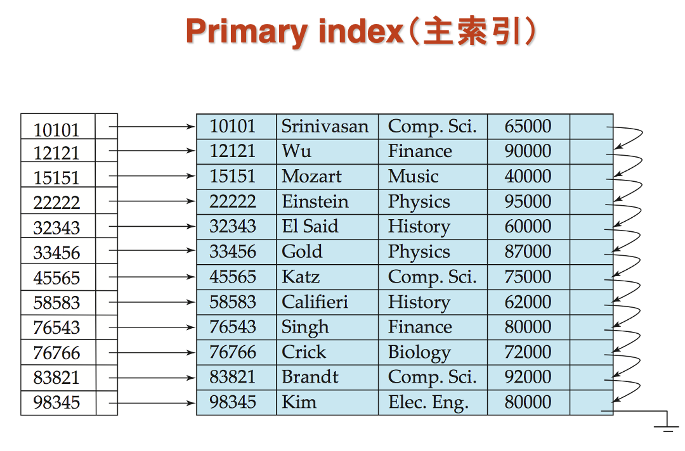
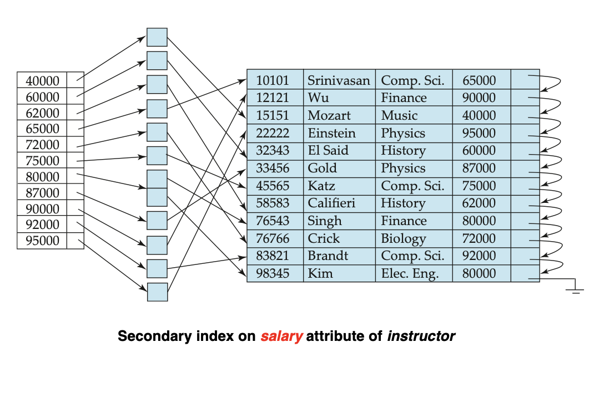
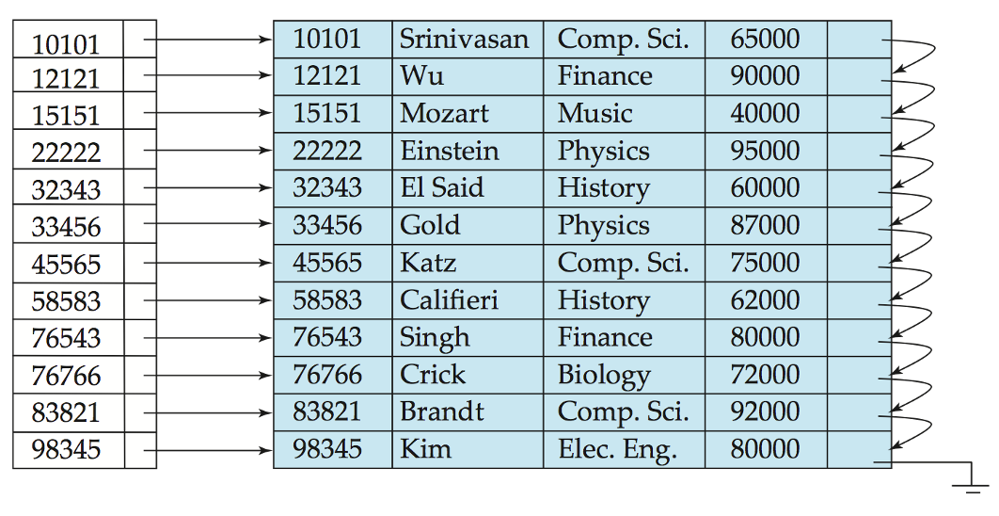
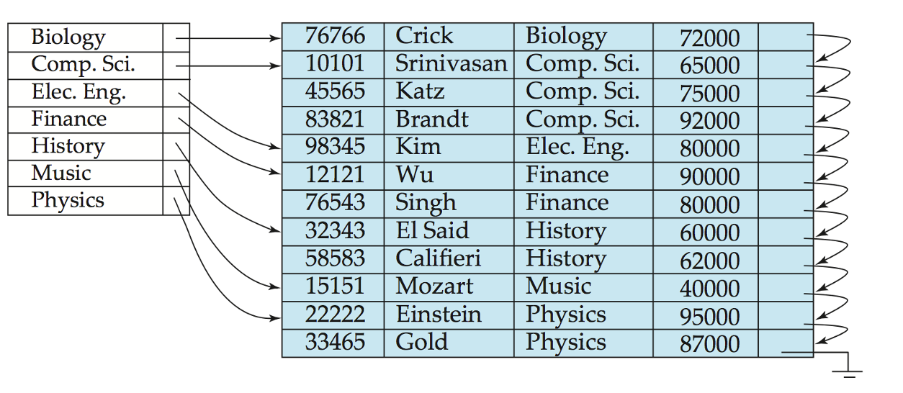
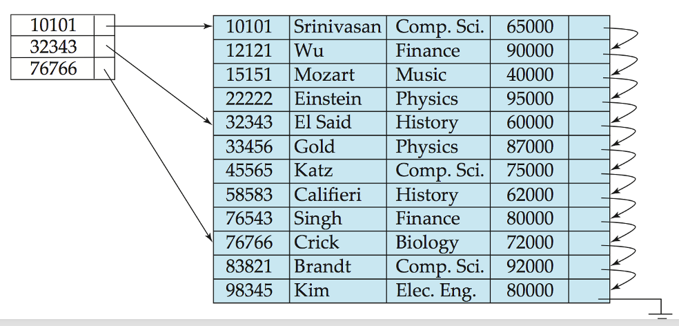
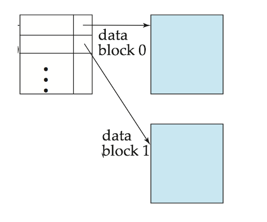
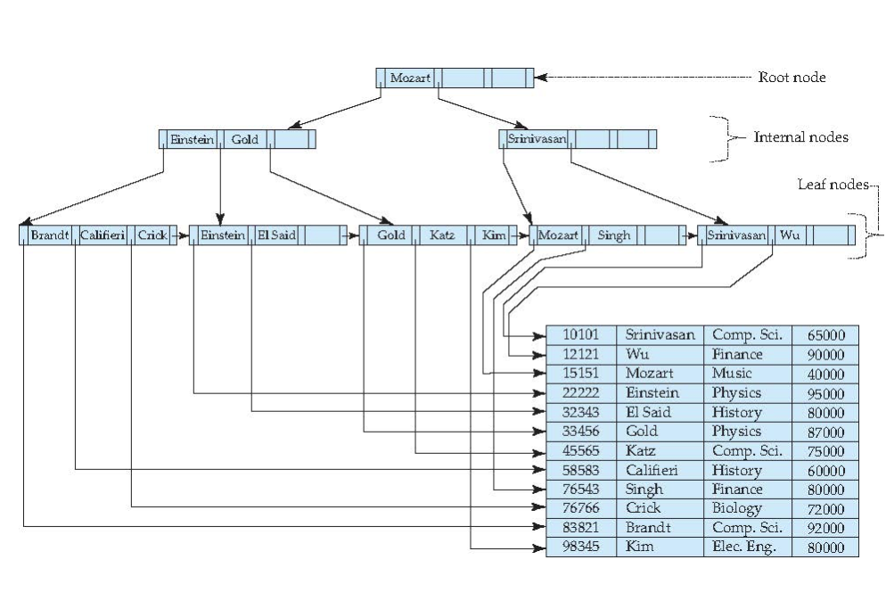

# **Indexing**

Outline:

- Basic Concepts
- Ordered indices
- B+ Tree Index
- B+ Tree File Organization
- B Tree Index Files
- Indices on Multiple Keys
- Indexing on a Flash
- Indexing in Main Memory
- Write Optimized Indices
    - Log Structured Merge(LSM) Tree
    - Buffer Tree
- Bitmap indices

## **Basic Concepts**

<font color = red>Search Key</font> - attribute to set of attributes used to look up records in a file.

An <font color= red>index file</font> consists of records(called index entries) of the form

| Search-key | pointer |
| :--------: | :-----: |

Two basic kinds of indices:

  - <font color = red>Ordered indices</font>: search keys are stored in <font color = blue> sorted order</font>
  - <font color = red>Hash indices</font>: search keys are distributed uniformly across "buckets" using a "hash function".

### **Index Evaluation Metrics**

- Access types supported efficiently.
    - <font color = red>Point query</font>: records with a specified value in the attribute
    - <font color = red>Range query</font>: or records with an attribute value falling in a specified range of values

支持点查以及范围查询。

- Access time
- Insertion time
- Deletion time
- Space overhead

## **Ordered Indices**

- <font color = red>Primary index(主索引)</font>: in a sequentially ordered file, the index whose search key specifies the sequential order of the file.
    - Also called <font color = red>clustering index(聚集索引)</font>
    - The search key of a primary index is usually but not necessarily the primary key.
- <font color = red>Secondary index(辅助索引)</font>: an index whose search key specifies an order different from the sequential order of the file. Also called <font color = blue>non-clustering index</font>
- <font color =blue>Index-sequential file(索引顺序文件)</font>: ordered sequential file with a primary index.

主索引只能有一个，其他都是辅助索引。

!!! Example

    <figure markdown="span">
    
    </figure>

    <figure markdown="span">
    
    </figure>

### **Dense Index Files**

<font color = red>Dense index(稠密索引)</font> - index record appears for every search-key value in the file.

每一个 search-key 都要出现在文件里。

<figure markdown="span">

</figure>

<figure markdown="span">

</figure>

图一是以 ID 为主索引来搜索，图二是以 ```dept_name``` 为主索引来搜索。

### **Sparse Index Files**

<font color = red>Sparse index(稀疏索引)</font> - contains index records for only <font color = blue>some search-key</font> values.

<figure markdown="span">

</figure>

<font color = blue>Good tradeoff</font>: sparse index with an index entry for every block in file, corresponding to least search-key value in the block.

<figure markdown="span">

</figure>

### **Multilevel Index(多级索引)**

对索引再次建立索引，类似 B+ 树。

## **B+ Tree Index Files**

- <font color = red>All paths</font> from root to the leaf are of <font color = blue>the same length</font>
- <font color = red>Inner node</font>(not a root or a leaf) between $\lceil n/2 \rceil$ and $n$ children
- <font color = red>Leaf node</font> between $\lceil (n-1)/2 \rceil$ and $n-1$ values
- Special cases:
    - If the root is not a leaf: at least 2 children
    - If the root is a leaf: between $0$ and $n-1$ values

<figure markdown="span">

</figure>

数据库中B+ 树一般一个叶子结点就是一个块的大小，即 4KB.

### **Observations about B+ Trees**

