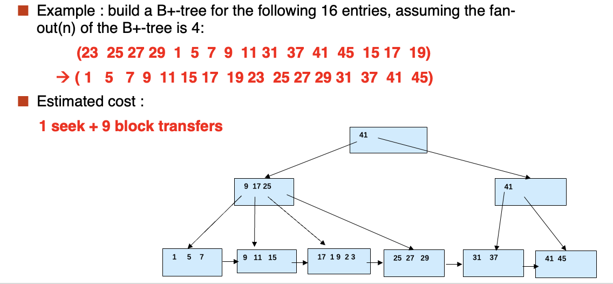

# **Indexing**

Outline:

- Basic Concepts
- Ordered indices
- B+ Tree Index
- B+ Tree File Organization
- B Tree Index Files
- Indices on Multiple Keys
- Indexing on a Flash
- Indexing in Main Memory
- Write Optimized Indices
    - Log Structured Merge(LSM) Tree
    - Buffer Tree
- Bitmap indices

## **Basic Concepts**

<font color = red>Search Key</font> - attribute to set of attributes used to look up records in a file.

An <font color= red>index file</font> consists of records(called index entries) of the form

| Search-key | pointer |
| :--------: | :-----: |

Two basic kinds of indices:

  - <font color = red>Ordered indices</font>: search keys are stored in <font color = blue> sorted order</font>
  - <font color = red>Hash indices</font>: search keys are distributed uniformly across "buckets" using a "hash function".

### **Index Evaluation Metrics**

- Access types supported efficiently.
    - <font color = red>Point query</font>: records with a specified value in the attribute
    - <font color = red>Range query</font>: or records with an attribute value falling in a specified range of values

支持点查以及范围查询。

- Access time
- Insertion time
- Deletion time
- Space overhead

## **Ordered Indices**

- <font color = red>Primary index(主索引)</font>: in a sequentially ordered file, the index whose search key specifies the sequential order of the file.
    - Also called <font color = red>clustering index(聚集索引)</font>
    - The search key of a primary index is usually but not necessarily the primary key.
- <font color = red>Secondary index(辅助索引)</font>: an index whose search key specifies an order different from the sequential order of the file. Also called <font color = blue>non-clustering index</font>
- <font color =blue>Index-sequential file(索引顺序文件)</font>: ordered sequential file with a primary index.

主索引只能有一个，其他都是辅助索引。

!!! Example

    <figure markdown="span">
    
    </figure>

    <figure markdown="span">
    
    </figure>

### **Dense Index Files**

<font color = red>Dense index(稠密索引)</font> - index record appears for every search-key value in the file.

每一个 search-key 都要出现在文件里。

<figure markdown="span">

</figure>

<figure markdown="span">

</figure>

图一是以 ID 为主索引来搜索，图二是以 ```dept_name``` 为主索引来搜索。

### **Sparse Index Files**

<font color = red>Sparse index(稀疏索引)</font> - contains index records for only <font color = blue>some search-key</font> values.

<figure markdown="span">

</figure>

<font color = blue>Good tradeoff</font>: sparse index with an index entry for every block in file, corresponding to least search-key value in the block.

<figure markdown="span">

</figure>

### **Multilevel Index(多级索引)**

对索引再次建立索引，类似 B+ 树。

## **B+ Tree Index Files**

- <font color = red>All paths</font> from root to the leaf are of <font color = blue>the same length</font>
- <font color = red>Inner node</font>(not a root or a leaf) between $\lceil n/2 \rceil$ and $n$ children
- <font color = red>Leaf node</font> between $\lceil (n-1)/2 \rceil$ and $n-1$ values
- Special cases:
    - If the root is not a leaf: at least 2 children
    - If the root is a leaf: between $0$ and $n-1$ values

<figure markdown="span">

</figure>

数据库中B+ 树一般一个叶子结点就是一个块的大小，即 4KB.

### **Observations about B+ Trees**

- Since the inter-node connections are done by pointers, "logically" close blocks need not be "physically" close.
- The non-leaf levels of the B+ tree form a hierarchy of sparse indices.
- The B+ tree contains a relatively small number of levels
    - Level below root has at least $2 * \lceil n/2 \rceil$ values
    - Next level has at least $2 * \lceil n/2 \rceil * \lceil n/2 \rceil$ values
    - ..etc.

如果文件中有 $K$ 个索引项，那么树的高度不会超过 $\lceil \log_{\ceil n/2 \rceil}(K/2) \rceil + 1$

B+ 树的插入，删除等操作这里就不展示了，可以在[这个网站](https://www.cs.usfca.edu/~galles/visualization/BPlusTree.html)查看

### **B+ tree: height and size estimation**

<figure markdown="span">
{ width=50%}
</figure>

<figure markdown="span">
{ width=50%}
</figure>

### **B+ tree File Organization**

- B+ tree File Organization:
    - Leaf nodes in a B+ tree file organization store records, instead of pointers.叶子节点不放指针，而是放记录本身。
    - Helps keep data records clustered even when there are insertions/deletions/updates.
- Leaf nodes are still required to be half full
- Insertion and deletion are handled in the same way as insertion and deletion of entries in a B+ tree index.

<figure markdown="span">

</figure>

为了提高空间利用率，我们可以改变“半满”的条件，比如将“半满”定义为 $\lfloor 2n/3 \rfloor$

### **Other Issues in Indexing**

- Record relocation and secondary indices
    - If a record moves, all secondary indices that store record pointers have to be updated.
    - Node splits in B+ tree file organizations become very expensive.
    - Solution: <font color = blue>use primary-index search key instead of record pointer in secondary index</font>
- Variable length strings as keys
    - Variable fanout
- Prefix compression
    - Key values at internal nodes can be perfixes of full key
    - Keys in leaf node can be compressed by sharing common prefixes.

### **Bulk Loading and Bottom-Up Build**

- Efficient alternative 1: Insert in sorted order
    - Sort entries first(using efficient external-memory sort algorithms)
    - insert in sorted order
- Efficient alternative 2: Bottom-up B+ tree construction
    - As before sort entries
    - And then create tree layer-by-layer, starting with leaf level
    - Implemented as part of bulk-utility by most database systems

<figure markdown="span">

</figure>

#### **Bulk insert index entries**

<figure markdown="span">

</figure>

## **Indices on Multiple Keys**

- Composite search keys are search keys containing more that one attribute.
- Lexicographic ordering: $(a_1, a_2) < (b_1, b_2)$ if either $a_1 < b_1$ or $a_1 = b_1 \mathrm{and} a_2 < b_2$

## **Indexing in Main Memory**

- Random access in memory
    - Much cheaper than on disk/flash, but still expensive compared to cache read
    - Binary search for a key value within a large B+ tree node results in many cache misses
    - Data structures that make best use of cache perferable - cache conscious
- B+ trees with small nodes that fit in cache line are preferable to reduce cache misses
- Key idea:
    - use large node size to optimize disk access
    - but structure data within a node using a tree with small node size, instead of using an array, to optimize cache access

## **Indexing on Flash**

- Random I/O cost much lower on flash
- Writes are not in-place, and (eventually) require a more expensive erase
- Optimum page size therefore much smaller
- Bulk-loading still useful since it minimizes page erases
- Write-optimized tree structures (i.e., LSM-tree) have been adapted to minimize page writes for flash-optimized search trees

## **Write Optimized Indices**

- Two approaches to reducing cost of writes
    - Log-structured merge tree (LSM-tree)
    - Buffer tree

### **Log Structured Merge Tree(LSM-tree)**

<figure markdown="span">

</figure>

- Records inserted first into in-memory tree($L_0$ tree)
- When in-memory tree is full, records moved to disk($L_1$ tree).如果内存中的树满了，就将内存中的树移动到磁盘上。
    - B+ tree constructed using bottom-up build by merging existing $L_1$ tree with records from $L_0$ tree
- When $L_1$ tree exceeds some threshold, merge into $L_2$ tree
    - And so on for more levels
    - Sizethreshold for $L_{i+1}$ tree is $K$ times size threshold for $L_i$ tree

<figure markdown="span">

</figure>

#### **Stepped Merge Index**

- Stepped-merge index: variant of LSM tree with k trees at each level on disk
    - When all $k$ indices exist at a level, merge them into one index of next level.
    - Reduces write cost compared to LSM tree
- But queries are even more expensive since many trees need to be queries
- Optimization for point lookups
    - Compute Bloom filter for each tree and store in-memory
    - Query a tree only if Bloom filter returns a positive result