# **Query Processing**

Outline:

- Basic Steps in Query Processing
- Measures of Query Cost
- Selection Operation
- Sorting
- Join Operation
- Other Operations
- Evaluation of Expressions

## **Basic Steps in Query Processing**

<figure markdown="span">
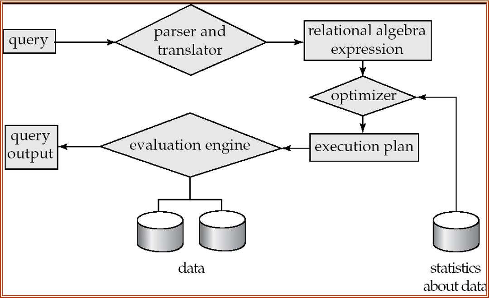
</figure>

- Parsing and translation.语法分析和语义分析
    - translate the query into its internal form. This is then translated into relational algebra.把查询语句翻译成关系代数
    - Parser checks syntax, verifies relations.检查语法是否正确，句子中提到的表，属性是否存在等。
- Optimization
    - Amongst all equivalent evaluation plans choose the one with lowest cost.
- Evaluation

!!! Example

    <figure markdown="span">
    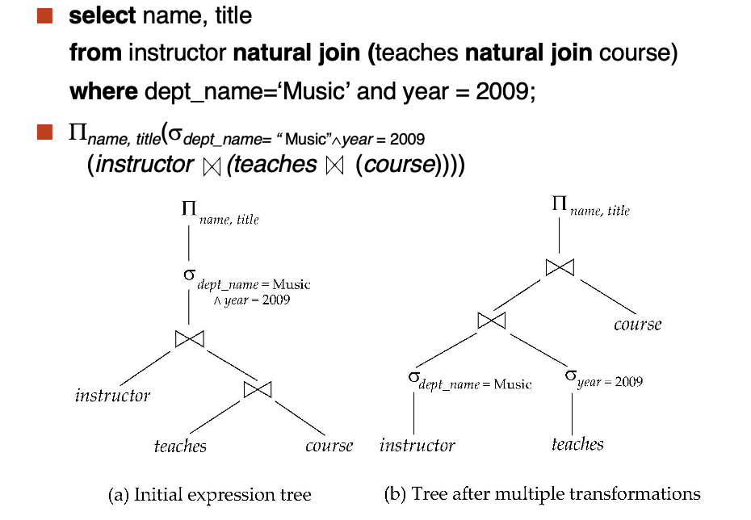
    </figure>

    转化成关系代数之后，构建一个二叉树，从底层往上进行运算。

    图 (a) 是根据关系代数直接构建得到的，图 (b) 是经过优化后的结果。

    <figure markdown="span">
    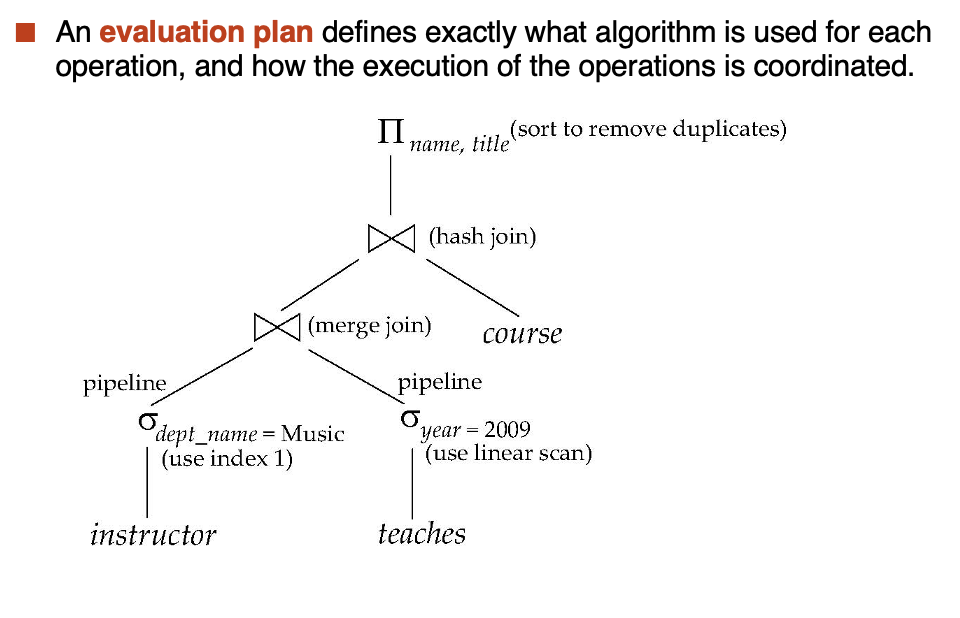
    </figure>

## **Measures of Query Cost**

- Typically disk access is the predominant cost. and is also relatively easy to estimate.
- Measured by taking into account
    - Number of seeks
    - Number of blocks read
    - Number of blocks written
        - Cost to write a block is greater than cost to read a block. Because data is read back after being written to ensure that the write was successful.通常写的代价比读的代价要大因为我们会在写完之后读回来检查写入是否成功。

For simplicity we just use the number of block transfers from disk and the number of seeks as the cost measures.

- $t_T$ - time to transfer one block
- $t_S$ - time for one seek
- Cost for $b$ block transfers plus $S$ seeks: $b * t_T + S * t_S$

$t_S$ and $t_T$ depend on where data is stored; with 4 KB blocks:
    
- High end magentic disk: $t_S = 4 \mathrm{msec}$ and $t_T = 0.1 \mathrm{msec}$
- SSD: $t_S = 20 - 90 \mathrm{microsec}$ and $t_T = 2 - 10 \mathrm{microsec}$ for 4KB

## **Selection Operation**

### **File Scan**

Algorithm $A_1 \mathrm{(linear \ search)}$. Scan each file block and test all records to see whether they satisfy the selection condition.

线性搜索，查找每个块的所有记录。

- worst cost = $b_r * t_T + t_S$, 其中 $b_r$ 记录有关系 $r$ 的块数
- average cost = $(b_r/2) * t_T + t_S$, if selection is on a key attribute, can stop on finding record

### **Index Scan**

Algorithm $A_2 \mathrm{(primary \ B+\ tree\ index/clustering\ B+\ tree\ index,\ equality\ on\ key).}$

- cost = $(h_i + 1) * (t_T + t_S)$, where $h_i$ is the height of the index tree

<figure markdown="span">
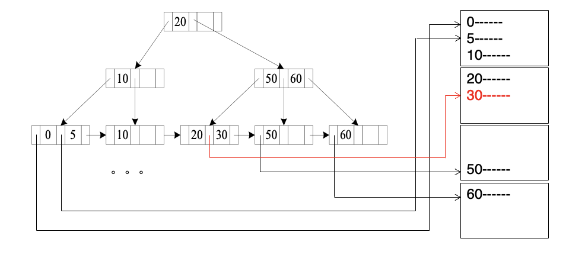
</figure>

---

Algorithm $A_3 \mathrm{(primary \ B+\ tree\ index/clustering\ B+\ tree\ index,\ equality\ on\ nonkey).}$

此时不依靠主键进行搜索，而是别的属性。

cost = $h_i * (t_T + t_S) + t_S + t_T * b$, 这里的 $b$ 是包含满足条件的记录的块数。

<figure markdown="span">
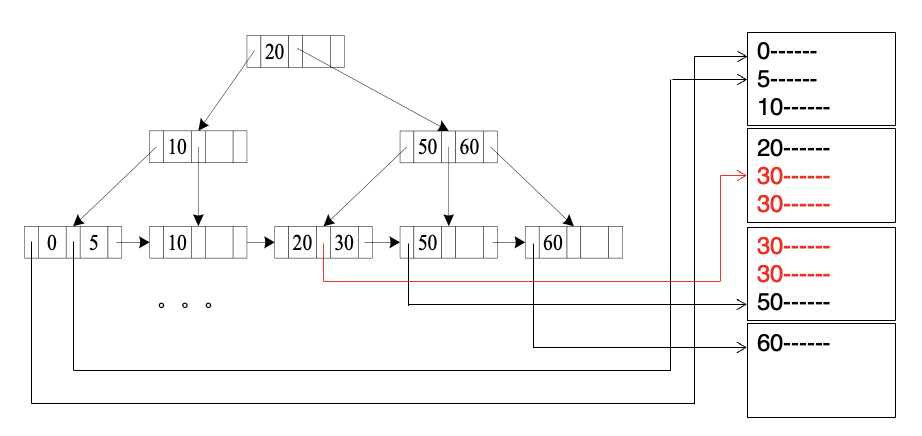
</figure>

---

Algorithm $A_4 \mathrm{(secondary\ B+\ tree\ index,\ equality\ on\ key).}$

cost = $(h_i + 1) * (t_T + t_S)$

<figure markdown="span">
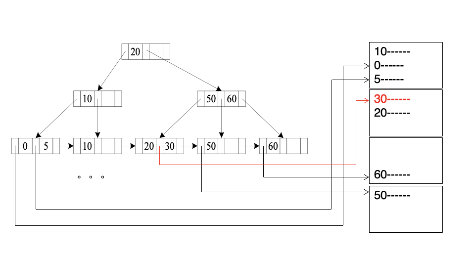
</figure>

---

Algorithm $A_4^{\prime} \mathrm{(secondary\ B+\ tree\ index\ on\ nonkey,\ equality).}$

- Each of $n$ matching records may be on a different block.
- $n$ pointers may be stored in $m$ blocks.
- cost = $(h_i + m + n) * (t_T + t_S)$

<figure markdown="span">
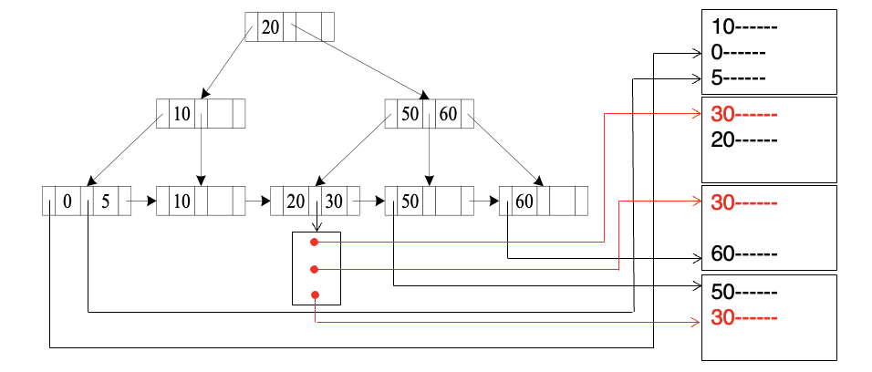
</figure>

### **Selections Involving Comparisons**

Can implement selections of the form $\sigma_{A \leq V}(r) \mathrm{or} \sigma_{A \geq V}(r)$ by using

- a linear file scan or binary search,
- or by using indices in the following ways:

Algorithm $A_5 \mathrm{(primary\ B+\ tree\ index/clustering\ B+\ tree\ index,\ comparison).}$

- 先找到满足条件的第一个记录，然后线性扫描。
- cost = $h_i * (t_T + t_S) + t_S + t_T * b$, 其中 $b$ 是满足条件的记录的块数。

<figure markdown="span">
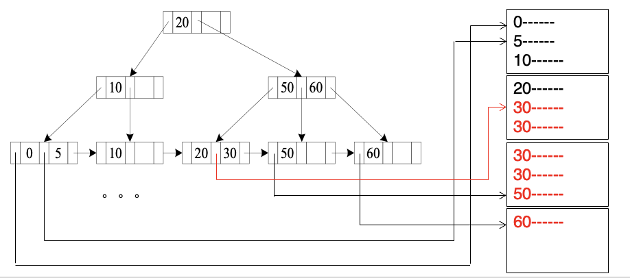
</figure>

---

Algorithm $A_6 \mathrm{(secondary\ B+\ tree\ index,\ comparison).}$

<figure markdown="span">
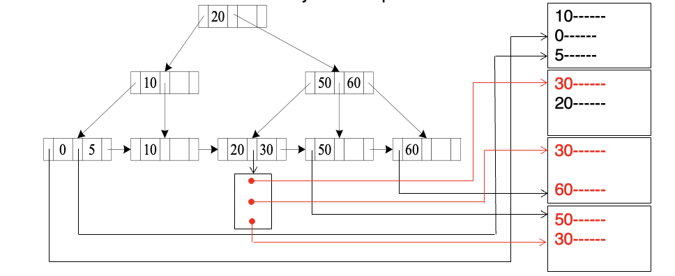
</figure>

情况与 $A_4$ 类似。

### **Implementation of Complex Selections**

- Conjunction: $\sigma_{\theta_1} \cap \sigma_{\theta_2} \cap \cdots \cap \sigma_{\theta_n}(r)$
- Algorithm $A_7 \mathrm{(conjunctive\ selection\ using\ one\ index)}$
    - Select a combination of $\theta_i$ and algorithm $A_1$ through $A_6$ that results in the least cost for $\sigma_{\theta i}{r}$
    - Test other conditions on tuple after fetching it into memory buffer.
- Algorithm $A_8 \mathrm{(conjunctive\ selection\ using\ composite\ index)}$
    - Use appropriate composite (multiple-key) index if available.
- Algorithm $A_9 \mathrm{(conjunctive\ selection\ by\ intersection\ of\ identifiers)}$.
    - 对每个索引都查询，然后将结果拼起来。

### **Algorithms for Complex Selections**

- Disjunction: $\sigma_{\theta_1} \cup \sigma_{\theta_2} \cup \cdots \cup \sigma_{\theta_n}(r)$
- Algorithm $A_{10} \mathrm{(disjunctive\ selection\ by\ union\ of\ identifiers)}$
    - Applicable if all conditions have available indices. Otherwise use linear search.
    - Use corresponding index for each condition, and take union of all the obtained sets of record pointers.
    - Then fetch records from line.
- Negation: $\sigma_{\neg \theta}(r)$
    - Use linear scan on file
    - If very few records satisfy $\neg \theta$, and an index is applicable to $\theta$, find satisfying records using index and fetch from file.

### **Bitmap Index Scan**

<figure markdown="span">
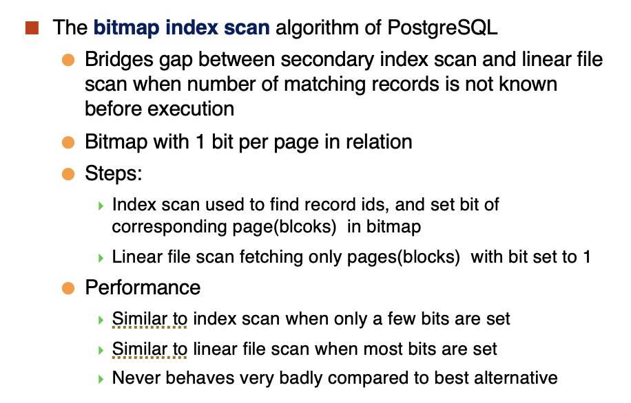
</figure>

## **Sorting**

- For relations that fit in memory, techniques like quicksort can be used
- For relations that don't fit in memory, external sert-merge is a good choice.

<figure markdown="span">
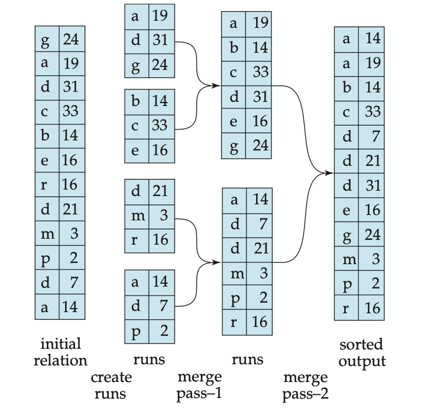
</figure>

### **External Sort-Merge**

Let $M$ denote memory size(in pages).

- Create sorted runs(归并段)
    - Repeatedly do the following till the end of the relation:
        - Read $M$ blocks of relation into memory
        - Sort the in-memory blocks
        - Write sorted data to run $R_i$; increment $i$
    - Let the final value of $i$ be $N$
- Merge the runs(N-way merge)

<figure markdown="span">
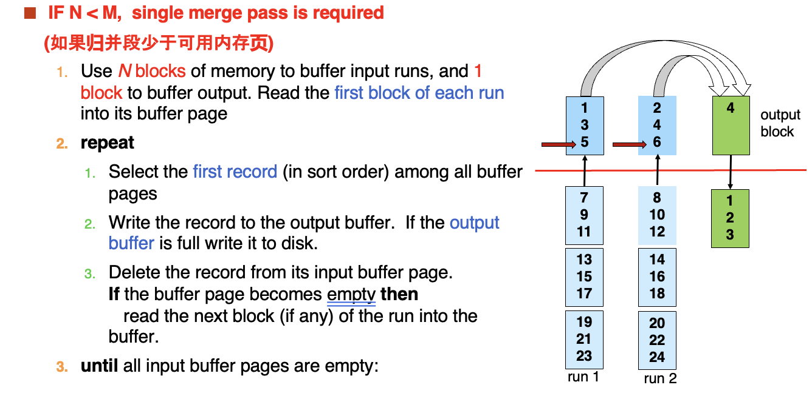{width="400"}
</figure>

- If $N \geq M$, several merge passes are required.

<figure markdown="span">
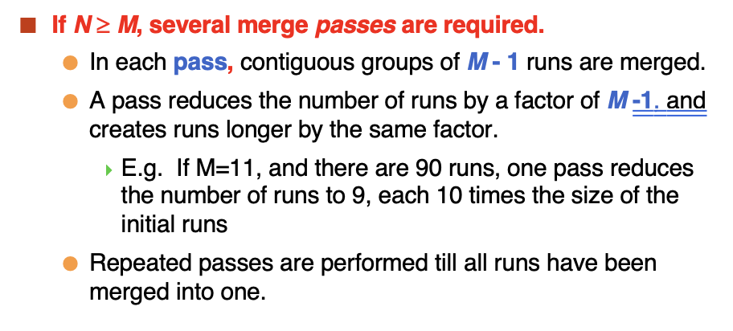{width="400"}
</figure>

### **Cost Analysis**

#### **Simple Version**

- Transfer
    - Total number of runs: $\lceil \frac{b_r}{M} \rceil$
    - Total number of merge passes required: $\lceil \log_{M-1}(b_r / M) \rceil$
    - Block transfers for initial run creation as well as in each pass is $2b_r$
    - So the total number of block transfers is $2b_r\lceil \log_{M-1}(b_r / M) \rceil + b_r = b_r(2\lceil \log_{M-1}(b_r / M) \rceil + 1)$
- Seeks

<figure markdown="span">
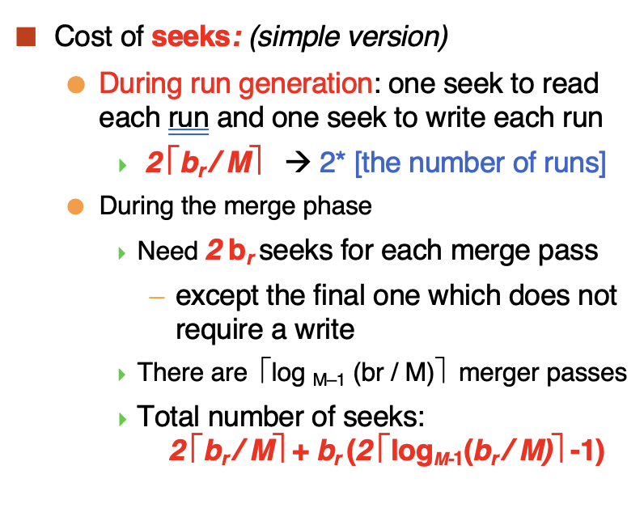
</figure>

#### **Advanced Version**

之前的版本中每一次读进去都要 seek, 可以改进：为每一个归并段分配多个缓冲区，这样一次定位之后可以读如多块进入缓冲区

<figure markdown="span">
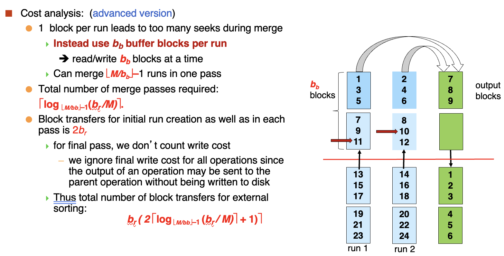
</figure>

<figure markdown="span">

</figure>

## **Join Operation**

Several different algorithms to implement joins
  - Nested-loop join
  - Block nested-loop join
  - Indexed nested-loop join
  - Merge-join
  - Hash-join

### **Nested-Loop Join**

为了实现 $r \bowtie_{\theta} s$，我们可以使用嵌套循环连接。

<figure markdown="span">
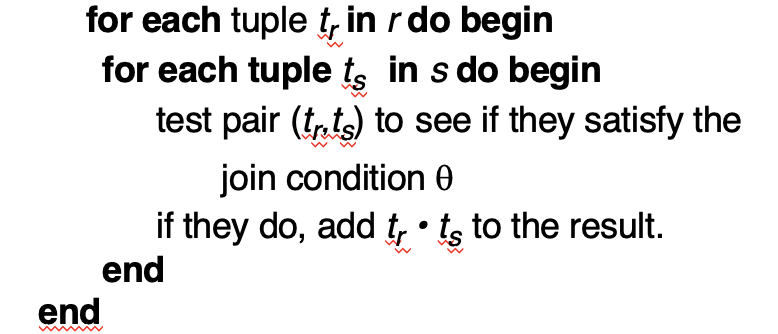
</figure>

- $r$ is called the outer relation and $s$ is called the inner relation.
- In the worst case, the cost is $n_r * b_s + b_r$ block transfers, plus $n_r + b_r$ seeks.

### **Block Nested-Loop Join**

<figure markdown="span">
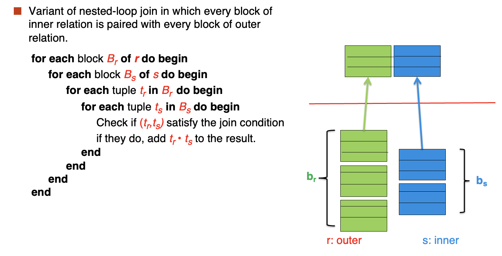
</figure>

以块为单位进行连接，检查每一个块中的每一个记录。

- Worst cost: $b_r * b_s + b_r$ block transfers, plus $2 * b_r$ seeks.
- Best case: $b_r + b_s$ block transfers, plus $2$ seeks