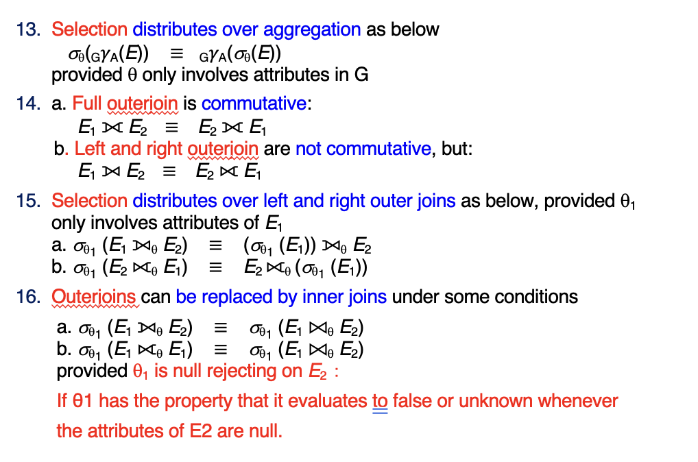
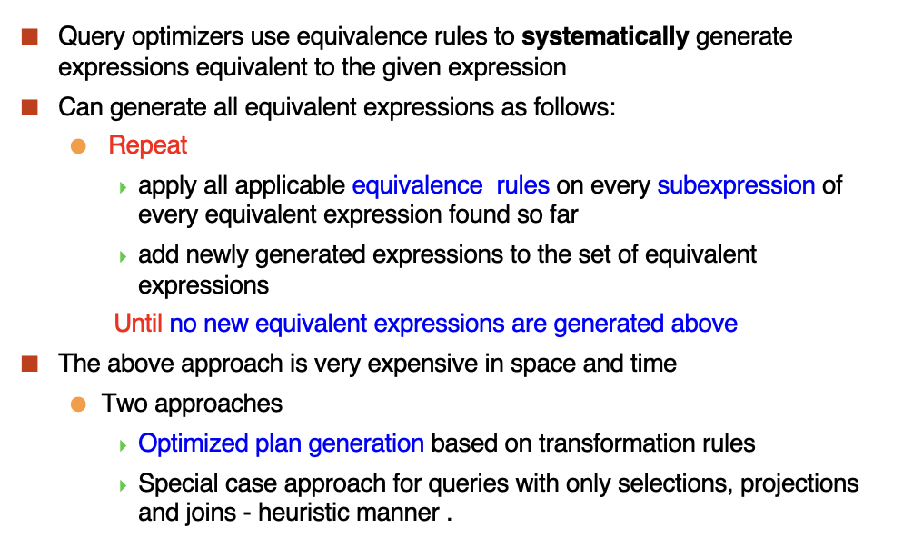
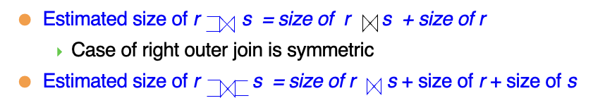
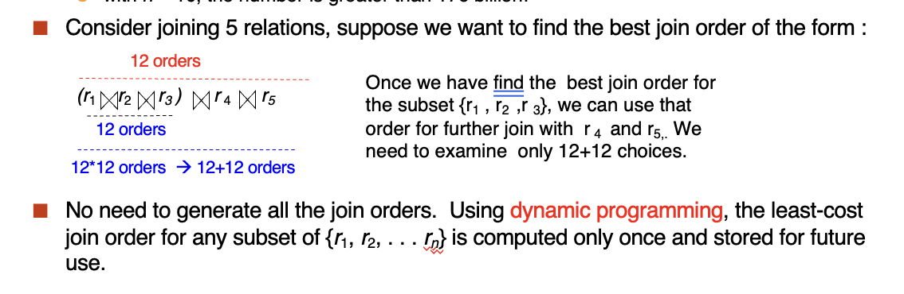

# **Query Optimization**

Outline:

- Introduction
- Transformation of Relational Expressions
- Statistical Information for Cost Estimation
- Cost-based Optimization
- Dynamic Programming for Choosing Evaluation Plans
- Nested Subqueries
- Materialized Views
- Advanced Topics in Query Optimization

## **Introduction**

- Alternative ways of evaluating a given query
    - Equivalent expressions
        - 逻辑优化， transformation based optimization
    - Different algorithms for each operation
        - 物理优化， cost based optimization

- Estimation of plan cost based on:
    - Statistical information about relations. Examples:
        - number of tuples, number of distinct values for an attribute
    - Statistics estimation for intermediate results(Cardinality Estimation)
        - to compute cost of complex expressions
    - Cost formulae for algorithms, computed using statistics

### **Viewing Query Evaluation Plans**

如果想要查看数据库系统选择的查询计划，可以使用 `EXPLAIN` 语句。这个语句会显示出数据库系统在执行查询时所选择的查询计划，包括每个操作的成本估计和执行顺序。

<figure markdown="span">

</figure>

## **Transformation of Relational Expressions**

- Two relational algebra expressions are said to be equivalent if the two expressions generate the same set of tuples on every legal database instance.
    - 如果两个关系代数表达式在每个合法的数据库实例上生成相同的元组集合，则这两个表达式是等价的。
- An equivalence says that expressions of two forms are equivalent.
    - Can replace expression of first form by second, or vice versa

### **Equivalence Rules**

#### **Selection Operations**

- Conjunctive selection operations can be deconstructed into a sequence of individual selections.选择操作可以分解为一系列单独的选择操作。

$$
\sigma_{\theta_1 \land \theta_2}(E) = \sigma_{\theta_1}(\sigma_{\theta_2}(E))
$$

- Selection operations are commutative.选择操作是可交换的。

$$
\sigma_{\theta_1}(\sigma_{\theta_2}(E)) = \sigma_{\theta_2}(\sigma_{\theta_1}(E))
$$

- Only the last in a sequence of projection operations is needed, the others can be omitted.投影操作中只有最后一个是必要的，其他的可以省略。

$$
\pi_{L_1}(\pi_{L_2}(\cdots (\pi_{L_n}(E)) \cdots)) = \pi_{L_1}(E)
$$

- Selections can be combined with Cartesian products and theta joins.选择操作可以与笛卡尔积和 $\theta$ 连接结合使用。

    a. $\sigma_{\theta}(E_1 \times E_2) = E_1 \bowtie_{\theta} E_2$

    b. $\sigma_{\theta_1}(E_1 \bowtie_{\theta_2} E_2) = E_1 \bowtie_{\theta_1 \land \theta_2} E_2$

- Theta-join operations (and natural joins) are commutative. $\theta$ 连接操作（和自然连接）是可交换的。

$$
E_1 \bowtie_{\theta} E_2 = E_2 \bowtie_{\theta} E_1
$$

- (a). Natural join operations are associative.自然连接操作是结合的。

$$
(E_1 \bowtie E_2) \bowtie E_3 = E_1 \bowtie (E_2 \bowtie E_3)
$$

- (b). Theta joins are associative in the following manner:

$$
(E_1 \bowtie_{\theta_1} E_2) \bowtie_{\theta_2 \land \theta_3} E_3 = E_1 \bowtie_{\theta_1 \land \theta_3} (E_2 \bowtie_{\theta_2} E_3)
$$

: where $\theta_2$ involves attributes from only $E_2$ and $E_3$

- The selection operation distributes over the theta join operation under the following two conditions

    a. When all the attributes in $\theta_0$ involve only the attribute of one of the expressions($E_1$) begin joined.

    $$
    \sigma_{\theta_0}(E_1 \bowtie_{\theta} E_2) = \sigma_{\theta_0}(E_1) \bowtie_{\theta} E_2
    $$

    b. When $\theta_1$ involves only the attributes of $E_1$ and $\theta_2$ involves only the attributes of $E_2$.

    $$
    \sigma_{\theta_1 \land \theta_2}(E_1 \bowtie_{\theta} E_2) = \sigma_{\theta_1}(E_1) \bowtie_{\theta} \sigma_{\theta_2}(E_2)
    $$

#### **Projection Operations**

The projection operation distributes over the theta join operation as follows:

a. if $\theta$ involves only attributes from $L_1 \cup L_2$:

$$
\pi_{L_1 \cup L_2}(E_1 \bowtie_{\theta} E_2) = (\pi_{L_1}(E_1) \bowtie_{\theta} \pi_{L_2}(E_2))
$$

b. Consider a join $E_1 \bowtie_{\theta} E_2$.

  - Let $L_1$ and $L_2$ be sets of attributes from $E_1$ and $E_2$, respectively.
  - Let $L_3$ be attributes of $E_1$ that are involved in join condition $\theta$, but are not in $L_1 \cup L_2$ and
  - Let $L_4$ be attributes of $E_2$ that are involved in join condition $\theta$, but are not in $L_1 \cup L_2$.

$$
\pi_{L_1 \cup L_2}(E_1 \bowtie_{\theta} E_2) = \pi_{L_1 \cup L_2}(E_1) \bowtie_{\theta} \pi_{L_2 \cup L_4}(E_2)
$$

#### **Set Operations**

- The set operations union and intersection are commutative

$$
E_1 \cup E_2 = E_2 \cup E_1
$$

$$
E_1 \cap E_2 = E_2 \cap E_1
$$

- Set union and intersection are associative

$$
(E_1 \cup E_2) \cup E_3 = E_1 \cup (E_2 \cup E_3)
$$

$$
(E_1 \cap E_2) \cap E_3 = E_1 \cap (E_2 \cap E_3)
$$

- The selection operation distributes over $\cup$ and $\cap$ operations as follows:

$$
\sigma_{\theta}(E_1 - E_2) = \sigma_{\theta}(E_1) - \sigma_{\theta}(E_2)
$$

also: $\sigma_{\theta}(E_1 - E_2) = \sigma_{\theta}(E_1) - E_2$ and similarly for $\cap$ in place of $-$, but not for $\cup$.

- The projection operation distributes over union

$$
\pi_{L}{E_1 \cup E_2} = \pi_{L}{E_1} \cup \pi_{L}{E_2}
$$

#### **Other Equivalence Rules**

<figure markdown="span">
{ width="100%"}
</figure>

### **Enumeration of Equivalent Expressions**

<figure markdown="span">
{ width="100%"}
</figure>

## **Statistics for Cost Estimation**

估计代价需要以下的信息：

- $n_r$: number of tuples in a relation $r$.
- $b_r$: number of blocks containing tuples of $r$.
- $l_r$: size of a tuple of $r$.
- $f_r$: blocking factor of $r$ - i.e., the number of tuples of $r$ that fit into ont block.每个块能放几个元组
- $V(A, r)$: number of distinct values that appear in $r$ for attribute $A$; same as the size of $\pi_A(r)$.
- If tuples of $r$ are stored together physically in a file, then:

$$
b_r \ = \ \frac{n_r}{f_r}
$$

### **Selection Size Estimation**

- $\sigma_{A = v}(r)$
    - $n_r / V(A, r)$: number of records that will satisfy the selection
    - Equality condition on a key attribute: size estimate = 1
- $\sigma_{A \leq v}(r)$
    - Let c denote the estimated number of tuples satisfying the condition.
    - If min(A, r) and max(A, r) are available in catalog
        - c = 0 if $v < min(A, r)$
        - c = $n_r \frac{v - min(A, r)}{max(A, r) - min(A, r)}$
    - If histograms available, can refine above estimate
    - In absence of statistical information c is assumed to be $n_r / 2$.

<figure markdown="span">
{ width="100%"}
</figure>

### **Join Size Estimation**

The Cartesian product $r \times s$ contains $n_r, n_s$ tuples; each tuple occupies $s_r + s_s$ bytes.

- If $R \cap S = \emptyset$, then $r \bowtie s$ is the same as $r \times s$
- If $R \cap S$ is a key for $R$, then a tuple of s will join at most one tuple from $r$.
    - Therefore, (the number of tuples in $r \bowtie s$) $\leq n_s$

<figure markdown="span">

</figure>

- If $R \cap S$ is a foreign key in $S$ referencing $R$, then the number of tuples in $r \bowtie s = \mathrm{the number of tuples in} s$
    - The case for $R \cup S$ being a foreign key referencing $S$ is symmetric.

<figure markdown="span">

</figure>

- If $R \cap S = {A}$ is not a key for $R$ or $S$
- If we assume that every tuple $t$ in $R$ produces tuples in $R \bowtie S$, the number of tuples in $R \bowtie S$ is estimated to be:

$$
\frac{n_r * n_s}{V(A, s)} = n_r * \frac{n_s}{V(A, s)}
$$

可以理解为：每一个 $r$ 都可以和 $s$ 中的每一个元组进行连接.

: If the reverse is true, the estimate obtained will be:

$$
\frac{n_r * n_s}{V(A, r)} = n_s * \frac{n_r}{V(A, r)}
$$

<figure markdown="span">

</figure>

### **Size Estimation for Other Operations**

- Projection: estimated size of $\pi_A(r) = V(A, r)$
- Aggregation: estimated size of $$_A\mathcal{G}(r) = V(A, r)$
- Set operations:
    - For unions/intersections of selections on the same relation: rewrite and use size estimate for selections
        - E.g., $\sigma_{\theta_1}(r) \cup \sigma_{\theta_2}(r)$ can be rewritten as $\sigma_{\theta_1 \land \theta_2}(r)$
    - For operations on different realtions:
        - Estimated size of $r \cup s$ = size of $r$ + size of $s$
        - Estimated size of $r \cap s$ = min(size of $r$, size of $s$)
        - Estimated size of $r - s$ = size of $r$
        - All the three estimated may be quite inaccurate, but provide upper bounds on the sizes.
- Outer join:
    
<figure markdown="span">

</figure>

### **Estimation of Number of Distinct Values**

- Selections: $\sigma_{\theta}(r)$, estimate $V(A, \sigma_{\theta}(r))$
    - If $\theta$ forces A to take a specified value: $V(A, \sigma_{\theta}(r)) = 1$
        - e.g., A = 3
    - If $\theta$ forces A to take on one of a specified set of values: $V(A, \sigma_{\theta}(r)) = number of specified values$
        - e.g., A in {1, 2, 3}
    - If the selection condition $\theta$ is of the form $A op v$, estimated $V(A, \sigma_{\theta}(r)) = V(A, r) * s$
        - Where $s$ is the selectivity of the selection
    - In all the other cases, use approximate estimate: $V(A, \sigma_{\theta}(r)) = min(V(A, r), n_{\sigma \theta}(r))$
- Joins: $r \bowtie s$, estimate $V(A, r \bowtie s)$
    - If all attributes in A are from $r$, the estimated

$$
V(A, r \bowtie s) = min(V(A, r), n_{r \bowtie s})
$$

: - If A contains attributes A1 from $r$ and A2 from $s$, then estimated

$$
V(A, r \bowtie s) = min(V(A1, r) * V(A1 - A2, r) * V(A2, s), n_{r \bowtie s})
$$

## **Choice of Evaluation Plans**

### **Cost-based Join-Order Selection**

Consider finding the best join-order for $r_1 \bowtie r_2 ... r_n$

There are $\frac{(2(n-1))!}{(n-1)!}$ different join orders for above expression.

!!! EXAMPLE

    <figure markdown="span">
    
    </figure>

#### **Join Order Optimization Algorithm**

<figure markdown="span">

</figure>

1. 对于一个集合 $S$, 考虑其所有形式为 $S_1 \bowtie (S - S_1)$ 的连接方案，其中 $S_1$ 是 $S$ 的一个子集。
2. 对于 $S$ 的每一个子集，递归计算其连接方案的代价。
3. 当递归到单个关系时，考虑对其采取所有的连接方案，从而找出最优的连接方案。
4. 实际上是一个动态规划的思想。

<figure markdown="span">
{ width="100%"}
</figure>

<figure markdown="span">
{ width="100%"}
</figure>

##### **Left Deep Join Trees**

In left-deep join trees, the right-hand-side input for each join is a relation, not the result of an intermediate join.

在 left-deep-join trees 中，每个连接的右侧输入都是一个关系，而不是中间连接的结果。

左边可以是中间结果。

<figure markdown="span">

</figure>

##### **Cost of Optimization**

- With dynamic programming
    - Time complexity of optimization with bushy tree is $O(3^n)$
    - Space complexity is $O(2^n)$
- If only left-deep trees are considered
    - Time complexity of finding best join order is $O(n*2^n)$
    - Space complexity is $O(2^n)$

#### **Heuristic Optimization(启发式优化)**

- Systems may use Heuristics to reduce the number of choices that must be made in a cost-based fashion.
- Heuristic optimization transforms the query-tree by using a set of rules that typically (but not in all cases) improve execution preformance:
    - Perform selection early(reduces the number of tuples)
    - Perform projection early(reduces the number of attributes)
    - Perform most restrictive selection and join operations(i.e. with smallest result size) before other similar operations.
    - Perform left-deep join order

## **Additional Optimization Techniques**

### **Nested Subqueries**

- Nested query example:

```SQL
select name
from instructor
where exists (select *
            from teaches
            where instructor.ID = teaches.ID and teaches.year = 2022)
```

- SQL conceptually treats nested subqueries in the where clause as functions that take parameters and return a single value or set of values.
    - Parameters are variables from outer level query that are used in the nested subquery; such variables are called correlated variables(相关变量).

在上边的例子中，对于每一层外部循环，我们都要遍历内层的循环。但是如果来自外循环的变量没有相关变量的话，那么我们可以先执行内层的循环，然后将结果传递给外层的循环。

- The semijoin(半连接) operator ⋉ is defined as follows:
    - If a tuple $r_i$ appears $n$ times in $r$, it appears $n$ times in the result of $r ⋉_{\theta} s$, if there is at least one tuple $s_j$ in $s$ matching with $r_i$.

<figure markdown="span">

</figure>

- The process of replacing a nested query by a query with a join/semijoin (possibly with a temporary relation) is called decorrelation(去除相关).

#### **Decorrelation**

- Decorrelation of scalar aggregate subqueries can be done using groupby/aggregation in some cases.

<figure markdown="span">

</figure>

### **Materialized Views**

- A materialized view is a view whose contents are computed and stored.

```SQL
create view department_total_salary(dept_name, total_salary) as
select dept_name, sum(salary)
from instructor
group by dept_name
```

#### **Materialized View Maintenance**

Use incremental maintenance(增量视图维护).

Changes to database relations are used to compute changes to the materialized view, which is then updated.

对于数据库的关系的变化，我们可以计算出物化视图的变化，然后更新物化视图。

The changes (inserts and deletes) to a relation or expressions are referred to as its differential(差分).

##### **Join Operation**

<figure markdown="span">

</figure>

$$
\mathrm{for\ inserts:} v^{new} = v^{old} \cup (i_r \bowtie s)
$$

$$
\mathrm{for\ deletes:} v^{new} = v^{old} - (d_r \bowtie s)
$$

##### **Selection and Projection Operations**

<figure markdown="span">

</figure>

Seelction: Consider a view $V = \sigma_{\theta}(r)$

: - $v^{new} = v^{old} \cup \sigma_{\theta}(i_r)$
: - $v^{new} = v^{old} - \sigma_{\theta}(d_r)$

##### **Aggregation Operations**

<figure markdown="span">

</figure>

<figure markdown="span">

</figure>

##### **Other Operations**

<figure markdown="span">

</figure>