# **Transaction**

!!! NOTE

    Outline:

    - Transaction Concept
    - A Simple Transaction Model
    - Concurrent Executions
    - Serializability
    - Recoverability
    - Transaction Isolation Level
    - Transaction Definition in SQL

## **Transaction Concept**

- A transaction is a unit of program execution that accesses and possibly updates various data items.
- E.g. transaction to transfer $50 from account A to account B

```SQL
update account set balacne = balance - 50 where account_number = A;
update account set balance = balance + 50 where account_number = B;
commit;
```

- Two main issues to deal with:
    - Failures of various kinds, such as hardware failures and system crashes. 各种故障，如硬件故障和系统崩溃
    - Concurrent execution of multiple transactions. 多个事务的并发执行

### **ACID Properties**

- Atomicity(原子性). Either all actions of the transaction are executed, or none are. 事务中的所有操作要么都执行，要么都不执行。
- Consistency(一致性). Execution of a transaction in isolation preserves the consistency of the database. 隔离执行的事务保持数据库的一致性，即事务执行后数据库的状态是正确的。
- Isolation(隔离性). 多个事务的并发执行互不干扰。
- Durability(持久性). After a transaction completes successfully, the changes it has made to the database persist, even if there are system failures. 事务完成后，即使系统崩溃，事务对数据库的修改仍然保持。

## **A Simple Transaction Model**

我们简单地把事务的操作分为两类：

- ```Read(x)```, which transfers the data item x from the database to a variable, also called x, in a work area in main memory belonging to the transaction that executed the read operation. 读的可以是一个记录，一个表，或者一个属性等。
- ```Write(x)```, which transfers the value of x in the main memory work area of the transaction that executed the write operation to the data item in database.

<figure markdown="span">
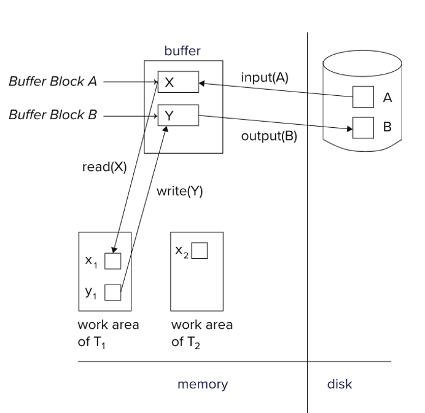{width = 50%}
</figure>

!!! EXAMPLE "Example of Fund Transfer"

    <figure markdown="span">
    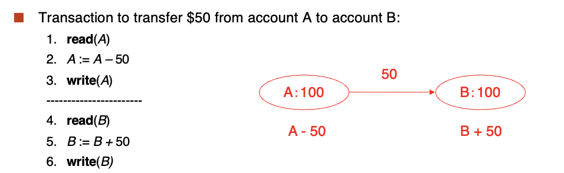{width = 50%}
    </figure>

    - Atomicity requirement
        - If the transaction fails after step 3 and before step 6, money will be "lost" leading to an inconsistent database state.
            - Failure could be due to software or hardware
        - The system should ensure that updates of a partially executed transaction are not reflected in the database.
        - 如果在第3步和第6步之间发生故障，系统应该确保部分执行的事务的更新不会反映在数据库中。即如果执行出了问题，数据库要撤销之前的操作。
    - Durability requirement
        - 如果事务结束了，系统应该确保即使在系统崩溃的情况下，事务的更新也会被保留。
    - Consistency requirement in above example:
        - the sum of A and B is unchanged by the execution of the transaction.
        - Explicitly(显式) specified integrity constraints, e.g. primary keys, foreign keys. 数据库把定义放在内部，自己维护。
        - Implicit(隐式) integrity constraints, e.g. balance >= 0. 数据库不维护，用户自己维护。
    - Isolation requirement. 如果在第3步和第6步之间，另一个事务访问了这个数据库，那么它会看到 $A + B$ 小于正确答案，这是因为没有保证隔离性。

### **Transaction State**

- Active - the initial state; the transaction stays in this state while it is executing.
- Partially committed - after the final statement has been executed.
- Failed - after the discovery that normal execution can no longer proceed.
- Aborted - after the transaction has been rolled back and the database restored to its state prior to the start of the transaction. Two options after it has been aborted:
    - Restart the transaction, which will be rolled back and restarted.
    - Kill the transaction, which will not be restarted.
- Committed - after successful completion.

<figure markdown="span">
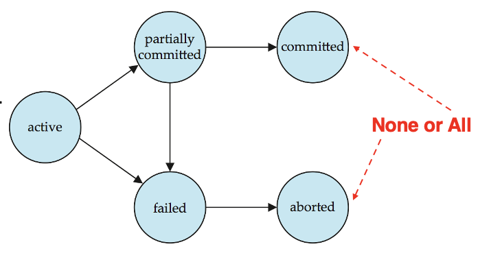{width = 50%}
</figure>

## **Concurrent Executions**

- Multiple transactions are executed at the same time. Advantages:
    - Increased processor and disk utilization, leading to better transaction throughput.
        - E.g. one transaction can be using the CPU while another is reading from or writing to the disk.
    - Reduced average response time for transactions: short transactions need not wait behind long ones.

Anomalies in concurrent execution:

: - Lost Update(丢失修改)

!!! NOTE "Lost Update"

    <figure markdown="span">
    {width = 50%}
    </figure>

    如图所示，T1和T2都读取了A的值，然后分别对其进行了修改。由于T1在T2之前提交，因此T1的更新被丢失了。

: - Dirty Read(读脏数据)

!!! NOTE "Dirty Read"

    <figure markdown="span">
    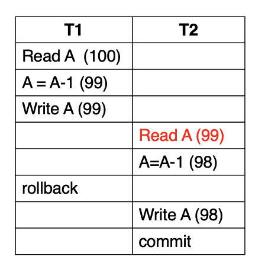{width = 50%}
    </figure>

    如图所示，T1 读取了 A 的值，然后对其进行了修改。由于 T2 读取 A 的值之后，T1 又执行了 ```rollback``` 操作，因此 T2 读取的 A 的值是脏数据。

: - Unrepeatable Read(不可重复读)

!!! NOTE "Unrepeatable Read"

    <figure markdown="span">
    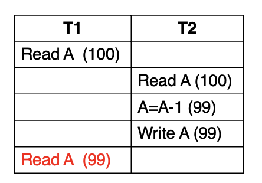{width = 50%}
    </figure>

    由于 ```Isolation```, 我们要求 T1 前后读取的 A 的值是一样的。上图中，T1 在读取 A 的值后，T2 修改了 A 的值并提交了，因此 T1 读取的 A 的值不一致。

: - Phantom Problem(幽灵问题)

!!! NOTE "Phantom Problem"

    <figure markdown="span">
    {width = 50%}
    </figure>

    如图所示，T1 在读取之后， T2 插入了一条新的记录。由于 T1 读取的范围是 ```age = 18```，因此 T1 读取的结果不一致。

### **Schedules**

Schedule - a sequencess of instructions that specify the chronological order in which instructions of concurrent transactions are executed. 事务的执行顺序。

!!! EXAMPLE "Example of Schedule"

    === "Schedule 1"

        <figure markdown="span">
        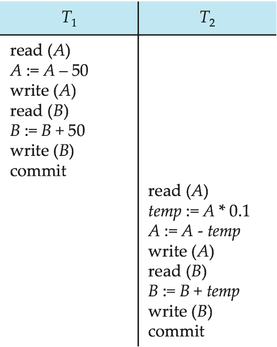{width = 50%}
        </figure>

        串行调度。 T1 transfer $50 from A to B, and T2 transfer 10% of the balance from A to B.

    === "Schedule 2"

        <figure markdown="span">
        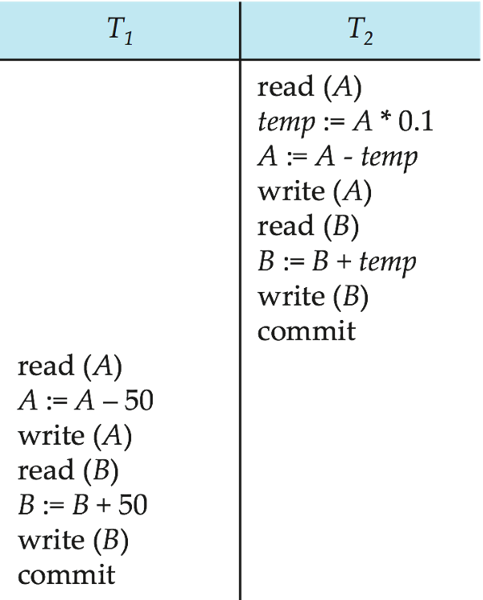{width = 50%}
        </figure>

        串行调度。 这次是 T2 先执行，然后是 T1。

    === "Schedule 3"

        <figure markdown="span">
        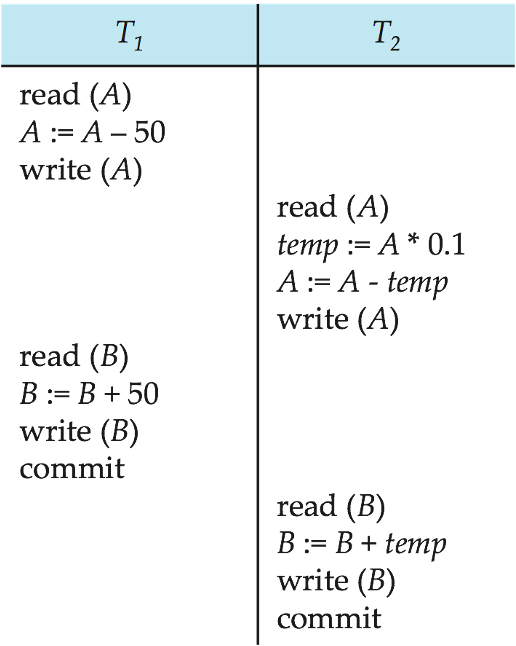{width = 50%}
        </figure>

        交错执行，但是等价于 ```Schedule 1```。 这两个调度的结果是一样的。

    === "Schedule 4"

        <figure markdown="span">
        {width = 50%}
        </figure>

        交错执行，但是不等价于 ```Schedule 1```。 这两个调度的结果是不一样的。破坏了隔离性。

## **Serializability(可串行化)**

- A (possibly concurrent) schedule is serializable if it is equivalent to a serial schedule.
- Different forms of schedule equivalence give rise to the notions of:
    - conflict serializability(冲突可串行化)
    - view serializability(视图可串行化)

### **Conflicting Instructions**

<figure markdown="span">
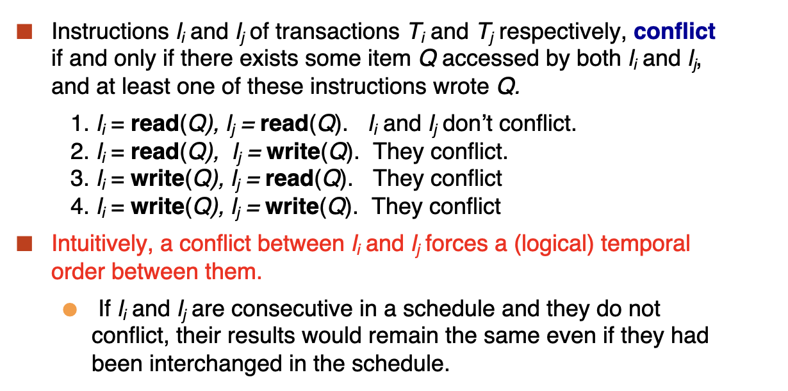{width = 50%}
</figure>

先读后写，先写后读，先写后写都会导致冲突，可以类比 CPU 中的 ```read-after-write```, ```write-after-read```, ```write-after-write```。 但是读和读之间没有冲突。

- If a schedule $S$ can be transformed into a schedule $S'$ by a series of swaps of non-conflicting instructions, we say that $S$ and $S'$ are conflict equivalent.
    - 如果一个调度 $S$ 可以通过一系列非冲突指令的交换转换为调度 $S'$，我们说 $S$ 和 $S'$ 是冲突等价的。
- We say that a schedule $S$ is conflict serializable if it is conflict equivalent to a serial schedule.
    - 我们说一个调度 $S$ 是冲突可串行化的，如果它与一个串行调度冲突等价。

### **Testing for Serializability**

- Consider some schedule of a set schedule of a set of transactions $T_1, T_2, \ldots, T_n$.
- Precedence graph(前驱图) - a directed graph where the vartices are the transactions (names).

如果 T1 和 T2 之间有冲突，那么它们之间有一条边。比如，如果 T1 先执行，它和 T2 有冲突，就有一条边从 T1 指向 T2。如果最终的图是无环的，那么这个调度是可串行化的。否则就是不可串行化的。

如果可串行化，我们就需要用拓扑排序来找出一个可串行化的调度。

<figure markdown="span">
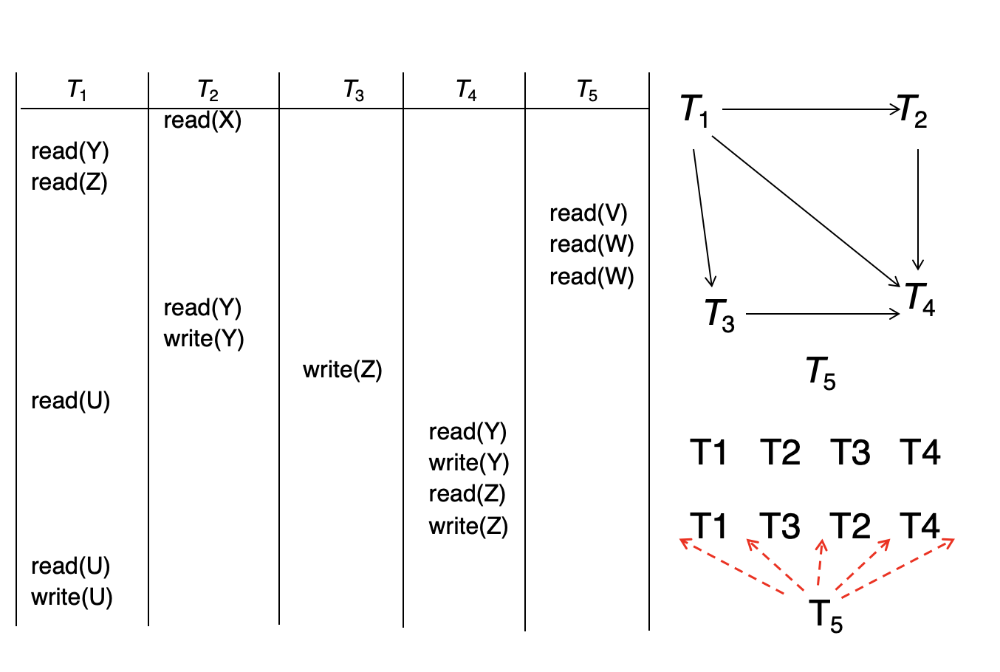{width = 50%}
</figure>

我们最终得到右上方的前驱图，根据拓扑排序得到一共 $2 * 5 = 10$ 种可串行化的调度。

### **Different forms of Serializability**

- Conflict serializability(冲突可串行化): same order of the conflict operation pairs.
- View serializability(视图可串行化): 
    - Same data content of the corresponding read ($Q$) operations.
    - Same data content ($Q$) of the final write ($Q$) operations.

<figure markdown="span">
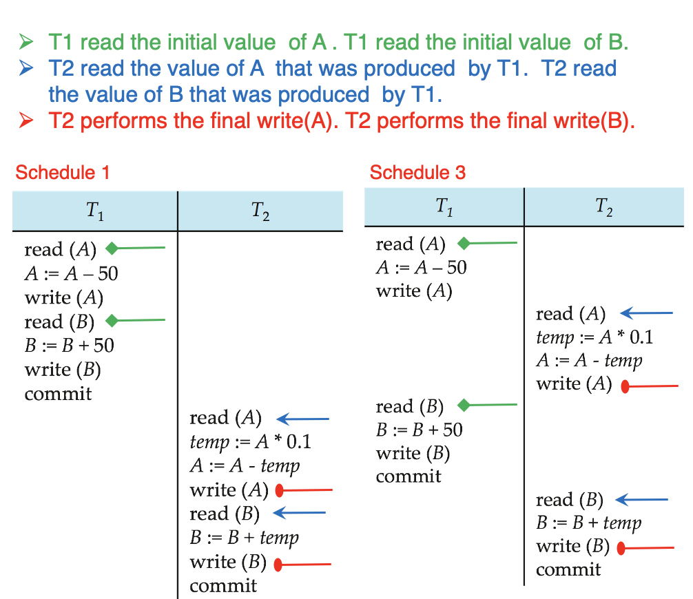{width = 50%}
</figure>

#### **View Serializability**

<figure markdown="span">
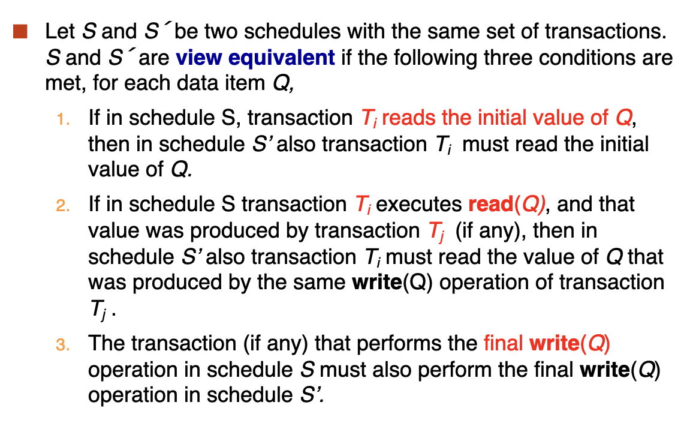{width = 50%}
</figure>

初始值由同一个事务读取，最终写会的结果由同一个事务写入。

冲突可串行化都是视图可串行化，但是视图可串行化不一定是冲突可串行化的。

!!! EXAMPLE

    <figure markdown="span">
    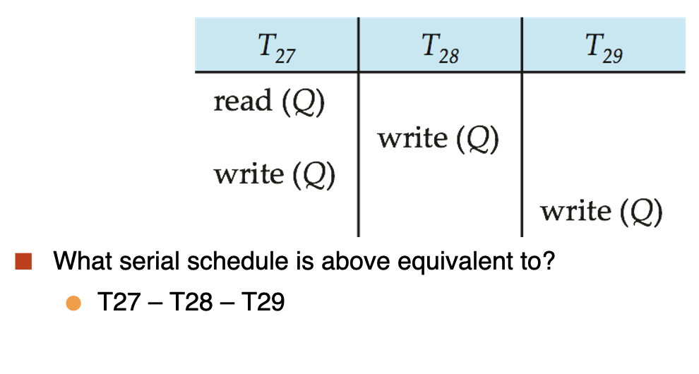{width = 50%}
    </figure>

    如图所示，上图等价于 $T27-T28-T29$，但是它不是冲突可串行化的。因为 $T27$ 和 $T28$ 之间有冲突。

#### **Other Notions of Serializability**

有些调度既不是冲突可串行化的，也不是视图可串行化的，但是它是可串行化的：

<figure markdown="span">
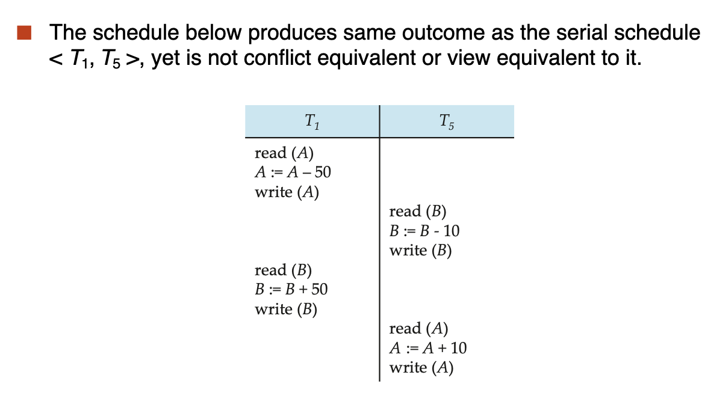{width = 50%}
</figure>

如图，这个调度不满足冲突可串行化和视图可串行化，但是它是可串行化的，因为由数学定理 $(B-10)+50 = (B+50)-10$，所以我们可以更换顺序。

## **Recoverable Schedules**

Recoverable schedule(可恢复调度) - if a transaction $T_j$ reads a data item previously written by a transaction $T_i$, then the commit operation of $T_i$ appears before the commit operation of $T_j$. 如果事务 $T_j$ 读取了一个数据项，而这个数据项是事务 $T_i$ 写的，那么 $T_i$ 的提交操作必须在 $T_j$ 的提交操作之前。

!!! EXAMPLE

    The following schedule is not recoverable if $T_9$ commits immeiately after the read.

    <figure markdown="span">
    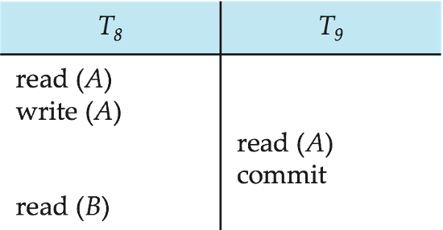{width = 50%}
    </figure>

    如果 $T_8$ 回滚，但是 $T_9$ 提交了，那么 $T_9$ 读取的值是脏数据，这个调度是不可以恢复的。

### **Cascading Rollbacks**

级联回滚 - a single transaction leads to a series of rollbacks.

<figure markdown="span">
{width = 50%}
</figure>

If $T_10$ falls, $T_11$ and $T_12$ must also be rolled back.

## **Transaction Isolation Level**

- Serializable - default。 避免上述提到的四种问题，开销大。
- Repeatable read - only committed records to be read, repeated reads of same record must return same value. However, a transaction may not be serializable - it may find some records inserted by a transaction but not find others. 不管幽灵问题。
- Read committed - only committed records can be read, but successive reads of record may return different(but committed) values. 保证不读脏数据。
- Read uncommitted - even uncommitted records can be read. 最宽松的隔离级别，通常在做统计的时候用。

在数据库中，我们可以自己设定隔离等级。

```SQL
In SQL: set transaction isolation level <serializable>;
In JDBC: connection.setTransactionIsolation(Connection.TRANSACTION_SERIALIZABLE);
```