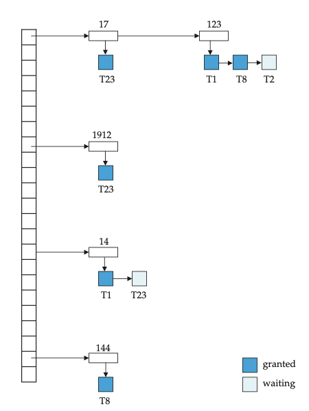
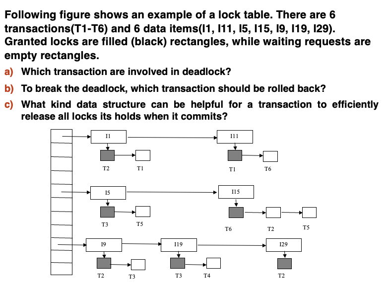

# **Concurrency Control**

Outline:

- Lock-Based Protocols
- Deadlock Handling
- Multiple Granularity
- Insert and Delete Operations
- Multiversion Schemes

## **Lock-Based Protocols**

A lock is a mechanism to control concurrent access to a data item.

Data items can be locked in two modes:

1. exclusive(X) mode. Data item can be both read as well as written. X-lock is requested using lock-X instruction. 既可以读也可以写
2. shared(S) mode. Data item can only be read. S-lock is requested using lock-S instruction. 只能读不能写

- Lock-compatibility matrix

<figure markdown="span">
{ width=400 }
</figure>

### **The Two-Phase Locking Protocol**

- This is a protocol which ensures conflict-serializable schedules.
- 拥有两个阶段
    - 第一个阶段叫做 "Growing Phase"，在这个阶段，事务可以申请锁，但不能释放锁，一直到它获得了所有需要的锁，此时锁的数量达到最高。我们把锁的数量达到最高的时间点叫做 "Lock Point"。
    - 第二个阶段叫做 "Shrinking Phase"，在这个阶段，事务可以释放锁，但不能申请锁。也就是说，在这个阶段，锁的数量只能减少，不能增加。

<figure markdown="span">
{ width=400 }
</figure>

- 该协议保证了冲突可串行化的调度。

!!! NOTE "Proof"

    我们需要证明: In the precedence graph corresponding to a schedule of a set of transactions $T_1, T_2, ..., T_n$, if there is an arc from $T_i$ to $T_j$ , then LP($T_i$)< LP($T_j$)

    假设 $T_i$ 时刻是 "Lock point", 那么此时 $T_i$ 所对应的数据已经被锁住了，但是 $T_j$ 此时也要对 $T_i$ 锁住的数据进行操作，那么 $T_j$ 也必须对该数据加锁，然而 $T_i$ 已经是 "Lock point" 了，所以这是不可能的，由此我们就证明了。

2PL 协议虽然保证了冲突可串行化，但是它并不能解决所有的并发问题:

- 死锁问题：
    - 由于两个或多个事务互相等待对方释放锁而导致的死锁现象。
    - 解决方法：使用死锁检测算法，或者使用超时机制。
- 级联回滚问题：
    - 由于一个事务的回滚导致其他事务也需要回滚的现象。

所以在 2PL 协议的基础上加以改进，得到了两种协议

#### **Strict Two-Phase Locking Protocol (严格两阶段封锁)**

X 锁必须等到提交的时候再释放，S 锁可以用完就释放。

可以确保可恢复性和避免级联回滚。

#### **Rigorous Two-Phase Locking Protocol (强两阶段封锁)**

X 锁和 S 锁都必须等到提交的时候释放。

大多数数据库实现的是强两阶段封锁，但是把这个协议称作 2PL.

!!! NOTE

    - Two-phase locking is not a necessary condition for serializability.
    - There can be conflict serializable schedules that cannot be obtained if two-phase locking is used.
    - However, in the absence of extra information(e.g., ordering of access to data), two-phase locking is needed for conflict serializability.

### **Lock Conversions**

- Two-phase locking with lock conversions:
    - First Phase:
        - Can acquire a lock-S or lock-X on a data item
        - Can convert a lock-S to a lock-X(lock-upgrade)
    - Second Phase:
        - Can release a lock-S or lock-X
        - Can convert a lock-X to a lock-S(lock-downgrade)

### **Implementation of Locking**

- A lock manager can be implemented as a separate process to which transactions send lock and unlock requests.
- The lock manager maintains a data-structure called a lock table to record granted locks and pending requests.
    - The lock table is usually implemented as an in-memory hash table indexed on the name of the data item being locked.

#### **Lock Table**

<figure markdown="span">
{ width=400 }
</figure>

如图所示是一个 lock-table，数字代表锁，数字的箭头指向锁的拥有者。比如 123 指向 T1, T8 和 T2，T1, T8 为深蓝色，代表已经获得了锁，而 T2 为浅蓝色，代表正在等待释放锁。

- 锁表记录了所有被授予的锁和在等待的锁，以及被授予或请求的锁的状态
- 新的请求放在队列的最末尾，只有当它与锁表中早期的锁相容时，才会被授予锁
- 锁一旦被释放，相应的请求就被从队列中删除。然后看后续的请求是否可以被授予锁
- 如果事务中止，所有在等待或者被授予锁的请求都会被删除

## **Deadlock Handling**

- System is deadlocked if there is a set of transactions such that every transaction in the set is waiting for another transaction in the set.
- 然而 2PL 协议并不能避免死锁的发生，所以我们需要一个死锁处理机制来解决这个问题。
- 考虑如下的两个事务:

<figure markdown="span">
{ width=400 }
</figure>

- 事务 T1 申请锁 X, T2 申请锁 Y, 然后 T1 申请锁 Y, T2 申请锁 X, 两个事务互相等待，就构成了死锁

Deadlock prevention protocols ensure that the system will never enter into a deadlock state. Some prevention strategies:

- Require that each transaction locks all its data items before it begins execution (predeclaration).
    - 执行前一次性获得所有锁
    - 这种方法会导致资源的浪费，因为有些锁可能永远不会被使用。
- Impose partial ordering of all data items and require that a transaction can lock data items only in the order specified by the partial order (graph-based protocol).
    - 对所有数据项进行部分排序，要求事务只能按照指定的顺序加锁

Timeout-Based Schemes:

- A transaction waits for a lock only for a specified amount of time. After that, the wait times out and the transaction is rolled back.
    - 一个事务只会等待锁一段时间，如果超时了，就会回滚
- Thus deadlocks are not possible
- Simple to implement; but starvation is possible. Also difficult to determine good value of the timeout interval.
    - 简单易实现，但是可能会导致“饥饿”现象，而且时长不好确定

!!! NOTE "Other Deadlock Pervection Strategies"

    <figure markdown="span">
    { width=400 }
    </figure>

    - Wait-die
        - 老事务可以等待新事务，新事务不能等待老事务
        - 一旦新事物等待老事务，就让新事物死掉
    - Wound-wait
        - 新事物可以等待老事务，老事务不能等待新事务
        - 一旦新事物等待老事务，就让老事务 "wound"(强制回滚)

### **Deadlock Detection**

类似于前边说的前驱图，如果一个事务在等待另一个事务的锁，那么就在图中加一条边，从等待的事务指向被等待的事务。

如果图中形成了环，就说明发生了死锁。

When deadlock is detected:

- Some transaction will have to be rolled back (made a victim) to break deadlock. Select that transaction as victim that will inncur minimum cost.
    - 选择代价最小的事务作为牺牲者
- Rollback: determine how far to roll back transaction
    - Total rollback: abort the transaction and then restart it.
    - More effective to roll back transaction only as far as necessary to break deadlock.
        - 只回滚到必要的地方
- 如果一直回滚同一个事务的话，会发生 "Starvation".所以要把事务被回滚的次数也纳入代价的计算中。

!!! EXERCISE

    <figure markdown="span">
    { width=400 }
    </figure>

    只要画出图就可以很容易地解决这个问题，这里不再展示。

### **Graph-Based Protocols**

如果我们知道数据之间存在某些偏序关系的话，可以有更高级的协议。

Impose a $\mathrm{partial ordering} \rightarrow$ on the set $D \ = \ \{d_1, d_2, \ldots, d_n\}$ of data items.

- If $d_i \rightarrow d_j$ then any transaction accessing both $d_i$ and $d_j$ must access $d_i$ before accessing $d_j$.
    - 如果 $d_i$ 先于 $d_j$，那么任何访问 $d_i$ 和 $d_j$ 的事务都必须先访问 $d_i$ 再访问 $d_j$
- Implies that the set $D$ may now be viewed as a directed acyclic graph (DAG).
    - 这意味着集合 $D$ 可以被视为一个有向无环图 (DAG)

<figure markdown="span">
{ width=400 }
</figure>

The tree-protocol is a simple kind of graph protocol.

1. Only exclusive locks are allowed. 只有独占锁
2. The first lock by $T_i$ may be on any data item. Subsequently, a data $Q$ can be locked by $T_i$ only if the parent of $Q$ is currently locked by $T_i$. 第一个锁可以放在任意位置，但是只有在父节点被上锁时，后续节点才能被上锁。
3. Data items may be unlocked at any time. 任何时间都可以释放锁。
4. A data item that has been locked and unlocked by $T_i$ cannot subsequently be relocked by $T_i$. 锁被释放之后就不能再加锁了。

The tree protocol ensures conflict serializability as well as freedom from deadlock.

Advantages:

- Unlocking may occur earlier in the tree-locking protocol than in the two-phase locking protocol.
    - Shorter waiting times, and increase in concurrency
- protocol is deadlock-free
    - no rollbacks are needed

Disadvantages:

- protocol does not guarantee recoverability or cascade freedom.
    - Need to introduce commit dependencies to ensure recoverability.
- Transactions may have to lock more data items than needed.
    - Increased locking overhead, and additional waiting time.
    - potential decrease in concurrency

## **Multiple Granularity(多粒度)**

加锁可以加在不同多粒度上，比如可以加在整个表上，也可以加在某一行上，或者某个属性上。

Granularity of locking (level in tree where locking is done):

- fine granularity(细粒度)(lower in tree): high concurrency, high locking overhead. 高并发，高开销
- Coarse granularity(粗粒度)(higher in tree): low concurrency, low locking overhead. 低并发，低开销

!!! Example
    
    <figure markdown="span">
    { width=400 }
    </figure>

### **Intention Lock Modes**

- 除了 S 锁和 X 锁之外，还有其他三种锁：
    - intention-shared(IS): indicates explict locking at a lower level of the tree but only with shared locks. 意向共享锁。如果事务要给记录加 S 锁，那么这个事务也要给表加上 IS 锁。
    - intention-exclusive(IX): indicates explicit locking at a lower level with exclusive or shared locks. 意向独占锁。如果事务要给记录加 X 锁，那么这个事务也要给表加上 IX 锁。
    - shared and intention-exclusive(SIX): the subtree rooted by that node is locked explicitly in shared mode and explicit locking is being done at a lower level with exclusive-mode locks. 是 S 锁和 IX 锁的结合，需要读整个表，同时可能对表中的某些记录进行修改。
- Intention locks allow a higher level node to be locked in S or X mode without having to check all descendent nodes. 意向锁允许在不检查所有子节点的情况下锁定更高层节点。

!!! NOTE "Compatibility Matrix"

    <figure markdown="span">
    { width=400 }
    </figure>

!!! Example

    <figure markdown="span">
    { width=400 }
    </figure>

    从上往下加锁，从下往上放锁。

## **Insert and Delete Operations**

If two-phase locking is used:

- A delete operation may be performed only if the transaction deleting the tuple has an exclusive lock on the tuple to be deleted. 只有当事务拥有独占锁时才能删除元组。
- A transaction that inserts a new tuple into the database is given an X-mode lock on the tuple. 插入之前没有这个数据，不能加锁。因此需要在插入之后立马加上 X 锁。

Insertions and deletions can lead to phantom phenomenon.

<figure markdown="span">
{ width=400 }
</figure>

### **Index Locking Protocol**

Index locking protocol:

- Every relation must have at least one index. 每个关系必须至少有一个索引。
- A transaction can access tuples only after finding them through one or more indices on the relation. 一个事务只能通过索引访问元组。
- A transaction $T_i$ that performs a lookup must lock all the index leaf nodes that it accesses, in S-mode. 事务 $T_i$ 在查找时必须锁定所有访问的索引叶节点。
- A transaction $T_i$ that inserts, updates or deletes a tuple $t_i$ in a relation $r$
    - Must update all indices to $r$. 事务在执行插入、更新或删除操作时，必须更新所有索引。
    - must obtain exclusive locks on all index leaf nodes affected by the operation. 必须在所有受影响的索引叶节点上获得独占锁。
- The rules of two-phase locking protocol must be followed. 必须遵守两阶段锁定协议的规则。
