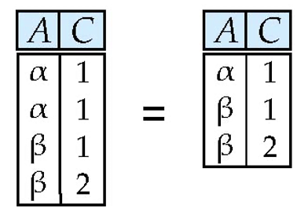
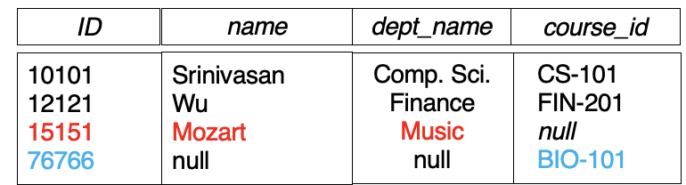

# **The Relational Model**

Outline:

- Structure of Relational Databases
- Database Schema
- Keys
- Schema Diagrams
- Relational Query Languages
- The Relational Algebra

## **Basic Structure**

Formally, given sets $D_1, D_2, \ldots, D_n$ a <font color= red>relation</font> $r$ is a subset of $D_1 \times D_2 \times \ldots \times D_n$. This, a relation is a set of n-tuples ($a_1, a_2, \ldots, a_n$) where rach $a_i \in D_i$.

!!! example

    - name = {Wu, Mozart, Gold, Singh, ...} // set of all instructor names
    - dept_name = {Music, Physics, Finance, ...} // set of all department names
    - salary = {40000, 80000, 87000, 90000, ...} // set of all salaries

    Then r = {
        (Wu, Music, 40000),
        (Mozart, Music, 80000),
        (Gold, Physics, 87000),
        (Singh, Finance, 90000) }
    is a relation over $name \times dept\_name \times salary$

## **Relation Schema and Instance**

- $A_1, A_2, \ldots, A_n$ are <font color = blue>attributes</font>
- $R = (A_1, A_2, \ldots, A_n)$ is a <font color = blue>relation schema</font>
    - Example: $instructor = (ID, name, dept_name, salary)$ 
- A <font color = blue>relation instance</font> $r$ defined over schema $R$ is denoted by $r(R)$
- The current values a relation are specified by a <font color = blue>table</font>
- An element $t$ of relation $r$ is called a <font color = blue>tuple</font> is represented ny a $row$ in a table.

### **Attributes**

- The set of allowed values for each <font color = blue>attribute</font> is called the <font color = red>domain(域)</font> of the attribute.
- Attribute values are (normally) required to be <font color = red>atomic</font> (indivisible)
- The special value <font color = red>NULL</font> is a member of every domain and represents an unknown or undefined value.
- The null value causes complications in the definition of operations.

??? note "Atomic"

    An attribute value is atomic means it cannot be divided into smaller components. For example, a name attribute must be of type string instead of a structure containing first name and last name.

??? note "NULL value"

    In C language, how do we define a NULL value? For ```int age```, we may say ```age = -1``` to represent a NULL value. For ```int temperature```, we may say ```temperature = -999``` to represent a NULL value. But we don't have a universal way to represent NULL value.

    So in SQL, we use the keyword ```NULL``` to represent a NULL value for any type of data.

### **Relations are Unordered**

Order of tuples is irrelebant (tuples may be stored in an arbitrary order)

## **Database Schema**

- <font color = blue>Database schema</font> is the logical structure of the database.
- <font color= blue>Database instance</font> is a snapshot of the data in the database at a given instant in time.

Example:

- Schema: $instructor(ID, name, dept_name, salary)$
- Instance:

<figure markdown="span">
{width = "400"}
<figcaption>Database Schema and Instance</figcaption>
</figure>

## **Keys**

<figure markdown="span">
{width = "400"}
<figcaption>University Schema</figcaption>
</figure>

- Let $K \in R$
- K is a <font color = red>superkey(超键)</font> of R if values for K are sufficient to identify a unique tuple of each possible relation $r(R)$.超键可以唯一确定一个元组。
    - Example: ${ID}$ and ${ID, name}$ are both superkeys of $instructor$
- Superkey K is a <font color = red>candidate key(候选键)</font> if K is minimal.
    - Example: ${ID}$ is a candidate key of $instructor$
- One of the candidate keys is selected to be the <font color= red>primary key(主键)</font>.
- <font color = red>Foreign key(外键)</font> constraint from attributes A of relation r1 to the priamry key B of relation r2 states that on any datebase instance, the value of A for each tuple in r1 must also be the value of B for some tuple in r2.
    - 在任何数据库实例中，r1 中每个元组对 A 的取值必须是 r2 中某个元组对 B 的取值。
    - 如上图大学数据库模式图中，$instructor$ 的 $dept\_name$ 是一个外键，它指向 $department$ 的 $dept\_name$。
    - Another example:
<figure markdown="span">
{width = "400"}
<figcaption>Foreign Key</figcaption>
</figure>

- <font color = red>Referential integrity(参照完整性)</font> constraint requires that values appearing in specified attribute(s) <font color = red>A</font> of any tuples in the referencing relation <font color =red>r1</font> also appear in specified attribute(s) <font color = red>B</font> of at least one tuple in the referenced relation <font color = red>r2</font>.
    - 引用关系的任意元组中的指定属性 A 的值也必须出现在被引用关系的至少一个元组的指定属性 B 中。
<figure markdown="span">
{width = "400"}
<figcaption>Referential Integrity</figcaption>
</figure>

## **Schema Diagrams**

We can draw a schema diagram to represent the schema of a database.

<figure markdown="span">
{width = "400"}
<figcaption>Schema Diagram</figcaption>
</figure>

## **Relational Query Languages**

- Procedural vs. non-procedural, or declarative
- "Pure" languages:
    - Relational algebra(<font color = red>关系代数</font>)
    - Tuple relational calculus(<font color = red>元组关系演算</font>)
    - Domain relational calculus(<font color = red>域关系演算</font>)
- The above 3 pure languages are equivalent in computing power.
- We will concentrate on relational algebra.
    - Not Turing-machine equivalent
    - Consist of <font color = blue>6 basic operations</font>

## **Relational Algebra**

Six basic operators:

- select: $\sigma$
- project: $\pi$
- union: $\cup$
- set difference: $-$
- Cartesian product(笛卡尔积): $\times$
- rename: $\rho$

### **Select Operation**

!!! example

    <font size = 5>relation r:</font>

    <figure markdown="span">
    {width = "400"}
    </figure>

    <font size = 5>$\sigma_{A = B \ \wedge \ D > 5}(r)$</font>

    <figure markdown="span">
    {width = "400"}
    </figure>

- Notation: $\sigma_p(r)$
- $p$ is called the <font color = red>selection predicate</font>
- Defined as: $\sigma_p(r) = \{t \in r \ and \ p(t)\}$
    - where $p$ is a formula in propositional calculus consisting of terms connected by: <font color = red>$\wedge$(and), $\vee$(or), $\neg$ (not)</font>
    - Each term is one of: <font color = red>=, $\neq$, $>$, $\geq$, $<$, $\leq$</font>
- Example of selection:
    - $\sigma_{dept\_name = Physics}(instructor)$
    - $\sigma_{salary > 80000}(instructor)$
    - $\sigma_{dept\_name = Physics \ \wedge \ salary > 80000}(instructor)$

### **Project Operation**

!!! example

    <font size = 5>relation r:</font>

    <figure markdown="span">
    {width = "400"}
    </figure>

    <font size =5>$\pi_{A, B}(r)$</font>

    <figure markdown="span">
    {width = "400"}
    </figure>

- Notation: $\pi_{A_1, A_2, \ldots, A_n}(r)$
    - $A_1, A_2, \ldots, A_n$ are attributes of $r$
- Note that the result of a projection is a set, so duplicate tuples are eliminated.
- Example of projection:
    - $\pi_{ID, name, salary}(instructor)$

### **Union Operation**

!!! example

    <font size =5>relation r, s:</font>
    <figure markdown="span">
    {width = "400"}
    </figure>

    <font size = 5>$r \cup s$</font>

    <figure markdown="span">
    {width = "400"}
    </figure>

- Notation: $r \cup s$
- Defined as:$r \cup s = \{t | t \in r \ or \ t \in s\}$
- For $r \cup s$ to be valid.
    1. $r, s$ must have the same <font color = red>arity</font>(元数)(same number of attributes)
    2. The attribute domains must be <font color = red>compatible</font>(兼容)(example: $2^{nd}$ column of $r$ deals with the same type of values as does the $2^{nd}$ column of $s$)
- Example: to find all courses taught in the Fall 2009 semester, or in the Spring 2019 semester, or in both
    - $\pi_{courst\_id}(\sigma_{semester = Fall \ \vee \ year = 2009}(section)) \cup \pi_{course\_id}(\sigma_{semester = Spring \ \vee \ year = 2019}(section))$

### **Set difference**

!!! example

    <font size = 5>relation r, s:</font>
    <figure markdown="span">
    {width = "400"}
    </figure>

    <font size = 5>$r - s$</font>

    <figure markdown="span">
    {width = "400"}
    </figure>

- Notation: $r \ - \ s$
- Defined as:$r \ - \ s = \{t \ \in \ r \ and \ t \notin \ s\}$
- Set difference must be taken between <font color = red>compatible</font> relations.
    - $r$ and $s$ must have the <font color = red>same</font> arity.
    - Attribute domains of $r$ and $s$ must be compatible.
- Example: to find all courses taught in the Fall 2009 semester, but not in the Spring 2019 semester
    - $\pi_{course\_id}(\sigma_{semester = Fall \ \wedge \ year = 2009}(section)) \ - \ \pi_{course\_id}(\sigma_{semester = Spring \ \wedge \ year = 2019}(section))$

### **Cartesian-Product**

!!! example

    <font size = 5>relation r, s:</font>
    <figure markdown="span">
    {width = "400"}
    </figure>

    <font size = 5>$r \times s$</font>

    <figure markdown="span">
    {width = "400"}
    </figure>

- The <font color = red>Cartesian-product operation</font>(denoted by $\times$) allows us to combine information from any two relations.
- Nitation: $r \times s$
- Defined as: $r \times s = \{t \ q \ | \ t \ \in \ r \ and \ q \ \in \ s\}$
- Assume that attributes of $r(R)$ and $s(S)$ are disjoint.(That is, $R \cap S = \emptyset$)
- If attributes of $r(R)$ and $s(S)$ are not disjoint, then renaming must be used.

### **Composition of Operations**

<font size = 5>$\sigma_{A \ = \ C}(r \ \times \ s)$</font>

- $r \ \times \ s$
<figure markdown = "span">
{width = "400"}
</figure>

- $\sigma_{A \ = \ C}(r \ \times \ s)$
<figure markdown = "span">
{width = "400"}
</figure>

### **Rename Operation**

- Allows us to name, and therefore to refer to, the results of relational-algebra expressions.
- Example: <font color = red>$\rho_{x}(E)$</font> renames the result of expression $E$ as $x$.
- If a relation-algebra expression $E$ has arity $n$, then

$$
\rho_{x(A_1, A_2, \ldots, A_n)}(E)
$$

returns the result of expression $E$ under the name $X$, and with the attributes renamed to $A_1, A_2, \ldots, A_n$.

### **Example Queries**

- Find the names of all instructors in the Physics department, along with the course_id of all courses they have taught
    - Query 1:$\pi_{instructor.name, course\_id}(\sigma_{dept\_name=Physics}(\sigma_{instructor.ID \ = \ section.ID}(instructor \times teaches)))$
    - Query 2:$\pi_{instructor.name, course\_id}(\sigma_{instructor.ID \ = \ teaches.ID}(\sigma_{dept\_name \ = \ Physics}(instructor \times teaches)))$

- Find the names of all instructors in the Physics department, along with the course_id and title of all courses they have taught
    - Query: $\pi_{instructor.name, course.course_id. course.title}(\sigma_{dept\_name = Physics \wedge \ instructor.ID \ = \ teaches.ID \ \wedge \ teaches.course\_id \ = \ course.course\_id}(instructor \ \times \ teaches \ \times \ course))$


- Find the largest salary in the university
    - Step 1:find instructor salaries that are less than some other instructor salary(i.e. not maximum)
        - Using a copy of instructor under a new name d.
        - $\pi_{instructor.salary}(\sigma_{instructor.salary \ < \ d.salary}(instructor \times \rho_{d}(instructor)))$
    - Step 2:Find the largest salary
        - $\pi_{salary}(instructor) \ - \ \pi_{instructor.salary}(\sigma_{instructor.salary \ < \ d.salary}(instructor \times \rho_{d}(instructor)))$
    - 我们想比较薪水，就需要能够两两比较。则薪水相乘，然后选择小于的部分，再从原来的薪水中减去这部分，就得到最大的薪水。

## **Additional Operations**

- Set intersection: $r \cap s$
- Natural join:$r \Join s$
- Semijoin:$r \ltimes_{\theta} s$
- Assignment: $\leftarrow$
- Outer join:$r$ &#10197 $s$, $r$ &#10198 $s$, $r$ &#10199 $s$
- Division Operator: $r \div s$

### **Set-Intersection Operation**

!!! example

    <font size = 5>relation r, s:</font>
    <figure markdown="span">
    {width = "400"}
    </figure>

    <font size =5>$r \cap s$</font>
    <figure markdown="span">
    {width = "400"}
    </figure>

- Notation:$r \cap s$
- Defined as: $r \cap s \ = \ \{t \ | \ t \in r \ and \ t \in s \}$
- Assume:
    - $r, s$ have the same arity
    - Attribute domains are compatible
- <font color = red>Note:$r \cap s \ = \ r \ - \ (r \ - \ s)$</font>
- 只是方便了我们表达，并不能增加数据库的查询能力

### **Natural Join Operation**

!!! example

    <font size = 5>relation r, s:</font>
    <figure markdown="span">
    {width = "400"}
    </figure>

    <font size = 5>$r \Join s$</font>
    <figure markdown="span">
    {width = "400"}
    </figure>

- Notation:$r \Join s$
- Let $r$ and $s$ be relations on schemas $R$ and $S$ respectively.Then,$r \Join s$ is a relation on schema $R \cup S$ obtained as follows:
    - Consider each pair of tuples $t_r$ from $r$ and $t_s$ from $s$
    - If $t_r$ and $t_s$ have the same value on each of the attributes in $R \cap S$, add a tuple $t$ to the result, where
        - $t$ has the same value as $t_r$ on attributes of $R$
        - $t$ has the same value as $t_s$ on attributes of $S$
- Example: 
    - $R = (A, B, C, D)$
    - $S = (B, D, E)$
    - Result schema = $(A, B, C, D, E)$
- $r \Join s = \pi_{r.A, r.B, r.C, r.D, s.E}(\sigma_{r.B = s.B \ \wedge \ r.D = s.D}(r \times s))$
- 实际上就是将两张表中自动匹配相等的字段，然后将这两张表合并成一张表
- 同样只能简化表达，不能增加查询能力

??? info "Natural Join and Theta Join"

    === "Natural Join"
        - Natural join is associative:$r \Join (s \Join t) = (r \Join s) \Join t$
        - Natural join is commutative:$r \Join s = s \Join r$

    === "Theta Join"
        - Theta join is a generalization of natural join
        - In theta join, we can specify any condition
        - $r \Join_{\theta} s = \sigma_{\theta}(r \times s)$
        - Example: $r \Join_{r.A = s.B} s$

### **Outer Join**

- An extension of the join operation that avoids loss of information.
- Computes the join and then adds tuples form one relation that does not match tuples in the other relation to the result of the join.
- Uses null values:
    - <font color = red>null signifies that the value is unknown or does not exist</font>
    - All comparisons involving null are(roughly speaking) **false** by definition.

!!! example

    <font size = 5>instructor</font>
    <figure markdown="span">
    {width = "400"}
    </figure>

    <font size = 5>teaches</font>
    <figure markdown="span">
    {width = "400"}
    </figure>

    <font size = 5>$instructor \Join teaches$</font>
    <figure markdown="span">
    {width = "400"}
    </figure>

    <font size = 5>$instructor$ &#10197 $teaches$</font>
    <figure markdown="span">
    {width = "400"}
    </figure>

    <font size = 5>$instructor$ &#10198 $teaches$</font>
    <figure markdown="span">
    {width = "400"}
    </figure>

    <font size = 5>$instructor$ &#10199 $teaches$</font>
    <figure markdown="span">
    {width = "400"}
    </figure>

- $r$ &#10197 $s$ = $r \Join s \cup (r - \pi_R(r \ \Join \ s) \ \times \ \{(null, \ldots, null\})$
- $r$ &#10198 $s$ = $r \Join s \cup \{(null, \ldots, null)\}\ \times \ (s \ - \ \pi_S(r \ \Join \ s))$
- $r$ &#10199 $s \ = \ r$ &#10197 $s \ \cup \ r$ &#10198 $s$
- 只是简化表达，不能增加查询能力

### **Semijoin Operation(半连接)**

- Notation:$r \ltimes_{\theta} s$
- Is a subset of <font color = red>$r$</font>, in which every tuple <font color = red>$r_i$</font> matches at least ont truple <font color = red>$s_i$</font> in <font color= red>$s$</font> under the condition <font color = red>$\theta$</font>
- Defined as: $r \ltimes_{\theta} s = \pi_r(r \Join_{\theta} s)$
- 计算两个关系 $R$ 和 $S$ 之间的连接，但他**只返回**满足连接条件的**左表($R$)**中的元组。

```SQL
select name
from instructor
where exists (  select *
                from teaches
                where teaches.ID = instructor.ID and teaches.year = 2022)
```

$$
\pi_{name}(instructor \ltimes_{instructor.ID = teaches.ID}(\sigma_{teaches.year=2022(teaches)}))
$$

```SQL
select name
from instructor
where ID in (select teaches.ID
            from teaches
            where teaches.year = 2022)
```

### **Assignment Operation**

- The Assignment operation($\leftarrow$) provides a convenient way to express complex queries.
    - Write query a a sequential program consisting of 
        - a series of assignments
        - followed by an expression whose value is displayed as a result of the query
    - Assignment must always be made to a temporary relation variable.

### **Division Operation**

!!! example

    <font size = 5>relation r, s:</font>
    <figure markdown="span">
    {width = "400"}
    </figure>

    <font size = 5>$r \div s$</font>
    <figure markdown="span">
    {width = "400"}
    </figure>

$s$ 中有1，2两个元组，我们到 $r$ 中查看 $B$ 列，找到包含 $s$ 中所有元组的 $A$ 值。然后返回 $A$ 值。

- We can write $r \div s$ as:

$$
temp1 \leftarrow \pi_{R-S}(r)
$$

$$
temp2 \leftarrow \pi_{R-S}((temp1 \times s) \ - \ \pi_{R-S,S}(r))
$$

$$
result \ = \ temp1 \ - \ temp2
$$

!!! example "Another Example"

    <font size = 5>relation r, s:</font>
    <figure markdown="span">
    {width = "400"}
    </figure>

    <font size = 5>$r \div s$</font>
    <figure markdown="span">
    {width = "400"}
    </figure>

## **Extened Relational-Algebra-Operations**

- Generalized Projecttion
- Aggregate Functions

### **Generalized Projection**

我们可以在投影操作中加入算数运算，如下：

$$
\pi_{F_1, F_2, \ldots, F_n}(E)
$$

Example: $\pi_{ID, name, salary/12}(instructor)$

### **Aggregate Functions and Operations**

- Aggregate functions are functions that take a collection of values as input and return a single value.
- Common aggregate functions:
    - COUNT
    - SUM
    - AVG
    - MIN
    - MAX
- Aggregate operation in relational algebra

$$
_{G_1, G_2, \ldots, G_n}\mathcal{G}_{F_1(A_1), F_2(A_2, \ldots, F_n(A_n))}(E)
$$

- $G_1, G_2, \ldots, G_n$ is a list of attributes on which to group (can be empty)
- Each $F_i$ is an aggregate function
- Each $A_i$ is an attribute name.

!!! example

    === "sum"

        <font size = 5>relation r:</font>
        <figure markdown="span">
        {width = "400"}
        </figure>

        <font size = 5>$\mathcal{G}_{sum(c)}(r)$</font>
        <figure markdown="span">
        {width = "400"}
        </figure>

    === "avg"

        <font size = 5>relation r:</font>
        <figure markdown="span">
        {width = "400"}
        </figure>

        <font size = 5>$\mathcal{G}_{avg(salary)}(instructor)$</font>
        <figure markdown="span">
        {width = "400"}  
        </figure>

- Result of aggregation does not have a name
    - Can use rename operation to give it a name
    - For convenience, we permit renaming as part of aggregate operation

$$
_{dept\_name}\mathcal{G}_{avg(salary) \ as \ avg\_salary}(instructor)
$$

## **Modification of the Database**

- Deletion
- Insertion
- Updating

### **Multiset Relational Algebra**

- Pure relational algebra removes all duplicates
- Multiset(<font color = red>多重集</font>) relational algebra retains duplicates, to match SQL semantics.
    - SQL duplicate retention was initially for efficiency, but is now a feature.
- Multiset relational algebra defined as follows
    - Selection: has as many duplicates of a tuple as in the input, if the tuple satisfies the selection.
    - projection: ont tuple per inpur tuple, even if it is a duplicate.
    - cross product:If there are $m$ copies of $t1$ in $r$, and $n$ copies of $t2$ in $s$, there are $m \times n$ copies of $(t1, t2)$ in $r \times s$.
    - Set operators:
        - Union: $m + n$ copies
        - Intersection:$min(m, n)$ copies
        - Difference:$max(m - n, 0)$ copies

### **SQL and Relational Algebra**

```SQL
select A1, A2, ..., An
from r1, r2, ..., rm
where P
```

is equivalent to

$$
\pi_{A_1, \ldots, A_n}(\sigma_P(r_1 \times r_2 \times \ldots \times r_m))
$$

```SQL
select A1, A2, sum(A3)
from r1, r2, ..., rm
where P
group by A1, A2
```

is equivalent to

$$
A1, A2, \mathcal{G}_{sum(A3)}(\sigma_P(r_1 \times r_2 \times \ldots \times r_m))
$$

```SQL
select A1, sum(A3)
from r1, r2, ..., rm
where P
group by A1, A2
```

is equivalent to

$$
\pi_{A1, sumA3}(_{A1, A2}\mathcal{G}_{sum(A3) \ as \ sumA3}\sigma_P(r_1 \times r_2 \times \ldots \times r_m))
$$