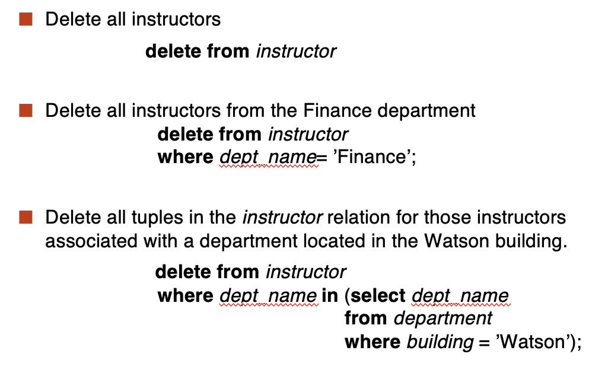

# **Introduction to SQL**

Outline:

- Overview of the SQL Query Language
- Date Definition
- Basic Query Structure
- Additional Basic Operations
- Set Operations
- Null Values
- Aggregate Functions
- Nested Subqueries
- Modification of the Database

## **Date Definition Language**

The SQL <font color = blue>data-definition language(DDL)</font> allows the specification of information about relations, including:

- The shcema for each relation.
- The domain of values associated with each attribute.
- Integrity constraints.
- And as we will see later, also other information such as
    - The set of indices to be maintained for each relations.
    - Security and authorization information for each relation.
    - The physical storage structure of each relation on disk.

### **Domain Types in SQL**

- <font color= blue>char(n).</font> Fixed length character string, with user-specified length n.
- <font color= blue>varchar(n).</font> Variable length character string, with user-specified maximum length n.
- <font color= blue>int.</font> Integer (typically 4 bytes).
- <font color= blue>smallint.</font> Small integer (typically 2 bytes).
- <font color =blue>tinyint</font>: A very small integer (typically 0-255).
- <font color= blue>numeric(p,d).</font> Fixed point number, with user-specified precision of $p$ digits, with $d$ digits to the right of decimal point.
    - 最多有$p$位数字，其中$d$位在小数点右边。
- <font color= blue>real, double precision.</font> Floating point number and double-precision floating point numbers, with machine-dependent precision.
- <font color= blue>float(n).</font> Floating point number with user-specified precision of at least $n$ digits.

### **Built-in Data Types in SQL**

- <font color= blue>date.</font> Dates, containing a (4 digit) year, month and date.
    - Example: **date** '2005-7-27'.
- <font color= blue>time.</font> Time of day, in hours, minutes and seconds.
    - Example: **time** '14:30:00' or **time** '14:30:00.45'.
- <font color= blue>timestamp.</font> Date plus time of day.
    - Example: **timestamp** '2005-7-27 14:30:00.45'.
- interval: period of time
    - Example: interval '1' day
    - Subtracting a date/time/timestamp value from another gives an interval value.
    - Interval values can be added to date/time/timestamp values.
- <font color = blue>date, time functions:</font>
    - current_date(), current_time()
    - year(x), month(x), day(x), hour(x), minute(x), second(x)

### **Creat Table Construct**

- An SQL relation is defined using the <font color= blue>create table</font> command.

```SQL
create teble r(A1 D1, A2 D2, ..., An Dn, 
            (integrity-constraint1),
            (integrity-constraint2),
            ...,
            (integrity-constraintk));
);
```

- $r$ is the name of relation
- each $A_i$ is an attribute name in the schema of relation $r$
- $D_i$ is the data type of values in the domain of attribute $A_i$

!!! Example

    ```SQL
    create table instructor(
        ID        char(5),
        name      varchar(20) not null,
        dept_name varchar(20),
        salary    numeric(8,2)
    );
    ```
    
    - We can do ```insert into instructor values('10101', 'Srinivasan', 'Comp. Sci.', 65000);```
    - But we can't do ```insert into instructor values('10101', null, 'Comp. Sci.', 65000);``` because of the **not null** constraint.

#### **Integrity Constraints in Create Table**

- not null
- primary key($A_1, A_2, ..., A_n$)
- foreign key($A_m, \dots, A_n$) references $r$

!!! Example "Declare *ID* as the primary key for *instructor*"

    ```SQL
    create table instructor(
        ID        char(5),
        name      varchar(20) not null,
        dept_name varchar(20),
        salary    numeric(8,2),
        primary key(ID)
        foreign key(dept_name) references department
    );
    ```
    
    <font color = red>primary key</font> declaration on an attribute automatically ensures </font color = red>not null</font>

And a few more relation definitions:

```SQL
create table student(
    ID        char(5),
    name      varchar(20) not null,
    dept_name varchar(20),
    tot_cred  numeric(3,0) default 0,
    primary key(ID)
    foreign key(dept_name) references department
);
```

Here ```default 0``` means that if no value is specified for the ```tot_cred``` attribute, it is assumed to be 0.

```SQL
create table takes(
    ID        varchar(5),
    course_id varchar(8),
    sec_id    varchar(8),
    semester  varchar(6),
    year      numeric(4,0),
    grade     char(2),
    primary key(ID, course_id, sec_id, semester, year),
    foreign key(ID) references student
    foreign key(course_id, sec_id, semester, year) references section
);
```

Note: <font color = red>sec_id</font> can be dropped from primary key above, to ensure a student cannot be registered for two sections of the same course in the same semester.

And more still

```SQL
create table course(
    course_id   varchar(8) primary key,
    title       varchar(50),
    dept_name   varchar(20),
    credits     numeric(2,0),
    foreign key(dept_name) references department(dept_name)
);
```

!!! note "Foreign key"

    ```foreign key(dept_name) references department```
    
    on delete cascade | set null | restrict | set default
    on update cascade | set null | restrict | set default
    
    - 如果被引用的元组该属性被删除，那么引用该属性的元组可以有相应变换规则
    - ```update``` 是指当被引用的属性被更新时，引用该属性的元组可以有相应变换规则，而```delete``` 就是删除。
    - ```on update / delete``` 后边可以跟四个词语：
        - ```cascade```：删除或更新被引用的属性后，引用该属性的元组也被删除或更新。
        - ```set null```：删除或更新被引用的属性后，引用该属性的元组的该属性被设置为null。
        - ```restrict```：如果有元组引用被引用的属性，那么被引用的属性不能被删除或更新。
        - ```set default```：删除或更新被引用的属性后，引用该属性的元组的该属性被设置为默认值。
    
    <figure markdown="span">
    {width="400"}
    <figcaption>Foreign key</figcaption>
    </figure>

### **Drop and Alter Table Constructs**

- <font color = blue>drop table</font> $r$; 删除表$r$
- <font color = blue>delete from</font> $r$; 删除表$r$中的所有元组
- <font color = blue>alter table</font>:
    - alter table $r$ add $A \ D$; 添加属性$A$到表$r$中，其中$D$是$A$的值域
    - Example: ```alter table student add resume varchar(256);```
    - alter table $r$ drop $A$; 从表$r$中删除属性$A$，但是许多数据库并不支持这个操作。

### **SQL and Relational Algebra**

```SQL
select A1, A2, ..., An
from r1, r2, ..., rm
where P;
```

is equivalent to the following expression in multiset relational algebra:

$$
\pi_{A_1, \ldots, A_n}(\sigma_{P}(r_1 \times r_2 \times \ldots \times r_m))
$$

---

```SQL
select A1, A2, sum(A3)
from r1, r2
where P
group by A1, A2;
```

is equivalent to the following expression in multiset relational algebra:

$$
A_1, A_2 \mathcal{G}_{sum(A_3)}(\sigma_P(r_1 \times r_2 \times \ldots \times r_m))
$$

---

```SQL
select A1, sum(A3)
from r1, r2, ..., rm
where P
group by A1, A2;
```

is equivalent to the following expression in multiset relational algebra:

$$
\pi_{A_1, sumA3}(_{A_1, A_2}\mathcal{G}_{sum(A_3) \ as \ sumA3}(\sigma_P(r_1 \times r_2 \times \ldots \times r_m)))
$$

## **Basic Query Structure**

- The SQL <font color = blue>data-manipulation language(DML)</font> provides the ability to query information, and insert, delete and update tuples.
- A typical SQL query has the form:

```SQL
select A1, A2, ..., An
from r1, r2, ..., rm
where P;
```

- $A_i$ represents an attribute
- $r_i$ represents a relation
- $P$ is a predicate
- The result of an SQL query is a relation.

### **The select Clause**

- Corresponds to the <font color = blue>projection</font> operation in relational algebra.
- NOTE: <font color = red>SQL names are case insensitive</font>(i.e., you may use upper or lower case letters)
- E.g. $Name \equiv NAME \equiv name$

In our last course, we konw that the select clause allows duplicates by default. If we want to eliminate duplicates, we can use the <font color = blue>distinct</font> keyword.

!!! example 

    Find the names of all departments with instructor, and remove duplicates
    
    ```SQL
    select distinct dept_name
    from instructor
    ```
    
    And the keyword <font color = blue>all</font> can be used to include duplicates.
    
    ```SQL
    select all dept_name
    from instructor
    ```

### **The where Clause**

- The <font color = blue>where</font> clause specifies conditions that the result must satisfy.
- Corresponds to the <font color = blue>selection</font> operation in relational algebra.
- To find all instructors in the Comp. Sci. department with salary > 70000:

```SQL
select name
from instructor
where dept_name = 'Comp. Sci.' and salary > 70000;
```

- SQL includes a between comparison operator
- Example: Find the names of all instructors with salary between 90,000 and 100,000

```SQL
select name
from instructor
where salary between 90000 and 100000;
```

- Tuple comparison

```SQL
select name, course_id
from instructor, teaches
where (instructor.ID, dept_name) = (teaches.ID, 'Biology');
```

### **The from Clause**

- Corresponds to the <font color = blue>cartesian product</font> operation in relational algebra.
- Find the Cartesian product instructor X teaches.

```SQL
select *
from instructor, teaches
```

## **Additional Basic Operations**

### **Joins**

- For all instructors who have taught some course, find their names and the course ID of the course they taught.

```SQL
select name, course_id
from instructor, teaches
where instructor.ID = teaches.ID;
```

- Find the course ID, semester, year and title of each course offered by the Comp. Sci. department

```SQL
select course_id, semester, year, title
from section, course
where section.course_id = course.course_id and course.dept_name = 'Comp. Sci.';
```

### **Natural Join**

- List the names of instructors along with the course ID of the courses that they taught.

```SQL
select name, course_id
from instructor, teaches
where instructor.ID = teaches.ID;
```

or

```SQL
select name, course_id
from instructor natural join teaches;
```

!!! important

    Beware of unrelated attributes with same name which get equated incorrectly.
    
    - List the names of instructors along with the titles of courses that they teach.
        - ```course(course_id, title, dept_name, credits)```
        - ```teaches(ID, course_id, sec_id, semester, year)```
        - ```instructor(ID, name, dept_name, salary)```
    - Incorrect version(makes course.dept_name = instructor.dept_name)
    
    ```SQL
    select name, title
    from instructor natural join teaches natural join course;
    ```
    
    - Correct version
    
    ```SQL
    select name, title
    from instructor natural join teaches, course
    where teaches.course_id = course.course_id;
    ```
    
    or
    
    ```SQL
    select name, title
    from (instructor natural join teaches) join course using (course_id);
    ```
    
    or
    
    ```SQL
    select name, title
    from instructor, teaches, course
    where instructor.ID = teaches.ID and teaches.course_id = course.course_id;
    ```

Another example: find students who takes courses across his/her department

```SQL
select distinct student.id
from (student natural join takes) join course using (course_id)
where student.dept_name <> course.dept_name;
```

### **The Rename Operation**

- The SQL allows renaming relations and attributes using the **as** clause:

```SQL
old-name as new-name
```

E.g.

```SQL
select ID, name, salary/12 as monthly_salary
from instructor;
```

- Find the names of all instructors who have a higher salary than some instructor in 'Comp. Sci'.

```SQL
select distinct T.name
from instructor as T, instructor as S
where T.salary > S.salary and S.dept_name = 'Comp. Sci.';
```

- Keyword **as** is optional and may be omitted: $instructor as T \equiv instructor T$

### **String Operations**

- <font color = red>percent(%).</font> The % character matches any substring.
- <font color = red>underscore(_).</font> The _ character matches any character.

- Find the names of all instructors whose name includes the substring "dar".

```SQL
select name
from instructor
where name like '%dar%';
```

- Match the string "100%"

```SQL 
like '100\%' escape '\'
like '100\%'
like '100 #%' escape '#'
```

!!! note

    - '_ _ _' matches any 3-character string
    - '_ _ _ %' matches any string of at least 3 characters

### **Ordering the Display of Tuples**

- List in alphabetic order the names of all instructors

```SQL
select distinct name 
from instructor
order by dept_name, name desc
```

从上边的代码可以看到，我们可以同时对多个属性进行排序，并且可以指定升序或者降序。

### **The limit Clause**

- Limit clause takes one or two numeric arguments, which must both be nonnegative integer constants:

```SQL
limit offset, row_count
```

or

```SQL
limit row_count == limit 0, row_count
```

- List names of instructors whose salary is among top 3. 

```SQL
select name
from instructor
order by salary desc
limit 3;
```

## **Set Operations**

- Set operations <font color = blue>union, intersect, except</font> are supported in SQL.
    - Each of the above operations automatically eliminates duplicates
- To retain duplicates, use <font color = blue>union all, intersect all, except all</font>

## **Null Values**

- The result of any arithmetic operation with a null operand is null.
- Example: Find all instructors whose salary is null.

```SQL
select name
from instructor
where salary is null
```

!!! note

    - <font color = red>comparisons with null values return the special truth value:  unknown</font>
    - Three-valued logic using the truth value unknown:
    
    === "OR"
    
        - unknown or true = true
        - unknown or false = unknown
        - unknown or unknown = unknown
    
    === "AND"
    
        - true and unknown = unknown
        - false and unknown = false
        - unknown and unknown = unknown
    
    === "NOT"
    
        - not unknown = unknown

## **Aggregate Functions**

- These functions operate on the multiset of values of a column of a relation, and return a value
    - avg: average value
    - min: minimum value
    - max: maximum value
    - sum: sum of values
    - count: number of values

- Find the number of tuples in the course relation

```SQL
select count(*)
from course;
```

### **Having Clause**

- 对我们的聚合函数进行过滤
- 例：找到所有的部门，以及部门的平均工资大于 42000 的部门

```SQL
select dept_name, avg(salary)
from instructor
group by dept_name
having avg(salary) > 42000;
```

- All aggregate operations except **count(*)** ignore tuples with null values on the aggregated attributes
- If collection has only null values, then **count(*)** returns 0, while other aggregate functions return null.

## **Nested Subqueries**

- A subquery is a **select-from-where** expression that is nested within another query.
- A common use of subqueries is to perform tests for:
    - set membership
    - set comparison
    - set cardinality

### **Set Membership**

- Find courses offered in Fall 2009 and in Spring 2010

```SQL
select distinct course_id
from section
where semester = 'Fall' and year = 2009 and
    course_id in (select course_id
                  from section
                  where semester = 'Spring' and year = 2010);
```

- Find courses offered in Fall 2009 but not in Spring 2010

```SQL
select distinct course_id
from section
where semester = 'Fall' and year = 2009 and 
    course_id not in (select course_id
                      from section
                      where semester = 'Spring' and year = 2010);
```

- Find the total number of (distinct) students who have taken course sections taught by the instructor with ID 10101

```SQL
select count(distinct ID)
from takes
where (course_id, sec_id, semester, year) in 
    (select course_id, sec_id, semester, year
    from teaches
    where ID = '10101');
```

### **Set Comparison**

- Find names of instructors with salary greater than that of all instructors in the Biology department.

```SQL
select name
from instructor
where salary > all (select salary
                    from instructor
                    where dept_name = 'Biology');
```

### **Scalar Subquery**

**Scalar(标量) subquery** is one which is used where a single value is expected.

!!! example

    ```SQL
    select name
    from instructor
    where salary * 10 >
        (select budget from department
        where department.dept_name = instructor.dept_name);
    ```
    
    这里的```dept_name```是这个表的主键，只返回一个元组，所以我们不能用```some, all```这样的关键字。

Runtime error if subquery returns more than one result value.

### **Test for Empty Relations**

The exists construct returns the value true if the argument subquery is nonempty.

- $\mathrm{Exists} \ r \ \Leftrightarrow \ r \neq \emptyset$
- $\mathrm{Not \ exists} \ r \ \Leftrightarrow \ r = \emptyset$

!!! example

    找到所有在2009年秋学期和2010年春学期都有课的课程
    
    ```SQL
    select course_id
    from section as S
    where semester = 'Fall' and year = 2009 and
        exists(select *
               from section as T
               where semester = 'Spring' and year = 2010 and
                   S.course_id = T.course_id);
    ```

!!! example

    找到所有参加了生物系所有课程的学生
    
    ```SQL
    select distinct S.ID, S.name
    from student as S
    where not exists((select course_id
                      from course
                      where dept_name = 'Biology')
                      except
                      (select course_id
                      from takes as T
                      where S.ID = T.ID));
    ```
    
    逆向考虑，找到这样的学生，不存在他没选过的生物系的课。

### **Test for Absence of Duplicate Tuples**

The **unique** construct tests whether a subquery has any duplicate tuples in its result.

**Unique**关键字用于测试子查询的结果是否有重复的元组。

可以将其理解为最多一次。

!!! example

    Find all courses that were offered at most once in 2009.
    
    ```SQL
    select T.course_id
    from course as T
    where unique (select R.course_id
                  from section as R
                  where R.course_id = T.course_id and R.year = 2009);
    ```

!!! example "Another Example"

    Find all courses that were offered once in 2009
    
    ```SQL
    select T.course_id
    from course as T
    where unqiue (select R.course_id
                  from section as R
                  where R.course_id = T.course_id and R.year = 2009);
            and exists (select R.course_id
                        from section as R
                        where R.course_id = T.course_id and R.year = 2009);
    ```
    
    由于```unqiue```是找一次或两次，所以我们必须加上后边的```exists```来保证存在一次，否则有不开的课也会被算进去。

## **Modification of the Database**

### **Deletion**

<figure markdown="span">
{width="400"}
<figcaption>Deletion</figcaption>
</figure>

### **Insertion**

<figure markdown="span">
{width="400"}
<figcaption>Insertion</figcaption>
</figure>

```insert```后还可以接查询语句，用于插入特定的元组。

```SQL
insert into student
select ID, name, dept_name, 0
from instructor
```

### **Update**

<figure markdown="span">
{width="400"}
<figcaption>Update</figcaption>
</figure>

还可以与```case```配合使用。

```SQL
update instructor
set salary = case 
                when salary <= 100000 then salary * 1.1
                else salary * 1.05
            end;
```

