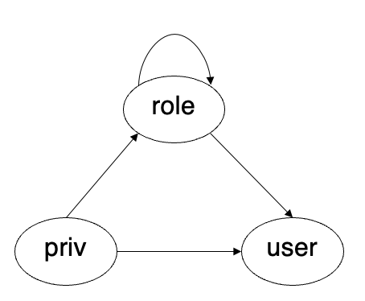
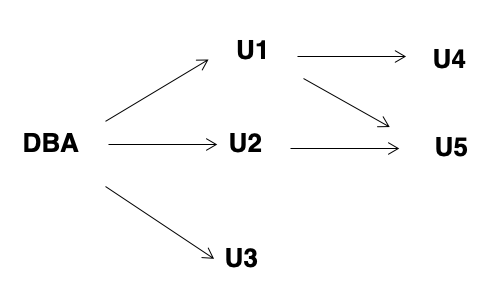

# **Intermediate SQL**

Outline:

- Joined Relation
- SQL Data Types and Schemas
- Integrity Constraints
- Views
- Indexes
- Transactions
- Authorization

## **Joined Relation**

Join types:

- inner join
- left outer join
- right outer join
- full outer join

## **SQL Data Types and Schemas**

### **User-Defined Types**

SQL 允许我们定义自己的数据类型，相当于 C 语言中的 `typedef`。

```sql
create type Dollars as numeric(12, 2) final;
```

这里我们就定义了自己的数据类型 `Dollars`，它是一个精度为 12 位，小数点后 2 位的数字。

最后的 ```final``` 与面向对象有关，表示这个类型不能被继承。

```sql
create table department
(dept_name varchar(20),
 building varchar(15),
 budget Dollars);
```

### **Domains**

```domain``` 与 ```type``` 类似，也是定义自己的数据类型，不同的是 ```domain``` 可以加限制条件。

```sql
create domain person_name char(20) not null;
```

如上我们定义了 ```person_name``` 这一数据类型，并且附带了 ```not null``` 这个限制条件。

```sql
create domain degree_level varchar(10)
constraint degree_level_test
check (value in ('Bachelors', 'Masters', 'Doctorate'));
```

我们定义了 ```degree_level``` 数据类型，并且加了限定条件，学位必须是三个 ```value``` 中的一个。

### **Large-Object Types**

在数据库中，有一些很大的数据（如图片，视频等），被存在 ```large object``` 中。

<font color = blue>blob</font>:binary large object -- object is a large collection of uninterpreted binary data(whoe interpretation is left to an application outside of the database system).

<font color = red>MySQL BLOB</font> datatypes:

- TinyBlob: 0 - 255 bytes
- Blob: 0 - 64K bytes
- MediumBlob: 0 - 16M bytes
- LargeBlob: 0 - 4G bytes

<font color = blue>clob</font>: character large object -- object is a large collection of character data.

## **Integrity Constraints**

我们前边已经了解过了 ```not null```, ```primary key``` 和 ```foreign key``` 这三种约束。

这里还要补充两种约束条件:

- ```unqiue```: 保证列中的值是唯一的。
- ```check(P), where P is a predicate```: 保证列中的值满足某种条件。

!!! example

    创建一个课程表，我们规定学期必须是“春夏秋冬”四个中的一个

    ```sql
    create table section(
        course_id varchar(8),
        sec_id varchar(8),
        semester varchar(6),
        year numeric(4,0),
        building varchar(15),
        room_number varchar(7),
        time_slot_id varchar(4),
        primary key(course_id, sec_id, semester, year),
        check (semester in ('Fall', 'Winter', 'Spring', 'Summer'))
    );
    ```

### **Integrity Constraints Villation During Transactions**

```sql
create table person(
    ID char(10),
    name char(40),
    mother char(10),
    father char(10),
    primary key (ID),
    foreign key (father) references person,
    foreign key (mother) references person
);
```

我们定义了一个全体人员的表，这个表有两个外键，分别指向父亲和母亲。

!!! Question

    如果我们想插入一个人，他的父母暂时不在这个表里，应该怎么做？

    - 方案一：先插入这个人的父母。
    - 方案二：先插入这个人，把他的父母都置为 ```null```, 然后在插入他的父母之后，再更新这个人的两个 ```foreign key```。
    - 方案三：我们并不是所有操作之后都要进行约束检查，因为这很耗费资源，我们可以在多个操作之后再进行检查，那么这时候插入一个人，他的父母不在表里，是可以的。

### **Assertion**

> 理想很丰满，现实很骨感。

我们可以通过 ```assertion``` 来定义一些约束条件，这些约束条件是在数据库的整个生命周期中都有效的。

如此一来我们就可以直接调用这个 ```assertion``` 来检查约束条件，而不是去写冗长的查询语句。

```sql
create assertion credits_earned_constraint check(
    not exists(
        select ID
        from student
        where tot_cred != (
            select sum(credits)
            from takes natural join course
            where student.ID = takes.ID
            and grade is not null
            and grade != 'F'
        )
    )
);
```

上边我们定义了一个 ```credits_earned_constraint```，这个约束条件是学生的总学分必需等于他所选课程的学分之和。

从上边的实例来看，似乎 ```assertion``` 是一个很好的工具，但是实际上，很多数据库系统并不支持 ```assertion```，因为它耗费了很多资源。

## **Views**

A view provides a mechanism to hide certain data from the view of certain users.

视图可以看作是一个虚拟的表，它并不存储数据，而是通过查询语句来生成数据。视图可以只选取特定的数据呈现出来。

### **View Definition**

```sql
create view v as <query expression>;
```

!!! Example

    建立一个视图，不包含教授的工资

    ```sql
    create view faculty as
    select ID, name, dept_name
    from instructor
    ```

    然后从视图中找到所有生物系老师的名字

    ```sql
    select name
    from faculty
    where dept_name = 'Biology'
    ```

    或者还可以建立每个系所有老师的工资总和

    ```sql
    create view departments_total_salary(depat_name, total_salary) as
    select dept_name, sum(salary)
    from instructor
    group by dept_name
    ```

视图和真正的表在使用上并没有多大差别，视图可以：

- 隐藏不必要的信息
- 方便查询以及对数据库操作
- 有利于权限控制（用户可以看到自己的工资，但看不到别人的工资）

!!! Example

    定义物理系2009年秋开设的课的视图

    ```sql
    create view physics_fall_2009 as
    select course.course_id, sec_id, building, room_number
    from course, section
    where course.course_id = section.course_id
            and course.dept_name = 'Physics'
            and course.semester = 'Fall'
            and section.year = '2009';
    ```

    在从这个视图中找在 ```Watson``` 上课的课程

    ```sql
    create physics_fall_2009_watson as
    select course_id, room_number
    from physics_fall_2009
    where building = 'Watson';
    ```

### **Update of a View** 

我们可以像正常的表一样对视图进行更新，同时最初的原表也会被修改。

以我们之前创建的 ```faculty``` 视图为例，向其中插入新的教师。

```sql
insert into faculty values ('30765', 'Green', 'Music');
```

我们插入了一条新的数据，并把 ```salary``` 设置为 ```null```，但是如果原表限制了 ```salary``` 不能是 ```null``` 的话，那我们这条数据就不能插进去了。

### **Materialized Views**

我们前边说的视图是虚拟的表，在数据库中并不实际存在这个表。

但是如果我们在创建视图的时候加上 ```materialized``` 这个限定条件，那么数据库就会为我们的视图创建一个临时的表，可以提高查询的效率。

但是如果数据发生变化了，那么视图对应的表就过时了，所以需要我们的手动维护。

If relations used in the query are updated, the Materialized view result becomes out of date.

Need to maintain the view, by updating the view whenever the underlying relations are updated.

### **View and Logical Data Independence**

如果我们有一个特别大的表，这显然是不好的，因为查询的效率会很低，并且维护起来也很麻烦。

那么我们的想法就是把大表拆成两个小的表。然而这样又会出问题，因为我们之前的所有查询语句都是基于原来的大表的，现在我们要把这些查询语句都改一遍，这显然是不现实的。

所以一个基本的思路就是把大表拆成小表，然后把两个小表通过视图合并成原来的大表。

- If relation ```S(a, b, c)``` is split into ```S1(a, b)``` and ```S2(a, c)```. How to realize the logical data independence?

1. ```create table S1(a, b);create table S2(a, c);```
2. ```insert into S1 select a, b from S;insert into S2 select a, c from S;```
3. ```drop table S;```
4. ```create view S(a, b, c) as select a, b, c from S1 natural join S2;```

## **Indexes**

Indices are data structures used to speed up access to records with specified values for index attributes

Index 相当于给表建立一个索引，这样我们在查询的时候就可以直接通过 B+树的索引来查找，而不是遍历整个表。

!!! Example

    ```sql
    create table student
    (
        ID varchar(5),
        name varchar(20) not null,
        dept_name varchar(20),
        tot_cred numeric(3, 0) default 0,
        primary key (ID)
    )
    create index studentID_index on student(ID);
    ```

    然后执行 ```select * from student where ID = '12345'```

    数据库就会自己选择合适的方法来查找，而不是顺序遍历。

## **Transactions**

- Unit of work(<font color = red>NONE or ALL</font>):要么不做，要么全部做。
- Atomic transaction:原子性，要么全部成功，要么全部失败。
- Transaction begin implicitly
    - Ended by ```commit work``` or ```rollback work```
- 在数据库中一般是自动提交的，但是我们也可以手动提交。
    - In MySQL: ```SET AUTOCOMMIT = 0;```

!!! Question

    关系person（id, gender, age） 有如下5个记录：
    
    p1 M 30

    p2 F 28
    
    p3 M 20
    
    p4 F 18
    
    p5 M 10

    对上述关系依次下列SQL 语句：
    
    ```sql
    set autocommit=0;

    update person set age=age+1 where id='p1';
    insert into person values ('p6', 'M', 25);
    rollback;

    delete from person where id= 'p2';
    commit;

    delete from person where age < 20；
    rollback;
    ```

    那么，第4步的语句执行之后，person表有<font color = red>5</font>个记录；

    第6步的语句执行之后，person表有<font color = red>4</font>个记录；

    第8步的语句执行之后，person表有<font color = red>4</font>个记录；

    **解析**：首先进行一个更新和一个插入，这时表里有6条记录，但是后边来了个```rollback```，那么前边的两条语句就都被撤销了，所以表里还是原来的5条记录。

    然后删除一条记录并```commit```，那么表里就剩下4条记录。

    最后再执行删除，但又被撤销了，所以最后还有4条记录。

## **ACID Properties**

A transaction is a unit of program execution that accesses and possibly updates various data items.To preserve the integrity of data the database system must ensure:（事务必须满足原子性，一致性，独立性，持续性）

- Atomicity: Either all operations of the transaction are properly reflected in the database or none are.
- Consistency: Execution of a transaction in isolation preserves the consistency of the database.

:   数据库执行事务前后都是一致的。

- Isolation: Although multiple transactions may execute concurrently, each transaction must be unaware of other concurrently executing transactions. Intermediate transaction results must be hidden from other concurrently executed transactions.  

:   尽管数据库可能同时执行很多操作，但是这些操作之间是独立的，互不干扰。

- Durability: After a transaction completes successfully, the changes it has made to the database persist, even if there are system failures.

:   数据库的事务一旦提交，这个修改就必须保存到数据库当中，不能丢失。换言之，数据库必须负责对事务进行备份。

## **Authorization**

Forms of authorization on parts of the database:

- Select - allows reading, but not modification of data.
- Insert - allows insertion of new data, but not modification of existing data.
- Update - allows modification, but not deletion of data.
- Delete - allows deletion of data.

Forms of authorization to modify the database schema

- Resources(MySQL:Create) - allows creation of new relations.
- Alteration - allows addition or deletion of attributes in a relation.
- Drop - allows deletion of relations.
- Index - allows creation and deletion of indices.
- Create view(MySQL) - allows creation of views.

### **Authorization Specification in SQL**

```grant <privilege list> on <relation name or view name> to <user list>```

把表或视图上的权限给用户。

```<user list>``` is:

- a user-id
- public, which allows all valid users the privilege granted
- A role

!!! Example

    ```sql
    grant select on instructor to U1, U2, U3;
    grant select on department to public;
    grant update (budget) on department to U1;
    grant all privileges on department to U1;
    ```

    第一条语句给用户 U1, U2, U3 读取 instructor 表的权限。

    第二条语句给所有人读取 department 表的权限。

    第三条语句给用户 U1 修改 department 表的 budget 的权限。

    第四条语句给用户 U1 所有权限。

### **Revoking Authorization in SQL**

用法与 ```grant``` 相同，用于收回权限。

```revoke <privilege list> on <relation name or view name> from <user list>```

### **Roles**

可以理解为一组权限的集合，比如学校的学生，教师等。我们可以把权限赋给角色，然后再把角色赋给用户。

```create role <role name>``` 创建一个角色，然后把权限赋予角色。

<figure markdown="span">

</figure>

上图表示了 ```privilege, user, role``` 之间的关系。

- ```privilege``` 可以给角色，也可以给用户。
- ```role``` 可以给用户，还可以给另外一个角色。

!!! Example

    ```sql
    create role instructor;                 // 创建一个角色
    grant select on takes to instructor;    // 给角色 instructor 读取 takes 表的权限
    grant instructor to Amit;               // 给用户 Amit 角色 instructor 的权限

    create role teaching_assistant;
    grant teaching_assistant to instructor; // 给角色 instructor 角色 teaching_assistant 的权限
    ```

### **Other Authorization Features**

- references privilege to create foreign key.

```sql
grant reference (dept_name) on department to Mariano;
```

如果没有这个权限的话，我们可以通过被引用者 ```on cascade``` 删除引用者。

- transfer of privileges

    - ```grant select on department to Amit with grant option;```.用户可以把获得的权限传递下去。

    - ```revoke select on department from Amit, Satoshi cascade;```.一旦权限被收回，那么所有用户都会失去权限。

    - ```revoke select on department from Amit, Satoshi restrict;```.一旦权限被收回，那么只有该用户会失去权限。

    - ```revoke grant option for select on department from Amit;```.收回用户的传递权限。

<figure markdown="span">

</figure>