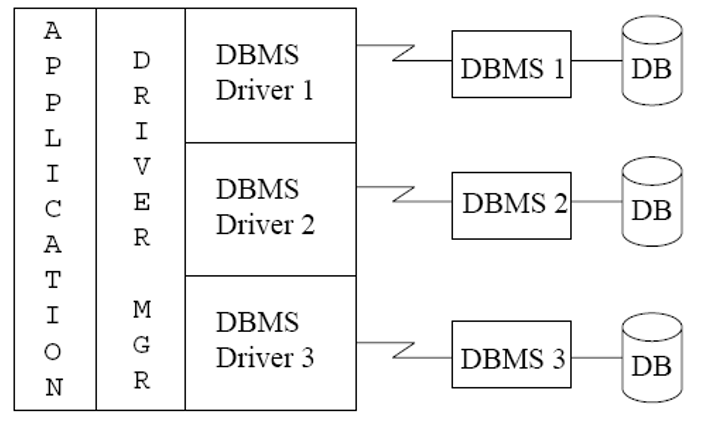
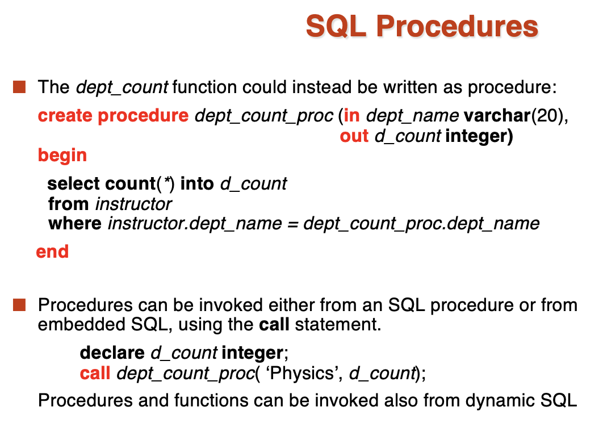
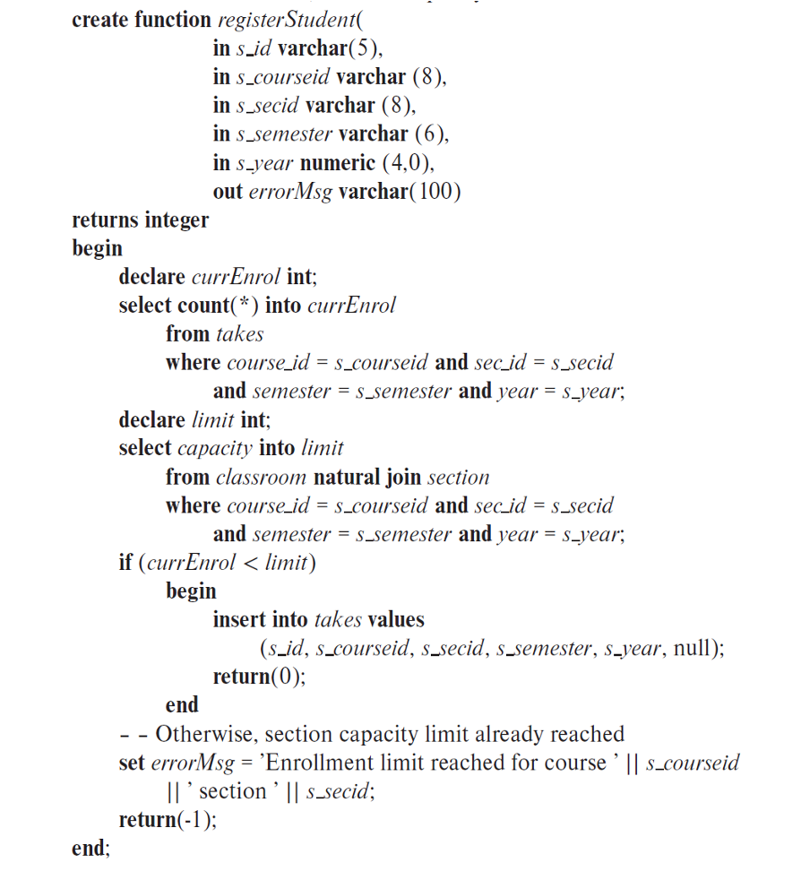
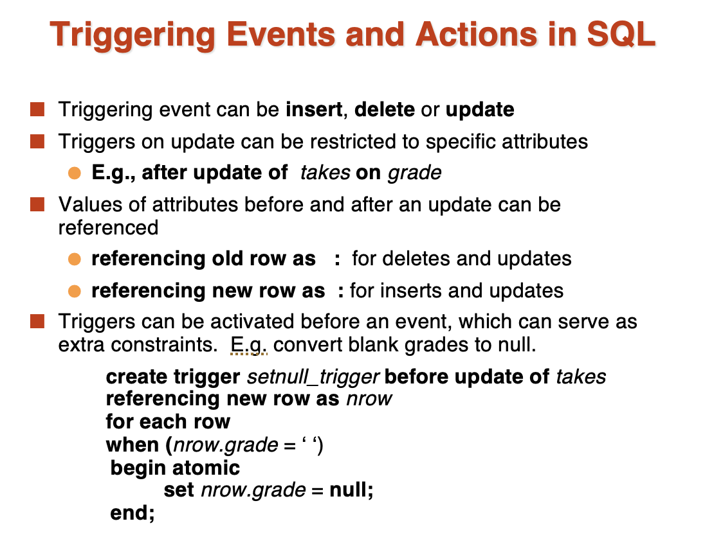

# **Advanced SQL**

Outline:

- Accessing SQL From a Programming Language
- Functions and Procedures
- Triggers
- Recursive Queries
- Advanced Aggregation Features

## **Accessing SQL From a Programming Language**

通常有两种方式来通过编程语言访问数据库：

- API(Application Programming Interface, 应用程序接口) -- 通过函数调用来访问数据库
- Embedded SQL -- 在编程语言中嵌入SQL语句
    - The SQL statements are translated at compile time into finction calls
    - At runtime, these function calls connect to the database using an API that provides dynamic SQL facilities
    - 在编译的时候，这些 SQL 语句会被预编译，然后在运行时，这些预编译的 SQL 语句会被转换成函数调用，然后通过 API 来连接数据库

!!! Note "**JDBC and ODBC**"

    - API for a program to interact with a database server
    - ODBC(Open Database Connectivity) works with C, C++, C#
    - JDBC(Java Database Connectivity) works with Java
    - Embedded SQL in C
    - SQLJ - embedded SQL in Java
    - JPA(Java Persistence API) - Java ORM(Object-Relational Mapping) API

### **JDBC**

JDBC supports a variety of features for qureying and updating data, and for retrieving query results.

JDBC also supports metadata retrieval, which allows a program to determine the structure of a database and the types of data stored in it.

Model for communication with the database:

- Open a connection
- Create a "statement" object
- Execute queries using the Statement object to send qureies and fetch results
- Exception mechanism to handle errors

```java
public static void JDBCexample(String dbid, String userid, String passwd) 
{ 
     try { 
        Connection conn = DriverManager.getConnection(
            "jdbc:oracle:thin:@db.yale.edu:2000:univdb", userid, passwd); 
        Statement stmt = conn.createStatement(); 
            … Do Actual Work ….
        stmt.close();	
        conn.close();	
     }		
     catch (SQLException sqle) { 		
        System.out.println("SQLException : " + sqle);		
     }		
}
```

!!! Info "Try - catch 语句"

    我们把可能会出现异常的代码放在 try 代码块中，如果出现异常了，就会跳到 catch 代码块中，然后执行 catch 代码块中的代码来处理异常。

<font size = 4, color = blue>Update to database:</font>

```java
try{
    stmt.executeUpdate("INSERT INTO Students VALUES (‘Joe’, 12345, ‘CS’)");
} catch(SQLExecution sqle){
    System.out.println("Could not insert tuple." + sqle);
}
```

<font size = 4, color = blue>Execute query and fetch and print results:</font>

```java
ResultSet rset = stmt.executeQuery(
    "SELECT dept_name, avg(salary) 
    FROM instructor
    GROUP BY dept_name");
while(rset.next()){
    System.out.println(rset.getString("dept_name") + " " + rset.getFloat(2));
}
```

我们看到，JDBC 中一个不方便的点在于，如果我们想获得每一列的数据，我们需要使用 ```rset.getString(dept_name)``` 或者 ```rset.getFloat(2)``` 这样的方式来获取数据，但是万一我们不知道这个数据的类型的话，就不能这么用了。

所以我们可以用 ```metadata``` 来获取数据的类型：

```java
ResultSetMetaData rsmd = rset.getMetaData();
for(int i = 1; i <= rsmd.getColumnCount(); i++){
    System.out.println(rsmd.getColumnName(i));
    System.out.println(rsmd.getColumnTypeName(i));
}
```

这段程序可以输出每一列的名字和类型。

#### **Prepared Statements**

我们可以用占位符来代替具体的值，然后在执行的时候再传入具体的值，可以视为将 SQL 语句模版化，还可以防止 SQL 注入攻击。

```java
PreparedStatement pStmt = conn.prepareStatement(
    "insert into instructor values(?,?,?,?)");
pStmt.setString(1, "88877");
pStmt.setString(2, "Perry");
pStmt.setString(3, "Finance");
pStmt.setInt(4, 125000);
pStmt.executeUpdate();
pStmt.setString(1, "88878");
pStmt.executeUpdate();
```

!!! Warning "SQL 注入攻击"

    从用户端接收数据时，一定要用 Prepared Statements。“永远相信你的用户非蠢即坏”。

    假如我们的查询语句需要用户输入查询的名字，而我们的查询语句是这样的：

    ```sql
    "select * from instructor where name = '" + name + "'"
    ```

    如果用户输入了 ```X' or 'Y' = 'Y```，那么这个查询语句就会变成：

    ```sql
    "select * from instructor where name = 'X' or 'Y' = 'Y'"
    ```

    就永远为真，这样就会泄露所有的数据。

#### **MetaData**

- ResultSet metadata

```java
ResultSetMetaData rsmd = rset.getMetaData();
for(int i = 1; i <= rsmd.getColumnCount(); i++){
    System.out.println(rsmd.getColumnName(i));
    System.out.println(rsmd.getColumnTypeName(i));
}
```

- Database metadata

```Java
DatabaseMetaData dbmd = conn.getMetaData();
ResultSet rs = dbmd.getColumns(null, "univdb", "department", "%");
// Arguments to getColumns: Catalog, Schema-pattern, Table-pattern,
// and Column-Pattern
// Returns: One row for each column; row has a number of attributes
// such as COLUMN_NAME, TYPE_NAME
while( rs.next()) {
    System.out.println(rs.getString("COLUMN_NAME"),rs.getString("TYPE_NAME");
}
```

#### **Transaction Control in JDBC**

- Can turn off auto-commit mode
    - ```conn.setAutoCommit(false)```
- Transactions must then be committed or rolled back explicitly
    - ```conn.commit()```
    - ```conn.rollback()```

### **SQLJ**

SQLJ: embedded SQL in Java

```java
#sql iterator deptInfoIter ( String dept name, int avgSal);
deptInfoIter iter = null;
#sql iter = { select dept_name, avg(salary) as avgSal from instructor 
        group by dept name };
while (iter.next()) {
    String deptName = iter.dept_name();
    int avgSal = iter.avgSal();
    System.out.println(deptName + " " + avgSal);
}
iter.close();
```

加上 ```#sql``` 这个标签，就可以直接在 Java 代码中写 SQL 语句了。

### **ODBC**

Each database system supporting ODBC provides a "driver" library that must be linked with the client program.

<figure markdown = "span">

<figcaption>ODBC</figcaption>
</figure>

!!! Example 

    ```C
    int ODBCexample()
    {
      RETCODE error;
      HENV    env;     /* environment */ 
      HDBC    conn;  /* database connection */ 
      SQLAllocEnv(&env);
      SQLAllocConnect(env, &conn);
      SQLConnect(conn, "db.yale.edu", SQL_NTS, "avi", SQL_NTS, "avipasswd", SQL_NTS); 
      { …. Do actual work … }
    
      SQLDisconnect(conn); 
      SQLFreeConnect(conn); 
      SQLFreeEnv(env); 
    }
    ```

    由于 C 没有 class, 所以所有的功能都是通过函数来实现的。

同一个数据库可能服务于多个对象，使用不同的编程语言，如字符串的结束标志也可能不同，所以需要用 ```SQL_NTS``` 来表示字符串的结束。

- Program sends SQL commands to database by using SQLExecDirect
- Result tuples are fetched using SQLFetch()
- SQLBindCol() binds C language variables to attributes of the query result
    - When a tuple is fetched, its attribute values are automatically stored in corresponding C variables
    - Arguments to SQLBindCol()
        - ODBC stmt variable, attribute positionin query result
        - The type conversion from SQL to C
        - The address of the variable
        - For variable-length types like character arrays,
            - The maximum length of the variable
            - Location to store actual length when a tuple is fetched
            - Note: A negative value returned for the length field indicates null value

!!! Example

    Main body of program

    ```C
    char deptname[80];
    float salary;
    int lenOut1, lenOut2;
    HSTMT stmt;
    char * sqlquery = "select dept_name, sum (salary)
                                  from instructor
                                  group by dept_name";
    SQLAllocStmt(conn, &stmt);
    error = SQLExecDirect(stmt, sqlquery, SQL_NTS);
    if (error == SQL SUCCESS) {
        SQLBindCol(stmt, 1, SQL_C_CHARx, deptname , 80, &lenOut1);
        SQLBindCol(stmt, 2, SQL_C_FLOAT, &salary, 0 , &lenOut2);
        while (SQLFetch(stmt) == SQL_SUCCESS) {
            printf (" %s %g\n", deptname, salary);
        }
    }
    SQLFreeStmt(stmt, SQL_DROP);
    ```

#### **ODBC Prepared Statements**

- Prepared Statement
    - SQL statement Prepared: compiled at the database
    - Can have placeholders: E.g. ```insert into account values(?, ?, ?)```
    - Repeatedly executed with actual values for the placeholders
- To prepare a statement
    - ```SQLPrepare()```
- To bind parameters
    - ```SQLBindParameter(stmt, <parameter#>), ... type information and value omitted for simplicity...);```
- To execute the statement
    - ```retcode = SQLExecute(stmt);```

#### **More ODBC Features**

- Metadata features
    - finding all the relations in the database
    - finding the names and types of columns of a query result or a relation in the database
- By default, each SQL statement is treated as a separate transaction that is committed automatically
    - Can turn off automatic commit on a connection
        - ```SQLSetConnectOption(conn, SQL_AUTOCOMMIT, 0);```
    - Transactions must then be committed or rolled back explicitly
        - ```SQLTransact(conn, SQL COMMIT);```
        - ```SQLTransact(conn, SQL ROLLBACK);```

### **Embedded SQL**

A language to which SQL queries are embedded is referred to as a <font color = red>host language</font>, and the SQL structures permitted in the host language comprise embedded SQL.

如果把 SQL 嵌入到 Java 中，那么 Java 就是 host language.

- ```EXEC SQL``` statements is used in the host language to identify embedded SQL requests to the preprocessor.(in java, it is ```#sql```)

Issues with Embedded SQL:

- Mark the start point and end point of Embedded SQL.
    - ```EXEC SQL <statement>```
- Communication between database and programming language.
    - SQLCA, SQLDA
- Address the mismatching issue between SQL and host lanugage.
    - Handle result (set) with cursor
    - Mapping of basic data types: SQL: date -> C: char(12)

!!! Example

    ```C
    main( )
    {  
        EXEC SQL INCLUDE SQLCA; //声明段开始
        EXEC SQL BEGIN DECLARE SECTION;
        char account_no [11];    //host variables(宿主变量)声明
        char branch_name [16];
        int  balance;  
        EXEC SQL END DECLARE SECTION;//声明段结束
        EXEC SQL CONNECT  TO  bank_db  USER Adam Using Eve; 
        scanf (“%s  %s  %d”, account_no, branch_name, balance);
        EXEC SQL insert into account 
            values (:account_no, :branch_name, :balance);
        If (SQLCA.sqlcode ! = 0) printf ( “Error!\n”);
       else printf (“Success!\n”);
    }
    ```

    注意：C语言与 SQL 语言有不匹配的地方，比如 C 语言中没有 date 类型，所以我们需要把 date 类型转换成 char 类型。

## **Procedural Constructs in SQL**

- SQL provides a module language 
    - Permits definition of procedures in SQL, with ```if-then-else``` statements, ```for``` and ```while``` loops, etc.
- Stored Procedures
    - Can store procedures in the database
    - then execute them using the call statement
    - permit external applications to operate on the database without knowing about internal details
  
### **SQL Functions**

Define a function that, given the name of a department, returns the count of the number of instructors in that department.

```sql
    create function dept_count (dept_name varchar(20))
    returns integer
    begin
        declare d_count integer;
        select count (* ) into d_count
        from instructor
        where instructor.dept_name = dept_name
        return d_count;
    end
```

然后调用这个函数:

Find the department name and budget of all departments with more that 12 instructors.

```sql
select dept_namem budget
from department
where dept_count(dept_name) > 12;
```

函数还能返回一个 table:

Return all accounts owned by a given customer

```sql
    create function instructors_of (dept_name char(20) )
        returns table (ID varchar(5),
        			    name varchar(20),
                        dept_name varchar(20),
        			    salary numeric(8,2))
    return table
    	(select ID, name, dept_name, salary
    	from instructor
    	where instructor.dept_name = instructors_of.dept_name)
```

Usage:

```sql
select * from instructors_of('CS');
```

### **SQL Procedures**

可以添加输入```in``` 和输出```out``` 参数。

<figure markdown = "span">

<figcaption>SQL Procedure</figcaption>
</figure>

### **Procedural Constraints**

- Compound statement: **begin ... end**,
    - May contain multiple SQL statements between **begin** and **end**
    - Local variables can be declared within a compound statement
- <font color = red>while</font> and <font color = red>repeat</font> statements:

```sql
declare n integer default 0;
while n < 10 do
    set n = n + 1
end while 

repeat
    set n = n  – 1
    until n = 0
end repeat
```

- <font color = red>for</font> loop:
  - Permits iteration over all results of a query

```sql
declare n integer default 0;
for r as
    select budget from department
    where dept_name = 'CS'
do
    set n = n - r.budget
end for
```

- <font color = red>if-then-else</font> statement:

```sql
if boolean expression
    then statement or compound statement
elseif boolean expression
    then statement or compound statement
else statement or compound statement
end if
```

<figure markdown = "span">

<figcaption>Procedure Example</figcaption>
</figure>

### **External Language Functions/Procedures**

可以使用外部的由其他语言编写的函数和过程。

```sql
create procedure dept_count_proc(in dept_name varchar(20),
                                out count integer)

language C
external name '/usr/avi/bin/dept_count_proc'

create function dept_count(dept_name varchar(20))
returns integer
language C
external name '/usr/avi/bin/dept_count'
```

但是这样会出现一个问题，如果外部的程序是病毒，那么就会对数据库造成很大的危害。

所以一般在 sandbox 或容器中运行这些程序。

## **Triggers**

- A <font color = blue>trigger</font> is a statement that is executed automatically by the system as a side effect of a modification to the database.
- Trigger - ECA rule
    - E: Event(insert, delete, update)
    - C: Condition
    - A: Action
- To design a trigger mechanism, we must:
    - Specify the conditions under which the trigger is to be executed.
    - Specify the actions to be taken when the trigger executes.

!!! Example

    ```sql
    create trigger account_trigger after update of account on balance
    referencing new row as nrow                     
    referencing old row as orow 
    for each row
    when nrow.balance - orow.balance > =200000 or 
         orow.balance  -nrow.balance >=50000 
    begin 
        insert into account_log values (nrow.account-number, nrow.balance-orow.balance , current_time())
    end
    ```

!!! Example "time_slot_id"

    ```sql
    create trigger timeslot_check1 after insert on section referencing new row as nrow
    for each row
    when (nrow.time_slot_id not in (
            select time_slot_id
            from time_slot)) /* time_slot_id not present in time_slot */
    begin
        rollback
    end;

    create trigger timeslot_check2 after delete on timeslot
    referencing old row as orow
    for each row
    when (orow.time_slot_id not in (
            select time_slot_id
            from time_slot) /* last tuple for time slot id deleted from time slot */
        and orow.time_slot_id in (
            select time_slot_id
            from section)) /* and time_slot_id still referenced from section*/
    begin
        rollback
    end;
    ```

    虽然 ```time_slot_id``` 不是 ```primary key```, 我们仍然可以设计一个触发器来保证 ```time_slot_id``` 的引用完整性。

<figure markdown = "span">

<figcaption>Trigger Events</figcaption>
</figure>

### **Statement Level Triggers**

除了 ```for each row``` 之外，还有 ```for each statement```.

前者是对每一行进行操作，后者是对每一条语句进行操作。

Instead of executing a separate action for each affected row, a single action can be executed for all rows affected by a transaction.

- Use ```for each statement``` instead of ```for each row```
- Use ```referencing old table``` or ```referencing new table``` to refer to temporary tables (called transition tables) containing the affected rows.
- Can be more effective when dealing with SQL statements that update a large number of rows.

!!! Example

    ```sql
    create trigger grade_trigger after update of takes on grade referencing new table as new_table                              
    for each statement
    when exists(select avg(grade)
                from new_table
                group by course_id, sec_id, semester, year
                having avg(grade)< 60 )
    begin 
        rollback
    end	
    ```