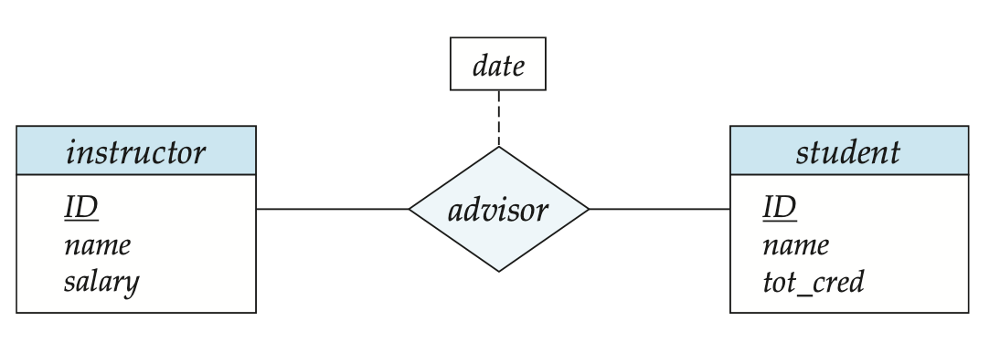
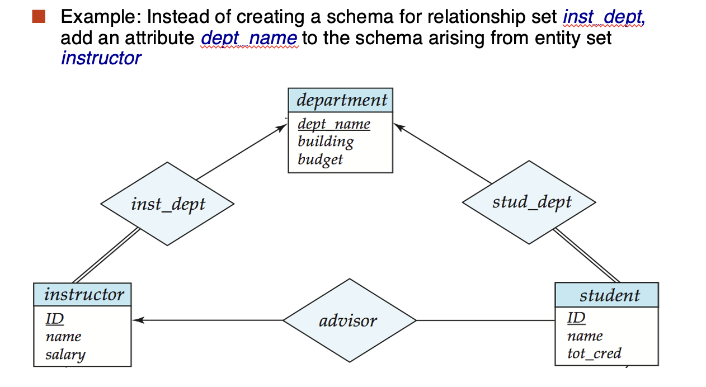

# **Entity-Relationship Model**

**Outline:**

- Database Design Process
- Modeling
- Constraints
- Weak Entity Sets
- Reduction to Relation Schemas
- Design Issues
- Extended E-R Features
- UML

## **Database Design Process**

<figure markdown="span">
{width = "400"}
<figcaption>E-R Diagram for a University Enterprise</figcaption>
</figure>
本节课最核心的就是这张图片，我们将围绕这张图片讲述 E-R 模型的相关内容，同时学习如何把 E-R 模型转换为关系模式。

!!! Important 

    - 一个方框代表一个实体，一个菱形代表一个关系
    - 实体有属性，有下划线标出 ```primary key```
      
    实体与实体之间有关系，中间用线连接起来。根据线的种类，箭头有无，可以把关系分类。
    
    比如 ```instructor``` 和 ```department``` 之间有 ```inst_dept``` 关系，```instructor``` 指向 ```department``` 的线有箭头，代表一个老师只能对应一个系；而 ```department``` 指向 ```instructor``` 的线没有箭头，代表一个系可以对应多个老师。

    还可以观察到有的线是双横线，有的是单横线。双横线代表所有的对象都必须参与关系，而单横线代表不一定所有的对象都要参与关系。

    还是 ```instructor``` 和 ```department``` 之间，```instructor``` 有双横线连接，代表每个老师都必须有系，而 ```department``` 有单横线连接，代表不一定所有的系都有这个老师，可能有的老师只属于数学系，计算机系就没有他，但是每个老师都会属于一个系。

    仔细观察还会发现，有的菱形是单横线构成的，而有的菱形则是双横线。

    双横线代表与它连接的实体是弱实体(weak entity)，即这个实体中的对象必须依赖于另一个实体。就比如 ```section``` 和 ```course``` 之间，可以看到 ```section``` 中有 ```sec_id, semester, year``` 这些属性，但是这些属性并不足以唯一确定一个 ```section```，比如 **2025年春夏学期一班**并不足以唯一确定一个 ```section```，还需要有 ```course_id``` 这个属性，这样才能唯一确定一个 ```section```。

    注意，```section``` 中的所有```primary key``` 是用虚线标注的，而不是实线。

以上只是一个简单的导览，更详细的部分会在后边涉及。

## **Modeling**

### **Entities**

- A database can be modeled as:
    - A collection of entities(用矩形表示)
    - Relationships among entities(用菱形表示)
- Entities have attributes
    - Example: people have *names* and *addresses*
- Entity sets can be represented graphically as follows:
    - Rectangles represent entity sets
    - Attributes listed inside entity rectangle
    - Underline indicates primary key attributes

??? Example

    <figure markdown="span">
    {width = "400"}
    </figure>

### **Relationship Sets**

- A relationship is an association among several entities
- A relationship set is a mathematical relation among n $\geq$ 2 entities, each taken from entity sets

$$
\{(e_1, e_2, \cdots , e_n) | e_1 \in E_1, e_2 \in E_2, \cdots , e_n \in E_n\} \notag
$$

where $(e_1, e_2, \cdots , e_n)$ is a relationship.

#### **Representing Relationship Sets in ER Diagrams**

- Diamonds represent relationship sets

<figure markdown="span">
{width = "400"}
</figure>

#### **Relationship Sets with Attributes**

- An attribute can also be property of a relationship set
- For instance, the *advisor* relationship set between entity sets *instructor* and *student* may have the attribute *date* which tracks when the student started being advised by the instructor

<figure markdown="span">
{width = "400"}
</figure>

<figure markdown="span">
{width = "400"}
</figure>

#### **Roles**

- Entity sets of a relationship need not be distinct
    - Each occurence of an entity set plays a "role" in the relationship
- The labels "course_id" and "preq_id" are called **roles**

#### **Degree of a Relationship Set**

- **Binary relationship(二元联系)**
    - involve two entity sets (or degree two)
    - most relationship sets in a database system are binary
- There are occasions when it is more convenient to represent relationships as non-binary

<figure markdown="span">
{width = "400"}
</figure>

三元联系用图表示出来可能不方便，通常把三元联系拆成三个二元联系，更加清晰直观。

### **Attributes**

- Attribute types:
    - <font color = bule>Simple(简单)</font> and <font color = bule>Composite(复合)</font> attributes.
    - <font color = bule>Single-valued(单值)</font> and <font color = bule>Multi-valued(多值)</font> attributes.
        - Example: multivalued attribute: phone_numbers
    - <font color = bule>Derived(派生)</font> attributes
        - Can be computed from other attributes
        - Example: age can be derived from birthdate

!!! note

    === "简单和复合"

        简单属性是指属性的值是不可再分的，比如一个人的年龄，性别等。
        
        复合属性是指属性的值是可以再分的，比如一个人的地址，可以分成省份，城市，街道等。

    === "单值和多值"

        单值表示一个实体只有一个属性值，比如一个人的年龄，性别等。

        多值表示一个实体有多个属性值，比如一个人的电话号码，一个人可能有多个电话号码。
    
    === "派生"

        派生属性是指属性的值可以通过其他属性的值计算得到，比如一个人的年龄可以通过出生日期计算得到。

<figure markdown="span">
{width = "400"}
</figure>

<figure markdown="span">
{width = "400"}
</figure>

## **Constraints**

### **Mapping Cardinality Constraints(映射基数约束)**

- Express the number of entities to which another entity can be associated via a relationship set
- Most useful in describing binary relationship sets
- For a binary relationship set the mapping cardinality must be one of the following types:
    - One to one
    - One to many
    - Many to one
    - Many to many

用带箭头的横线表示 "one", 用不带箭头的横线表示 "many"。就像是在导览中表示的那样。

### **Total and Partial Participation**

- <font color = blue>Total participation(indicated by double line)</font>: every entity in the entity set participates in at least one relationship in the relationship set
    - 所有的实体都必须参与关系
    - 用双横线表示
- <font color = blue>Partial participation(indicated by single line)</font>: some entities may not participate in any relationship in the relationship set

### **Notation for Expressing More Complex Constraints**

- A line may have an associated minimum and maximum cardinality, shown in the form $l .. h$, where $l$ is the minimum and $h$ is the maximum
    - A minimum value of 1 indicates total participation
        - 至少参加一个关系
    - A maximum value of 1 indicates that the entity participates in at most one relationship
        - 参加 0 个或 1 个关系
    - A maximum value of \*  indicates no limit
        - 没有限制

!!! Example

    <figure markdown="span">
    {width = "400"}
    </figure>

    左边横线上的 $0 .. *$ 表示一个学生可以选0门或多门课程，右边横线上的 $1 .. 1$ 表示一个课程只能被一个学生选。

在多元关系中，为了避免混淆，我们只允许一个箭头。

### **Primary Key**

#### **Primary Key for Relationship Sets**

多元联系的 ```primary key``` 一般是所有 ```primary key``` 的组合；一对一联系的 ```primary key``` 一般是其中一个实体的 ```primary key```；多对一或者一对多联系的 ```primary key``` 一般是多的一方的 ```primary key```。

<figure markdown="span">
{width = "400"}
</figure>

## **Weak Entity Sets**

- An entity set that does not have a primary key is referred to as a weak entity set
- The existence of a weak entity set depends on the existence of a <font color = blue>identifying entity set(标识性实体集)</font>
    - It must relate to the identifying entity set via a total, one-to-many relationship set from the identifying to the weak entity set
    - <font color = blue>Identifying relationship(标识性关系)</font> is depicted using a double diamond
- The <font color = blue>discriminator(分辨符, or partial key)</font> of a weak entity set is a set of attributes that distinguishes among all the entities of a weak entity set <font color = red>when the identifying entity they depend is known</font>

弱实体的主键由弱实体的分辨符和强实体的主键构成。

<figure markdown="span">
{width = "400"}
</figure>

### **Redundant Attributes**

假设我们有两个实体 ```student```, ```department```，在 E-R 关系图中，它们之间通过 ```stud_dept``` 关系连接。如果我们在 ```student``` 实体中加入 ```dept_name``` 属性，这样就会造成冗余，因为 ```dept_name``` 已经在 ```department``` 实体中了。那么 ```stud_dept``` 关系也就没有意义了。

## **Reduction to Relation Schemas**

我们的 E-R 图是中性的，它可以被转化成关系模式，也可以转化成面向对象的模式。

- A strong entity set reduces to a schema with the same attribtues (<code>course(<u>course_id</u>, title, credits)</code>)
- A weak entity set becomes a table that includes a column for the primary key of the identifying strong entity set 
    - Primary key of the table is the union of the discriminator of the weak entity set and the primary key of the identifying entity set
    - 弱实体的分辨符和强实体的主键
    - ```section(course_id, sec_id, semester, year)```
- A many-to-many relationship set is represented as a schema with attributes for the primary keys of the two participating entity sets, and any descriptive attributes of the relationship set(两个实体的主键和关系的属性)
    - <code>advisor = (<u>s_id</u>, <u>i_id</u>)</code>

<figure markdown="span">
{width = "400"}
</figure>

- Many-to-one and one-to-many relationship sets that are total on the many-side can be represented by adding an extra attribute to the "many" side, containing the primary key of the "one" side.
    - 多对一不能转化为关系模式，因为多的一方的主键不是唯一的，直接在“多”的那个表上加上“一”的主键就可以了
  
<figure markdown="span">
{width = "400"}
</figure>

转换前：

<pre>
<code>
deparement(<u>dept_name</u>, building, budget)
instructor(<u>ID</u>, name, salary)
inst_dept(<u>ID</u>, dept_name)
</code>
</pre>

转换后：

<pre>
<code>
deparement(<u>dept_name</u>, building, budget)
instructor(<u>ID</u>, name, salary, <u><b>dept_name</b></u>)
</code>
</pre>

### **Composite and Multivalued Attributes**

直接把复合属性拆开，多值属性新开一个表。

<figure markdown="span">
{width = "400"}
</figure>

```sql
instructor(ID, first_name, middle_name, last_name, street_number, street_number, apt_number, city, state, zip_code, date_of_birth, age)
```

多值属性比如 ```phone_numbers```，新开一个表 ```inst_phone```。

<pre>
<code>
inst_phone = (<u>ID</u>, <u>phone_number</u>)
</code>
</pre>

!!! note "Special case"

    <figure markdown="span">
    {width = "400"}
    </figure>

    好处：可以定义外键了，之前的 ```time_slot``` 是无法定义外键的。

    坏处：多了一个表，查询的时候需要多次查询

## **Design Issues**

### **Common Mistakes in E-R Diagrams**

<figure markdown="span">
{width = "400"}
</figure>

信息冗余，```dept_name``` 在 ```department``` 和 ```student``` 中都有，这样就会造成冗余。应该把 ```student``` 中的 ```dept_name``` 去掉。

---

<figure markdown="span">
{width = "400"}
</figure>

一门课会有多个作业，不能只用一个实体表示。

解决办法：

<figure markdown="span">
{width = "400"}
</figure>

### **Use of Entity Sets vs. Attributes**

<figure markdown="span">
{width = "400"}
</figure>

- 第一种方法，删除多余的电话号码，明确每个人只有一个电话号码
- 第二种方法，电话号码附带更多属性，一个电话可以有多人共享（比如办公室的电话）

### **Use of Entity Sets vs. Relationship Sets**

Possible guideline is to designate a relationship set to describe an action that occurs between entities

<figure markdown="span">
{width = "400"}
</figure>

### **Placement of relationship attributes**

<figure markdown="span">
{width = "400"}
</figure>

## **Extended E-R Features**

- <font color = red>Specialization(特化)</font>
    - <font color = blue>Top-down design process</font>; we designate sub-groupings within an entity set that are distinctive from other entities in the set
    - <font color = blue>Attribute inheritance(属性继承)</font> - a lower-level entity set inherits all the attributes and relationship participation of the higher-level entity set to which it is linked.
- <font color = red>Generalization(概化)</font>
    - <font color = blue>Bottom-up design process</font> - combine a number of entity sets that share the same features into a higher-level entity set