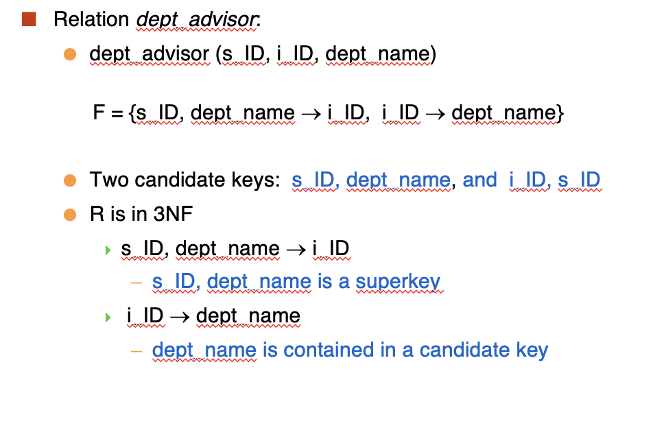

# **Relational Database Design**

Outline:

- Features of Good Relational Design
- Atomic Domains and First Normal Form
- Decomposition Using Functional Dependencies
- Functional Dependency Theory
- Algorithms for Functional Dependencies
- Decomposition Using Multivalued Dependencies
- More Normal Forms
- Database-Design Process
- Modeling Temporal Data

## **Features of Good Relational Design**

Consider combining relations

<pre>
<code>
student(<u>id</u>, name, tot_cred)
stud_dept(<u>id</u>, dept_name)
</code>
</pre>

$$
\rightarrow
$$

<pre>
<code>
student(<u>id</u>, name, tot_cred, dept_name)
</code>
</pre>

假设我们有一个关系

<pre>
<code>
inst_dept(<u>id</u>, name, salary, dept_name, building, budget)
</code>
</pre>

我们应该怎么把它们拆分成两个关系(```instructor```和```department```)呢？

通过函数依赖我们可以看到

$$
\mathrm{id} \rightarrow \mathrm{name, salary, dept_name}
$$

$$
\mathrm{dept_name} \rightarrow \mathrm{building, budget}
$$

在 ```inst_dept``` 关系中，由于 ```dept_name``` 不是候选键，所以可以把 ```building, budget, dept_name``` 拿出来单独成一个关系 ```department```，而 ```id, name, salary``` 作为 ```instructor``` 

但是有时候这么做可能会导致信息丢失 ```lose information```, 比如

```sql
employee(ID, name, street, citym, salary)
```

$$
\rightarrow
$$

```sql
employee1(ID, name)

employee2(name, street, city, salary)
```

这就发生了信息丢失，因为可能会有同名的人，导致 ```employee1``` 和 ```employee2``` 之间的联系丢失了

### **Lossless-join Decomposition**

我们说一个分解是```lossless-join``` 的，如果我们通过 $R_1 \cup R_2$ 代替 $R$, 不发生信息丢失

Conversely a decomposition is lossy if

$$
r \subset \pi_{R_1}(r) \bowtie \pi_{R_2}(r)
$$

!!! NOTE

    more tuples implies more uncertainty(less information)

A decomposition of $R$ into $R_1$ and $R_2$ is lossless join if at least one of the following holds:

$$
R_1 \cap R_2 \rightarrow R_1
$$

$$
R_1 \cap R_2 \rightarrow R_2
$$

## **First Normal Form**

A relation schema is in first normal form if the domains of all attributes of R are atomic

Domain is atomic if its elements are considered to be indivisible units.

一个关系满足第一范式需要以下条件：

1. 原子性：关系中的每个属性都必须是原子值，即不可再分的基本数据单位。
2. 无重复组：关系中的每一行都必须是唯一的，不能有重复的行。
3. 唯一性：关系中的每一行都必须有一个唯一的标识符，即主键。

不符合第一范式的例子：

| 姓名 |    科目    |
| :--: | :--------: |
| 张三 | 数学，物理 |

上边的“科目”一栏，就违背了“原子性”的原则

!!! Important

    Normal Forms(NF):
    
    $\mathrm{1NF} \rightarrow \mathrm{2NF} \rightarrow \mathrm{3NF} \rightarrow \mathrm{BCNF} \rightarrow \mathrm{4NF}$

## **Functional Dependencies**

!!! NOTE

    Let $R$ be a relation schema 
    
    $$
    \alpha \subseteq R \ \mathrm{and} \ \beta \subseteq R
    $$
    
    The functional dependency $\alpha \rightarrow \beta$ holds on $R$ if for any two tuples $t_1$ and $t_2$ in $R$, if $t_1[\alpha] = t_2[\alpha]$, then $t_1[\beta] = t_2[\beta]$

函数依赖 $\alpha \rightarrow \beta$ 要求从 $\alpha$ 到 $\beta$ 的映射是唯一的。反过来就是要求从 $\beta$ 到 $\alpha$ 的映射是唯一的

Example: Consider $r(A, B)$ with the following instance of $r$.

|  1   |  4   |
| :--: | :--: |
|  1   |  5   |
|  3   |  7   |

从 $A \rightarrow B$ 就不满足函数依赖，而从 $B \rightarrow A$ 就满足函数依赖

### **Superkey**

K is a <font color = red>superkey</font> for relation schema R <font color = red>if and only if $K \rightarrow R$</font>

如果 K 是一个超键，那么 K 可以决定关系 R 中的所有属性
换句话说，K 可以唯一地标识关系 R 中的每一行

K is a <font color = red>candidate key</font> for $R$ is and only if 

- $K \rightarrow R$, and
- for no $\alpha \subset K, \alpha \rightarrow R$

如果 K 是候选键，当且仅当 K 能决定 R，并且没有任何 K 的子集能决定 R

A functional dependency is <font color = red>trivial</font> if it is satisfied by all relations

Example:

- $\mathrm{ID, name} \rightarrow \mathrm{ID}$
- $\mathrm{name} \rightarrow \mathrm{name}$

in general, $\alpha \rightarrow \beta \ \mathrm{is trivial if} \ \beta \subseteq \alpha$

### **Closure(闭包) of a set of Functional Dependencies**

Given a set F of functional dependencies, there are certain other functional dependencies that are logically implied by F.

For example: if $\mathrm{A} \rightarrow \mathrm{B}$ and $\mathrm{B} \rightarrow \mathrm{C}$, then we can infer that $\mathrm{A} \rightarrow \mathrm{C}$

The set of all functional dependencies logically implied by F is the <font color = blue>closure</font> of F.

We donate the closure of F by $F^+$, $F^+$ is a superset of F

!!! NOTE "Armstrong's Axioms"

    - if $\beta \subseteq \alpha$, then $\alpha \rightarrow \beta$ (<font color = blue>reflexivity, 自反率</font>)
    - if $\alpha \rightarrow \beta$ then $\gamma \alpha \rightarrow \gamma \beta$ (<font color = blue>augmentation, 增补率</font>)
    - if $\alpha \rightarrow \beta$ and $\beta \rightarrow \gamma$, then $\alpha \rightarrow \gamma$ (<font color = blue>transitivity, 传递率</font>)

!!! Example

    $R \ = \ \{A, B, C, G, H, I\}$

    $F \ = \ \{A \rightarrow B, A \rightarrow C, CG \rightarrow H, CG \rightarrow I, B \rightarrow H\}$

    some members of $F^+$

    - $A \rightarrow H$
        - by transitivity from $A \rightarrow B$ and $B \rightarrow H$
    - $AG \rightarrow I$
        - by augmentation from $A \rightarrow C$ with G, to get $AG \rightarrow CG$ and then transitivity with $CG \rightarrow I$
    - $CG \rightarrow HI$
        - by augmentation from $CG \rightarrow I$ to infer $CG \rightarrow CGI$, and augmentation of $CG \tighrtarrow H$ to infer $CGI \rightarrow HI$, and then transitivity
  
Additional rules:

- If $\alpha \rightarrow \beta$ and $\alpha \rightarrow \gamma$ holds, then $\alpha \rightarrow \beta \gamma$ holds (<font color = blue>union, 合并</font>)
- If $\alpha \rightarrow \beta \gamma$ holds, then $\alpha \rightarrow \beta$ holds and $\alpha \rightarrow \gamma$ holds (<font color = blue>decomposition, 分解</font>)
- If $\alpha \rightarrow \beta$ and $\gamma \beta \rightarrow \delta$ holds, then $\alpha \gamma \rightarrow \delta$ holds (<font color = blue>pseudotransitivity, 伪传递率</font>)

### **Closure of Attribute Sets**

Given a set of attributes a, define the closure of a under F(donate by $a^+$) as <font color = red>the set of attributes that are functionally determined by a under F</font>

!!! Example

    $R(A, B, C, D), F \ = \ \{A \rightarrow B, B \rightarrow C, B \rightarrow D\}$

    So

    $$
    A^+ = ABCD
    $$

    $$
    B^+ = BCD
    $$

    $$
    C^+ = C
    $$

#### **Uses of Attribute Closure**

<figure markdown = "span">
{ width="50%" }
<figcaption>Uses of Attribute Closure</figcaption>
</figure>

### **Canonical Cover(正则覆盖)**

A canonical cover of F is a minimal set of functional dependencies equivalent to F, having no redundant dependencies or redundant parts of dependencies.

正则覆盖是 F 的一个最小超集，没有冗余的依赖关系或冗余的依赖关系部分

Example:

In $\{A \rightarrow B, B \rightarrow C, A \rightarrow C \}$, $A \rightarrow C$ is redundant, so we can remove it
and get $\{A \rightarrow B, B \rightarrow C\}$

!!! Example

    On RHS: 

    $$
    \{A \rightarrow B, B \rightarrow C, A \rightarrow CD \}
    $$

    can be simplified to 
    
    $$
    \{A \rightarrow B, B \rightarrow C, A \rightarrow D\}
    $$

    On LHS:

     $$
    \{A \rightarrow B, B \rightarrow C, AC \rightarrow D \}
    $$

    can be simplified to 
    
    $$
    \{A \rightarrow B, B \rightarrow C, A \rightarrow D\}
    $$

#### **Extraneous Attributes(无关属性)**

Consider a set F of functional dependencies and the functional dependency $\alpha \rightarrow \beta$ in F.

- Attribute A is extraneous in $\alpha$ if $A \in \alpha$ and F logically implies $(F - \{\alpha \rightarrow \beta \}) \cup \{(\alpha - A) \rightarrow \beta\}$
    - 如果移除了 A 之后仍然能推导出相同的约束，那么 A 就是无关属性
- Attribute A is extraneous in $\beta$ if $A \in \beta$ and the set of functional dependencies $(F - \{\alpha \rightarrow \beta \}) \cup \{\alpha \rightarrow (\beta - A)\}$

!!! Example

    Given $F \ = \ \{A \rightarrow C, AB \rightarrow C\}$

    B is extraneous in $AB \rightarrow C$ because $\{A \rightarrow C, AB \rightarrow C\}$ logically implies $\{A \rightarrow C\}$

    Given $F \ = \ \{A \rightarrow C, AB \rightarrow CD\}$

    C is extraneous in $AB \rightarrow CD$ because $\{A \rightarrow C\}$ can be inferred even after deleting C.

<figure markdown = "span">

</figure>

#### **Computing a Canonical Cover**

$$
R \ = \ (A, B, C)
$$

$$
F \ = \ \{A \rightarrow BC, B \rightarrow C, A \rightarrow B, AB \rightarrow C\}
$$

1. Combine $A \rightarrow BC$ and $A \rightarrow B$ into $A \rightarrow BC$
   - Set is now $\{A \rightarrow BC, B \rightarrow C, AB \rightarrow C\}$
2. A is extraneous in $AB \rightarrow C$
   - Check if the result of deleting A from $AB \rightarrow C$ is implied by the other dependencies
      - Yes: in fact, $B \rightarrow C$ is already in the set
   - Set is now $\{A \rightarrow BC, B \rightarrow C\}$
3. C is extraneous in $A \rightarrow BC$
   - Check if $A \rightarrow C$ is logically implied by $A \rightarrow B$ and the other dependencies
4. The canonical cover is $\{A \rightarrow B, B \rightarrow C\}$

另一种方法是通过画图：

<figure markdown = "span">

</figure>

可以直观地看出正则覆盖是 $\{A \rightarrow B, B \rightarrow C\}$

!!! Example

    <figure markdown = "span">
    
    </figure>

## **Boyce-Codd Normal Form (BCNF)**

一个关系模式满足 BCNF , 如果对于 $F^+$ 的所有形如 $\alpha \rightarrow \beta$ 的函数依赖，至少满足以下条件之一：

1. $\alpha \rightarrow \beta$ 是平凡的
2. $\alpha$ 是关系模式的超键

即 BCNF 要求所有的函数依赖要么是平凡的，要么左侧是超键

### **Decomposing a Schema into BCNF**

假设我们有 schema R 和一个非平凡的函数依赖 $\alpha \rightarrow \beta$

我们可以把 R 分解为：

$$
\alpha \cup \beta
$$

$$
R \ - \ (\beta \ - \ \alpha )
$$

#### **BCNF Decomposition Algorithm**

<figure markdown = "span">

</figure>

### **BCNF and Dependency Preservation**

依赖保持：原来的函数依赖都可以在分解后的函数依赖中得到单独检验。如果需要把几个关系连在一起才能检验的，称为依赖不保持。

!!! NOTE

    If it's sufficient to test only those dependencies on each individual relation of a decomposition in order to ensure that all functional dependencies hold, then that decomposition is <font color = blue>dependency perservation</font>

    如果通过检验单一关系上的函数依赖，就能确保所有的函数依赖成立，那么这样的分解是依赖保持的。或者原来关系 R 上的每一个函数依赖，都可以在分解后的单一关系上得到检验或者推导得到。

Let $F_i$ be the set of all functional dependencies in $F^+$ that include only attributes in $R_i$.(<font color = red>$F_i$: the restriction of F on $R_i$</font>)

- A decomposition is dependency preserving if $(F_1 \cup F_2 \cup \cdots \cup F_n)^+ \ = \ F^+$
- If it is not, then checking updates for violation of functional dependencies may require computing joins, which is expensive.

!!! Example

    <figure markdown = "span">
    
    </figure>

!!! Example

    <figure markdown = "span">
    
    </figure>

## **Third Normal Form (3NF)**

A relation schema R is in third normal form(3NF) if for all:

$$
\alpha \rightarrow \beta \in F^+
$$

at least ont of the following holds:

- $\alpha \rightarrow \beta$ is trivial
- $\alpha$ is a superkey for R
- Each attribute A in $\beta \ - \ \alpha$ is contained in a candidate key for R

任意一个非平凡的函数依赖，要么左边是超键，要么右边必须包含在一个候选键里面。

<figure markdown = "span">

</figure>

!!! NOTE "Algorithm"

<figure markdown = "span">

</figure>

### **Goals of Normalization**

Let R be a relation scheme with a set F of functional dependencies.Decide whether a relation scheme R is in "good" form.

In the case that a relation scheme R is not in "good" form, decompose it into a set of relation scheme $\{R_1, R_2, \cdots, R_n\}$ such that:

- each relation scheme is in good form(3NF or BCNF)
- the decomposition is a lossless-join decomposition
- Preferably, the decomposition should be dependency preserving