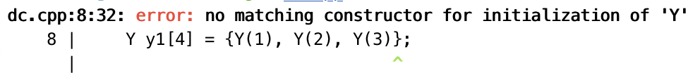

# **Class**

Object = Attributes + Services

## **Definition of a Class**

建议把类的定义放在一个单独的```.h```文件中，而类的实现放在一个单独的```.cpp```文件中。

```point.h```

```cpp
class Point {
private:
    int x;
    int y;
public:
    void init(int ix, int iy);
    void print();
    void move(int dx, int dy);
};
```

```point.cpp```

```cpp
#include <iostream>
#include "point.h"

void Point::init(int ix, int iy) {
    x = ix;
    y = iy;
}

void Point::print() {
    std::cout << "(" << x << ", " << y << ")" << std::endl;
}

void  Point::move(int dx, int dy) {
    x += dx;
    y += dy;
}
```

注意：为了不让三个函数变成 ```free functions```，我们在函数名前加上了 ```Point::```。声明这个函数是属于 ```Point``` 类的。

然后在 ```main.cpp``` 中可以直接使用 ```Point``` 类。

```main.cpp```

```cpp
#include "point.h"

int main()
{
    Point p;
    p.init(1, 2);
    p.print();
    p.move(3, 4);
    p.print();
    return 0;
}
```

这样就做到了接口和实现的分离。

### **Resolver**

```cpp
void S::f() {
    ::f();      // call the global function f()
    f();        // call the member function f()
    ::a++;      // access the global variable a
    a--;        // access the member variable a
}
```

## **Compilation Unit**

一个 CPP 文件就是一个编译单元。每个文件都是分开单独处理的，它们唯一的联系就是通过头文件。

### **include**

通过上边的例子可以看到，引入头文件的方式有两种，一种是双引号（```#include "point.h"```），一种是尖括号（```#include <iostream>```）。

尖括号引入的是系统目录的头文件，双引号引入的是本地的或者当前目录下的头文件。

### **Safe Guard**

如果我们在之前的 ```point.h``` 头文件中加入一个全局变量的定义 ```int globalx = 10;```，然后进行编译，发现报错: ```ld: 1 duplicate symbols```

原因就是因为头文件被引入了两次，一次是在 ```point.cpp``` 中，一次是在 ```main.cpp``` 中。所以全局变量也被定义了两次。

我们可以做的是在 ```.h``` 文件中对它进行声明，然后在 ```.cpp``` 文件中对其进行定义（只能在一个 ```.cpp``` 文件中定义）。

所以我们就需要加入一个 ```safe guard```，在头文件中加入：

```cpp
#ifndef POINT_H
#define POINT_H

class Point {
private:
    int x;
    int y;
public:
    void init(int ix, int iy);
    void print();
    void move(int dx, int dy);
};

#endif
```

如上我们就实现了一个标准的封装。

## **Build Automation Tools**

这里仅对本节课的项目进行简单的 ```CMake``` 介绍。

首先创建 ```CMakeLists.txt``` 文件：

```cmake
cmake_minimum_required(VERSION 3.10)    // 指定 cmake 版本
project(class)                          // 指定项目名称
add_executable(class main.cpp point.cpp)    // 指定可执行文件的名称和源文件
```

然后在当前目录下创建一个 ```build``` 文件夹，进入该文件夹，执行 ```cmake ..```，等到生成了 ```Makefile``` 文件后，执行 ```make```，就可以生成可执行文件了。

然后运行可执行文件 ```./class```，就可以看到输出结果了。

## **OOP Characteristics**

- Everything is an object
- A program is a bunch of objects telling each other what to do by sending messages
- Each object has its own memory made up of other objects
- Every object has a type
- All objects of a particular type can receive the same messages

OOP 一个优点就是，每个模块之间的接口都是很好地匹配的，我们使用者不用去关心内部实现，只需要知道接口就可以了，可以对模块进行任意的更改，只要不破坏接口就行。

## **Ctor and Dtor**

在我们上面的例子中，```point``` 类的初始化是需要用户来完成的，我们知道程序不初始化是很危险的，如果用户忘了初始化的话，那么很容易出现疏漏。

所以我们需要有一种机制，让编译器保证初始化这个动作一定要发生。这就是构造函数。

每一个对象被创建的时候，都会调用构造函数，这样就保证了对象的初始化。

构造函数的名字跟类型名字是一样的，在我们创建对象的时候，就会调用构造函数。跟我们上一节课讲 ```new``` 和 ```delete``` 的时候是一样的。

```cpp
#include <iostream>

using namespace std;

struct Y { int i; float f; Y(int a) { i = a;} };

int main() {
    Y y1[] = {Y(1), Y(2), Y(3)};
    return 0;
}
```

可以编译通过。

但是如果改成 ```Y y1[4] = {Y(1), Y(2), Y(3)};``` 就会报错，编译器会提示：

<figure markdown="span">

</figure>

会有一个箭头指着最后边，这是因为我们只写了三个初始化，但是数组的大小是 4，编译器自动为我们填进去了一个 ```Y()```，但是我们没有与之匹配的构造函数，因为我们的构造函数是需要一个参数的，所以会报错。

如果我们加一个构造函数的话 ```struct Y { int i; float f; Y(int a) { i = a;} Y() {} };```，就可以编译通过了。

!!! note

    如果我们创建类的时候不写构造函数，那么编译器会自动为我们创建一个默认的构造函数，这个构造函数不做任何事情。

    相当于 ```Y() {}```

