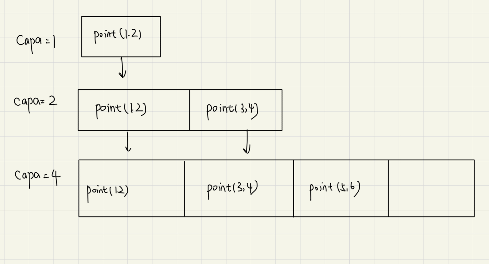

# **Copy Constructor**

拷贝构造函数：

```cpp
T::T(const T& t) {}
```

如果你自己不写拷贝构造函数，编译器会自动生成一个默认的拷贝构造函数。

这个默认的拷贝构造函数做的是 "Member-wise copy", 即逐个成员变量进行拷贝。

这个拷贝对于非指针类型的成员变量是安全的，但对于指针类型的成员变量就不一定安全了。

比如如果有一个类 'A', 它有一个指针变量 ```char *name```, 在执行拷贝构造的时候，编译器会把指针的地址也赋值给新的对象，这样就会导致两个对象指向同一块内存区域。

```cpp
#include <cstring>
#include <iostream>

using namespace std;

struct Person {
    char *name;
    Person(const char* s)
    {
        name = new char[strlen(s) + 1];
        strcpy(name, s);
    }

    ~Person()
    {
        delete[] name;
    }
};

int main()
{
    Person p1("John");
    Person p2 = p1;

    cout << (void *)p1.name << endl;
    cout << (void *)p2.name << endl;
}
```

我们发现程序输出了两个一模一样的地址，但是最后还是报错了。这是因为在执行 ```p2 = p1``` 的时候，我们赋值的是指针的地址，所以在执行析构函数的时候，```p2``` 先删除了一遍 ```name```，然后 ```p1``` 也删除了一遍 ```name```，导致了重复删除同一块内存区域，最终报错。

这时候就需要我们自己实现一个拷贝构造函数了：

```cpp
Person(const Person& p)
{
    name = new char[strlen(p.name) + 1];
    strcpy(name, p.name);
}
```

这样就可以避免两个对象指向同一块内存区域的问题了。

!!! NOTE "Rule of zero"

    通常情况下，以下四个函数是编译器会帮我们写的，我们不需要自己写：

    ```cpp
    T::T() // 默认构造函数
    T::T(const T&) // 拷贝构造函数
    T& operator=(const T&) // 拷贝赋值运算符
    T::~T() // 析构函数
    ```

## **When are copy ctors called?**

```cpp
Person baby_a("Fred");

Person baby_b = baby_a; // copy ctor called
Person baby_c(baby_a); // copy ctor called
```

```cpp
void roster( child ) {
    ...
}

Person child("Ruby");
roster(child); // copy ctor called
```

```cpp
Person captain() {
    Person player("George");
    return player; // copy ctor called
}

Person who = captain(); // copy ctor called
```

但是在有的时候，拷贝构造函数并不会被调用：

```cpp
#include <cstring>
#include <iostream>

using namespace std;

struct Person
{
    string name;
    Person(const char* s) : name(s) {
        cout << "Person(const char*)" << endl;
    }
    Person(const Person &p)
    {
        cout << "Person(&)" << endl;
    }
};

Person foo(Person p)
{
    cout << "in foo()" << endl;
    return p;
}

Person bar(const char* s) {
    cout << "in bar()" << endl;
    return Person(s);
}

int main()
{
    Person p1 = foo("John");
    cout << "----------------------" << endl;
    Person p2 = bar("Mike");
}
```

得到输出

```cpp
Person(const char*)
in foo()
Person(&)
----------------------
in bar()
Person(const char*)
```

我们在调用 ```bar()``` 函数的时候，并没有调用拷贝构造函数。这个叫返回值优化，编译器直接用 ```Mike``` 来构造 ```p2```，而不是先构造一个临时对象 ```Person```，然后再拷贝到 ```p2``` 中。这样可以避免不必要的拷贝，提高性能。

如果不想让编译器进行返回值优化，可以使用 ```-fno-elide-constructors``` 编译选项来禁止返回值优化。

## **Pay attention to efficiency**

如果我们有一个对象 ```Point```, 我们想构造一个 ```Point``` 的数组，通常的做法是这样的：

```cpp
#include <iostream>
#include <vector>

using namespace std;

struct Point
{
    int x;
    int y;

    Point(int x, int y) : x(x), y(y)
    {
        cout << "Point::Point(x, y)" << endl;
    }

    Point(const Point &p) : x(p.x), y(p.y)
    {
        cout << "Point::Point(const Point &p)" << endl;
    }
};

ostream &operator<<(ostream &os, const Point &p)
{
    os << "(" << p.x << ", " << p.y << ")";
    return os;
}

int main()
{
    vector<Point> pts;

    pts.push_back(Point(1, 2));
    pts.push_back(Point(3, 4));
    pts.push_back(Point(5, 6));

    for( const Point & p : pts )
    {
        cout << p << endl;
    }
}
```

然后输出：

```
Point::Point(x, y)
Point::Point(const Point &p)
Point::Point(x, y)
Point::Point(const Point &p)
Point::Point(const Point &p)
Point::Point(x, y)
Point::Point(const Point &p)
Point::Point(const Point &p)
Point::Point(const Point &p)
(1, 2)
(3, 4)
(5, 6)
```

发现调用了六次拷贝构造函数。这是因为第一次调用 ```push_back()``` 的时候，数组的容量只有 1, 然后第二次插入的时候，数组容量不够 了，于是程序就会重新分配一块内存，把原来的数据拷贝到新的内存中，然后再插入新的数据。这样就会导致多次调用拷贝构造函数。

<figure markdown="span">

<figcaption>拷贝构造函数调用</figcaption>
</figure>

我们可以使用 ```vector.reserve(3)``` 来预先分配好内存，这样就可以避免多次调用拷贝构造函数了。运行后发现只调用了 3 次拷贝构造函数。

如果把 ```push_back()``` 换成 ```emplace_back()```，就不会调用拷贝构造函数了，因为 ```emplace_back()``` 会直接在数组中构造对象，而不是先构造一个临时对象再拷贝到数组中。

```cpp
#include <iostream>
#include <vector>

using namespace std;

struct Point
{
    int x;
    int y;

    Point(int x, int y) : x(x), y(y)
    {
        cout << "Point::Point(x, y)" << endl;
    }

    Point(const Point &p) : x(p.x), y(p.y)
    {
        cout << "Point::Point(const Point &p)" << endl;
    }
};

ostream &operator<<(ostream &os, const Point &p)
{
    os << "(" << p.x << ", " << p.y << ")";
    return os;
}

int main()
{
    vector<Point> pts;
    pts.reserve(3);
    pts.emplace_back(1, 2);
    pts.emplace_back(3, 4);
    pts.emplace_back(5, 6);

    for( const Point & p : pts )
    {
        cout << p << endl;
    }
}
```
得到输出：

```
Point::Point(x, y)
Point::Point(x, y)
Point::Point(x, y)
(1, 2)
(3, 4)
(5, 6)
```

这样就可以避免拷贝构造函数的调用。

!!! IMPORTANT

    ```emplace_back()``` 中的参数必须和对象的某一个构造函数的参数一致，否则对象无法被构造。

如果不想要别人调用拷贝构造函数，有两种方法：

- 在 ```c++11``` 之前，可以把拷贝构造函数声明为 private（并不需要写函数体，声明即可），这样就不能被外部调用了。
- 在 ```c++11``` 之后，可以使用 ```delete``` 来删除拷贝构造函数，这样就不能被外部调用了。
  - ```Person(const Person &p) = delete;```

