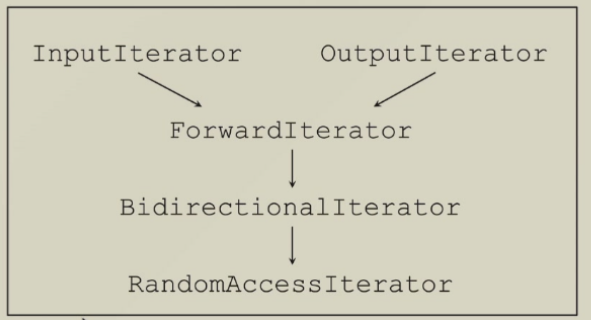

# **Iterators**

## **Requirements**

- A unified interface used in algorithms.
- Work like a pointer to the elements in a container
    - Have ```++``` operator to visit elements in order
    - Have ```*``` operator to access the content of an element

实现一个迭代器的核心是运算符重载。

## **Operator Overloading**

Overloading operators ```*``` and ```->```

```cpp
template<typename T>
class auto_ptr
{
private:
    T* pointee;
public:
    T& operator*() { return *pointee; }
    T* operator->() { return pointee; }
}
```

!!! EXAMPLE "List Container"

    === "List"
        ```cpp
        template<typename T>
        class List 
        {
        public:
            void insert_front();
            void insert_end();
            /* ... */
        private:
            ListItem<T> *front;
            ListItem<T> *end;
            long _size;
        }
        ```

    === "ListItem"
        ```cpp
        template<typename T>
        class ListItem
        {
        public:
            T& val() {
                return _value;
            }
            ListItem* next() {
                return _next;
            }
        /* ... */
        private:
            T _value;
            ListItem *_next;
        }
        ```

    === "ListIterator"
        ```cpp
        template<typename T>
        class ListIter
        {
            ListItem<T> *ptr;
        public:
            ListIter(ListItem<T> *p=0) : ptr(p) {}
            ListIter<T>& operator++() {
                ptr = ptr->next();
                return *this;
            }
            bool operator==(const ListIter& i) const {
                return ptr == i.ptr;
            }
        /* ... */
        T& operator*() { return ptr->val(); }
        T* operator->() { return &(**this); }
        }
        ```

在实现了链表的元素，链表以及迭代器之后，我们就可以在算法中使用了。

```cpp
#include <iostream>
#include <algorithm>

using namespace std;

template <class T>
struct ListItem
{
    T value;
    ListItem *next;
};

template <class T>
class ListIter
{
private:
    ListItem<T> *current;

public:
    ListIter(ListItem<T> *p = nullptr) : current(p) {}
    ListIter<T> &operator++()
    {
        current = current->next;
        return *this;
    }
    bool operator==(const ListIter<T> &p) const
    {
        return current == p.current;
    }
    bool operator!=(const ListIter<T> &p) const
    {
        return !(*this == p);
    }
    T &operator*()
    {
        return current->value;
    }
    T *operator->()
    {
        return &(**this);
    }
};

template <class T>
class List
{
public:
    List()
    {
        head = new ListItem<T>;
        head->next = nullptr;
    }
    ~List()
    {
        ListItem<T> *p = head;
        while (p != nullptr)
        {
            ListItem<T> *next = p->next;
            delete p;
            p = next;
        }
    }
    void push_front(T value)
    {
        ListItem<T> *item = new ListItem<T>;
        item->value = value;
        item->next = head->next;
        head->next = item;
    }
    ListItem<T> *get_head()
    {
        return head;
    }
    bool empty()
    {
        return head->next == nullptr;
    }
    ListIter<T> begin()
    {
        return ListIter<T>(head->next);
    }
    ListIter<T> end()
    {
        return ListIter<T>(nullptr);
    }

private:
    ListItem<T> *head;
};

int main()
{
    List<int> l;
    l.push_front(1);
    l.push_front(2);
    l.push_front(3);

    for (ListIter<int> iter = l.begin(); iter != l.end(); ++iter)
    {
        cout << *iter << " ";
    }
    cout << endl;

    for (auto iter : l)
    {
        cout << iter << " ";
    }
    cout << endl;
}
```

如上所示，我们实现了一个链表的迭代器。我们可以使用 ```ListIter``` 来遍历链表中的元素，同时可以配合 STL 算法来使用。

```cpp
    for (int i = 1; i <= 5; i++)
    {
        auto iter = find(l.begin(), l.end(), i);
        if (iter == l.end())
        {
            cout << i << " is not found" << endl;
        }
        else
        {
            cout << "found: " << *iter << endl;
        }
    }
```

我们与 ```find()``` 函数结合使用，来查找链表中的元素。

但是并不是所有的 STL 函数都能使用迭代器来实现。比如

```cpp
auto *iter = l.begin();
advance(iter, 2);   // 往后移动两位, 期望输出为 1
cout << "*iter after advance: " << *iter << endl;
```

编译之后我们发现会报错，这就说明并不是实现了迭代器就可以使用 STL 的所有算法。

这是因为很多算法在接受迭代器的同时，还需要一些迭代器的其他信息，比如元素的类型等，所以我们在实现迭代器等时候也需要把这些东西加进去。

### **Type info. definition**

!!! EXAMPLE

    ```cpp
    template<typename T>
    struct myIter {
        typedef T value_type;
        /* ...*/
        T* ptr;
        myIter(T* p=0) : ptr(p) {}
        T& operator*() { return *ptr; }
    };

    template<class T>
    typename I::value_type
    func(I iter) {
        return *iter;
    }

    // code
    myIter<int> iter(new int(8));
    cout << func(iter) << endl;
    ```

结合我们刚才的链表的代码，可以这样改善：

```cpp
#include <iostream>
#include <algorithm>
#include <iterator>

using namespace std;

template <class T>
struct ListItem
{
    T value;
    ListItem *next;
};

template <class T>
class ListIter
{
private:
    ListItem<T> *current;

public:
    using iterator_category = forward_iterator_tag;
    using value_type = T;
    using reference = T &;
    using pointer = T *;
    using difference_type = ptrdiff_t;

    ListIter(ListItem<T> *p = nullptr) : current(p) {}
    ListIter<T> &operator++()
    {
        current = current->next;
        return *this;
    }
    bool operator==(const ListIter<T> &p) const
    {
        return current == p.current;
    }
    bool operator!=(const ListIter<T> &p) const
    {
        return !(*this == p);
    }
    T &operator*()
    {
        return current->value;
    }
    T *operator->()
    {
        return &(**this);
    }
};

template <class T>
class List
{
public:
    List()
    {
        head = new ListItem<T>;
        head->next = nullptr;
    }
    ~List()
    {
        ListItem<T> *p = head;
        while (p != nullptr)
        {
            ListItem<T> *next = p->next;
            delete p;
            p = next;
        }
    }
    void push_front(T value)
    {
        ListItem<T> *item = new ListItem<T>;
        item->value = value;
        item->next = head->next;
        head->next = item;
    }
    ListItem<T> *get_head()
    {
        return head;
    }
    bool empty()
    {
        return head->next == nullptr;
    }
    ListIter<T> begin()
    {
        return ListIter<T>(head->next);
    }
    ListIter<T> end()
    {
        return ListIter<T>(nullptr);
    }

private:
    ListItem<T> *head;
};

int main()
{
    List<int> l;
    l.push_front(1);
    l.push_front(2);
    l.push_front(3);

    for (ListIter<int> iter = l.begin(); iter != l.end(); ++iter)
    {
        cout << *iter << " ";
    }
    cout << endl;

    for (auto iter : l)
    {
        cout << iter << " ";
    }
    cout << endl;

    auto iter = l.begin();
    advance(iter, 2);
    cout << *iter << endl;
}
```

我们做的改变是引入了 ```iterator``` 头文件，并且在 ```ListIter``` 中定义了 ```iterator_category``` 和 ```value_type``` 等类型信息。这样我们就可以使用 STL 的算法了。

然后再调用 ```advance()``` 函数时就不会报错了。

## **Pitfalls**

上述的做法看似很好，可以解决我们在使用 STL 算法时遇到的问题。

但是原生指针也可以用来当作迭代器，然而它并不是一个类，我们无法定义 ```iterator_category``` 和 ```value_type``` 等类型信息，这时候应该怎么做呢？

我们可以用 ```std::iterator_traits``` 来获取迭代器的类型信息。

```cpp
template<typename T>
struct iterator_traits
{
    typedef I::value_type value_type;
}
```

### **Template Specialization(模版特化)**

原本的主模版是这样的

```cpp
template<class T1, class T2, int I>
class A { /* ... */ }
```

除了主模版之外，我们可以提供一些特殊参数下的模版实现。

- Full template specialization(完全特化),因为参数给全了

```cpp
template<>
class A<int, double, 5> { /* ... */ }
```

- Partial template specialization(部分特化),因为参数只给了一部分

```cpp
template<class T2>
class A<int, T2, 3> { /* ... */ }
```

```cpp
#include <iostream>
#include <algorithm>

using namespace std;

template <class T>
class A
{
public:
    A() { cout << "template T" << endl; }
};

template <>
class A<int>
{
public:
    A() { cout << "template int, full specialization" << endl; }
};

template <class T>
class A<T *>
{
public:
    A() { cout << "template T*, partial specialization" << endl; }
};

int main()
{
    A<double> d;
    A<int> i;
    A<int*> p;
}
```

执行完成后，分别打印

```bash
template T
template int, full specialization
template T*, partial specialization
```

第一个是主模版，第二个是完全特化，这两个很好理解。但是第三个是部分特化，因为虽然我们给出了完整的参数，但是我们并没有指定参数的类型，只说明了它是一个指针类型（这里的指针可以是内建类型，也可以是用户自定义类型），所以它是部分特化。

于是我们回到刚才的问题，我们可以通过给模版提供一个指针的特化版本来解决这个问题。

下面是 ```iterator_traits``` 的主模版实现

```cpp
template<typename T>
class iterator_traits
{
public:
    typedef typename I::value_type value_type;
    typedef typename I::pointer_type pointer_type;
    /* ... */
};
```

然后我们可以给它提供一个指针的特化版本

```cpp
template<typename T>
class iterator_traits<T*>
{
public:
    typedef T value_type;
    typedef T* pointer_type;
    typedef random_access_iterator_tag iterator_category;
    /* ... */
};
```

## **Standard traits in STL**

通过上边的例子，我们可以大致理解 ```iterator_traits``` 实现的目的。

它的作用是获取迭代器的类型信息，提供一个统一的接口来获取迭代器的类型信息。避免不同的迭代器由于实现的不同导致类型信息不统一。

### **Iterator category(types)**

- Input iterator
- Output iterator
- ForwardIterator
- BidirectionalIterator
- RandomAccessIterator

<figure markdown="span">

<figcaption>Iterator category</figcaption>
</figure>

- Input Iterator: 只读迭代器
- Output Iterator: 只写迭代器
- Forward Iterator: 可以读，可以写，也可以往前走
- Bi_directional_Iterator: 可以读，可以写，也可以往前走和往后走
- Random_Access_Iterator: 可以读，可以写，随机访问

了解了迭代器的类型之后，我们可以根据迭代器的类型来定制算法的版本。比如 ```advance()``` 函数

!!! NOTE "```advance()```"

    === "InputIterator"

        ```cpp
        template<class InputIterator, class Distance>
        void advance(InputIterator& iter, Distance n)
        {
            while (n--) ++iter;
        }
        ```
    
    === "BidirectionalIterator"

        ```cpp
        template<class BidirectionalIterator, class Distance>
        void advance(BidirectionalIterator& iter, Distance n)
        {
            if ( n >= 0) 
                while (n--) ++iter;
            else
                while (n++) --iter;
        }
        ```

    === "RandomAccessIterator"

        ```cpp
        template<class RandomAccessIterator, class Distance>
        void advance(RandomAccessIterator& iter, Distance n)
        {
            iter += n;
        }
        ```

接下来的问题就是，如何根据迭代器的类型来选择不同的算法版本呢？这里只是我们把迭代器的名字取成了 ```InputIterator```， ```BidirectionalIterator``` 和 ```RandomAccessIterator```，但是实际使用中我们并没有实现这些迭代器的类型信息。

这时候就需要用到 ```category``` 信息。

```cpp
struct input_iterator_tag {};
struct output_iterator_tag {};
struct forward_iterator_tag 
    : public input_iterator_tag {};
struct bidirectional_iterator_tag 
    : public forward_iterator_tag {};
struct random_access_iterator_tag
    : public bidirectional_iterator_tag {};
```

这时候我们在实现 ```advance()``` 函数的时候，就可以加上一个参数。

!!! NOTE "```__advance()```"

    === "InputIterator"

        ```cpp
        template<class InputIterator, class Distance>
        inline void __advance(InputIterator& iter, Distance n, input_iterator_tag)
        {
            while (n--) ++iter;
        }
        ```
    
    === "BidirectionalIterator"

        ```cpp
        template<class BidirectionalIterator, class Distance>
        inline void __advance(BidirectionalIterator& iter, Distance n, bidirectional_iterator_tag)
        {
            if ( n >= 0) 
                while (n--) ++iter;
            else
                while (n++) --iter;
        }
        ```

    === "RandomAccessIterator"

        ```cpp
        template<class RandomAccessIterator, class Distance>
        inline void __advance(RandomAccessIterator& iter, Distance n, random_access_iterator_tag)
        {
            iter += n;
        }
        ```

然后由于我们调用 ```advance()``` 函数时只给了两个参数，所以对 ```__advance()``` 函数做一个封装。

```cpp
template<class Iterator, class Distance>
inline void advance(Iterator& iter, Distance n)
{
    __advance(iter, n, iterator_traits<Iterator>::iterator_category());
}
```