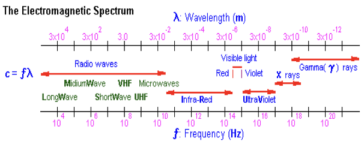
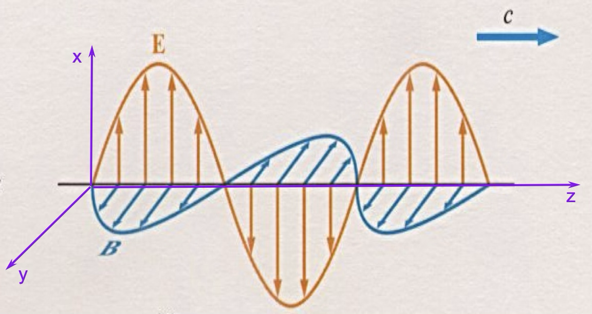
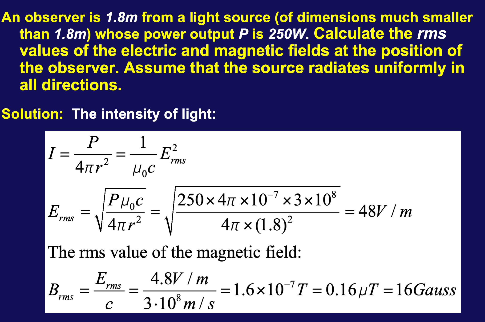
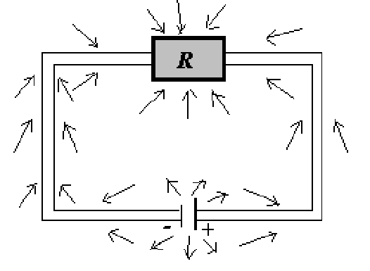
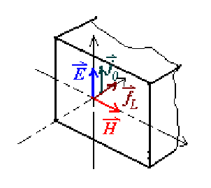

# 电磁波与光波

## 电磁波谱

## 概念

- 可见光(visible light):$\lambda = 4000A - 7000A$

- 红外线(infrared):$\lambda = 0.7 \mu m - 1 mm$
  - 用于夜视镜、辐射温度计、红外灯

- 微波(microwave):$\lambda = 1mm - 1m$
- 无线电波(radio waves):$\lambda > 1m$
  - 中波(MW):$\lambda = 3km - 50m$
  - 短波(SW):$\lambda = 50m - 10m$
  - 超短波(extra-SW):$\lambda < 1m$

- 紫外线(ultraviolet):$\lambda = 1nm - 400 nm$
- X-rays:$\lambda = 0.01 - 10nm$

- gamma rays:$\lambda < 10 pm$

## 电磁波的产生与发射

我们可以从麦克斯韦方程组推导出电磁波的性质

积分形式:

$$
\iint \vec{E} \cdot d\vec{A} = \frac{q_{0}}{\epsilon_{0}}
$$

$$
\iint \vec{B} \cdot d \vec{A} = 0
$$

$$
\oint \vec{E} \cdot d \vec{l} = - \iint \frac{\partial \vec{B}}{\partial t} \cdot d \vec{A}
$$

$$
\oint \vec{H} \cdot d \vec{l} = i_{0} + \iint \frac{\partial \vec{D}}{\partial t} \cdot d \vec{A}
$$

微分形式(自由空间:$\rho_{0} =0,\vec{J_{0}} = 0$):

$$
\nabla \cdot \vec{E} = 0
$$

$$
\nabla \cdot \vec{B} = - \frac{\partial \vec{B}}{\partial t}  = - \kappa_{m} \mu_{0} \frac{\partial \vec{H}}{\partial t}
$$

$$
\nabla \times \vec{H} = 0
$$

$$
\nabla \times \vec{H} = \kappa_{e} \epsilon_{0} \frac{\partial \vec{E}}{\partial t}
$$

分量形式(把上式中的$\nabla$展开,得到如下式子):

$$
\frac{\partial E_{x}}{\partial x} + \frac{\partial E_{y}}{\partial y} + \frac{\partial E_{z}}{\partial z} =0
$$

$$
\begin{vmatrix}
\widehat{i} && \widehat{j} && \widehat{k} \\
\frac{\partial}{\partial x} && \frac{\partial}{\partial y} && \frac{\partial}{\partial z} \\
\vec{E_{x}} && \vec{E_{y}} && \vec{E_{z}}
\end{vmatrix}
 = -\kappa_{m} \mu_{0}(\frac{\partial \vec{H_{x}}}{\partial t} \widehat{i} + \frac{\partial \vec{H_{y}}}{\partial t} \widehat{j} + \frac{\partial \vec{H_{z}}}{\partial t} \widehat{k})
$$

$$
\frac{\partial \vec{H_{x}}}{\partial x} +  \frac{\partial \vec{H_{y}}}{\partial y} +  \frac{\partial \vec{H_{z}}}{\partial z} = 0
$$

$$
\begin{vmatrix}
\widehat{i} && \widehat{j} && \widehat{k} \\
\frac{\partial}{\partial x} && \frac{\partial}{\partial y} && \frac{\partial}{\partial z} \\
\vec{H_{x}} && \vec{H_{y}} && \vec{H_{z}}
\end{vmatrix}
 = -\kappa_{m} \mu_{0}(\frac{\partial \vec{E_{x}}}{\partial t} \widehat{i} + \frac{\partial \vec{E_{y}}}{\partial t} \widehat{j} + \frac{\partial \vec{E_{z}}}{\partial t} \widehat{k})\notag
$$

## 平面波

首先假设单一波源,在很远的自由空间中,在球面上取一弧面,可以近似为平面波;以其传播方向为$z$轴,电场和磁场分别为$x$和$y$轴.

然后将上边的式子展开,可以得到以下八个方程

$$
\frac{\partial E_{x}}{\partial x} + \frac{\partial E_{y}}{\partial y} + \frac{\partial E_{z}}{\partial z} = 0 \tag{1} \\
$$

$$
\frac{\partial E_{z}}{\partial y} - \frac{\partial E_{y}}{\partial z} = -\kappa_{m} \mu_{0} \frac{\partial H_{x}}{\partial t} \tag{2-1}
$$

$$
\frac{\partial E_{x}}{\partial z} - \frac{\partial E_{z}}{\partial x} = -\kappa_{m} \mu_{0} \frac{\partial H_{y}}{\partial t} \tag{2-2}
$$

$$
\frac{\partial E_{y}}{\partial x} - \frac{\partial E_{x}}{\partial y} = -\kappa_{m} \mu_{0} \frac{\partial H_{z}}{\partial t} \tag{2-3}
$$

$$
\frac{\partial H_{x}}{\partial x} + \frac{\partial H_{y}}{\partial y} + \frac{\partial H_{z}}{\partial z} =0 \tag{3}
$$

$$
\frac{\partial H_{z}}{\partial y} - \frac{\partial H_{y}}{\partial z} =\kappa_{e} \epsilon_{0} \frac{\partial E_{x}}{\partial t} \tag{4-1}
$$

$$
\frac{\partial H_{x}}{\partial z} - \frac{\partial H_{z}}{\partial x} =\kappa_{e} \epsilon_{0} \frac{\partial E_{y}}{\partial t} \tag{4-2}
$$

$$
\frac{\partial H_{y}}{\partial x} - \frac{\partial H_{x}}{\partial y} =\kappa_{e} \epsilon_{0} \frac{\partial E_{z}}{\partial t} \tag{4-3}
$$

### 横波

首先,横波在x和y方向的电场强度和磁场强度都是一样的,不会发生变化,所以

$$
\frac{\partial E_{x}}{\partial x} = \frac{\partial E_{y}}{\partial y} = \frac{\partial H_{x}}{\partial x} = \frac{\partial H_{y}}{\partial y} = 0 \notag
$$

则由$(1)$式,我们有

$$
\frac{\partial E_{x}}{\partial x} = 0 \notag
$$

由$(2-3)$式,有

$$
\frac{\partial H_{z}}{\partial t} = 0 \notag
$$

同样地,由$(3)$式可得

$$
\frac{\partial H_{z}}{\partial z} = 0 \notag
$$

由$(4-3)$,有

$$
\frac{\partial E_{z}}{\partial t} = 0 \notag
$$

所以电场和磁场在$z$轴的分量与时间和z轴都无关,可以设为$constant$

$$
E \perp k ,H \perp k
\notag
$$

---

### 电场垂直磁场

运用$E_{z} = H_{z} = 0$,我们 有

$(2-1)$式

$$
\frac{\partial E_{y}}{\partial z} =\kappa_{m} \mu_{0} \frac{\partial H_{x}}{\partial t} \tag{2-1} \notag
$$

$(2-2')$式

$$
\frac{\partial E_{x}}{\partial z} =-\kappa_{m} \mu_{0} \frac{\partial H_{y}}{\partial t} \tag{2-2'}
$$

$(4-1')$式

$$
\frac{\partial H_{y}}{\partial z} =-\kappa_{e} \epsilon_{0} \frac{\partial E_{x}}{\partial t} \tag{4-1'}
$$

$(4-2)$式

$$
\frac{\partial H_{x}}{\partial z} =\kappa_{e} \epsilon_{0} \frac{\partial E_{y}}{\partial t} \notag
$$

上边四个式子只包含$E_{y},E_{x},H_{y},H_{X}$,说明电场,磁场只在$x,y$方向有分量.

由于$x,y$的方向是任意的,那么我们取$x$的方向为电场方向,就有

$$
\frac{\partial H_{x}}{\partial z} = 0 = \frac{\partial H_{x}}{\partial t}
\notag
$$

所以磁场强度方向与电场强度方向垂直,我们就证明了$\vec{E} \perp \vec{H}$

!!! note
    其实就是把$E_{y} = 0$带入$(2-1)$和$(4-2)$,就得到的上边的结论.

---

### 波动方程

>麦克斯韦:原来光就是电磁波

对$(2-2')$式同时对$t$求偏导

$$
\frac{\partial^{2} E_{x}}{\partial z^{2}} = - \kappa_{m} \mu_{0}\frac{\partial}{\partial t}\frac{\partial H_{y}}{\partial z} = \kappa_{m}\mu_{0}K_{e}\epsilon_{0} \frac{\partial^{2} E_{x}}{\partial t^{2}} \notag
$$

同理对$(4-1')$操作,得到如下方程

$$
\frac{\partial^{2} E_{x}}{\partial z^{2}} - \kappa_{e}\mu_{0}K_{m}\epsilon_{0} \frac{\partial^{2} E_{x}}{\partial t^{2}} = 0 \notag
$$

$$
\frac{\partial^{2} H_{y}}{\partial z^{2}} - \kappa_{e}\mu_{0}K_{m}\epsilon_{0} \frac{\partial^{2} H_{y}}{\partial t^{2}} = 0 \notag
$$

猜根,有:

$$
\left\{
\begin{matrix}
E_{x} = E_{x0}e^{i(\omega t - kz)} \\
H_{y} = H_{y0}e^{i(\omega t - kz)}
\end{matrix}
\right.
\notag
$$

$\omega = \frac{2\pi}{T}$是角频率,$k = \frac{2\pi}{\lambda}$是波矢,也叫波数

带回方程,得到

$$
k^{2} = \kappa_{e}\epsilon_{0}\kappa_m\mu_0\omega^2 
\Rightarrow
k = \omega\sqrt{\kappa_e\epsilon_0\kappa_m\mu_0}
\notag
$$

又因为

$$
v = \frac{\omega}{k} = \frac{1}{\sqrt{\kappa_e\epsilon_0\kappa_m\mu_0}} \notag
$$

!!! note
    而真空中,磁导率$\kappa_m$和介电常数$\kappa_e$都为1,所以代入计算得到$v = c = 3.0 \times 10^8 m/s$,我们就计算出了光速

    我们定义$\sqrt{\kappa_e\kappa_m} = n$,就是折射率,所以可以推导出光学中的

    $$
    v= \frac{c}{n} \notag
    $$

### 电场和磁场

由$(2-2')$式,将我们猜根得到的$E_{x},H_{y}$代入,得到如下式子

$$
\begin{align*}
-ikE_{x0}e^{i(\omega t - kx)} &= -\kappa_m\mu_0i\omega H_{y0}e^{i(\omega t - kx)} \\
kE_{x0} &= \kappa_m\mu_0\omega H_{y0} \\
E_{x0} &= \kappa_m\mu_0\frac{\omega}{k}H_{y0} = \kappa_m\mu_0v H_{y0} \\
&= \kappa_m\mu_0\frac{1}{\sqrt{\kappa_e\epsilon_0\kappa_m\mu_0}}H_{y0} \\
\sqrt{\kappa_e\epsilon_0}E_{x0} &= \sqrt{\kappa_m\mu_0}H_{y0} \\
\sqrt{\kappa_e\epsilon_0}E_{x0}e^{i\phi_E} &= \sqrt{\kappa_m\mu_0}H_{y0}e^{i\phi_H}
\end{align*}
\notag
$$

通过上式我们可得以下两个方程

$$
\left\{
\begin{matrix}
\sqrt{\kappa_e\epsilon_0}E_{0} = \sqrt{\kappa_m\mu_0}H_{0} (振幅相等) \\
\phi_{E} = \phi_{H} (相位相同)
\end{matrix}
\right.
\notag
$$

真空中,$\kappa_e = \kappa_m = 1$

所以

$$
\sqrt{\epsilon_0}E_{0} = \sqrt{\mu_0}H_0 \\
\Rightarrow E_{0} = \frac{\mu_0H_0}{\sqrt{\epsilon_0\mu_0}} = cB_{0}(c为光速) \notag
$$

!!! note "电场强度与磁感应强度"
    我们发现$E_{0} = cB_{0}$,电场强度和磁感应强度之间只差了一个常数

## 电磁波的能流密度和动量

单位体积内电磁波的能量包括电场和磁场两部分

- 电场能量:$U_E = \frac{1}{2}\epsilon_0E^2$
- 磁场能量:$U_B = \frac{1}{2}\frac{B^2}{\mu_0}$

则单位体积内电磁波的能量:

$$
U = \iiint (\frac{1}{2}\epsilon_0E^2 + \frac{1}{2}\frac{B^2}{\mu_0})dv \notag
$$

更一般的,我们知道$\vec{D} = \kappa_e\epsilon_0\vec{E},\vec{B} = \kappa_m\mu_0\vec{H}$,那么

$$
\begin{align*}
U = U_E + U_B &= \iiint(\frac{1}{2}\vec{D}\cdot \vec{E} + \frac{1}{2}\vec{B}\cdot\vec{H})dv \\
\frac{dU}{dt} &= \frac{d}{dt}\iiint(\frac{1}{2}\vec{D}\cdot \vec{E} + \frac{1}{2}\vec{B}\cdot\vec{H})dv \\
&= \frac{1}{2}\iiint \frac{\partial}{\partial t}(\vec{D}\cdot\vec{E} + \vec{B} \cdot\vec{H})dv
\end{align*}
$$

对积分内部展开:

$$
\begin{align*}
\frac{\partial}{\partial t}(\vec{D}\cdot\vec{E} + \vec{B} \cdot\vec{H}) &= \kappa_e\epsilon_0\frac{\partial}{\partial t}(\vec{E} \cdot \vec{E}) + \kappa_m\mu_0\frac{\partial}{\partial t}(\vec{H}\cdot\vec{H}) \notag \\
&= 2\kappa_e\epsilon_0\vec{E}\cdot\frac{\partial \vec{E}}{\partial t} + 2\kappa_m\mu_0\vec{H}\cdot\frac{\partial \vec{H}}{\partial t} \\
&= 2\vec{E}\cdot \frac{\partial \vec{D}}{\partial t} + 2\vec{H} \cdot \frac{\partial \vec{B}}{\partial t}
\end{align*}
$$

在麦克斯韦方程中:

$$
\frac{\partial \vec{D}}{\partial t} = \nabla \times \vec{H} - \vec{J_{0}}
$$

$$
\frac{\partial \vec{B}}{\partial t} = -\nabla \times \vec{E} \notag
$$

代入上式可得:

$$
\begin{align*}
&= 2\vec{E} \cdot (\nabla \times \vec{H} - \vec{J_{0}}) - 2\vec{H} \cdot (\nabla \times \vec{E}) \\
&= 2[\vec{E} \cdot (\nabla \times \vec{H}) - \vec{H} \cdot (\nabla \times \vec{E}) - \vec{J_{0}} \cdot \vec{E}] \\
&= -2\nabla \cdot (\vec{E} \times \vec{H}) - 2\vec{J_{0}}\cdot \vec{E} \notag
\end{align*}
$$

最后运用高斯定理化简:

$$
\begin{align*}
\frac{dU}{dt} &= - \iiint\nabla \cdot (\vec{E} \times \vec{H})dv - \iiint (J_{0} \cdot \vec{E})dv \notag \\
&= -\iint(\vec{E} \times \vec{H})\cdot dA - \iiint (J_{0} \cdot \vec{E})dv
\end{align*}
$$

我们现在关注第二项到底是什么意思

在欧姆定律中,我们有以下公式,$\vec{E}$为电场,$\vec{K}$为非静电力

$$
\vec{J_{0}} = \sigma(\vec{E} + \vec{K}) \notag \\
\Rightarrow \vec{E} = \frac{1}{\sigma}\vec{J_{0}} - \vec{K} = \rho J_{0} - \vec{K}
$$

把这个积分放到均匀的圆筒里边,那么我们对$v$积分其实就是乘以$\Delta A \cdot \Delta l$,从而进行如下变换

$$
\begin{align*}
\iiint(J_{0} \cdot \vec{E})dv &= (J_{0} \cdot \vec{E})\Delta A \cdot \Delta l \\
&= J_{0} \cdot (\rho J_{0} - \vec{K})\Delta A \cdot \Delta l \\
&= \rho J_{0}^{2}\Delta A - J_{0}\cdot \vec{K}\Delta A \cdot \Delta l \\
&= \rho \frac{\Delta l}{\Delta A}(J_{0}\Delta A)^{2} - (J_{0}\Delta A)(\vec{K}\cdot \Delta l) \\
&= Ri_{0}^{2} - I_{0}\Delta \epsilon(\Delta \epsilon是电动势) \\
&= Q - P
\end{align*}
\notag
$$

所以我们记$\vec{S} = \vec{E} \times \vec{H}$,为$Poynting \ Vertor(玻印廷矢量)$,那么

$$
\frac{dU}{dt} = - \iint \vec{S}\cdot d\vec{A} - Q + P \notag
$$

!!! note "理解上式"
    $\frac{dU}{dt}$是单位时间内电场能量与磁场能量之和的变化;
    $- \iint \vec{S}\cdot d\vec{A}$是通过表面向外辐射的能量;
    $Q$是产生的热量

### Poynting Vertor

定义单位时间,单位面积内的能量流动

$$
\vec{S} = \vec{E} \times \vec{H} = \frac{\vec{E} \times \vec{B}}{\mu_0} = \frac{\vec{E}^{2}}{{\mu_0}c} \notag
$$

定义$Z_{0} = \mu_0c = 377 \Omega$

从而$S = \frac{E^2}{377\Omega}$

!!! tip "电磁波的强度"
    电磁波的强度$I$实际上就是$S$的平均值

    $$
    I = \langle S\rangle = \frac{\langle E^2\rangle}{Z_0} = \frac{E_{max}^2}{377\Omega}\langle sin^2(kz-wt)\rangle = \frac{1}{2}\frac{E_{max}^2}{377\Omega}
    $$

!!! note "电场能量密度和磁场能量密度的关系"
    由于$\mu_{E} = \frac{1}{2}\epsilon_{0}E^2,\mu_B = \frac{1}{2}\frac{B^2}{\mu_0}$

    而$B = \frac{E}{c}$,那么$\mu_B = \frac{1}{2}\frac{E^2}{C^2\mu_0} = \frac{1}{2}\epsilon_0E^2 = \mu_E$ 

    所以二者能量各占一半

    电磁波的能量密度可以表示为:$\mu = \mu_E + \mu_B = \epsilon_0E^2$
    
!!! note "电磁波的强度"
    $$
    I = c\langle\mu\rangle = c\epsilon_0\langle E^2\rangle = c\epsilon_0\frac{E_{max}^2}{2} = \frac{1}{2}\frac{E_{max}^{2}}{\mu_0c} = \frac{E_{max}^2}{2 \cdot 377 \Omega} = \frac{E_{rms}^2}{377\Omega}
    $$

### 电路中的能量传输

如上图所示电路,考虑与电源正极相连的导线,导线内部存在一个电场,那么由于$\oint \vec{E} \cdot d\vec{l} = -\frac{d\Phi_B}{dt} = 0$,导体外部一定存在一个方向相同的电场.

再加上一个垂直导线的电场,根据$\vec{S} = \vec{E} \times \vec{H}$,我们可以得到能量流动的方向,一方面流向电阻,另一方面被导线消耗.

与电源负极相连的导线也是类似的

### 电磁波的动量

假设一个有一个力 $\Delta \vec{F}$,这个力会让电荷做功,即$\Delta W = \Delta F \cdot \Delta l$;而这部分功就是这个物体吸收的净能量;

$$
\Delta \vec{F} \cdot c \Delta t = (\vec{S_{in}} - \vec{S_{out}}) \cdot \Delta A \Delta t \notag
$$

故

$$
\Delta \vec{F} = \frac{1}{c}(\vec{S_{in}} - \vec{S_{out}}) \cdot \Delta A \notag
$$

**矢量减**

#### 光压

单位面积上的力

$$
\vec{P} = \frac{1}{c}(\vec{S_{in}} - \vec{S_{out}}) \notag
$$

#### 动量密度

单位体积内的动量

$$
\Delta g = \frac{F \cdot \Delta t}{\Delta Ac\Delta t} = \frac{F}{c\Delta A} = \frac{1}{c^2}(\vec{S_{in}} - \vec{S_{out}}) \notag
$$

!!! note "动量密度"
    $g_{in} = \frac{1}{c^2}\vec{S_{in}}$为入射光的动量密度,$g_{out} = \frac{1}{c^2}\vec{S_{out}}$为反射光的动量密度

!!! tip "光压"
    对于白体,$S_{in} = S_{out}$,故$g_{in} = g_{out}$

    $$
    P = \frac{2}{c}\vec{S_{in}} \notag
    $$

    对于黑体,$S_{out} = 0$,故$g_{in} = \frac{1}{c^2}\vec{S_{in}}$
    
    $$
    P = \frac{1}{c}\vec{S_{in}}\notag
    $$