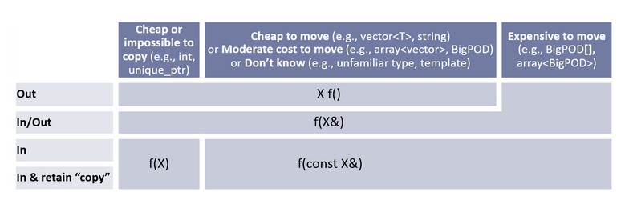

## Challenge Quiz

1. ```auto``` makes your program slower,so you should use it sparingly.
: **FALSE**.```auto``` is resolved at compile-time, but your program at run-time is the same speed.
2. In ```auto[i,s] = make_pair(3,"hi")```,the compile will deduce that s is a ```std::string```.
: **FALSE**.A string literal is a C-string (```const char*```),and ```auto``` will deduce s is a C-string.
3. A (Stanford) vertor behaves like a tuple where all the members have the same type.
: **FALSE**.A vector is a dynamic array, but a tuple has a fixed size.
4. Structured binding unpacks the members of a struct in the order the members were declared in the struct declaration.
: **TRUE**.
5. Structured binding can unpack individual elements of a Stanford Vector(or std::vector).
: **FALSE**.Related to question-3.You can only know the number of elements of a vector at run-time.
6. The code ```auto i;``` compiles.
: **FALSE**.Auto does not allow uninitialized variables.

## Size_t

```cpp
string str = "hello World!";
for (int i = 0;i < str.size(); ++i) {
    cout << str[i] << endl;
}
```

When we run this code, we probably get the following warning: **comparison of integer expressions of different signedness: 'int' and 'std::basic_string<char>::size_type' {aka 'unsigned long'}**

The warning is because `str.size()` returns a `size_t` which is an unsigned integer type while `i` is a signed integer type.We cannot compare signed and unsigned integers directly.

So what we should do is to change the type of `i` to `size_t`:

```cpp
string str = "hello World!";
for (size_t i = 0;i < str.size(); ++i) {
    cout << str[i] << endl;
}
```

## Topic 1:uniform initialization
Typically,we have many ways to initialize a variable in C++:

```cpp
std::vector<string> default_init; // default initialization
std::vector<string> value_init{}; // value initialization
std::vector<string> direct_init{3,"init"}; // direct initialization
std::vector<string> copy_init = {3,"init"}; // copy initialization
std::vector<string> list_init{"1","2","3"}; // list initialization
std::vector<string> aggr_init = {"1","2","3"}; // aggregate initialization
```

In daily programming, we usually use 1,3 and 5 to initialize a variable.

!!! note "initialization"
    上边的例子可能看起来不太直观,不容易理解.以下是```C++ Pirmer```中对```vector```初始化的解读.

    |       ```vector<T> v1```       | ```v1```是一个空```vector```,它潜在的元素是```T```类型的,执行默认初始化 |
    | :----------------------------: | :----------------------------------------------------------: |
    |     ```vector<T> v2(v1)```     |               v2中包含有```v1```所有元素的副本               |
    |    ```vector<T> v2 = v1```     |  等价于```v2(v1)```,```v2```中包含有```v1```所有元素的副本   |
    |   ```vector<T> v3(n,val)```    | ```v3```包含了```n```个重复的元素,每个元素的值都是```val```  |
    |     ```vector<T> v4(n)```      |      ```v4```包含了```n```个重复地执行了值初始化的对象       |
    |  ```vector<T> v5{a,b,c …}```   |  ```v5```包含了初始值个数的元素,每个元素被赋予相应的初始值   |
    | ```vector<T> v5 = {a,b,c …}``` |                   等价于```v5{a,b,c …}```                    |

    注意区分"**括号()**"和"**花括号{}**",括号代表有```n```个同样的元素,而花括号代表对```n```个元素依次赋值.

??? exercise
    Write a function that shifts all Courses forward by one hour.

    === "Question"

        ```cpp
        struct Time {
            int hour;
            int minute;
        };

        struct Course {
            string code;
            pair<Time,Time> time;
            vector<string> instructors;
        };

        void shift<vector<Course>& courses> {

        }
        ```

    === "Answer"

        ```cpp
        struct Time {
            int hour;
            int minute;
        };

        struct Course {
            string code;
            pair<Time,Time> time;
            vector<string> instructors;
        };

        void shift<vector<Course>& courses> {
            for (auto course : courses) {
                course.time.first.hour += 1;
                course.time.second.hour += 1;
            }
        }
        ```

## Topic 2:reference

Consider the following code:

```cpp
vector<int> original{1,2};
vector<int> copy = original;
vector<int>& lref = original;

original.push_back(3);
copy.push_back(4);
lref.push_back(5);
```

After running this code, we will find that ```original(lref) = {1,2,3,5}``` and ```copy = {1,2,4}```.

If we do the following:

```cpp
vector<int> original{1,2};
vector<int> copy = original;
vector<int>& lref = original;

original.push_back(3);
copy.push_back(4);
lref.push_back(5);

lref = copy;
copy.push_back(6);
lref.push_back(7);
```

What we do is to assign ```copy``` to ```lref```, so ```lref``` will be the same as ```copy```.After running this code, we will find that ```original(lref) = {1,2,4,7}``` and ```copy = {1,2,4,6}``.

One thing to note is that a const variable cannot be modified after construction. For example:

```cpp
std::vector<int> vec{1,2,3};
const std::vector<int> c_vec{7,8};
std::vector<int>& lref = vec;
const std::vector<int>& c_lref = vec;

vec.push_back(4); // OK
c_vec.push_back(4); //BAD - c_vec is const
lref.push_back(5); // OK
c_lref.push_back(5); // BAD - c_lref is const
```

??? note "cout reference"
    When we use ```cout``` to print something, it will secretly call the ```ostream& operator<<(ostream& os, const string& rhs)``` function.You will notice that it's returning a reference to the ```ostream``` object.

    That's why we can chain multiple ```<<``` operators together.

We can also do the following:

```cpp
int& front(const std::vector<int>& vec) {
    return vec[0];
}

int main() {
    std::vector<int> vec{1,2,3};
    front(vec) = 4;
    std::cout << vec[0] << std::endl;
}
```

After running this code, we will find that ```vec = {4,2,3}```.In ```front``` function, we return a reference to the first element of the vector, so we can modify the first element of the vector in the ```main``` function.

## Topic 3:parameters and return 
在C++标准中,对函数的参数和返回类型有以下规定:

