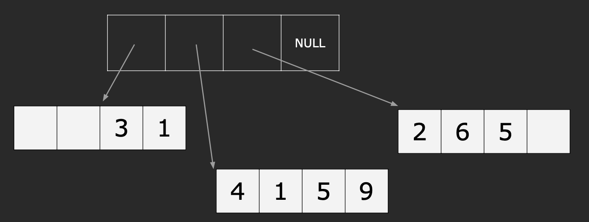
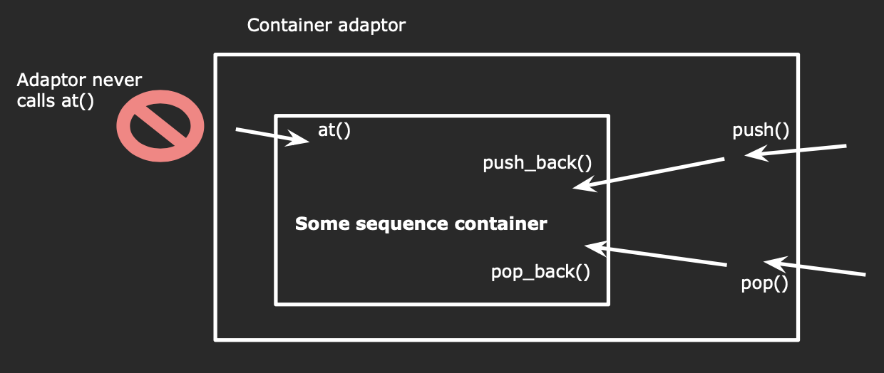

## Sequence Containers
Operator[] does not perform bounds checking.

```cpp
std::vector<int> v = {1, 2, 3}; // {1, 2, 3}
vec[2] = 4;                     // {1, 2, 4}
vec[3] = 5;                     // Undefined behavior
```

Vectors does not have a ```push_front``` function because it is very slow and expensive.

So if you really want fast insertion to the front,use ```std::deque```.

```cpp
std::deque<int> deq{5,6}; // {5, 6}
deq.push_front(4);        // {4, 5, 6}
deq.pop_back();           // {4, 5}
deq[1] = -2;              // {4, -2}
```

### How is a deque implemented?
There is no single specific implementation of a deque,but one common one might look like:



We have four blocks of memory,each of which can store 4 integers.

The earlier elements are stored in the first block,and the later elements are stored in the last block.

1. If we do ```push_back(3)```,we will add number 3 to the last place of the last block.Finally,we get:```{x,x,3,1},{4,1,5,9},{2,6,5,3},NULL```.(x means empty)
2. Then we do ```push_front(1)```,we will insert number 1 before the first element.Finally,we get:```{x,1,3,1},{4,1,5,9},{2,6,5,3},NULL```.
3. Then we do ```push_back(7)```,we find that the last block is full,so we need to allocate a new block and insert number 7.Finally,we get:```{x,1,3,1},{4,1,5,9},{2,6,5,3},{7,x,x,x}```.
4. Then we do ```push_front(8)``` and ```push_front(0)```.When inserting ```0```,we find that the first block is full,so we need to allocate a new block before the first block.Finally,we get:```{x,x,x,0},{8,1,3,1},{4,1,5,9},{2,6,5,3},{7,x,x,x}```.
5. Other operations are similar.

### When to use which Sequence Container?

```std::list``` is kind of like ```std::stack``` + ```std::queue```.

```std::list``` provides fast removal from the front and end but you can't access any elements in the middle.

|                                  |           ```std::vector```           |           ```std:deque```           |           ```std::list```            |
| :------------------------------: | :-----------------------------------: | :---------------------------------: | :----------------------------------: |
|          Indexed Access          | <font color = green>Super fast</font> |   <font color = blue>Fast</font>    |  <font color =red>Impossible</font>  |
|       Insert/remove front        |     <font color = red>Slow</font>     |   <font color = green>Fast</font>   |    <font color =green>Fast</font>    |
|        Insert/remove back        | <font color =green>Super Fast</font>  | <font color = blue>Very Fast</font> |   <font color = orange>Fast</font>   |
|        Ins/rem elsewhere         |     <font color = red>Slow</font>     |   <font color = blue>Fast</font>    | <font color = green>Very Fast</font> |
|              Memory              |    <font color = green>Low</font>     |    <font color = red>High</font>    |    <font color = red>High</font>     |
|         Splicing/Joining         |     <font color = red>Slow</font>     | <font color = red>Very Slow</font>  |   <font color = green>Fast</font>    |
| Stability(Iterators.concurrency) |     <font color = red>Poor</font>     | <font color = red>Very Poor</font>  |   <font color = green>Good</font>    |

!!! info "Summary"
    "vector is the type of sequence that should be used by <font color = orange>default</font>...deque is the data structure of choice when most insertions and deletions take place <font color = orange>at the beginning or at the end</font> of the sequence."
  
    - C++ ISO Standard(section 23.1.1.2).

### How is a vector implemented?
Internally,a vector consists of an fixed-size array,The array is automatically resized when necessary.

- size = number of elements in the vector.
- capacity = amount of space saved for the vector.

If possible,reserve the space for the vector **in advance**.

!!! example "Create a vector of the first 1,000,000 integers"

    === "practice 1"

        ```cpp
        std::vector<int> vec;

        for(size_t i = 0; i < 1000000l; +++i) {
            vec.push_back(i);
        }
        ```

    === "practice 2"

        ```cpp
        std::vector<int> vec;
        vec.reserve(1000000);

        for(size_t i = 0; i < 1000000l; +++i) {
            vec.push_back(i);
        }
        ```

In the first practice,we will have to resize the vector 1,000,000 times,which is very slow.But in the second practice,we only need to resize the vector once,which is much faster.

## Container Adaptors

### Stack
How to design a stack?

**Container adaptors** provide a different interface for sequence containers.You can choose what the underlying container is.



Through the adaptor,we can do ```push()``` and ```pop()``` to the stack.

```cpp
template <
    class T,
    class Container = std::deque<T>
> class stack;
```

We can see that in C++,the default container for stack is ```std::deque```.Because we need many insertions and deletions at the end and the beginning of the stack.

!!! note "Other containers"
    - ```std::stack<int> stack_d;``` : container = deque
    - ```std::stack<int, std::vector<int>> stack_v;``` : container = vector
    - ```std::stack<int, std::list<int>> stack_l;``` : container = list

### Priority Queue

```cpp
template<
    class T,
    class Container = std::vector<T>,
    class Compare = std::less<typename Container::value_type>
> Class priority_queue;
```

A priority queue is a container adaptor that provides constant time lookup of the largest(by default) element,at the expense of logarithmic insertion and extraction.

A user-provided Compare can be supplied to change the ordering, e.g. using ```std::greater<T>``` would cause the smallest element to appear as the ```top()```.

Working with a priority_queue is similar to managing a heap in some random access container,with the benefit of not being able to accidentally invalidate the heap.

### Set and Map
#### Set
Every element in a set has a unique key.We can search for an element through key with efficiency.

##### insertion

```cpp
set<int> s;
	s.insert(2);
	s.insert(1);
	s.insert(4);
	s.insert(5);
	s.insert(3);
	s.insert(5);
	s.insert(5);
	s.insert(5);
	s.insert(5);
	s.insert(5);
	for (auto e : s)
	{
		cout << e << " ";
	}
	cout << endl;
```

After running the code above,we will get:```1 2 3 4 5```.

From the output we can know that set will automatically remove the duplicate elements and sort the elements.

##### find

We have two ways to find an element in a set.

!!! example "find"

    === "First way"

        ```set<int>::iterator pos = s.find(3);```

    === "Second way"

        ```set<int>::iterator pos = find(s.begin(), s.end(), 3);```

The first way takes $O(\log n)$ time complexity beacuse it's based on binary search tree.
The second way takes $O(n)$ time complexity beacuse we need to go through the whole set.

##### Deletion

Directly use ```erease()``` function.

If the element is in the set,just delete it and if there is no such element,nothing will happen.

##### Swap

If we have two sets ```s1``` and ```s2```,we can use ```s1.swap(s2)``` to swap the two sets.

In fact,the ```swap``` function is just exchanging the pointers of the two sets,so it's very fast.

#### Map
Different from ```set```,```map``` has a key-value pair.```value``` can be the same but ```key``` must be unique.

Each element in a map is a pair.The first is called ```key``` and the second is called ```value```.

Map also automatically sorts the elements by key.

##### Insertion

We can use ```operator[]``` to find a value by key or insert a new key-value pair.

```cpp
dict["banana"];    // insert{"banana",\0}
dict["apple"] = 3; // insert{"apple",3}
dict["apple"] = 5; // update{"apple",5}
```