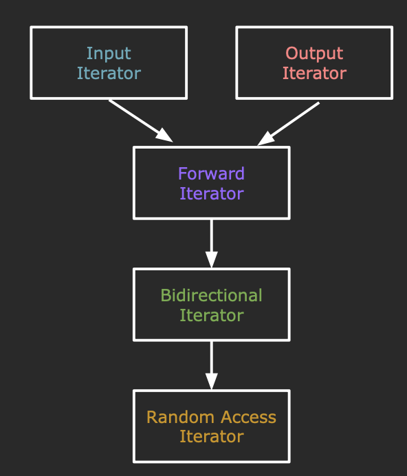
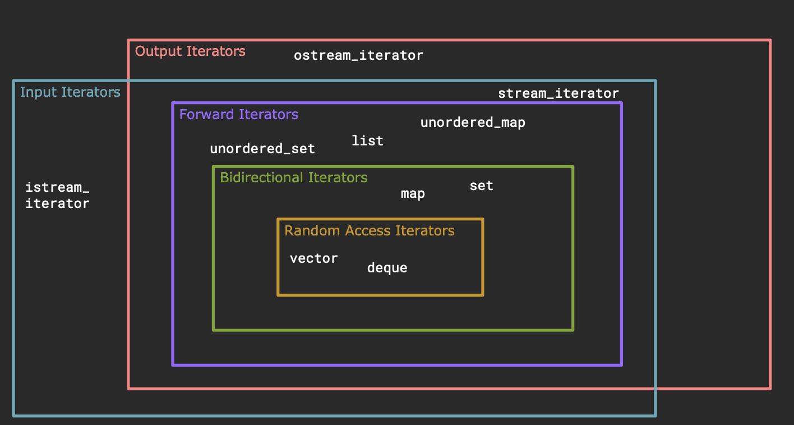
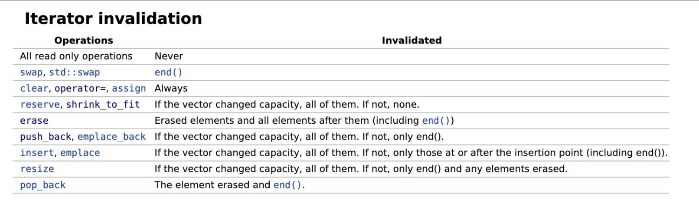

## Iterator Basics

Iterator knows where the next element is,even if the elements are stored haphazardly.

The STL iterators support the following operations:

- Copy constructible and assignable (```iter = another_iter```)
- Retrieve current element (```*iter```)
- Advance iterator (```++iter```)
- Equality comparable (```iter != container.end()```)

The STL containers support the following operations:

- ```begin()``` : iterator to the first element
- ```end()``` : iterator to **one past** the last element
  - So deferencing or advancing the end iterator is undefined behavior

!!! example 

    ```cpp
    std::map<int, int> map{{1, 2}, {3, 4}};
    auto iter = map.begin(); // *iter = {1, 2}
    ++iter; // *iter = {3, 4}
    auto iter2 = iter; // iter2 = iter = {3, 4}
    ++iter; // now (*iter) is undefined and iter2 = {3, 4}
    ```

!!! example "Print all elements the following collections"

    === "Question"

        ```cpp
        std::set<int> set{3, 1, 4, 1, 5, 9};
        //TODO

        std::map<int, int> map{{3, 2}, {1, 5} , {7, 7}, {4, 3}};
        //TODO
        ```

    === "Answer"

        ```cpp
        std::set<int> set{3, 1, 4, 1, 5, 9};
        for(const auto& elem : set) {
            std::cout << elem << std::endl;
        }

        std::map<int, int> map{{3, 2}, {1, 5} , {7, 7}, {4, 3}};
        for(const auto& elem : map) {
            std::cout << elem.first << " : " << elem.second << std::endl;
        }
        ```

## Iterator Categories

All iterators must support:
- Copy construction and assignment
- Equality comparable ( ```==``` and ```!=``` )
- Dereferencable (```*iter```) - either readable or writable (not necessarily both)
- Incrementable (```++iter```) - sign pass (previous iter invalidated after ++)



Supported Operations:
- Copy construct/assign (```=```) + destructible
- <font color = purple>Default constructible
- Equality comparable (```==``` and ```!=```)
- <font color = DodgerBlue> Dereferencable r-value (```auto e = *iter, ->```)</font>
- <font color = red> Dereferencable l-value (```*iter = e```) </font>
- Single-pass Incrementable (```++iter```)
- <font color = purple> Multi-pass Incrementable</font>
- <font color = green> Decrementable (```--iter```) </font>
- <font color = orange> Random access (```+,-,+=,-=,offset[]```) </font>
- <font color = orange> Inequality comparable (```<,>,<=,>=```) </font>



## Erase and Iterator Invalidation

Example : remove first element that begin with 'A'

```cpp
void removeOneA(std::vector<string>& vec) {
    for (auto iter = vec.begin(); iter != vec.end(); ++iter) {
        if(!(*iter).empty() && (*iter)[0] == 'A') {
            vec.erase(iter);
            return ;
        }
    }
}
```

How about remove all elements that begin with 'A'?

```cpp
void removeAllA(std::vector<string>& vec) {
    for (auto iter = vec.begin(); iter != vec.end(); ++iter) {
        if(!(*iter).empty() && (*iter)[0] == 'A') {
            vec.erase(iter);
        }
    }
}
```

### Iterator Invalidation
#### Vector
Documentation tells you which operations invalidate which iterators.



So that's why we say "```std::list``` is stable"

> Adding,removing and moving the elements within the list or across serval lists does not invalidate the iterators or references.An iterator is invalidated only when the corresponding element is deleted.

#### Return Value

Iterator following the last removed element(返回值是更新后的容器的被删除元素的后一个元素的迭代器).

- If pos refers to the last element, then the ```end()``` iterator is returned.
- If ```last == end()``` prior to removal, then the updated ```end()``` iterator is returned.
- If ```[first, last)``` is an empty range, then last is returned.

So after knowing the return value of ```erase()```, we may find that the code above is wrong.

Here we just provide a simple solution to remove all elements that begin with 'A'.

```cpp
void removeAllA(std::vector<string>& vec) {
    for(auto iter = vec.begin(); iter != vec.begin();) {
        if(!(*iter).empty() && (*iter)[0] == 'A') {
            iter = vec.erase(iter);
        } else {
            ++iter;
        }
    }
}
```

If we erased something,then we don't increment.Otherwise,we increment.