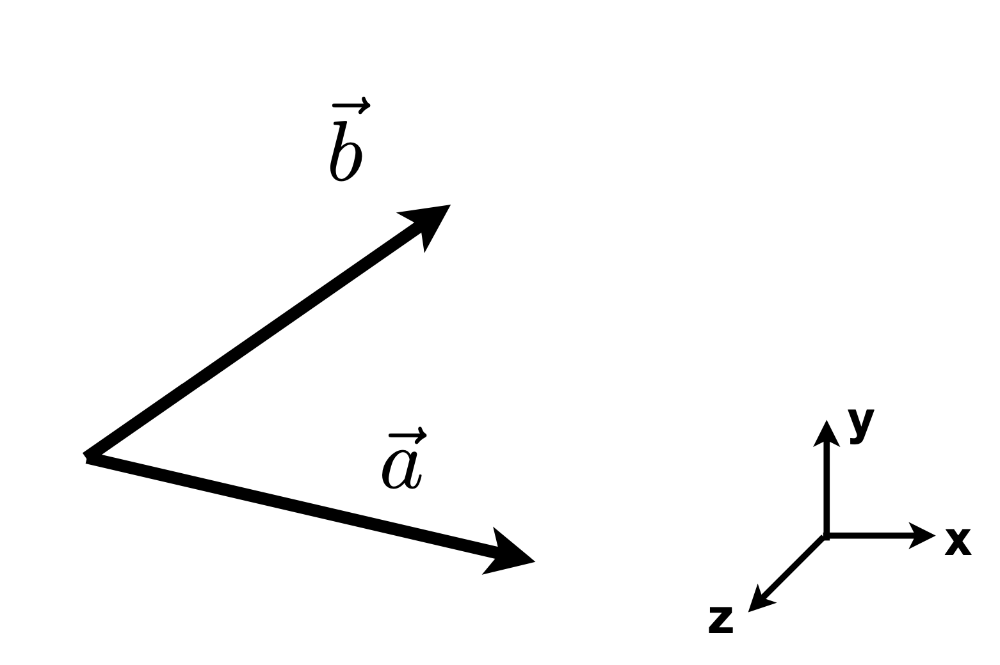
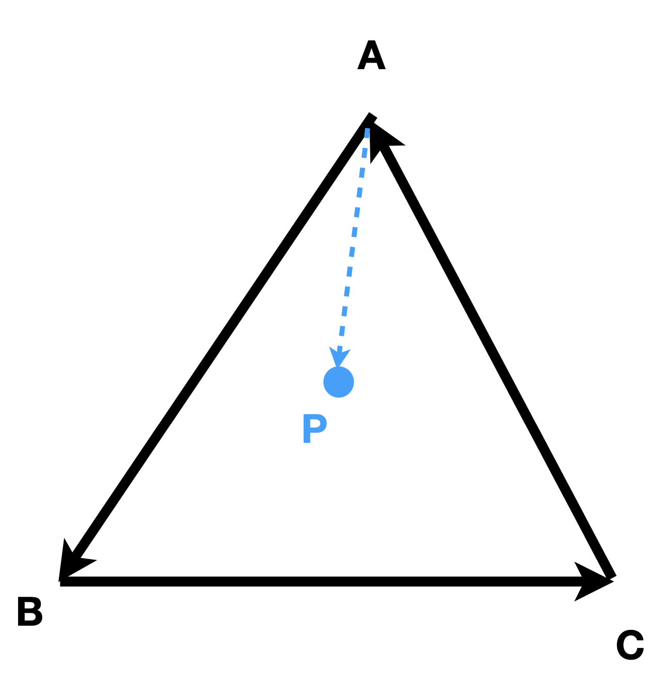

# **Preview of Linear Algebra**

A Swift and Brutal Introduction to Linear Algebra.

## **Vertors**

在图形学中，默认向量是列向量。

### **Dot Product**

$$
\vec{a} \cdot \vec{b} \ = \ ||\vec{a}|| \ ||\vec{b}|| \ cos(\theta)
$$

- Properties:
    - $\vec{a} \cdot \vec{b} = \vec{b} \cdot \vec{a}$
    - $\vec{a} \cdot (\vec{b} + \vec{c}) = \vec{a} \cdot \vec{b} + \vec{a} \cdot \vec{c}$
    - $(k \vec{a}) \cdot \vec{b} = k (\vec{a} \cdot \vec{b})$

点乘在图形学最大的作用就是找到两个向量之间的夹角。还可以找到一个向量在另一个向量上的投影。

投影算出来之后我们就可以把一个向量分解成两个向量的和，一个是在另一个向量上的投影，一个是垂直于另一个向量的向量。

$$
\vec{b_{\parallel}} = \vec{b} - \vec{b_{\perp}}
$$

还可以算两个向量在方向上有多么接近。我们通过计算两个单位向量的点乘，如果结果接近 1, 那么我们可以说这两个向量非常接近。

另一个应用是判断向量是否在同一方向上。如果两个向量的点乘大于0，那么这两个向量在同一方向上。

### **Cross Product**

$$
|| \vec{a} \times \vec{b}|| = ||\vec{a}|| \ ||\vec{b}|| \ sin(\theta) \ \vec{n}
$$

$$
\vec{a} \times \vec{b} = - \vec{b} \times \vec{a}
$$

计算出来的结果是一个向量，这个向量垂直于 $\vec{a}$ 和 $\vec{b}$。方向可以用右手定则判定。

!!! Note "右手定则"

    $$
    \vec{a} \times \vec{b}
    $$

    四指从 $\vec{a}$ 旋转到 $\vec{b}$，拇指指向的方向就是 $\vec{a} \times \vec{b}$ 的方向。

- Properties:
    - $\vec{a} \times (\vec{b} + \vec{c}) = \vec{a} \times \vec{b} + \vec{a} \times \vec{c}$
    - $(k \vec{a}) \times \vec{b} = k (\vec{a} \times \vec{b})$
    - $\vec{a} \times \vec{a} = \vec{0}$

假设 $\vec{a} = \begin{pmatrix} x_a \\ y_a \\ z_a \end{pmatrix}$, $\vec{b} = \begin{pmatrix} x_b \\ y_b \\ z_b \end{pmatrix}$, 那么

$$
\vec{a} \times \vec{b} = \begin{pmatrix} y_a z_b - z_a y_b \\ z_a x_b - x_a z_b \\ x_a y_b - y_a x_b \end{pmatrix} = \begin{pmatrix} 0 & -z_a & y_a \\ z_a & 0 & -x_a \\ -y_a & x_a & 0 \end{pmatrix} \begin{pmatrix} x_b \\ y_b \\ z_b \end{pmatrix}
$$

叉乘两个最大的作用：判断左和右，判断内与外。

- 判断左和右：如果想判断 $\vec{b}$ 在 $\vec{a}$ 的左边还是右边，就用 $\vec{a} \times \vec{b}$，如果结果是正的，那么 $\vec{b}$ 在 $\vec{a}$ 的左边，反之在右边。

<figure markdown="span">

<figcaption>判断左和右</figcaption>
</figure>

- 判断内与外：想判断 P 点在三角形 ABC 的内部还是外部，我们可以依次计算 $\vec{AB} \times \vec{AP}$, $\vec{BC} \times \vec{BP}$, $\vec{CA} \times \vec{CP}$，如果 P 点都在三条边的同一侧，那么这个点在三角形内部。

<figure markdown="span">

<figcaption>判断内与外</figcaption>
</figure>

### **Orthonormal Coordinate Frames**

定义右手直角坐标系的三个基向量 $\vec{u}, \vec{v}, \vec{w}$, 它们满足：

$$
||\vec{u}|| = ||\vec{v}|| = ||\vec{w}|| = 1
$$

$$
\vec{u} \cdot \vec{v} = \vec{v} \cdot \vec{w} = \vec{w} \cdot \vec{u} = 0
$$

$$
\vec{w} = \vec{u} \times \vec{v}
$$

那么任意一个向量都可以用这三个向量表示：

$$
\vec{p} = (\vec{p} \cdot \vec{u}) \vec{u} + (\vec{p} \cdot \vec{v}) \vec{v} + (\vec{p} \cdot \vec{w}) \vec{w}
$$

## **Matrices**

矩阵没有交换律，有结合律和分配律。

- (AB)C = A(BC)
- A(B + C) = AB + AC
- (A + B)C = AC + BC