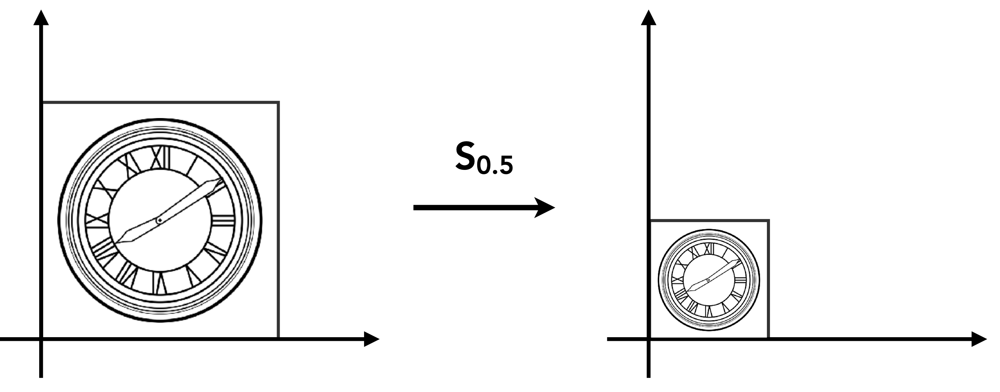
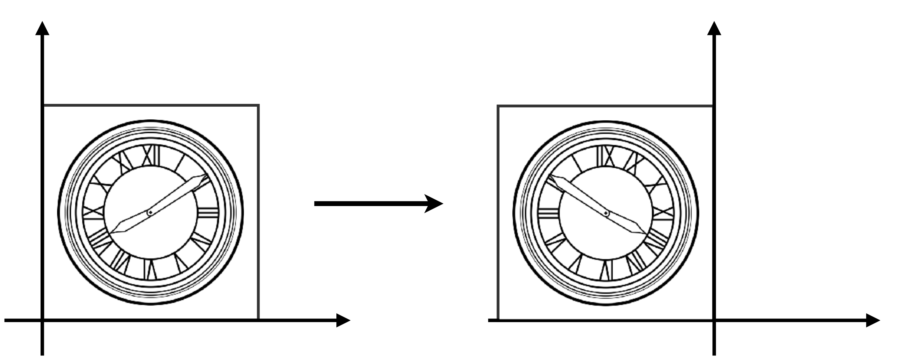
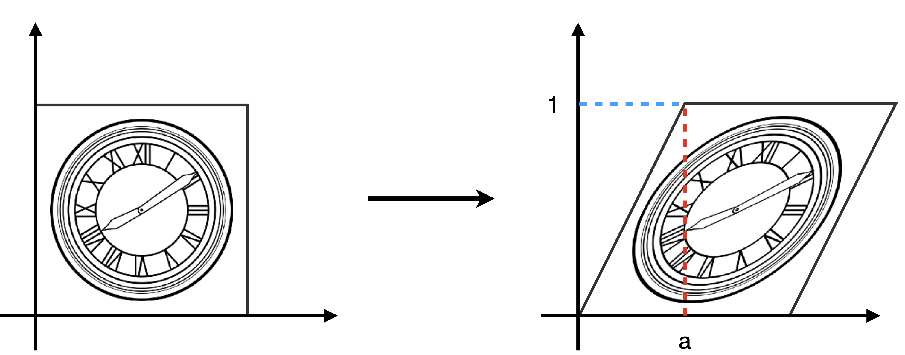
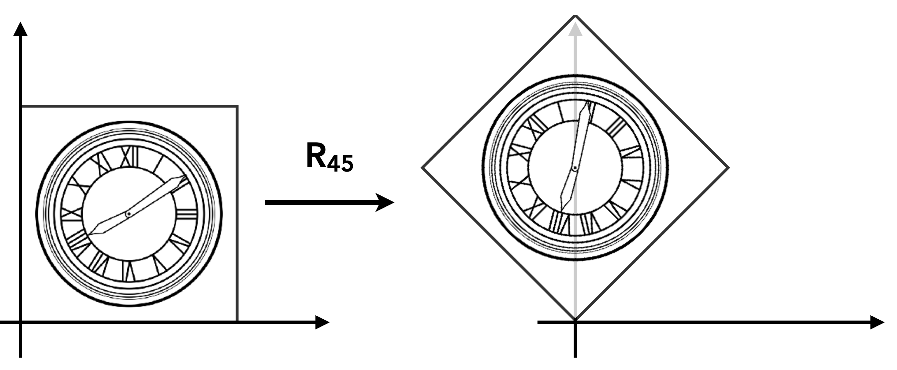
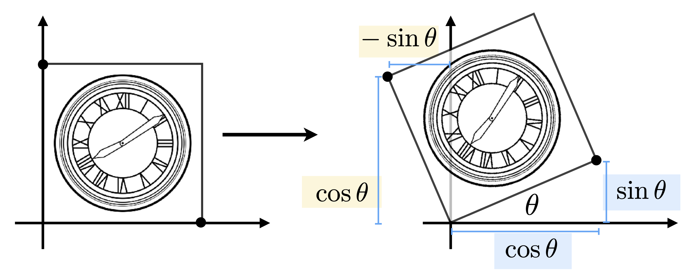
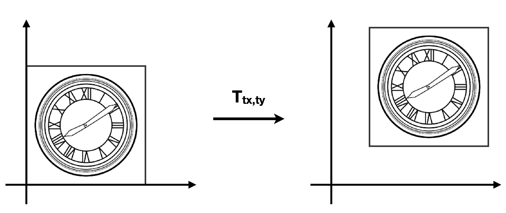
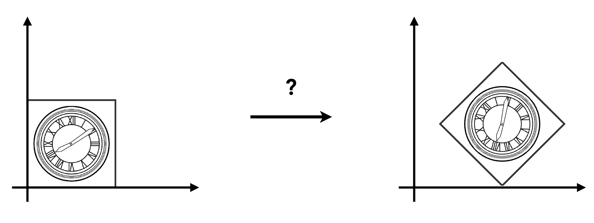
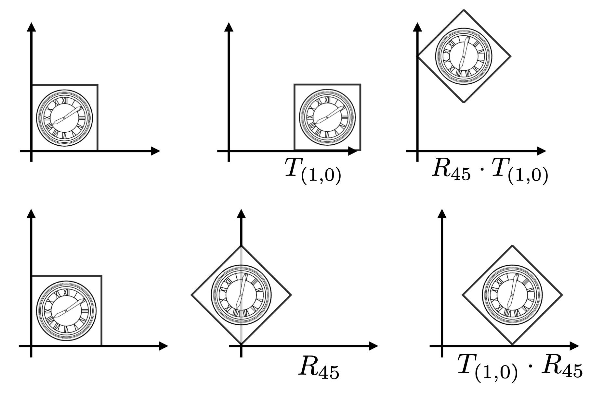
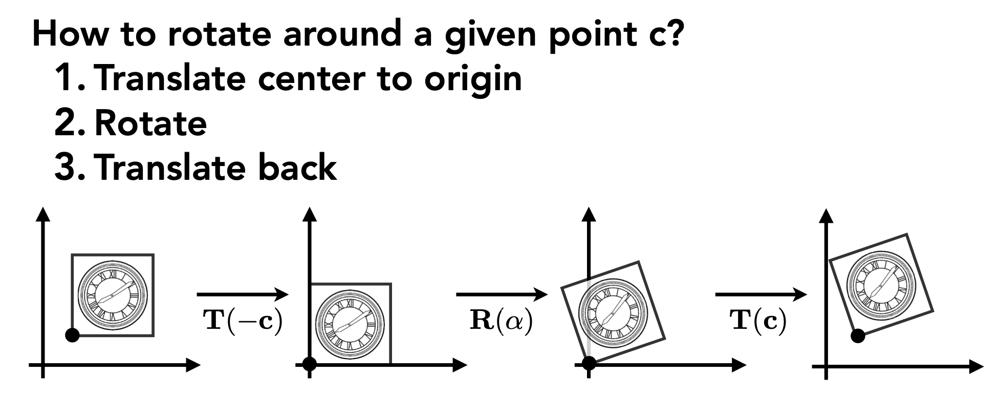
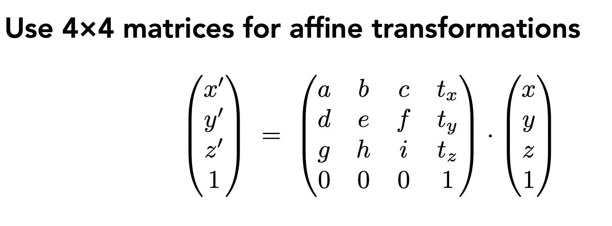

# **Transformation**

Outline:

- Why study transformation
- 2D transformations: rotation, scale, shear(旋转，缩放，切片)
- Homogeneous coordinates(齐次坐标)
- Composing transforms(组合变换)
- ~~3D transformations(3D 变换)~~

## **2D Transformations**

### **Scale**

对于一个图形的缩放，比如：

<figure markdown="span">
{:height="50%" width="50%"}
</figure>

我们最直观的想法就是每个点的坐标乘以一个系数：

$$
x^{\prime} = sx
$$

$$
y^{\prime} = sy
$$

写成矩阵形式：

$$
\begin{bmatrix} 
x^{\prime} \\ 
y^{\prime} 
\end{bmatrix} =
\begin{bmatrix} 
s & 0 \\ 
0 & s 
\end{bmatrix} 
\begin{bmatrix} x \\ 
y 
\end{bmatrix}
$$

这个矩阵就是一个缩放矩阵。

如果缩放不是均匀的，只需要改变对角线上的系数为 $s_x$ 和 $s_y$ 即可。

### **Reflection**

相对于 Y 轴的反射：

<figure markdown="span">
{:height="50%" width="50%"}
</figure>

$$
x^{\prime} = -x
$$

$$
y^{\prime} = y
$$

写成矩阵形式：

$$
\begin{bmatrix}
x^{\prime} \\
y^{\prime}
\end{bmatrix} =
\begin{bmatrix}
-1 & 0 \\
0 & 1
\end{bmatrix}
\begin{bmatrix}
x \\
y
\end{bmatrix}
$$

### **Shear(切变)**

<figure markdown="span">
{:height="50%" width="50%"}
</figure>

!!! Hint

    Horizontal shift is $0$ at $y \ = \ 0$

    Horizontal shift is $a$ at $y \ = \ 1$

    Vertical shift is always $0$(只有水平方向坐标发生变化，垂直方向坐标不变)

$$
\begin{bmatrix}
x^{\prime} \\
y^{\prime}
\end{bmatrix} =
\begin{bmatrix}
1 & a \\
0 & 1
\end{bmatrix}
\begin{bmatrix}
x \\
y
\end{bmatrix}
$$

### **Rotation**

<figure markdown="span">
{:height="50%" width="50%"}
</figure>

我们规定两件事：

1. 只要无特殊说明，我们都认为图像是绕着原点旋转的
2. 默认逆时针方向为正方向

我们尝试找到一个矩阵，能够表示一个点绕原点旋转 $\theta$ 角度后的坐标。

参考下面的图片：

<figure markdown="span">
{:height="50%" width="50%"}
</figure>

$$
R_{\theta} =
\begin{bmatrix}
\cos \theta & -\sin \theta \\
\sin \theta & \cos \theta
\end{bmatrix}
$$

!!! Note "如何快速推出这个矩阵？"

    假设矩阵是

    $$
    \begin{bmatrix}
    A & B \\
    C & D
    \end{bmatrix}
    $$

    我们知道所有的点经过旋转之后都是满足这个矩阵的，那么我们可以取 $(1, 0)$ 这个点，它经过旋转后的坐标是 $(\cos \theta, \sin \theta)$，所以我们可以得到：

    $$
    \begin{bmatrix}
    \cos \theta \\
    \sin \theta
    \end{bmatrix} =
    \begin{bmatrix}
    A & B \\
    C & D
    \end{bmatrix}
    \begin{bmatrix}
    1 \\
    0
    \end{bmatrix}
    $$

    从而得到 $A = \cos \theta$，$C = \sin \theta$

    同理取 $(0, 1)$ 这个点，可以得到 $B = -\sin \theta$，$D = \cos \theta$

以上几个例子我们可以得到一个共同点：变换之后的坐标可以写成一个矩阵乘以原坐标的矩阵

这种变换我们统称为线性变换。

## **Homogeneous Coordinates**

平移变换：

<figure markdown="span">
{:height="50%" width="50%"}
</figure>

$$
x^{\prime} = x + t_x
$$

$$
y^{\prime} = y + t_y
$$

它们不能写成之前的矩阵形式，因为这不是线性变换。

$$
\begin{bmatrix}
x^{\prime} \\
y^{\prime}
\end{bmatrix} =
\begin{bmatrix}
a & b \\
c & d
\end{bmatrix}
\begin{bmatrix}
x \\
y
\end{bmatrix} +
\begin{bmatrix}
t_x \\
t_y
\end{bmatrix}
$$

但是我们不希望把平移当作特殊情况来看待，我们希望所有的变换都可以写成矩阵相乘的形式。

我们可以通过引入齐次坐标来解决这个问题，所谓齐次坐标就是用 $(n+1)$ 维的向量来表示 $n$ 维的点。

对于一个点或者一个向量，我们可以增加一个维度

$$
\mathrm{2D point} = (x, y, 1)^{T}
$$

$$
\mathrm{2D vector} = (x, y, 0)^{T}
$$

那么平移变换就可以写成：

$$
\begin{bmatrix}
x^{\prime} \\
y^{\prime} \\
w^{\prime}
\end{bmatrix} =
\begin{bmatrix}
1 & 0 & t_x \\
0 & 1 & t_y \\
0 & 0 & 1
\end{bmatrix}
\begin{bmatrix}
x \\
y \\
1
\end{bmatrix} = 
\begin{bmatrix}
x + t_x \\
y + t_y \\
1
\end{bmatrix}
$$

!!! Note

    - vector + vector = vector
    - point - point = vector
    - point + vector = point(点朝着向量方向移动)
    - point + point = 中点

    在齐次坐标系中，对于任意 $w\neq 0$ 的点 $(x, y, w)$，我们把他写成 $(x/w, y/w, 1)$, 用来表示二维空间中 $(x/w, y/w)$ 这个点。

    所以点 $(x_1, y_1, 1) + (x_2, y_2, 1) \ = \ (x_1 + x_2, y_1 + y_2, 2)$，转换过来就是 $(\frac{x_1 + x_2}{2}, \frac{y_1 + y_2}{2}, 1)$，即两个点的中点。

所有的仿射变换(先线性变换，后平移变换)都可以写成一个矩阵乘以一个齐次坐标的形式。

$$
\begin{bmatrix}
x^{\prime} \\
y^{\prime} \\
1
\end{bmatrix} =
\begin{bmatrix}
a & b & t_x \\
c & d & t_y \\
0 & 0 & 1
\end{bmatrix}
\begin{bmatrix}
x \\
y \\
1
\end{bmatrix}
$$

## **Composing Transforms**

<figure markdown="span">
{:height="50%" width="50%"}
</figure>

$$
T_{(1, 0)} \cdot R_{45}
$$

注意矩阵乘法的顺序！

<figure markdown="span">
{:height="50%" width="50%"}
</figure>

!!! NOTE 

    如果一个向量要乘以多个矩阵，那么顺序应该是从右往左一个一个乘（可以使用结合律）。

### **Decomposing Complex Transforms**

我们之前说的旋转，默认它是绕原点进行旋转的，如果我们想要绕任意点进行旋转的话，我们可以先平移到原点，然后旋转，最后再平移回去。

<figure markdown="span">
{:height="50%" width="50%"}
</figure>

得到矩阵表示：

$$
T(c) \cdot R(\alpha) \cdot T(-c)
$$

先把所有点沿着 $-c$ 方向平移，然后旋转，最后再平移回去。

## **3D Transformations**

三维变换和二维变换类似，只是多了一个维度。

至于齐次坐标，我们类似可以用 $(x, y, z, 1)^{T}$ 来表示点，用 $(x, y, z, 0)^{T}$ 来表示向量。

<figure markdown="span">
{:height="50%" width="50%"}
</figure>