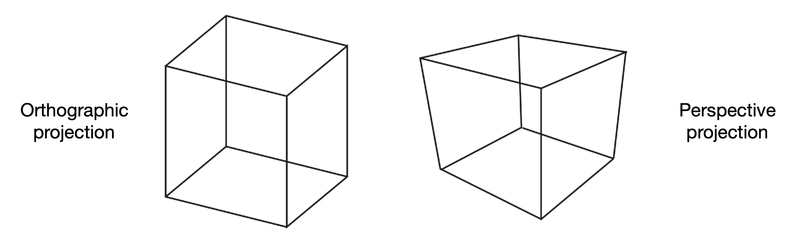
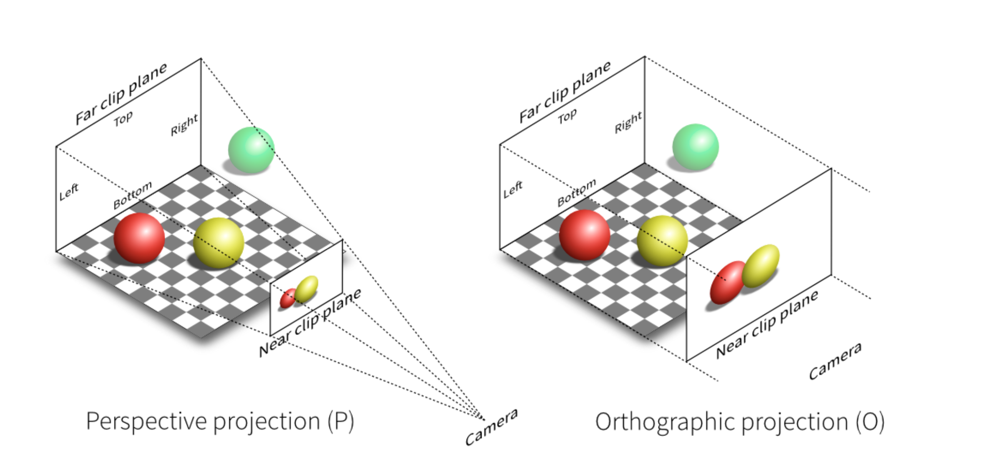
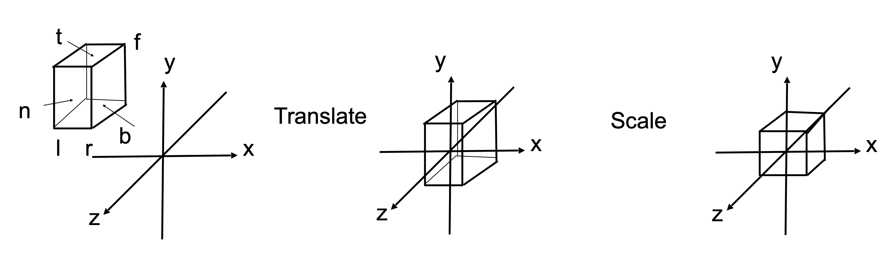
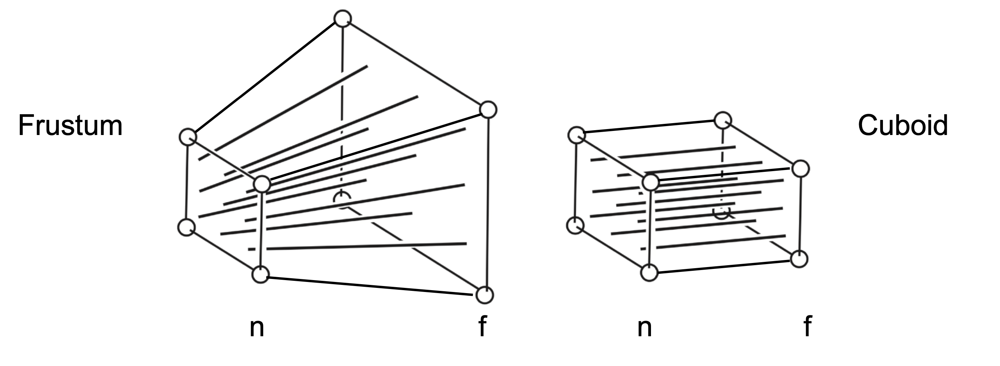
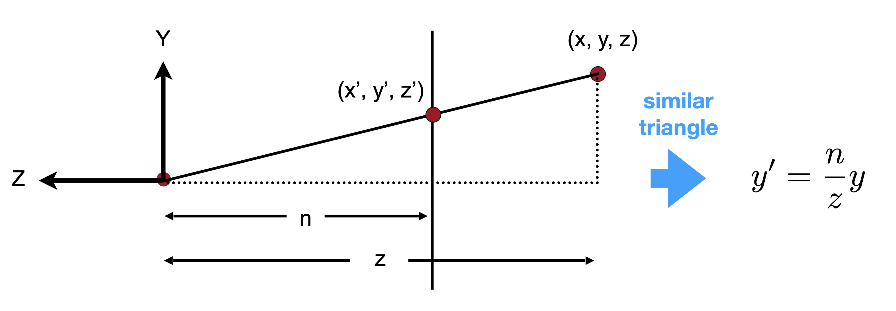

# **Transformation Cont.**

<body>

Homework 0 was released

</body>

!!! Note "关于上节课的一些补充"

    $$
    R_{\theta}^{-1} = R_{-\theta} \mathrm{by definition}
    $$

    通过观察还能发现，$R_{\theta}^{T} = R_{-\theta} = R_{\theta}^{-1}$

Today:

- 3D transformations
- Viewing(观测) transformation
    - View(视图) / Camera transformation
    - Projection(投影) transformation
        - Orthographic(正交) projection
        - Perspective(透视) projection

## **3D Transformations**

3维的操作和2维的操作都是一样的，只是多了一个维度。

$$
\begin{pmatrix}
x' \\
y' \\
z' \\
1
\end{pmatrix} = 
\begin{pmatrix}
a & b & c & t_x \\
d & e & f & t_y \\
g & h & i & t_z \\
0 & 0 & 0 & 1
\end{pmatrix}
\begin{pmatrix}
x \\
y \\
z \\
1
\end{pmatrix}
$$

左上角的 3x3 矩阵依旧表示线性变换，最右边一列仍然表示平移变换。

**Scale**

$$
S(s_x, s_y, s_z) =
\begin{pmatrix}
s_x & 0 & 0 & 0 \\
0 & s_y & 0 & 0 \\
0 & 0 & s_z & 0 \\
0 & 0 & 0 & 1
\end{pmatrix}
$$

**Translation**

$$
T(t_x, t_y, t_z) =
\begin{pmatrix}
1 & 0 & 0 & t_x \\
0 & 1 & 0 & t_y \\
0 & 0 & 1 & t_z \\
0 & 0 & 0 & 1
\end{pmatrix}
$$

比较复杂的可能就是旋转了。

**Rotation**

$$
R_x(\alpha) = 
\begin{pmatrix}
1 & 0 & 0 & 0 \\
0 & \cos(\alpha) & -\sin(\alpha) & 0 \\
0 & \sin(\alpha) & \cos(\alpha) & 0 \\
0 & 0 & 0 & 1
\end{pmatrix}
$$

绕 x 轴旋转 $\alpha$ 角度，x 坐标是不变的，所以左上角是 1， 而中间的 2x2 矩阵是一个二维的旋转矩阵，表示在 yz 平面上的旋转。

同样绕 z 轴旋转 $\alpha$ 角度：

$$
R_z(\alpha) =
\begin{pmatrix}
\cos(\alpha) & -\sin(\alpha) & 0 & 0 \\
\sin(\alpha) & \cos(\alpha) & 0 & 0 \\
0 & 0 & 1 & 0 \\
0 & 0 & 0 & 1
\end{pmatrix}
$$

依旧是一个二维的旋转矩阵。

但是绕 y 轴旋转的时候情况就不一样了：

$$
R_y(\alpha) =
\begin{pmatrix}
\cos(\alpha) & 0 & \sin(\alpha) & 0 \\
0 & 1 & 0 & 0 \\
-\sin(\alpha) & 0 & \cos(\alpha) & 0 \\
0 & 0 & 0 & 1
\end{pmatrix}
$$

!!! Question "这里该怎么理解呢？"

    x, y, z 三个坐标轴，我们可以由 x 轴叉乘 y 轴，从而得到 z 轴；y 轴叉乘 z 轴得到 x 轴，但是如果按照 x, y, z 这样的顺序的话，x 轴叉乘 z 轴并不能得到 y 轴，而是 -y 轴，所以这里对应的绕 y 轴旋转的矩阵是反过来的。

如果是一般性的旋转，我们可以转化成绕 x, y, z 轴的旋转的组合。

$$
R_{xyz}(\alpha, \beta, \gamma) = R_x(\alpha) R_y(\beta) R_z(\gamma)
$$

!!! Note "Rodrigues' Rotation Formula"

    $$
    R(\vec{n}, \alpha) = \cos(\alpha) I + (1 - \cos(\alpha)) \vec{n} \vec{n}^T + \sin(\alpha) \begin{pmatrix} 0 & -n_z & n_y \\ n_z & 0 & -n_x \\ -n_y & n_x & 0 \end{pmatrix}
    $$

    其中 $\vec{n}$ 是旋转轴，$\alpha$ 是旋转角度。

    这里默认旋转轴的起点是原点，如果不是的话，我们可以先平移到原点，然后旋转，再平移回去。

## **Viewing Transformation**

### **View / Camera Transformation**

- What is view transformation?
- Think about how to take a photo
    - Find a good place and arrange people(**model** transformation, 模型变换，把模型放到合适的位置)
    - Find a good angle to put the camera(**view** transformation)
    - Take a photo(**projection** transformation)

三步变换：模型变换、视图变换、投影变换，简称 MVP 变换。

如何做视图变换呢？

我们首先需要确定相机的位置，然后确定相机的朝向，最后确定相机的上方向。

$$
\mathrm{Position} \ \vec{e}
$$

$$
\mathrm{Look-at/gaze direction} \ \vec{g}
$$

$$
\mathrm{Up \ direction, assuming \ prep. to \ look-at} \ \vec{t}
$$

上方向：相机头顶的朝向，就比如我们手机拍照是横屏还是竖屏，最后拍到的照片就是不一样的。

这里定义了三个方向实际上就是定义了一个坐标系。

我们可以规定相机永远不动，而是所有的物体在移动。相机在原点，永远朝向 -z 方向看，上方向是 y 方向。

然而我们现在的相机是在 tge 坐标系中的，所以我们需要把相机的坐标系转换到 xyz 坐标系中。

我们可以这么先把相机平移到原点，然后把 g 轴转到 -z 轴，然后把 t 轴转到 y 轴。

所以有 

$$
M_{view} = R_{view}T_{view}
$$

平移矩阵很好写，就是把相机平移到原点。

$$
T_{view} =
\begin{pmatrix}
1 & 0 & 0 & -x_e \\
0 & 1 & 0 & -y_e \\
0 & 0 & 1 & -z_e \\
0 & 0 & 0 & 1
\end{pmatrix}
$$

但是旋转矩阵就不太好写了，因为我们要把 $(x_g, y_g, z_g)$ 旋转到 $(0, 0, -1)$, 这个很麻烦，但是反过来是好写的。

$$
R_{view}^{-1} = 
\begin{bmatrix}
x_{\vec{g} \times \vec{t}} & x_{t} & x_{-g} & 0 \\
y_{\vec{g} \times \vec{t}} & y_{t} & y_{-g} & 0 \\
z_{\vec{g} \times \vec{t}} & z_{t} & z_{-g} & 0 \\
0 & 0 & 0 & 1
\end{bmatrix}
$$

从而得到

$$
R_{view} = (R_{view}^{-1})^{T} =
\begin{bmatrix}
x_{\vec{g} \times \vec{t}} & y_{\vec{g} \times \vec{t}} & z_{\vec{g} \times \vec{t}} & 0 \\
x_{t} & y_{t} & z_{t} & 0 \\
x_{-g} & y_{-g} & z_{-g} & 0 \\
0 & 0 & 0 & 1
\end{bmatrix}
$$

### **Projection Transformation**

<figure markdown="span">

<figcaption>正交投影和透视投影</figcaption>
</figure>

如图是虎书上关于正交投影和透视投影的两个例子，左边是我们很熟悉的正交投影，右边是透视投影。

这个正方体在正交投影中，每条对边都是平行的，但是在透视投影中，这个正方体的对边就不再平行了，但是透视投影能给我们带来“近大远小”的效果。

<figure markdown="span">

</figure>

左侧表示的是透视投影的原理，右侧是正交投影的原理。

透视投影中，相机与被拍摄的物体之间形成了一个锥形；而在正交投影中，我们假设相机放在无穷远处，所以相机与物体之间形成的是平行的光线。

#### **Orthographic Projection**

我们可以定义一个立方体(cuboid)，它的左右在 x 轴上是 $[l, r]$, 下上在 y 轴上是 $[b, t]$, 远近在 z 轴上是 $[f, n]$。

我们可以把这个立方体映射到位于原点处的标准立方体上($[-1, 1]^{3}$): 先把立方体平移到原点，然后把 x, y, z 分别缩放到 $[-1, 1]$。这个过程叫做 canonical(正则，规范，标准)。

<figure markdown="span">

</figure>

$$
M_{ortho} = 
\begin{bmatrix}
\frac{2}{r - l} & 0 & 0 & 0 \\
0 & \frac{2}{t - b} & 0 & 0 \\
0 & 0 & \frac{2}{n - f} & 0 \\
0 & 0 & 0 & 1
\end{bmatrix}
\begin{bmatrix}
1 & 0 & 0 & -\frac{r + l}{2} \\
0 & 1 & 0 & -\frac{t + b}{2} \\
0 & 0 & 1 & -\frac{n + f}{2} \\
0 & 0 & 0 & 1
\end{bmatrix}
$$

#### **Perspective Projection**

在开始之前，先回忆之前在齐次坐标中讲过的内容：

对于一个点 $(x, y, z, 1)$ 和 $(kx, ky, kz, k != 0), (xz, yz, z^2, z != 0)$, 它们都表示三维空间中的同一个点 $(x, y, z)$

<figure markdown="span">

</figure>

同样定义近和远两个平面，远的平面大一些，近的平面小一些。

简单理解：把 Frustum “挤”成一个长方体，然后再用正交投影。

在“挤”的过程中，我们规定几个事情：

1. 近平面上的点不变
2. 远平面挤过之后，它的 z 值不变，即远平面不会前后移动
3. 远平面挤过之后，中心点不变

剩下的问题就是怎么“挤”了。

<figure markdown="span">

</figure>

我们从侧面观察，相机在原点，近平面上某个点是 $(x^{\prime}, y^{\prime}, z^{\prime})$, 远平面上某个点是 $(x, y, z)$。

根据数学关系很容易得出：

$$
y^{\prime} = \frac{n}{z} y
$$

同理

$$
x^{\prime} = \frac{n}z x
$$

我们想要把 $(x, y, z, 1)^{T}$ 映射到 $(x^{\prime}, y^{\prime}, z^{\prime}, 1)^{T}$.

也就是 

$$
M_{presp->ortho} 
\begin{pmatrix}
x \\
y \\
z \\
1
\end{pmatrix} =
\begin{pmatrix}
\frac{nx}{z} \\
\frac{ny}{z} \\
\mathrm{unknown} \\
1
\end{pmatrix} = 
\begin{pmatrix}
nx \\
ny \\
\mathrm{unknown} \\
z
\end{pmatrix}
$$

根据已知信息，可以得到一部分的矩阵：

$$
M_{persp->ortho} =
\begin{pmatrix}
n & 0 & 0 & 0 \\
0 & n & 0 & 0 \\
? & ? & ? & ? \\
0 & 0 & 1 & 0
\end{pmatrix}
$$

结合我们之前规定，近的平面上的点不变，远的平面挤过之后，它的 z 值不变：

对于近平面上的点 $(x, y, n, 1)$, 它映射之后还是 $(x, y, n, 1) \ = \ (nx, ny, n^2, n)$, 对于远平面上的中心点 $(x, y, f, 1)$，它映射之后还是自己

于是我们就得到矩阵的第三行：$(0, 0, n+f, -nf)$

所以最终的矩阵是：

$$
M_{persp->ortho} =
\begin{pmatrix}
n & 0 & 0 & 0 \\
0 & n & 0 & 0 \\
0 & 0 & n+f & -nf \\
0 & 0 & 1 & 0
\end{pmatrix}
$$

最后再左乘正交投影矩阵 $M_{ortho}$ 就得到了透视投影矩阵。