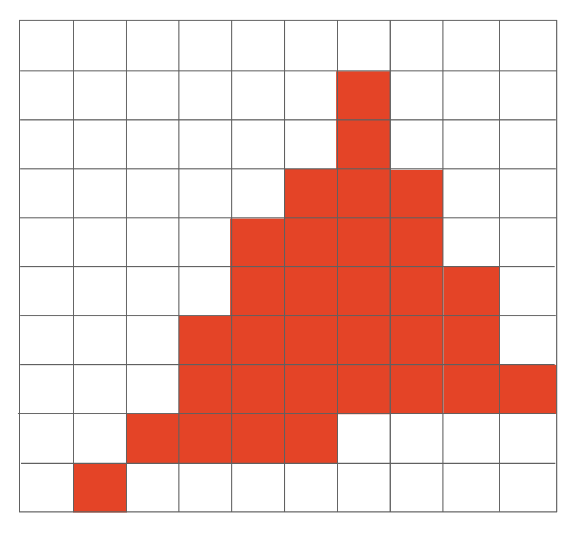

# **Rasterization 1(Triangles)**

<body>
<p align = "center">Homework 1 was released</p>
</body>

Outline:

- <font color = red>Finishing up Viewing</font>
    - Viewport transformation
- Rasterization(光栅化)
    - Different raster displays
    - Rasterizing a triangle
- Occlusions and Visibility

## **Finishing up Viewing**

<figure markdown="span">

<figurecaption>Field of View</figurecaption>
</figure>

如图，从相机视角来看，有两条线分别连接上下两条边的中点，这两条线之间的夹角就被叫做 fovY(垂直可视角)，它可以通过长宽比与水平可视角之间进行转化。

<figure markdown="span">

</figure>

如图是一个侧视图，我们可以得到如下的数学关系：

$$
\tan{\frac{fovY}{2}} = \frac{t}{\lvert n \rvert}
$$

$$
\mathrm{aspect} \ = \ \frac{r}{t}
$$

所以如果我们想定义一个视锥的话，我们只需要定义宽高比和垂直的可视角度即可。其他的参数都可以通过这两个参数来计算出来。

在做完 "MVP" 之后，我们得到了一个标准立方体，我们接下来的任务就是要把这个立方体画在屏幕上。

### **Canonical Cube to Screen**

- What is a screen?
    - An array of pixels(一个二维数组，每个元素是一个像素)
    - Size of the array: resolution(数组的大小：分辨率)
    - A typical kind of raster display(屏幕是一个典型的光栅化成像设备)
- Raster == screen in German
    - Rasterize == drawing onto the screen
- Pixel(FYI, short for "picture element")
    - 在本节课中，我们可以简单认为一个像素就是一个小方块，每个方块的颜色都不会发生变化
    - Color is a mixture of(<font color = red>red</font>, <font color = green>green</font>, <font color = blue>blue</font>)

接下来定义一个“屏幕空间”，实际上就是一个坐标系。

<figure markdown="span">

<figurecaption>Screen Space</figurecaption>
</figure>

- Pixels' indices are in the form of $(x, y)$, where both $x$ and $y$ are integers
- Pixels' indices are from $(0, 0)$ to $(\mathrm{width} - 1, \mathrm{height} - 1)$
- Pixel $(x, y)$ is centered at $(x + 0.5, y + 0.5)$
- The screen covers range $(0, 0)$ to $(\mathrm{width}, \mathrm{height})$

接下来就要把立方体映射到屏幕空间上了：

- Irrelevant to $z$
- Transform in xy plane: $[-1, 1]^2$ to $[0, \mathrm{width}] \times [0, \mathrm{height}]$
- 先忽略掉 z 轴的分量，把 xy 平面上的点映射到屏幕空间上

可以很容易地写出变换矩阵：

$$
M_{viewport} =
\begin{pmatrix}
\frac{\mathrm{width}}{2} & 0 & 0 & \frac{\mathrm{width}}{2} \\
0 & \frac{\mathrm{height}}{2} & 0 & \frac{\mathrm{height}}{2} \\
0 & 0 & 1 & 0 \\
0 & 0 & 0 & 1
\end{pmatrix}
$$

我们把这个变换称为 viewport transformation(视口变换)，它的作用就是把立方体映射到屏幕空间上。

## **Rasterizing Triangles into Pixels**

我们要把转换后的立方体打碎，打成一个个像素，并且设置每个像素的值，这一步就叫“光栅化”。

### **Drawing Machines**

目前主要的显示方式是通过显卡的显存。要显示的内容被储存在显存中，显示器会告诉显存需要显示什么内容，然后显存就会把内容传输到显示器上。

目前的显示设备主要是 LCD(液晶显示器)。有的显示器分辨率特别高，高到超过了人眼的分辨率，这种屏幕我们就把它叫做视网膜屏幕。

!!! NOTE "LCD Pixel"

    液晶显示器，液晶会通过自己不同的排布，来影响光的偏振方向。

还有一种广泛使用的显示设备叫做 LED(发光二极管)，它的原理是通过电流来激发发光二极管发光。

## **Rasterizing: Drawing to Raster Displays**

### **Triangles - Fundamental Shape Primitives**

Why triangles?

- Most basic polygon
    - We can break any polygon into triangles
- Unique properties
    - Guaranteed to be planar(一定是平面的)
    - Well-defined interior(有明确的内部)
    - Well-defined method for interpolating values at vertices over triangle(barycentric coordinates)

<figure markdown="span">

</figure>

如图我们输入了一个三角形的三个顶点坐标，我们想通过某种办法在像素上显示出这个三角形。这就来到了光栅化很重要的一个点：判断像素与三角形的位置关系。

#### **A Simple Approach: Sampling**

采样。给定一个函数，通过函数计算出每个点的函数值，其实就是把函数离散化的过程。

```cpp
for( int x = 0; x < xmax; ++x)
{
    output[x] = f(x);
}
```

我们对像素中心进行采样。

<figure markdown="span">

</figure>

如图所示，我们对每个像素的中心进行采样，判断这个点是否在三角形内部，如果函数值为 1，就说明这个点在三角形内部。

```cpp
for( int x = 0; x < xmax; x++)
{
    for( int y = 0; y < ymax; y++)
    {
        image[x][y] = inside(tri, x + 0.5, y + 0.5);
    }
}
```

遍历整个屏幕，判断每个像素的中心是否在三角形内部。

#### **Evaluatin ```inside(tri, x, y)**

判断点是不是在三角形内的方法之前课上讲过，三条边分别做叉乘，判断结果是不是在同一个方向上。

我们前边判断像素的中心是否在三角形内，实际上是对每个像素的中心都进行了采样，但是有的点是明显不可能在三角形内的，所以我们没有必要对每个像素的中心都进行采样。我们可以通过对三角形进行包围盒的计算，来减少采样的点。

<figure markdown="span">

<figurecaption>Bounding Box</figurecaption>
</figure>

x 的范围就是三个点中最小和最大的 x 坐标，y 的范围就是三个点中最小和最大的 y 坐标。我们可以通过这个包围盒来减少采样的点。

### **Rasterization on Real Displays**

<figure markdown="span">

</figure>

上图展示了两个不同的手机显示同一个画面的图像。我们可以看到，两个手机的像素排布是不同的。

Iphone 是三个长条形的像素，分别是红色、绿色和蓝色的组合。每个像素的颜色是通过这三个长条形的像素的颜色混合而成的。

三星则是 Bayer pattern.

而且还能发现 Bayer Pattern 中绿色的像素是最多的，红色和蓝色的像素是最少的。因为人眼对绿色的敏感度是最高的，所以绿色的像素多一些可以提高显示效果。

<figure markdown="span">

</figure>

根据上边的算法，我们最终判断上图的红色点是属于三角形内部的，但是如果我们对这些像素点进行上色的话，得到的却是这样的一个图形：

<figure markdown="span">

</figure>

这不是我们想要的结果，我们想要的是一个平滑的三角形，而不是一个锯齿状的三角形。

锯齿出现的原因是像素本身有大小，并且我们的采样率并不高，导致我们在采样的时候没有采样到三角形的边界。

在下节课我们会提到“抗锯齿”或“反走样”。