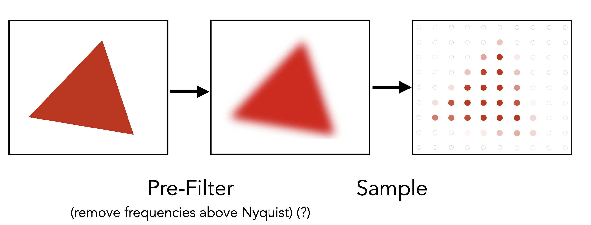
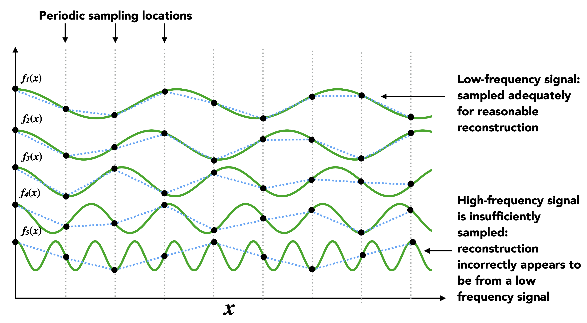
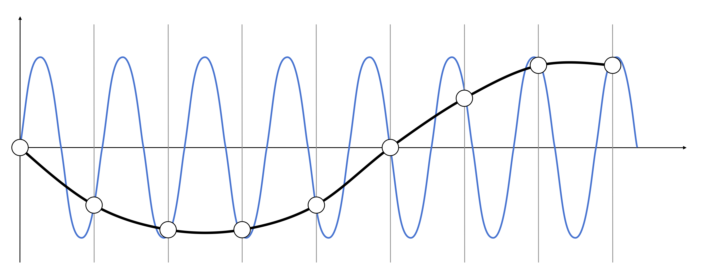
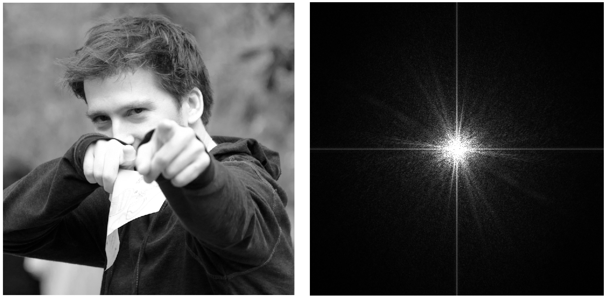
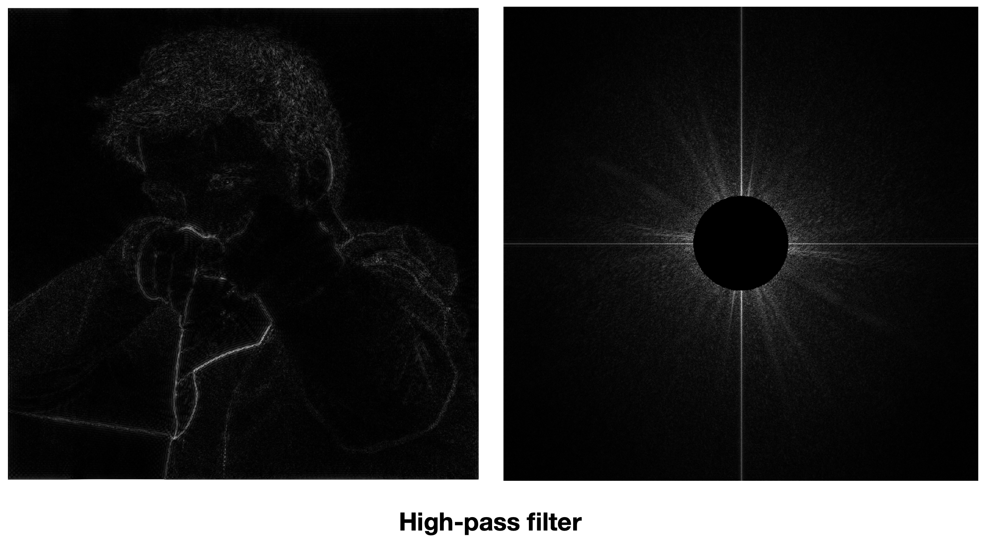
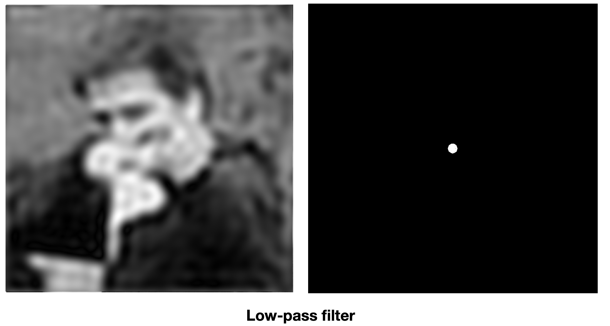
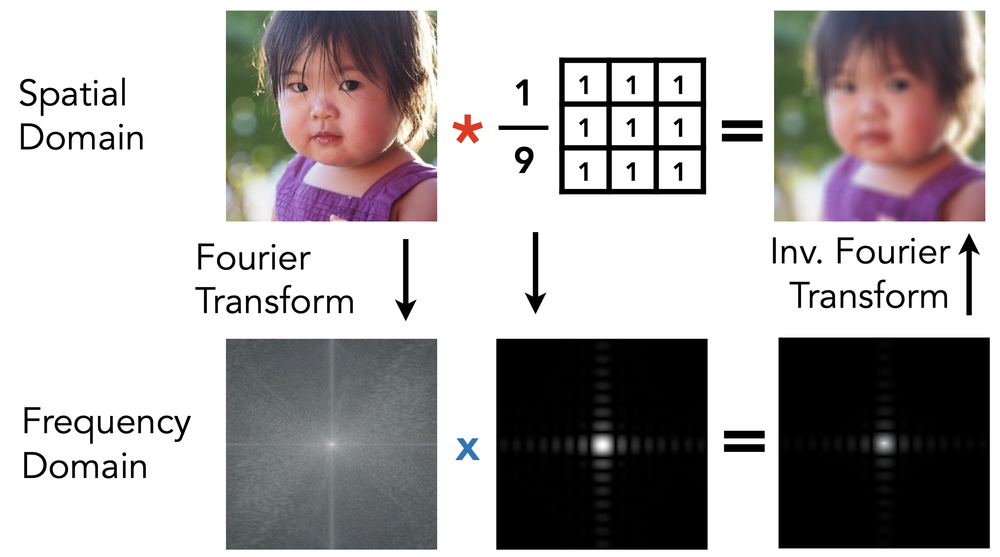
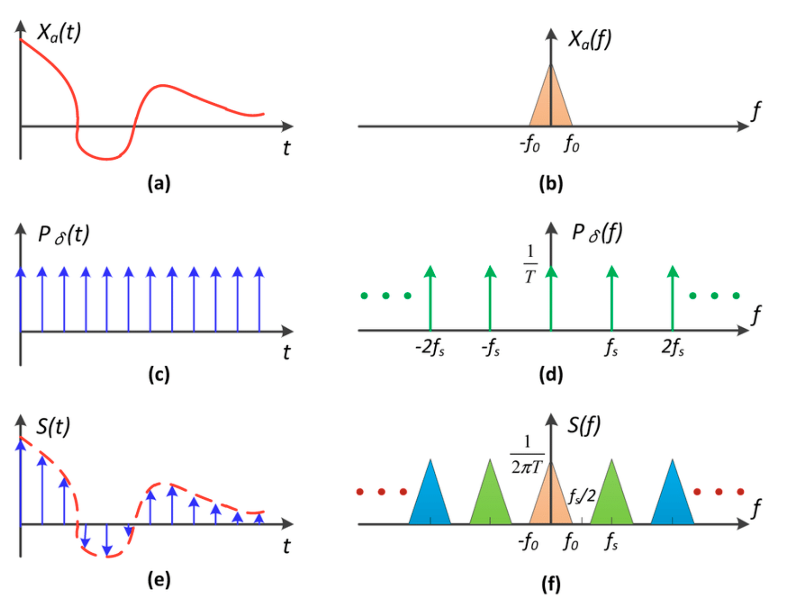
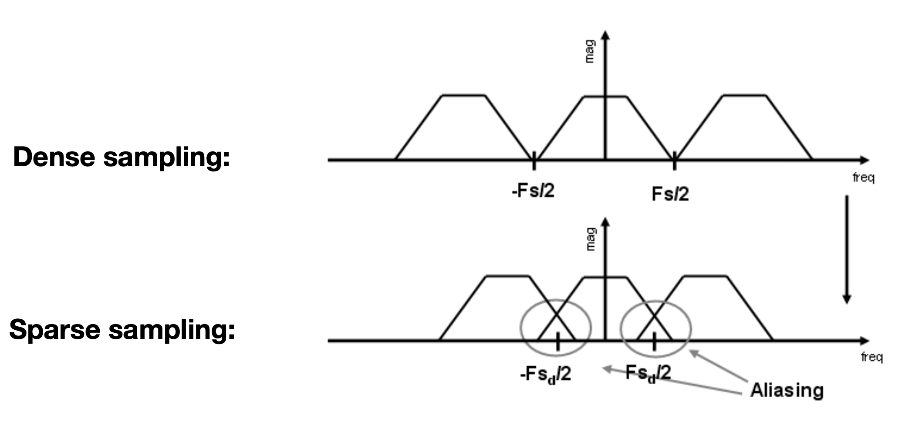
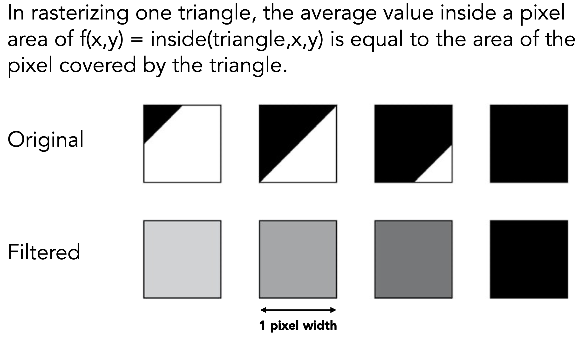

# **Rasterization 2(Antialiasing and Z-buffering)**

!!! NOTE "Outline"

    - Antialiasing（抗锯齿/反走样）
        - Sampling theory
        - Antialiasing in practice
    - Visibility / occlusion
        - Z-buffering

采样在计算机图形学中无处不在。，但是它也会带来很多问题(artifacts)，比如锯齿，摩尔纹等。

<figure markdown = "span">
{width = "400"}<figcaption>
    摩尔纹
</figcaption>
</figure>

上图就是一个摩尔纹的例子，左边是原图，如果我们去掉原图中的奇数行和奇数列，但是图片的尺寸不变，那么就会出现摩尔纹。摩尔纹是由于采样率过低导致的。

## **Antialiasing idea: Blurring(Pre-Filtering) Before Sampling**

在采样之前，可以先做一个模糊（滤波）处理。

<figure markdown = "span">
{width = "400"}<figcaption>
    模糊处理
</figcaption>
</figure>

如图所示，在采样之前，我们加了一步模糊操作，当采样到三角形的边界时，像素点是粉红色而不是红色，这样就可以起到抗锯齿的效果。

## **Frequency Domain**

定义 $\cos{2\pi \mathrm{fx}}$ 的频率为 $f$，周期 $T = \frac{1}{f}$。

### **Fourier Transform**

傅立叶级数展开：我们可以用一系列正弦和余弦函数来表示一个周期函数。

傅立叶级数展开与傅立叶变换是紧密相连的。任何一个函数，都可以分解为不同的频率。所谓傅立叶变换，其实就是把函数变成不同的频率的段，并且把不同的频率的段显示出来。

!!! EXAMPLE "Higher Frequencies Need Faster Sampling"

    <figure markdown = "span">
    {width = "400"}
    </figure>

    如图有五个函数，从上到下频率从低到高。假设我们用相同的采样频率来对五个函数进行采样，那么对于低频函数来说，可以看到我们基本可以采样到函数的形状。等到了第三个函数的时候，我们发现采样过后恢复的形状已经开始失真了，相差比较大。

    那么说明，高频的函数需要更高的采样频率才能够恢复出原来的形状。

考虑如下两个函数：

<figure markdown = "span">
{width = "400"}
</figure>

上图有一个蓝色的函数和一个黑色的函数，如果我们用相同的采样方法去采样这两个函数，那么得到的图像是完全一样的（图中白色圆圈），这种现象就叫做“走样”。

### **Filtering = Getting rid of certain frequency contents**

#### **Visualizing Image Frequency Content**

傅立叶变换可以把图像从“时域”变到“频域”

<figure markdown = "span">
{width = "400"}
</figure>

左图是原图，我们通过傅立叶变换得到右图的频域图。对于频域图，我们把中心定义为最低频的区域，周围定义为高频的区域，从中心到周围，频率越来越高。然后我们通过亮度表示有多少信息集中在某个频率上，亮度越高，说明这个频率上包含的信息越多。

自然界中大多数图片都是低频信息比较多，高频信息比较少。高频信息对应边界，高通滤波器过滤图片之后，就只剩下边界了;低通滤波器会过滤掉边界，图片会变模糊。

<figure markdown = "span">
{width = "400"}
<figurecaption>High-pass filter</figurecaption>
</figure>

<figure markdown = "span">
{width = "400"}
<figurecaption>Low-pass filter</figurecaption>
</figure>

#### **Filtering = Convolution(= Averaging)**

!!! NOTE "Convolution Theorem"

    时域上，如果想对两个信号进行卷积，对应到频域上，实际上就是两个信号的乘积；如果在时域上是乘积，那么对应到频域上就是卷积。

    <figure markdown = "span">
    {width="400"}
    </figure>

#### **Sampling = Repeating Frequency Contents**

下图左边分别代表原函数，采样函数，采样后的函数；右边代表它们对应的频谱。

<figure markdown="span">
{width="400"}
</figure>

通过观察可以发现：采样实际上就是对原图像频谱的周期性重复。

如此我们就可以通过频谱分析“走样”这一现象了。走样实际上就是在周期性重复的过程中，图像的频谱之间发生了重合（混叠）。

<figure markdown="span">
{width="400"}
</figure>

## **Antialiasing**

反走样有几种做法：

1. 增加采样率，但是开销很大；
2. 反走样，先模糊，再采样（先把信号高频信息拿掉，然后做反走样）；

<figure markdown="span">
{width="400"}
</figure>

如图我们砍掉了高频部分，然后再以原本的采样率进行采样，这样就可以避免走样现象（砍掉了重叠部分）。

### **A Practical Pre-Filter**

在实际操作中，我们需要通过某种办法让图片变模糊，然后才可以采样。我们通常采用的是用一定大小的低通滤波器，对图片进行卷积操作，从而得到模糊后的图像。

在对三角形采样的时候，我们会计算三角形覆盖了这个像素的多少，然后把像素块变成对应比例的颜色。

<figure markdown="span">
{width="400"}
</figure>

### **Antialiasing By Supersampling(MSAA)**

在实际操作中，上边这种办法太麻烦了，所以人们就研究出了一种方法对反走样近似（它并不能解决反走样的问题）。

操作方法：对于一个大的像素点，我们把它划分成很多小像素点，然后判断小像素点中心点是不是在三角形内，最后把像素点平均起来，就得到了一个近似覆盖率。

!!! NOTE 

    注意，MSAA 并不是通过提高分辨率来直接解决走样问题，只是为了近似得到一个合理的覆盖率而已，并不是真正提高了分辨率。MSAA 实际上近似的是“模糊”过程。

但是 MSAA 并不是没有代价的，MSAA 通过更多的点来得到抗锯齿的效果，那么一个显而易见的代价就是增加了计算量。

其他抗锯齿方案：

- FXAA(Fast Approximate AA)：得到一副有锯齿的图，然后通过一些图像匹配的方法找到锯齿的边界，再换成没有锯齿的边界，速度非常快。
- TAA(Temporal AA)：基于时间的抗锯齿方法，利用前一帧的像素信息来平滑当前帧的像素，效果较好，但可能会引入模糊。

!!! NOTE "Super resolution(超分辨率)"

    - From low resolution to high resolution
    - Essentially still "not enough samples" problem
    - DLSS(Deep Learning Super Sampling)