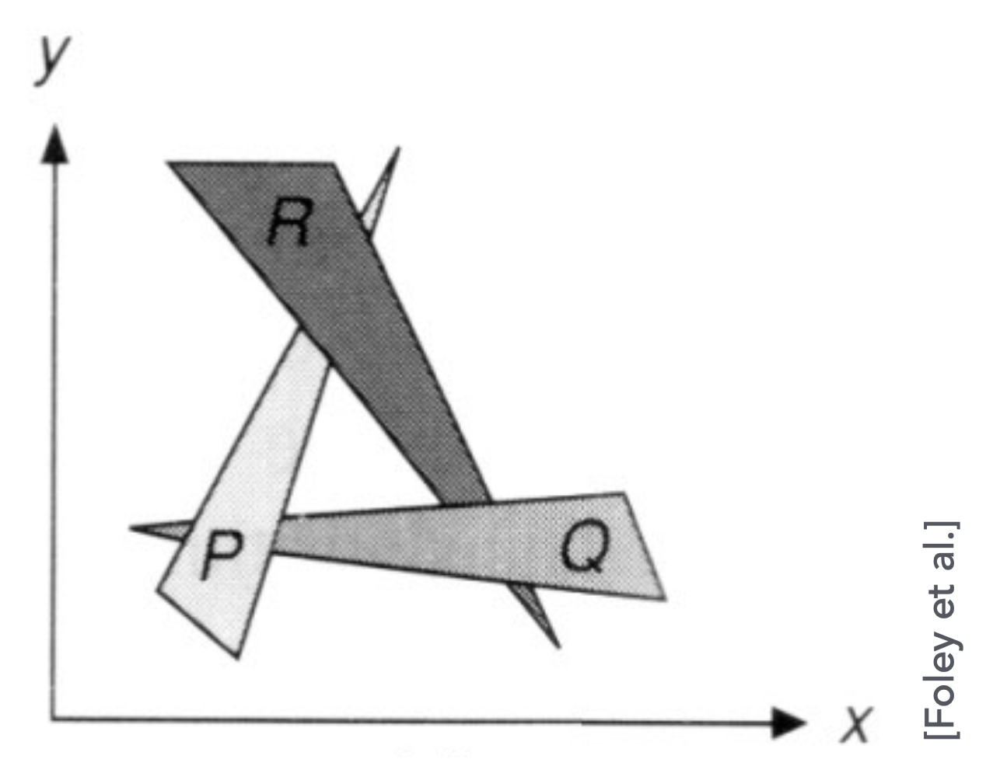
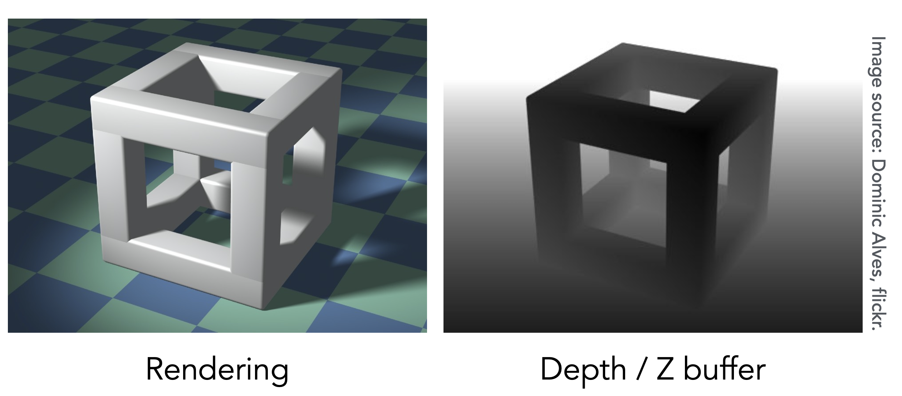
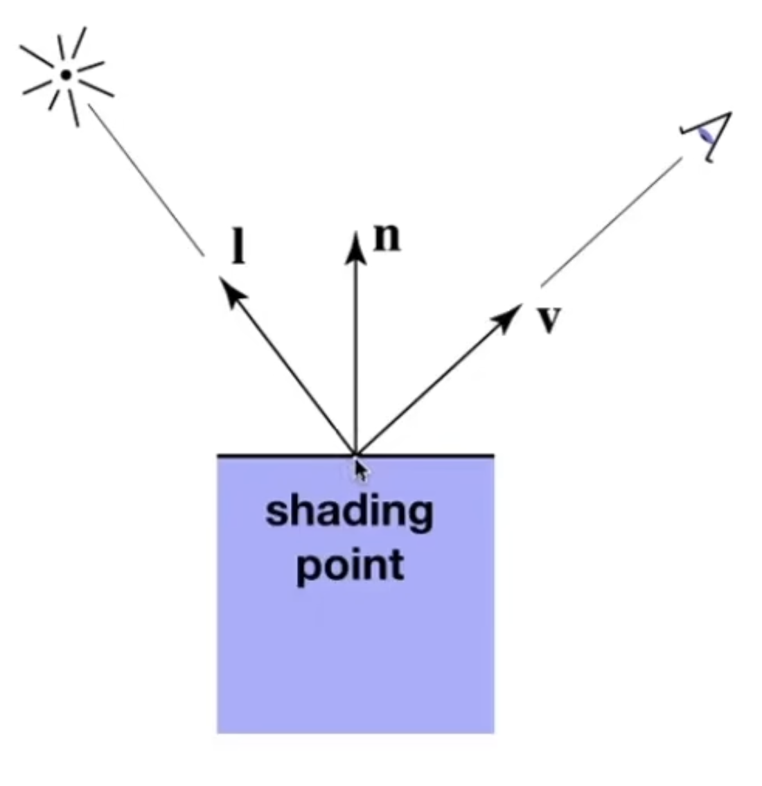
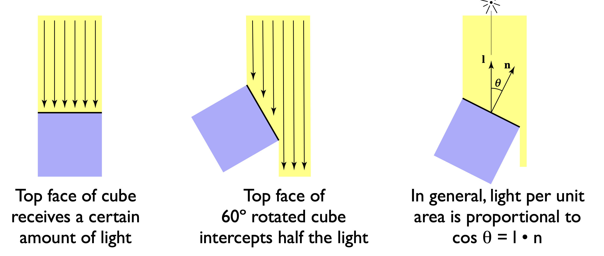
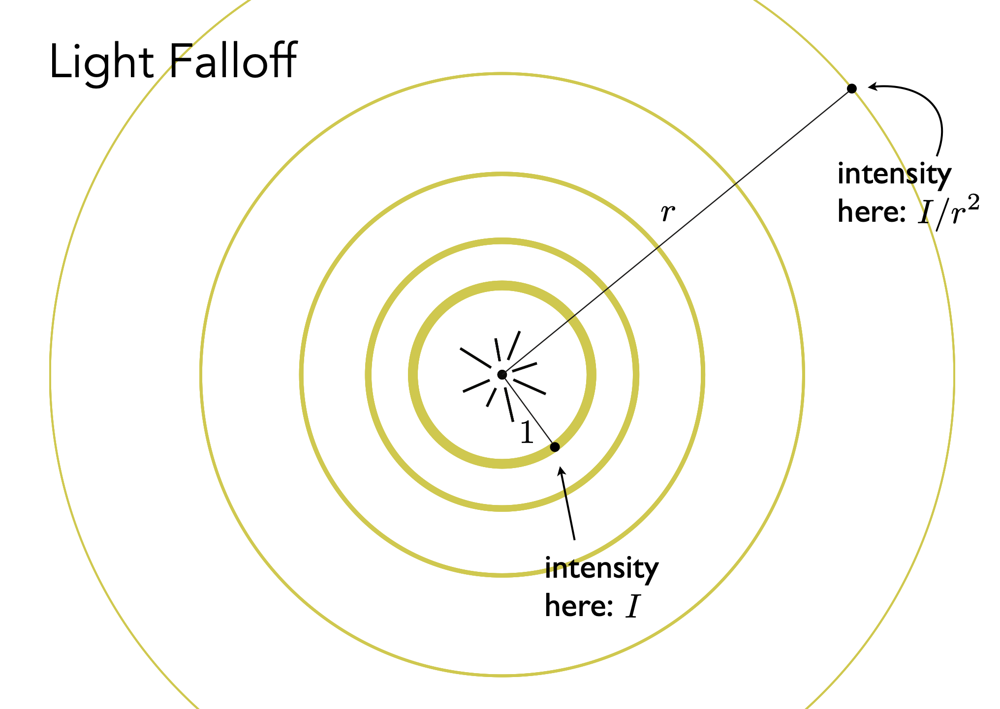

# **Shading 1(Illumination, Shading and Graphics Pipeline)**

<body>
<p align = "center">Homework 2 was released</p>
</body>

!!! NOTE "Outline"

    - <font color = red>Visibility / occlusion</font>
        - Z-buffering（深度缓存/深度缓冲）
    - Shading（着色）
        - Illumination & Shading
        - Graphics Pipeline

!!! NOTE "Painter's Algorithm"

    画家算法（Painter's Algorithm）是一种简单的可见性算法。它的基本思路是从远到近绘制物体，先绘制远处的物体，再绘制近处的物体，近的物体覆盖一部分远的物体。排序需要消耗 $n\log{n}$ 的时间。

    它的缺点在于我们很难定义深度（远近）。

    <figure markdown="span">
    {width="400"}
    </figure>

    上图中三个三角形相互遮挡，彼此形成覆盖关系，这种情况就不能通过画家算法来绘制。

## **Z-buffering**

为了解决上述问题，图形学引入了深度缓存（Z-buffering）技术。

核心思想：

- 对于一个图像来说，我们很难定义深度（远近），但是我们可以定义每个像素的深度值。
- 我们记录每个像素点最浅的深度值。
- 然后在绘制图片的时候，会一次性绘制两张图片
    - 一张叫做 frame buffer(帧缓存)，记录每个像素点的颜色值。
    - 一张叫做 depth buffer(z-buffer, 深度缓存)，记录每个像素点的深度值

为了简单起见，我们假设 z 值永远是正的，z 值越小，表示越近。

<figure markdown="span">
{width="400"}
<figurecaption>Z-buffer example</figurecaption>
</figure>

### **Z-buffering Algorithm**

```cpp
Initialize depth buffer to infinity
During rasterization:
    for (each triangle T){
        for (each sample (x, y, z) in T) {
            if (z < zbuffer[x, y]) {
                framebuffer[x, y] = color of T
                zbuffer[x, y] = z
            }
            else {
                // do nothing
            }
        }
    }
```

首先初始化深度缓存为无穷大（表示所有像素点都没有被绘制过）。然后在光栅化的过程中，对于每个三角形 T，我们遍历 T 中的每个采样点 (x, y, z)，如果 z 小于当前深度缓存中对应像素点的值，则更新帧缓存和深度缓存，我们最终只需要当前像素点的最小深度值。

## **Shading**

着色：对不同的物体应用不同的材质

### **A Simple Shading Model(Blinn-Phong Reflection Model)**

#### **Shading is Local**

在定义着色模型时，我们假设光照是局部的（local），即每个点的颜色只与该点的光照和材质有关，而与其他点无关。并且定义如下的物理量：

Inputs:

- Viewer direction, $v$，观测方向
- Surface normal, $n$，表面法线
- Light direction, $l$ (for each of many lights)，光照方向
- Surface parameters(color, shininess, ...)

<figure markdown = "span">
{width="400"}
</figure>

我们要考虑 shading point 这个点的着色结果是什么样的。同时由于着色的局部性，那么阴影的计算就不在我们的讨论范围内，因为我们不考虑其他物体的影响，后面我们会讨论怎么生成阴影。

#### **Diffuse Reflection(漫反射)**

Light is scattered uniformly in all directions.

!!! NOTE "Lambert's cosine law"

    漫反射物体表面的亮度与入射光线和表面法线的夹角有关，具体来说，漫反射的亮度与入射光线和表面法线夹角的余弦值成正比。

    <figure markdown = "span">
    {width="400"}
    </figure>

    $$
    \cos{\theta} = \vec{l} \cdot \vec{n}
    $$

漫反射表面的亮度是与光线能量的接收有关的，那么与能量接收相对应的就是能量的产生。

!!! NOTE "Light Falloff"

    <figure markdown = "span">
    {width="400"}
    </figure>

    假设光线来自一个点光源，我们认为在任何一个时刻，点光源辐射出的能量集中在一个球壳上。我们定义点光源的强度是 $I$，那么如果它传播到距离为 $r$ 的球壳上，那么这里的光强就是 $\frac{I}{r^2}$。

    这样一来我们就可以知道有多少光传播到了当前的 shading point 上。

因此漫反射的光照模型可以表示为：

$$
L_d = k_d(I \ / r^2)\max{0, \vec{l} \cdot \vec{n}}
$$

$k_d$ 表示漫反射系数，对应能量的吸收率，表现为不同的颜色，$I$ 是点光源的强度，$r$ 是光源到 shading point 的距离，$\vec{l}$ 是光线方向，$\vec{n}$ 是表面法线。