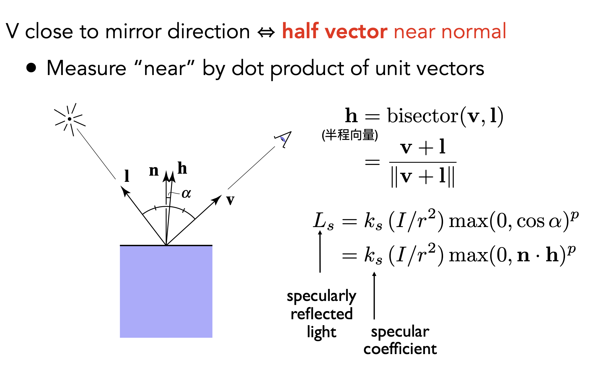
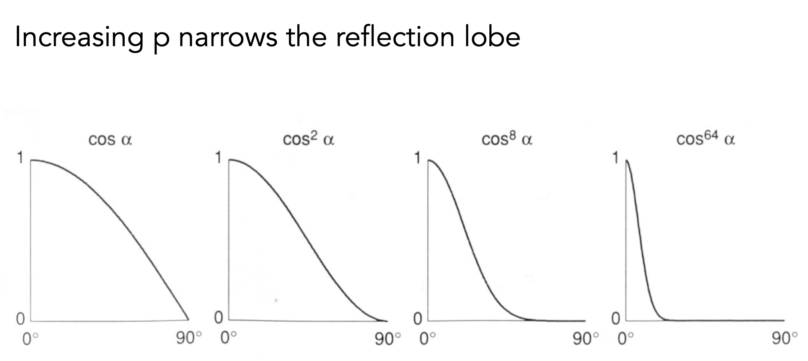
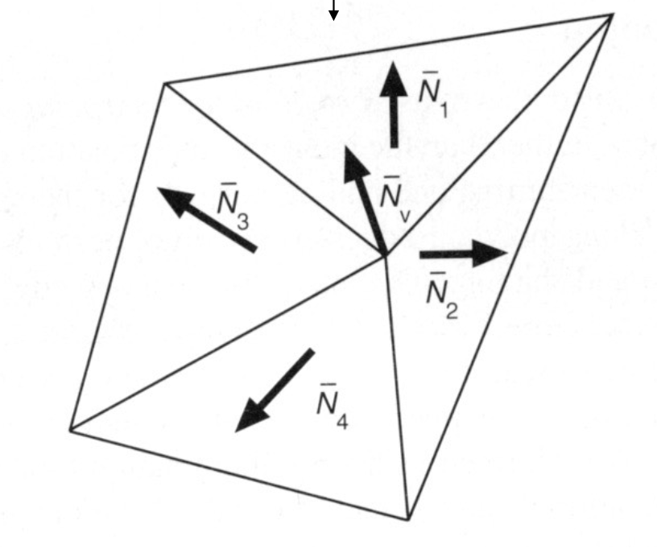
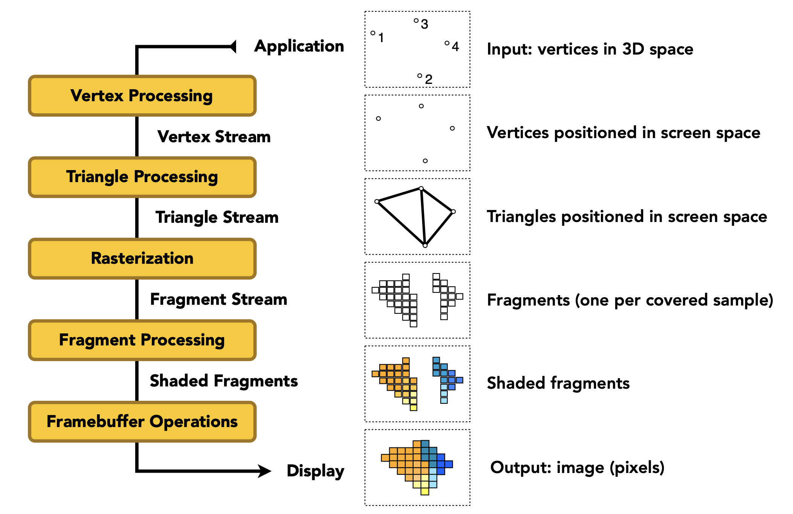
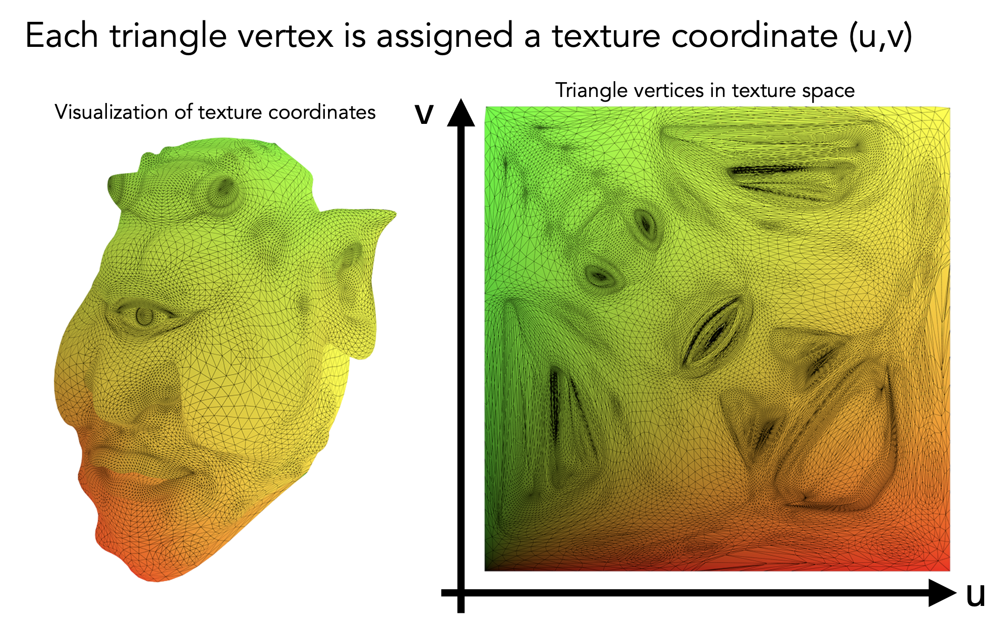

# **Shading 2(Shading, Pipeline and Texture Mapping)**

!!! NOTE "Outline"

    - Shading 2
        - Blinn-Phong reflectance model
            - Specular and ambient terms
        - Shading frequencies
        - Graphics pipeline
        - Texture mapping
        - Barycentric coordinates

## **Specular Term(Blinn-Phong)**

上节课我们说过了漫反射与光源方向，观察方向之间的关系，这节课我们会把高光项加入进去。高光一般出现在比较光滑的物体的反射上，很接近于镜面反射，所以它的出射角也比较接近入射角，并且只有当观察方向和镜面反射方向接近的时候，才能看到高光。

但是布林-冯观察到了一个很巧妙的现象：当观察方向和反射方向很接近的时候，也就说明法线和**半程向量**很接近。所谓半程向量就是光源入射方向和观察方向的角平分线。

<figure markdown="span">
{width="400"}
</figure>

图中的 $\vec{h}$ 就是半程向量，根据平行四边形法则，我们只要把 $\vec{l}$ 和 $\vec{v}$ 加起来，再做归一化，就得到了角平分线，也就是半程向量 $\vec{h}$。所以为了衡量我能不能看到高光，只要看半程向量和法线是不是接近就可以了。

所以我们有公式来计算高光：

$$
L_s = k_s(I / r^2) \max{0, \vec{n} \cdot \vec{h}}^P \notag
$$

$k_s$ 是镜面反射系数，通常认为是 1.这里还引入了一个指数 $P$，因为 $\cos\alpha$ 虽然确实能反映两个方向是否足够接近，但是它的容忍度太高了，我们希望只有当两个方向非常接近的时候，才能看到高光，所以我们把 $\cos\alpha$ 做了一个幂运算，指数越大，容忍度越低，只有当两个方向非常接近的时候，$\cos\alpha$ 才能接近 1，从而看到高光。正常情况下取 $P$ 在 100 到 200 之间。

<figure markdown="span">
{width="400"}
<figurecaption>余弦函数的容忍度</figurecaption>
</figure>

## **Ambient Term(Blinn-Phong)**

我们认为，任何一个点接收到来自环境的光都是相同的，环境光强度为 $I_a$，环境光的反射系数为 $k_a$，所以环境光的亮度为：

$$
L_a = k_a I_a \notag
$$

## **Blinn-Phong Reflectance Model**

把前面提到的所有项（环境光，漫反射，高光）加起来，我们就得到了布林-冯反射模型：

$$
\begin{aligned}
L &= L_a + L_d + L_s \\
&= k_a I_a + k_d (I / r^2) \max{0, \vec{n} \cdot \vec{l}} + k_s (I / r^2) \max{0, \vec{n} \cdot \vec{h}}^P
\end{aligned}
$$

这时候我们已经可以找到一个点它的着色情况了，下一步就是找到整个物体是什么情况。

## **Shading Frequencies（着色频率）**

着色频率可以理解为着色的点的个数，我们可以对一个面着色，也可以对一个点着色。显然对一个点着色更为精细，但是计算量也更大。

- Flat Shading（面着色）：对一个面，求它的法线，然后用这个法线去计算这个面的颜色。这样的话，整个面都是一个颜色，看起来会比较生硬。
- Gouraud Shading（顶点着色）：对一个面的三个顶点分别求法线，然后用这个法线去计算这个顶点的颜色，最后对这个面的颜色进行插值。这样的话，面内的颜色会比较平滑，但是高光可能会丢失，因为高光可能出现在面内，而不在顶点上。
- Phong Shading（像素着色）：对一个面的三个顶点分别求法线，然后对这个面的每一个像素点，插值出它的法线，再用这个法线去计算这个像素点的颜色。这样的话，面内的颜色会非常平滑，并且高光也不会丢失，但是计算量也最大。

并不是说面着色就不好，当几何体特别复杂，有很多很小的面的时候，面着色反而会更好，因为它的计算量小。

除了面着色之外，其他两种着色方法都需要求出顶点的法线，对于一个顶点来说，它肯定会和很多个三角形相连，所以它的法线可以通过这些三角形的法线求平均得到（简单平均和加权平均都可以，权重是三角形的面积）。

<figure markdown="span">
{width="400"}
</figure>

$$
N_v = \frac{\sum_i N_i}{||\sum_i N_i||} \notag
$$

我们已经能够求出顶点的法线了，接下来就是如何求出插值的法线，这个需要用到重心坐标。

## **Graphics Pipeline（图形管线）**

<figure markdown="span">
{width="600"}
<figurecaption>图形管线</figurecaption>
</figure>

## **Texture Mapping（纹理映射）**

我们希望在物体的不同位置定义不同的材质属性，比如说一个物体的某个部分是金属的，某个部分是塑料的，这时候我们就需要用到纹理映射。

我们定义纹理是一张图（平面），我们可以把纹理覆盖在物体的表面上，这样物体的不同位置就可以有不同的材质属性了，这个就叫纹理映射。

为了表示纹理上的一个点，我们引入了纹理坐标 $(u, v)$，它的取值范围是 $[0, 1]$，$(0, 0)$ 表示纹理的左下角，$(1, 1)$ 表示纹理的右上角。

<figure markdown="span">
{width="400"}
<figurecaption>纹理坐标</figurecaption>
</figure>