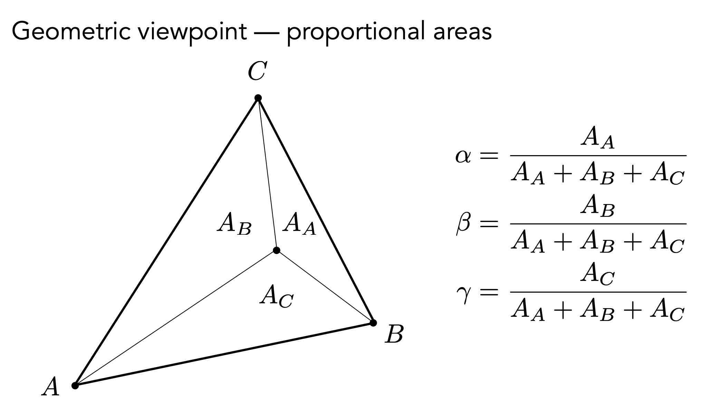

# **Shading 3(Texture Mapping Cont.)**

<body>

Homework 3 will be released soon

</body>

!!! NOTE "Outline"

    - Shading 3
        - Barycentric Coordinates（重心坐标）
        - Texture queries
        - Applications of textures

## **Barycentric Coordinates**

重心坐标是为了做三角形内部的插值。

三角形三个顶点分别为 \(A\)、\(B\)、\(C\)，任意一点 $P(x, y)$ 可以表示为

$$
(x, y) = \alpha A + \beta B + \gamma C
$$

如果 $\alpha, \beta, \gamma$ 满足：

$$
\alpha + \beta + \gamma = 1
$$

那么我们就把 $\alpha, \beta, \gamma$ 称为一个重心坐标。同时如果 $\alpha, \beta, \gamma$ 都是非负的，那么 $P$ 就在三角形内部。

根据定义我们可以知道 $A$ 点的重心坐标是 $(1, 0, 0)$，$B$ 点的重心坐标是 $(0, 1, 0)$，$C$ 点的重心坐标是 $(0, 0, 1)$。

!!! NOTE "重心坐标的另外一种定义"

    重心坐标是可以通过面积来定义的。

    <figure markdown="span">
    {width="400"}
    </figure>

计算重心坐标的公式：

$$
\alpha = \frac{-(x - x_B)(y_C - y_B) + (y - y_B)(x_C - x_B)}{-(x_A - x_B)(y_C - y_B) + (y_A - y_B)(x_C - x_B)} \notag
$$

$$
\beta = \frac{-(x - x_C)(y_A - y_C) + (y - y_C)(x_A - x_C)}{-(x_B - x_C)(y_A - y_C) + (y_B - y_C)(x_A - x_C)} \notag
$$

$$
\gamma = 1 - \alpha - \beta \notag
$$

从而插值的属性 $V = \alpha V_A + \beta V_B + \gamma V_C$。属性可以是纹理坐标，颜色，法线等。

然而在投影下，重心坐标会变化，所以如果我们想插值一些三维空间中的属性的话，我们需要取三维空间中的坐标，然后再计算重心坐标。

### **Applying Textures**

<figure markdown="span">
{width="400"}
</figure>

我们可以把纹理坐标也看成是一个属性，然后通过重心坐标来插值，但是这样会出一些问题。

!!! NOTE "Texture Magnification"

    纹理放大。如果纹理太小了，那么纹理会被拉大。因为对于一个像素点来说，它需要找到纹理上对应的那个点，如果纹理太小了的话，那么很多像素点找到的不是一个整数，我们需要做的就是把它近似成一个整数。

    <figure markdown="span">
    {width="400"}
    <figurecaption>纹理放大示意图</figurecaption>
    </figure>

#### **Bilinear Interpolation（双线性插值）**

<figure markdown="span">
{width="400"}
</figure>

如图所示的红点是像素对应的纹理坐标，但是它不是整数，所以我们需要把它近似成整数。我们可以找到它周围的四个点，然后通过双线性插值来计算出这个点的颜色。

先定义线性插值(Linear Interpolation)：

$$
\mathrm{lerp}(x, v_0, v_1) = v_0 + x(v_1 - v_0)
$$

对于非整数的纹理坐标 $(u, v)$，我们可以找到它周围的四个点：$u_{00}, u_{10}, u_{01}, u_{11}$，然后找到纹理坐标与左下角点的水平距离 $s$，垂直距离 $t$。

<figure markdown="span">
{width = "400"}
</figure>

然后通过双线性插值来计算出这个点的颜色：

$$
u_0 = \mathrm{lerp}(s, u_{00}, u_{10}) \notag
$$

$$
u_1 = \mathrm{lerp}(s, u_{01}, u_{11}) \notag
$$

然后再根据 $t$ 得到最终结果：

$$
f(x, y) = \mathrm{lerp}(t, u_0, u_1) \notag
$$

上边示意图中的第二幅图就是我们通过双线性插值得到的结果。

!!! NOTE "Texture Minification"

    如果纹理太大的话，会出现很严重的走样问题。

    <figure markdown="span">
    {width="400"}
    </figure>

    这是因为屏幕上的像素覆盖的纹理大小是不同的，近处的像素覆盖的纹理比较小，远处的像素可能会覆盖一片比较大的纹理区域。

既然一个像素可能覆盖一大片纹理区域，那么采样的时候就会出现问题。所以我们可以**不采样**，而是对于任何一个区域，我们想要立刻得到它的平均值。

## **Mipmap : Allowing (fast, approx, square) range queries**

允许进行快速，近似，正方形的范围查询。

<figure markdown="span">
{width="400"}
</figure>

上边所有图片的存储量是 $1 + \frac{1}{4} + \frac{1}{16} + ... = \frac{4}{3}$ 倍的原图。也就是说，只额外增加了 $\frac{1}{3}$ 的存储量。

把 Mipmap 运用到上边说的方法中，就是看这个区域是几乘几的大小，然后我们去查它在 Mipmap 的哪一层会变成一个像素，然后直接取这一层的平均值，就实现了上述目标。

!!! EXAMPLE

    比如原图是 4 x 4 的大小，那么它的 Mipmap 第一层是 2 x 2，第二层是 1 x 1。所以我们只要去第二层取值就行了。

    $$
    D = \log_2 L
    $$

    其中 $L$ 是这个区域的边长，$D$ 是我们要去 Mipmap 的哪一层取值。

但是这样会出现一个问题，就是颜色的变化会很突兀。因为我们直接从一层跳到另一层，颜色变化会很大，我们并没有考虑中间的层。我们可以对中间的层进行插值，比如我们要查第 1.8 层，我们可以先通过对第 1 层和第 2 层进行插值，然后再用得到的结果进行层间的插值，一共需要两次双线性插值和一次线性插值，叫做三线性插值。

### **Mipmap Limitations**

<figure markdown="span">
{width="400"}
</figure>

Mipmap 处理过后的图片，远处的细节完全被模糊掉了，这个叫做 Overblur。问题在于 Mipmap 只能处理正方形区域，而不能处理长方形区域。

所以我们可以引入各向异性过滤(Anisotropic Filtering)，允许我们对长方形区域进行处理，从而完美解决矩形查询问题，但是仍然不能解决不规则的图形，引入 EWA 过滤(Elliptical Weighted Average Filtering)，允许我们对任意形状的区域进行处理。