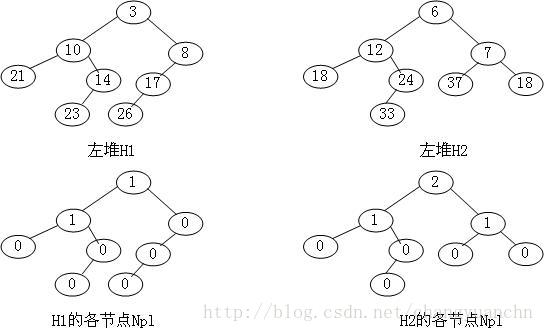

# 左式堆

## 概念
零路径长（null path length）Npl(X)：结点X到一个没有两个儿子的结点的最短路径的长度。这里我们定义没有两个儿子的结点的Npl(x) =0；Npl(NULL) = 0.

对于任意节点的左右两个子节点，右子节点的npl不大于左子节点的npl，这样的堆我们称为左堆。

Leftist Heap只有在不满足左堆的性质时才会旋转，而Skew Heap每次操作都要旋转。

左堆的左子树节点数量往往大于右子树。

## 合并
 