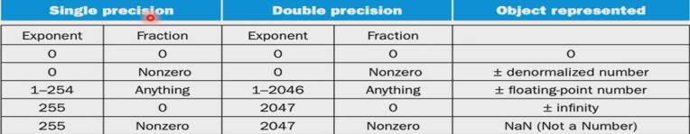

# 计算机系统基础

## 除法器
有符号数相除,约定 ```remainder``` 符号与 被除数符号一致.
 > 例: -7 / 2 = -3 余 -1
 > 7 / (-2) = -3 余 1
运算的结果放在 ```remainder``` 中,高位是余数,低位是商

## 浮点数
### 单精度浮点数
用8位表示指数,23位表示尾数
第31位表示正负,30到23位表示指数,22位到0位表示尾数
指数部分有 ```bias = 127``` 的偏移量,真正的指数等于 ```exp - bias ```
> 例: -0.11 = -1.1 * 2 ^-1^ 表示成单精度: 1 01111110 10000000000000000000000
> 15 = 1111 = 1.111 * 2 ^3^ 表示成单精度 : 0 10000010 11100000000000000000000
注意:指数部分 00000000 和 11111111 作为保留数,不允许使用.
所以单精度浮点数最小可以表示 $\pm$ 1.0 * 2 ^-126^ $\approx$ $\pm$ 1.2 * 10 ^-38^
最大可以表示 $\pm$ 2.0 * 2 ^127^ $\approx$ $\pm$ 3.4 * 10 ^38^
精度相当于6位十进制数, 23 * $\log2$ $\approx$ 23 * 0.3 $\approx$ 6
### 双精度浮点数
用11位表示指数,52位表示尾数
第31位表示正负,30到20位表示指数,19位到0位再加上另一个寄存器的32位表示尾数
指数部分有```bias = 1023``` 的偏移量,真正的指数等于 ```exp - bias```

> 最小可以表示 $\pm$1.0 * 2 ^-1022^ $\approx$ $\pm$ 2.2 * 10 ^-308^
> 最大可以表示 $\pm$ 2.0 * 2 ^1023^ $\approx$ $\pm$ 1.8 * 10 ^308^
> 精度相当于16位十进制数
### 浮点数的上溢和下溢表示
 - exp = 111…… fraction = 000…… 表示上溢(INF)
 - exp = 111…… fraction != 000…… 表示下溢(NAN)

### 计算
#### 加法