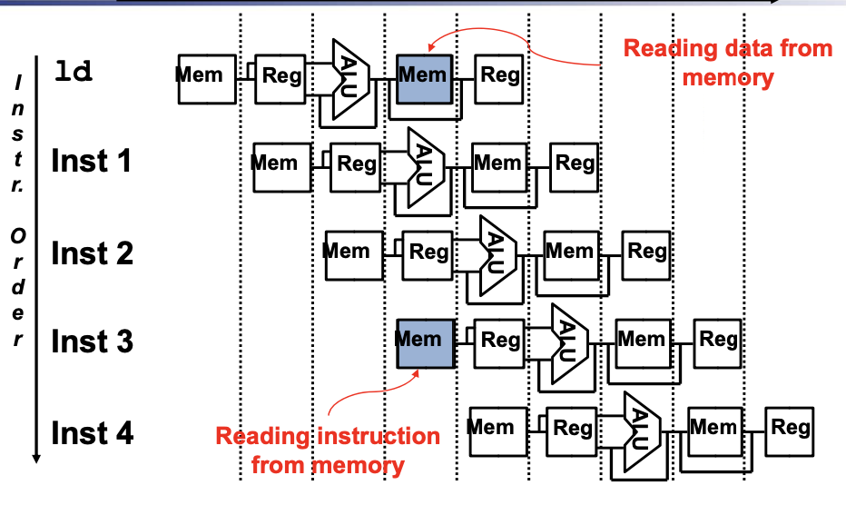
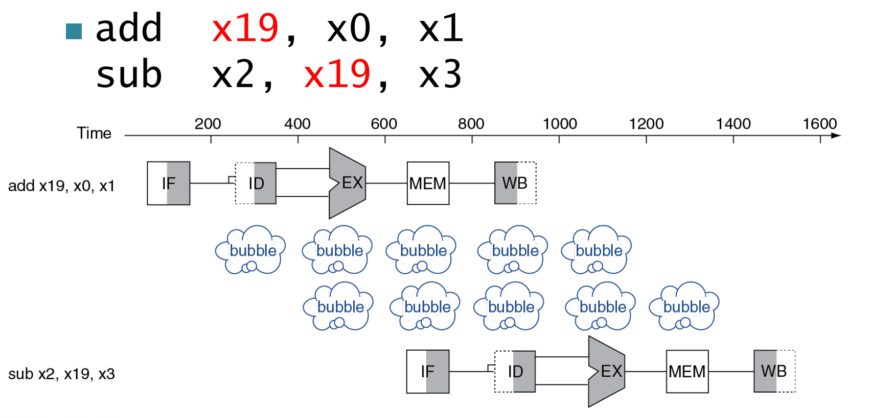
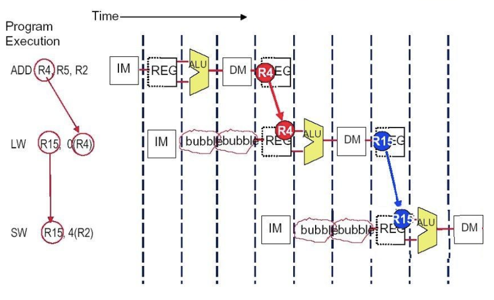
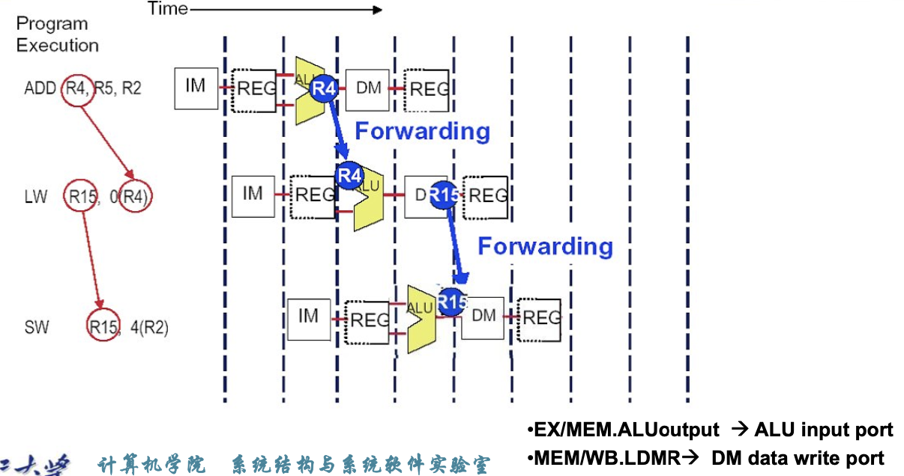
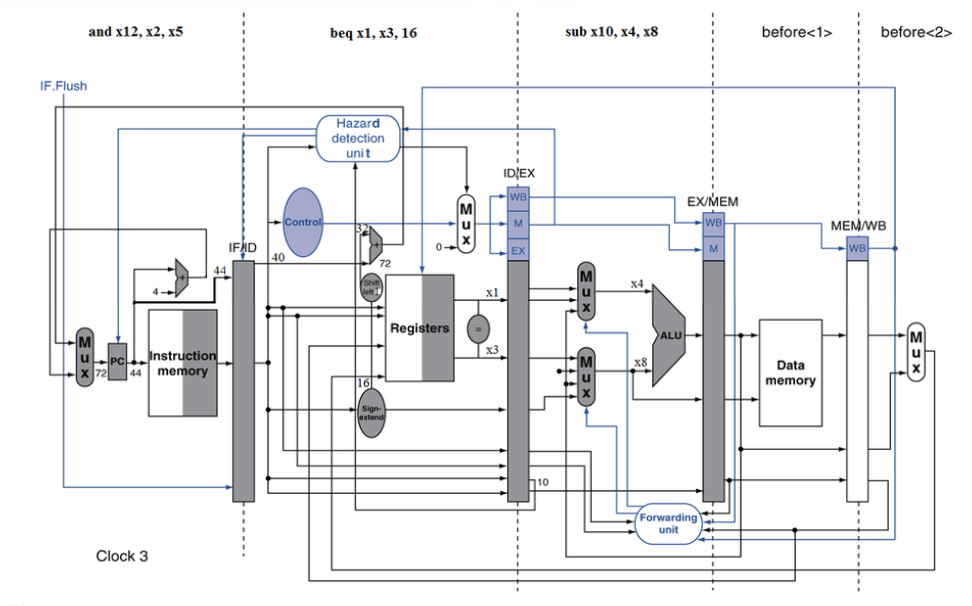
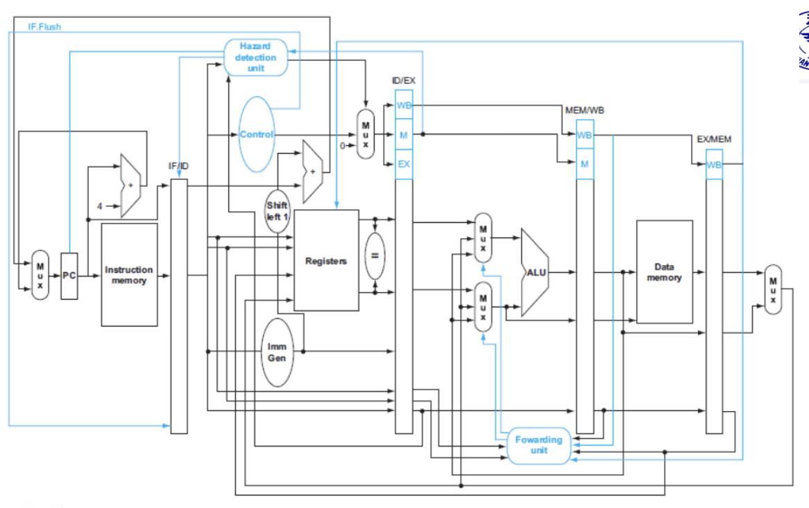

# Chapter 4.Processor

## Pipeline

### Five stages

1. IF: Instruction fetch from memory(取指)
2. ID: Instruction decode & register read(译码)
3. EX: Execute operation or calculate address(执行)
4. MEM: Access data memory operand(访存)
5. WB: Write result back to register(写回)

### Pipeline registers

1. IF/ID(从取指到译码): 存储```指令,PC,分支预测信息```
2. ID/EX(从译码到执行): 存储```rs1,rs2,imm,wt_addr,控制信号,PC,PC + 4```
3. EX/MEM(从执行到访存): 存储```ALU_res,zero,写入内存的数据,wt_addr,控制信号,PC + imm,PC + 4```
4. MEM/WB(从访存到写回): 存储```内存中读取到数据,ALU_res,wt_addr,控制信号```

## Hazard

引入加速比的概念

$$
\begin{align*}
Speedup \ from \ pipeline &= \frac{Average\ instruction\ time\ unpipelined}{Average\ instruction\ time\ pipelined} 
\\ 
&=\frac{CPI\ unpipelined * Clock\ cycle\ unpipelined}{CPI\ pipelined * Clock\ cycle\ pipelined}
\\
&=\frac{CPI\ unpipelined}{CPI\ pipelined} * \frac{Clock\ cycle\ unpipelined}{Clock\ cycle\ pipelined}
\end{align*}
$$

- 从右到左到数据流会导致冒险
- 最简单的解决办法—```stall```,在指令之间插入空指令,防止冒险.
  - 弊端:会降低效率

### Structure Hazard

需要使用到的元件被占用了



如图,我的```inst1```需要用到内存,但此时内存正在被```inst3```使用,发生了结构冒险

??? note
    注意,有一类特殊情况,由于寄存器是可以随时读,但只能在上升沿写的.因此如果我某条指令在读寄存器,但另一条指令在写寄存器,这不属于结构冒险,程序可以正常执行.

### Data Hazard

我现在要用的数据还没有传递过来,如:



这里第二条指令需要用到```x19```,但此时```x19```还没有写入寄存器,但它在```EX```时已经产生了,这就是数据冒险

??? tip "解决方法"
    - 核心思想:不要等到数据自己存到寄存器,当数据产生时,我们可以直接把它前递到需要使用到地方,提高效率.
    - 但是前递并不能百分百避免```stall```,如果我们需要的数据还没产生,就只能插入空指令等到它产生.

如何探测我们需要前递?

1. 判断寄存器编号: EX阶段使用到寄存器编号(rs)是否与MEM/WB阶段写回的寄存器编号(rd)相同
2. Data hazards when
    - Fwd from EX/MEM pipeline reg
        - ```EX/MEM.RegisterRd = ID/EX.RegisterRs1```
        - ```EX/MEM.RegisterRd = ID/EX.RegisterRs2```

    - Fwd from MEM/WB pipeline reg

        - ```MEM/WB.RegisterRd = ID/EX.RegisterRs1```
        - ```MEM/WB.RegisterRd = ID/EX.RegisterRs2```

3. 只有我们需要改变寄存器的值的时候才会用前递,有些指令根本不可能写回寄存器,没有有效的rd
      - 即:```EX/MEM.RegWrite,MEM/WB.RegWrite != 0 且 EX/MEM.RegisterRd,MEM/WB.RegisterRd存在```

!!! tip "Set Forwarding Signals"

    |  Mux control  | Source |                 Explanation                  |
    | :-----------: | :----: | :------------------------------------------: |
    | ForwardA = 00 | ID/EX  |         第一个ALU源操作数来自寄存器          |
    | ForwardA = 10 | EX/MEM |     ALU源操作数是从前边的ALU_res前递来的     |
    | ForwardA = 01 | MEM/WB | ALU源操作数是从前边的内存或更早的ALU前递来的 |

    - If (```EX/MEM.RegWrite and (EX/MEM.RegisterRd != 0) and (EX/MEM.RegisterRd = ID/EX.RegisterRs1)```)
        - ForwardA = 10
    - If (```EX/MEM.RegWrite and (EX/MEM.RegisterRd != 0) and (EX/MEM.RegisterRd = ID/EX.RegisterRs2)```)
        - ForwardB = 10
    - If (```MEM/WB.RegWrite and (MEM/WB.RegisterRd != 0) and (MEM/WB.RegisterRd = ID/EX.RegisterRs1)```)
        - ForwardA = 01
    - If (```MEM/WB.RegWrite and (MEM/WB.RegisterRd != 0) and (MEM/WB.RegisterRd = ID/EX.RegisterRs2)```)
        - ForwardB = 01

!!! note
    考虑以下汇编代码
    ```assembly
    add x1, x1, x2
    add x1, x1, x3
    add x1, x1, x4
    ```
    这里有两个数据冒险,我们重点关注后两条指令.
    
    第二条指令的```EX```阶段需要用到第一条指令写回的```x1```,第三条指令的```EX```阶段需要用到第二条指令写回的```x1```.

    如果我们的```Forwarding```信号没有优先级的话,那么等到我第三条指令需要从前边得到```x1```时,我有可能取到的是当前```MEM/WB```阶段写回的```x1```,而不是```EX/MEM```阶段写回的```x1```.但是此时```MEM/WB```阶段写回的```x1```实际上是第一条指令的```x1```,而不是我们想要的第二条指令的```x1```.

    因此我们需要添加一个条件:**只有当EX/MEM的条件不成立时**,才能查看,才能查看MEM/WB的条件

于是就有了下边的```Forwarding```信号

  - If (```MEM/WB.RegWrite and (MEM/WB.RegisterRd != 0) and not (EX/MEM.RegWrite and (EX/MEM.RegisterRd != 0) and (EX/MEM.RegisterRd = ID/EX.RegisterRs1)) and (MEM/WB.RegisterRd = ID/EX.RegisterRs1)```)
      - ForwardA = 01
  - If (```MEM/WB.RegWrite and (MEM/WB.RegisterRd != 0) and not (EX/MEM.RegWrite and (EX/MEM.RegisterRd != 0) and (EX/MEM.RegisterRd = ID/EX.RegisterRs1)) and (MEM/WB.RegisterRd = ID/EX.RegisterRs2)```)
    - ForwardB = 01

#### Load-Use Data Hazards

如果我们的load指令在EX/MEM时停止,此时ld后边有两条指令需要暂停,但其实我们可以更早发现这个问题

- `ID/EX.MemRead and ((ID/EX.RegisterRd = IF/ID.RegisterRs1) or (ID/EX.RegisterRd = IF/ID.RegisterRs2))`

如果探测到了,就```stall and insert nop```

如果发生了load-use冒险,load的下一条指令在load 的```EX```阶段,即load的下一条指令的ID阶段检测到了冒险,那么我们需要做如下三件事(相当于把load后边的两条指令都阻塞了一个时钟周期):

1. 把```ID/EX```阶段控制信号清零,而不是把译码得到的控制信号给EX
2. 保持```IF/ID```阶段寄存器值不变,而不送入当时取出的指令
3. 保持PC值不变,这样阻塞一个时钟周期后load的下下一条指令可以正常取指

然后再通过forwarding,把load指令在MEM阶段得到的数据传递给阻塞后的下一条指令的EX阶段

#### How to Stall the Pipeline

- 强制把ID/EX寄存器中的控制信号变为0
  - EX,MEM and WB do ```nop```

考虑如下汇编代码:

``````assembly
add r4,r5,r2
lw r15,0(r4)
sw r15,4(r2)
``````

不用forwarding的解决方式:



我们在lw和sw指令的IM和REG之间插入了两个bubble.

用forwarding的解决方式:



### Control Hazard

!!! note
    如果我有一条B型指令,需要跳转,但是此时的PC并不是我B型指令当前的PC,因此我的跳转地址不是正确的地址.

#### Simple solutions

- Stall
- Prediction
  - Predict-untaken: treat every branch an not taken
  - Predict-taken: treat every branch as taken

- Reducing Branch Delay
- Dynamic Branch Prediction

#### Branch Hazards

是否跳转在MEM阶段决定

最简单的解决方式:无视这种情况,因为前三个阶段并不涉及对寄存器和内存的修改,即使我们预测后续不执行这些指令也不会带来影响,但这样可能导致CPI显著降低

!!! example
    一段汇编代码有30%的branch指令,理论CPI是1,如果插入stall,性能如何?

    > CPI = 1 + 30% * 3 = 1.9 >> 1

    显著降低了性能

另一种方法是在ID阶段决定是否跳转,因为此时我们已经有了两个源操作数和立即数



#### Dynamic Branch Prediction

In deeper and superscalar pipelines,branch penalty is more significant 

Use dynamic prediction

- Branch prediction buffer (aka branch history table)
  - 记录前几次是否命中

- Indexed by recent branch instruction addresses
- Stores outcome (taken/not taken)
- To execute a branch
  - Check table,expect the same outcome
  - Start fetching from fall-through or target
  - If wrong,flush pipeline and flip prediction

##### 1-bit prdictor

###### Branch History Table

CPU在拿到一条指令并确定其是分支跳转指令后,就去BHS中找该指令的跳转历史,并通过其跳转历史来预测未来是否跳转.

这里我们记录的是PC的低位,但是如果相同低位而高位不同时,就会出现问题.

!!! example
    考虑以下分支历史:

    ```TNTNTNTNTNTNTN...```,使用```1-bit predictor```但结果就是,除了第一次我们可能预测正确外,其它时候都会预测错误,准确率为0.这显然是不可接受的,由此引入```2-bit predictor```

##### 2-bit predictor

只有在连续错两次时才会修改我们的预测

#### Calculating the Branch Target

即使我们预测出了是否要跳转,我们仍然需要一个时钟的bubble来计算目标地址

!!! note
    - Branch Target Buffer
    - Cache of target addresses
    - Indexed by PC when instruction fetched
        - If hit and instruction is branch predicted taken,can fetch target immediately 

### DataPath



## Exception and Interrupt

- Exception:异常
  - 在CPU内部引起
- Interrupt:中断
  - 由外部输入或硬件引起

### Handling Exceptions

- Save PC of offending (or interrupted) instruction
  - In RISC-V:**Supervisor Exception Program Counter(SEPC)**
- Save Indication of the problem
  - In RISC-V:**Supervisor Exception Cause Register(SCAUSE)**
- Jump to handler
  - 必须由硬件跳到这个地址
  - Direct:所有异常跳到固定地址
  - Vectored Interrupts:中断向量
    - 由异常的种类决定我们跳到哪个地方,异常,外部中断,非法指令跳到不同的程序

如果我同时有多个异常/中断,如何处理?

#### Handler Actions-中断服务程序

- Read cause,and transfer to relevant handler
- Determine action required
- If restartable
  - Take corrective action 
  - use SEPC to return to program
- Otherwise
  - Terminate program
  - Report error using SEPC,SCAUSE...
