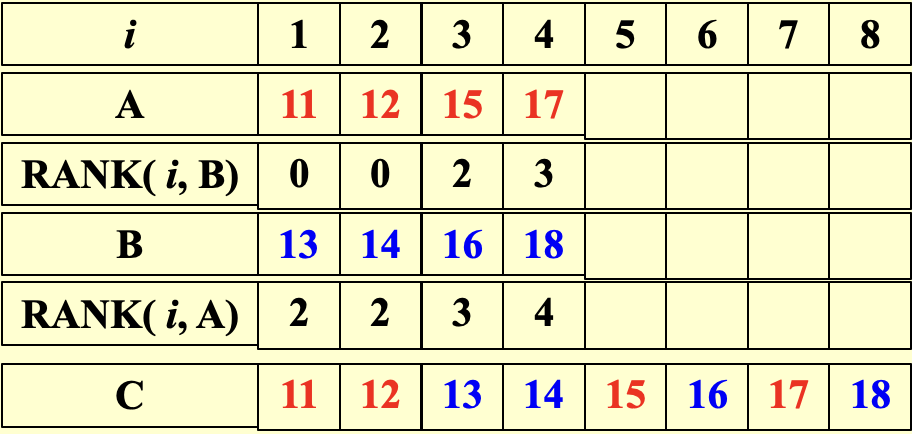
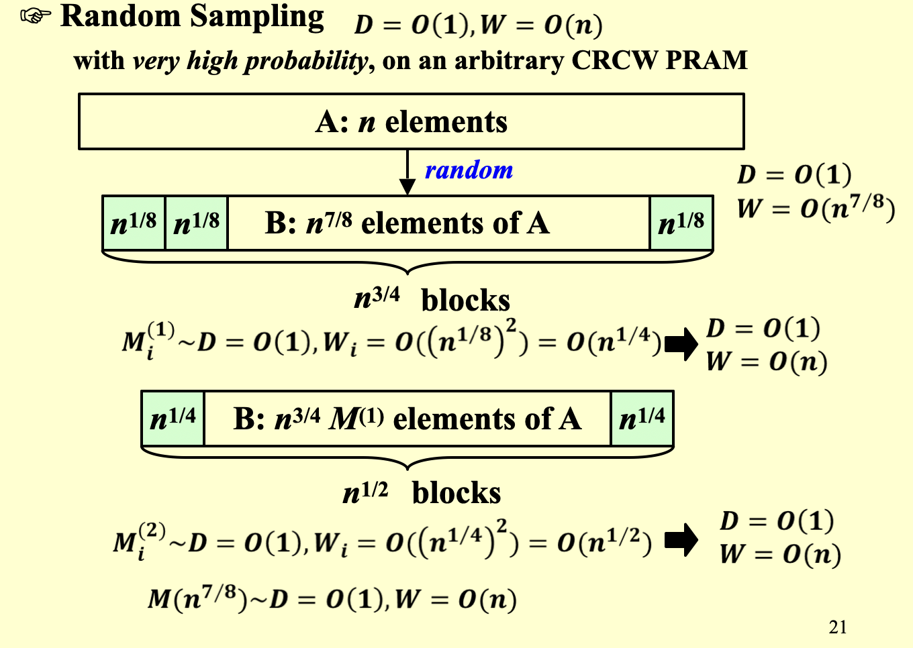

# Parallel Algorithms

对于一个并行算法,

- 它的work W定义为我需要多少单位时间的操作来完成这个算法
  - W = T~1~
- 它的depth D定义为最长的序列
  - $D = T_{\infty}$

## Brent’s theorem

- A lower bound
  - $\frac{W}{P} \leq T_{P}$
- An upper bound
  - $T_{P} \leq \frac{W}{P} + D$
  - 上界的证明:
    - 假设每一层有$W_{i}$个,一共有D层,那么我在这一层所需要的时间是$\lfloor \frac{W_{i}}{P} \rfloor \leq \frac{W_{i}}{P} + 1$
    - 把每一层加起来
    - $\sum_{1}^{D}(\frac{W_{i}}{P} + 1) = \frac{W}{P} + D$

## Prefix Sums 计算前缀和

Input: A(1),A(2),…,A(n)

Output: $\sum_{i=1}^{k}A(k)$

我们在前边有某个点的$B(h,i)$是它两个儿子的和,且$B(h,i) = B(h-1,2i-1) + B(h-1,2i)$

定义$C(h,i) = \sum_{k = 1}^{\alpha}A(k)$,$(0,\alpha)$是node(h,i)的最右边的一个后代.通俗来说,C(h,i)就是从叶子结点的第一个一直加到它最右边一个后代

!!! note

    根据定义,如果```i == 1```,则```C(h,i) = B(h,i)```

    若 ``` i%2 == 0```,则```C(h,i) = C(h+1,i/2)```,即如果i是偶数,那么它和它的父节点的值一样

    若``` i%2 ==1 && i != 1```,则```C(h,i) = C(h+1, (i-1)/2) + B(h,i)```,就是它的叔叔加上它自己的值

## Merge两个数组

merge两个递增的数组A,B到另外一个递增数组C

为简便起见,我们假设:

1. A和B的元素都是可以比较的
2. $n = m$
3. $\log{n} 和 \frac{n}{\log{n}}$都是整数

对每一个element做rank

- RANK(j,A) = i,if A(i) < B(j) < A(i + 1),for $1 \leq i < n$
- RANK(j,A) = 0,if B(j) < A(1)
- RANK(j,A) = n,if B(j) > A(n)

```c
for Pi,1 <= i <= n pardo
	C(i + RANK(i,B)) := A(i)
for Pi,1 <= i <= n pardo
	C(i + RANK(i,A)) := B(i)
```

如果我知道了rank,那么我所用的时间是$O(1)$,做的work是$O(n + m)$



### Parallel Ranking

#### Stage 1:Partitioning

$ p = \frac{n}{\log{n}}$

把A和B分成P组,每组$\log{n}$个元素

- $A\_select(i) = A(1 + (i-1)\log{n}),for 1 \leq i \leq p$
- $B\_select(i) = B(1 + (i-1)\log{n}),for 1 \leq i \leq p$
  - $D = O(\log{n})$
  - $W = O(p\log{n}) = O(n)$

每组有一个最小的,我们可以先找到每组中最小的那个元素的RANK,然后剩下的元素就被限定在了这个小区域内,节省work

#### Actual Ranking

最多2p个$O(\log{n})$的子问题

- $D = O(\log{n})$
- $W = O(p\log{n}) = O(n)$

Overall: $D = O(\log{n}),W = O(p\log{n}) = O(n)$

## Maximun Finding

在求和问题中,直接把“ + ”号换成max就可以

时间 $ \log n $

work:$ O(n) $

### A Doubly-logarithmic Paradigm

假设$h = \log{\log{n}}$是整数

---

每$\sqrt{n}$为一组

- $A_{1} = A(1) , \dots , A(\sqrt{n}) \Rightarrow M_{1} \sim D(\sqrt{n}),W(\sqrt{n})$
- $A_{2} = A(\sqrt{n} + 1) , \dots , A(2\sqrt{n}) \Rightarrow M_{2} \sim D(\sqrt{n}),W(\sqrt{n})$
- $\dots$
- $A_{\sqrt{n}} = A(n - \sqrt{n} + 1) , \dots , A(n) \Rightarrow M_{\sqrt{n}} \sim D(\sqrt{n}),W(\sqrt{n})$

$M_{1},M_{2},\dots,M_{\sqrt{n}} \Rightarrow A_{max} \sim D^{'} = O(1),W^{'} = (\sqrt{n})^{2} = O(n)$这里后边的近似是用的暴力算法,直接两两比较

$D(n) \leq D(\sqrt{n}) + O(1),W(n) \leq \sqrt{n}W(\sqrt{n}) + O(n) \Rightarrow D(n) = O(\log{\log{n}}),W(n) = O(n\log{\log{n}})$

---

每 h 为一组

- $A_{1} = A(1) , \dots , A(h) \Rightarrow M_{1} \sim O(h)$
- $A_{2} = A(h + 1) , \dots , A(2h) \Rightarrow M_{2} \sim O(h)$
- $\dots$
- $A_{\frac{n}{h}} = A(n - h + 1) , \dots , A(n) \Rightarrow M_{\frac{n}{h}} \sim O(h)$

$M_{1},M_{2},\dots,M_{\sqrt{n}} \Rightarrow A_{max}$

$D(n) = O(h + \log{\log{\frac{n}{h}}}) = O(\log{\log{n}})$

$W(n) = O(h * \frac{n}{h} + \frac{n}{h}\log{\log{\frac{n}{h}}}) = O(n)$

---

#### Random Sampling

$D = O(1),W = O(n)$



!!! note

    这个算法有很高的概率在$O(1)$的深度和$O(n)$的工作量内找到数组$A$的最大值;存在常数$c$,使得算法只有$\frac{1}{n^c}$的概率无法在这一时间复杂度内找到最大值
