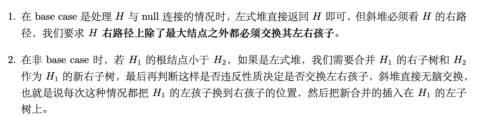

# Skew Heap斜堆

特殊的leftist heap,且满足父节点值小于子节点(最小堆)

## 合并

- 如果一个空斜堆与一个非空斜堆合并，返回非空斜堆.
- 如果两个斜堆都非空,斜堆直接把$H_{1}$的右子树和$H_2$合并,放在$H_1$的右子树位置.
- 然后**将当前根结点的左右孩子互换位置**

## 摊还分析

引入定义:

- 我们称一个结点P是***重的(heavy)***,如果它的右子树结点个数至少是P的所有后代的一半(后代包括P自身).反之则称为***轻结点(light node)***

引理: 

- 对于右路径上右$l$个轻结点的斜堆,整个斜堆至少有$2^l - 1$个结点,这意味着一个$n$个结点的斜堆右路径上的轻结点个数为$O(\log{n})$

那么我们可以有如下摊还时间复杂度的定理:

- 若我们有两个斜堆$H_1$和$H_2$,它们分别有$n_1$和$n_2$个结点,则合并$H_1$和$H_2$的摊还时间复杂度为$O(\log{n})$,其中$n = n_1 + n_2$

同时还可以有如下的性质:

1. 在合并过程中,只有$H_1$和$H_2$右路径上的结点才可能改变轻重状态.因为其他结点合并前后子树是完全复制的,不可能改变轻重状态
2. $H_1$和$H_2$右路径上的**重结点在合并后一定会变成轻结点**,这是因为右路径上的结点一定会交换左右子树,并且后续所有结点也都会继续插入在左子树上.然而**轻结点不一定会变成重结点**