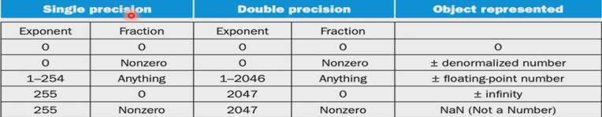

# Chapter 1
## 除法器
有符号数相除,约定 ```remainder``` 符号与 被除数符号一致.
 > 例: -7 / 2 = -3 余 -1
 > 7 / (-2) = -3 余 1
运算的结果放在 ```remainder``` 中,高位是余数,低位是商

## 浮点数
### 单精度浮点数
用8位表示指数,23位表示尾数
第31位表示正负,30到23位表示指数,22位到0位表示尾数
指数部分有 ```bias = 127``` 的偏移量,真正的指数等于 ```exp - bias ```
!!! example
    -0.11 = -1.1 * 2 ^-1^ 表示成单精度: 1 01111110 10000000000000000000000

    15 = 1111 = 1.111 * 2 ^3^ 表示成单精度 : 0 10000010 11100000000000000000000

    -15 = -1.111 * 2 ^3^ 表示成单精度 : 1 10000010 11100000000000000000000
注意:指数部分 00000000 和 11111111 作为保留数,不允许使用.
所以单精度浮点数最小可以表示 $\pm$ 1.0 * 2 ^-126^ $\approx$ $\pm$ 1.2 * 10 ^-38^
最大可以表示 $\pm$ 2.0 * 2 ^127^ $\approx$ $\pm$ 3.4 * 10 ^38^
精度相当于6位十进制数, 23 * $\log2$ $\approx$ 23 * 0.3 $\approx$ 6
### 双精度浮点数
用11位表示指数,52位表示尾数
第31位表示正负,30到20位表示指数,19位到0位再加上另一个寄存器的32位表示尾数
指数部分有```bias = 1023``` 的偏移量,真正的指数等于 ```exp - bias```

> 最小可以表示 $\pm$1.0 * 2 ^-1022^ $\approx$ $\pm$ 2.2 * 10 ^-308^
> 最大可以表示 $\pm$ 2.0 * 2 ^1023^ $\approx$ $\pm$ 1.8 * 10 ^308^
> 精度相当于16位十进制数
### 浮点数的上溢和下溢表示
#### 非规格化数
exp全0,用来表示0以及非常接近0的数.

$x=(-1)^{sign} \times ((0.fraction) \times 2^{1-bias})$
#### 特殊数
 - exp全1,fraction全0,表示 $\pm$ INF
 - exp全1,fraction不全0,表示 NaN

### 计算

#### 十进制与二进制互转

##### 十进制小数转二进制

将十进制小数乘以二,取出整数部分,再继续对剩下的小数做同样操作.如:

1. 要将0.15625转为二进制,首先将0.15625*2 = 0.313,取整数部分为0;
2. 再将0.313*2 = 0.626 ,整数部分为0;
3. 再0.626*2 = 1.252,整数部分为1,去掉整数,保留小数;
4. 0.252*2 = 0.504,整数部分为0;
5. 0.504*2 = 1.008,整数部分为1;
6. 最后根据题目的精度要求保留
7. 最终得到(0.15625)~10~=(0.00101)~2~=1.01*2^{-3}^ 

##### 二进制小数转十进制

分别考虑整数和小数部分:

- 整数部分直接转
- 小数部分,二进制0.1对应十进制0.5($\frac12$),二进制0.01对应十进制0.25($\frac14$),以此类推,得到小数部分
- 最后整数和小数相加