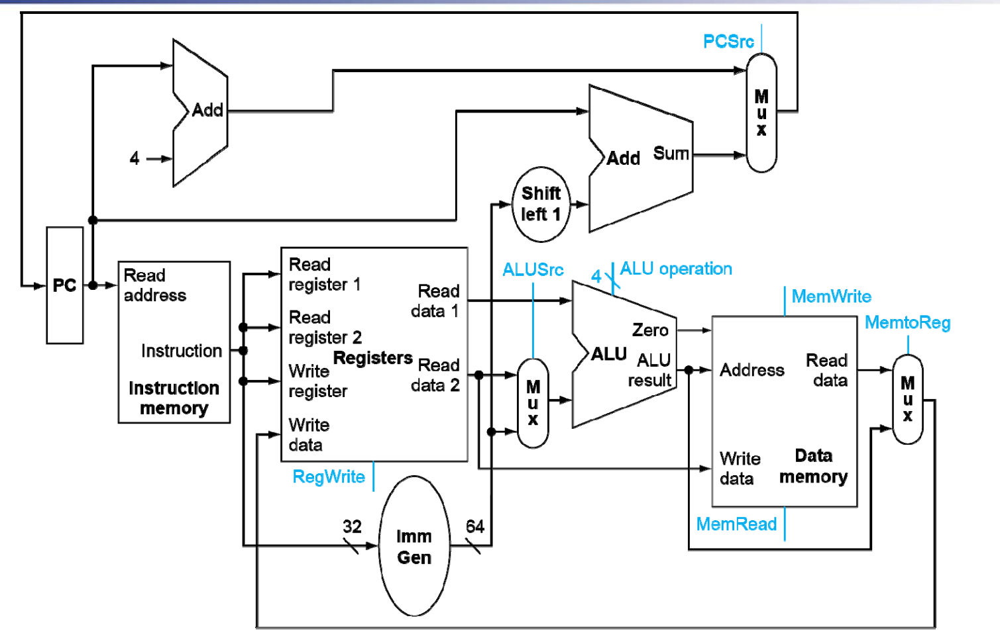
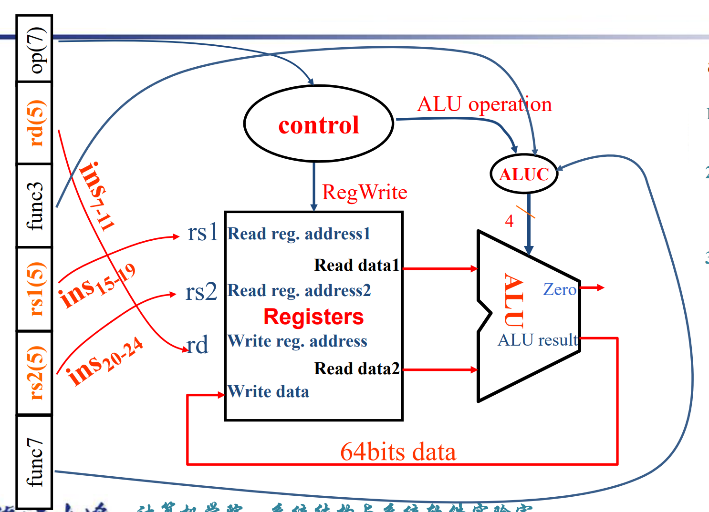
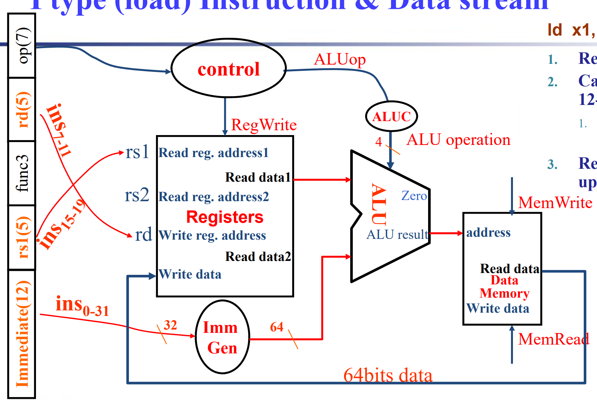
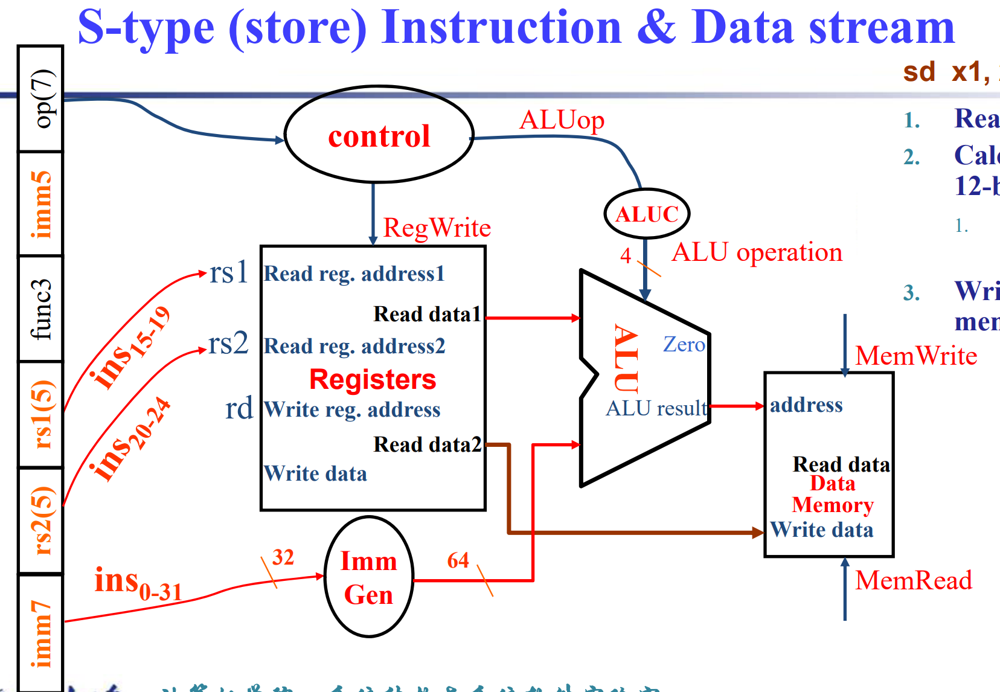
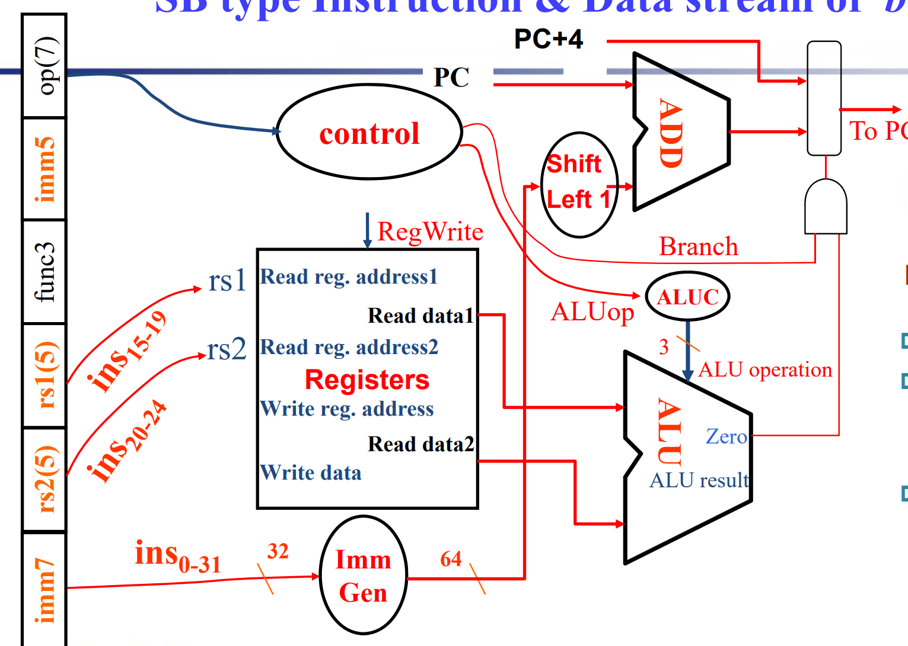
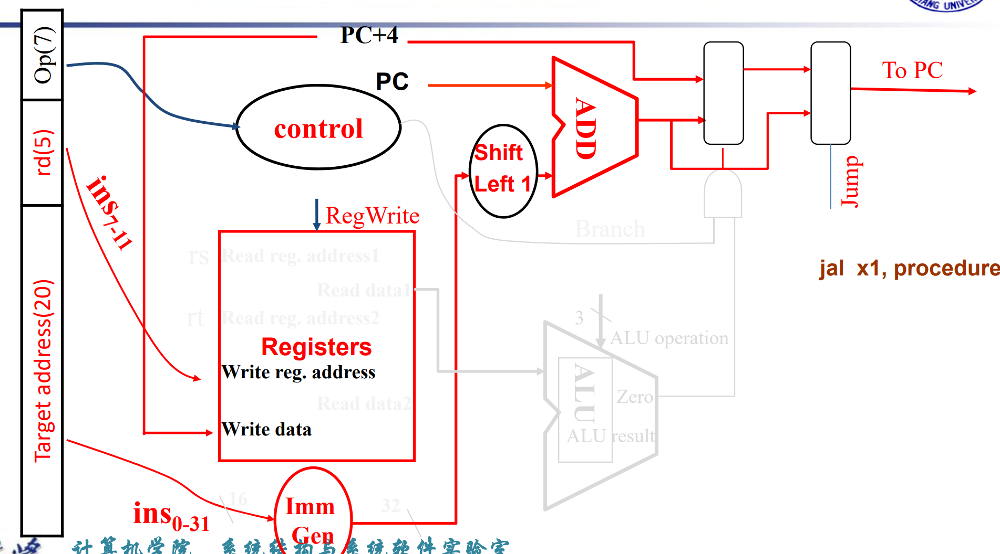

# Chapter 2
## RISC-V 指令
小端:低位放在地址较小处;大端相反
### Registers
|Name|Register name|usage|preserved on call?|
|---|---|---|---|
|x0|0|Constant value 0||n.a.|
|x1(ra)|1|return address(link register)|yes|
|x2(sp)|2|stack pointer|yes|
|x3(gp)|3|global pointer|yes|
|x4(tp)|4|thread pointer|yes|
|x5-x7|5-7|temporaries|no|
|x8-x9|8-9|saved|yes|
|x10-x17|10-17|arguments/results|no|
|x18-x27|18-27|saved|yes|
|x28-x31|28-31|temporaries|no|

### Data Path


### R-type
#### 内部结构
|7bits|5bits|5bits|3bits|5bits|7bits
| --- | --- | --- | --- | --- | --- |
|^31^funct7^25^|^24^rs2^20^|^19^rs1^15^|^14^funct3^12^|^11^rd^7^|^6^opcode^0^|

#### 具体指令
opcode = ```0110011```

不包含立即数的所有整数计算指令，一般表示寄存器-寄存器操作的指令,如:

 - add,sub,and,or,nor,sll,srl,sra,slt,sltu
#### Data_Path

#### 机器码转换
> ```add x9,x20,x21 -> 0000000 10101 10100 000 01001 0110011 = 0x015A04B3```

|7bits|5bits|5bits|3bits|5bits|7bits
| --- | --- | --- | --- | --- | --- |
|0000000|10101(21)|10100(20)|000|01001|0110011|

由于二进制太长,我们通常用十六进制表示

### I-type
#### 内部结构
|12bits|5bits|3bits|5bits|7bits
| ---| --- | --- | --- | --- |
|^31^immediate[11:0]^20^|^19^rs1^15^|^14^funct3^12^|^11^rd^7^|^6^opcode^0^|

#### 具体指令
opcode = ```0010011,0000011,1100111```
相当于将 R-typed 指令格式中的一个操作数改为立即数,如:

 - 算术型(```0010011```):addi,xori,ori,andi,slli,srli,srai,slti,sltiu
  : ```addi rd,rs1,imm```

 - load型(```0000011```):lb,lh,lv,lbu,lhu
  : ```lb rd,imm(rs1)```:从内存读8bit数据,内存地址=rs1 + imm,数据写入rd

 - store型(```1100111```):jalr
  : ```jalr rd,imm(rs1)```:```rd```存储返回地址(```pc + 4```),然后跳转到新地址(```rs1 + imm```)
#### 立即数生成
```imm = {{20{inst[31]}},inst[31:20]}```

#### Data_Path
##### load型


### S-type
#### 内部结构
|7bits|5bits|5bits|3bits|5bits|7bits
| --- | --- | --- | --- | --- | --- |
|^31^immediate[11:0]^25^|^24^rs2^20^|^19^rs1^15^|^14^funct3^12^|^11^immediate[4:0]^7^|^6^opcode^0^|

#### 具体指令
opcode = ```0100011```
一般表示访存store指令,如:

 - sw(存储字),sh(半字),sb(字节)
  : ```sb rs2,imm(rs1)```:将rs2低8位写入内存,内存地址 = rs1 + imm
#### Data_Path

#### 立即数生成
```imm = {{20{inst[31]}},inst[32:25],inst[11:7]}```

### B-type
#### 内部结构
|7bits|5bits|5bits|3bits|5bits|7bits
| --- | --- | --- | --- | --- | --- |
|^31^immediate[12,10:5]^25^|^24^rs2^20^|^19^rs1^15^|^14^funct3^12^|^11^immediate[4:1,11]^7^|^6^opcode^0^|

#### 具体指令
opcode = ```1100011```
一般表示条件跳转指令,如:
 - beq(相等),bne(不相等),bge(大于等于),bgeu,blt(小于),bltu
  : ```beq rs1, rs2, imm```:比较rs1和rs2的值,相等则跳转到新地址(imm),不相等则执行下一条指令(pc = pc + 4)
#### Data_Path

### 立即数生成
```imm = {{19{inst[31]}},inst[31],inst[7],inst[30:25],inst[11:8],1'b0}```

### J-type
#### 内部结构
|20bits|5bits|7bits|
| :-: | --- | --- |
|^31^immediate[20,10:1,11,19,12]^12^|^11^rd^7^|^6^opcode^0^|

#### 具体指令
opcode = ```1101111```

一般表示无条件跳转指令,如:

 - jal(```jal rd,label```):将当前指令的下一条地址```(pc + 4)```存储到```rd```,然后跳转到```label```

#### Data_Path

#### 立即数生成
```imm = {{11{inst[31]}},inst[31],inst[19:12],inst[20],inst[30:21],1'b0}```

### U-type
#### 内部结构
|20 bits|5 bits|7 bits|
| :-: | :-: | :-: |
|^31^immediate[31 : 12]^12^|^11^rd^7^|^6^opcode^0^|

#### 具体指令
opcode = ```0110111,0010111```
一般表示长立即数操作指令,如:
 - lui(```0110111,lui x5, imme[4:0]```):将立即数左移12位,并将低12位置0,将结果写回目的寄存器

 - auipc(```0010111,auipc x1,imme[4:0]```):将PC高20位加上imme存储到x1

#### 立即数生成
```imm = {inst[31:12],12'b0}```