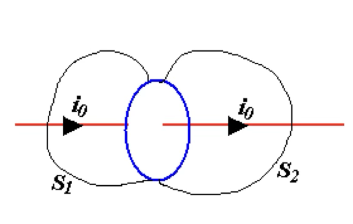
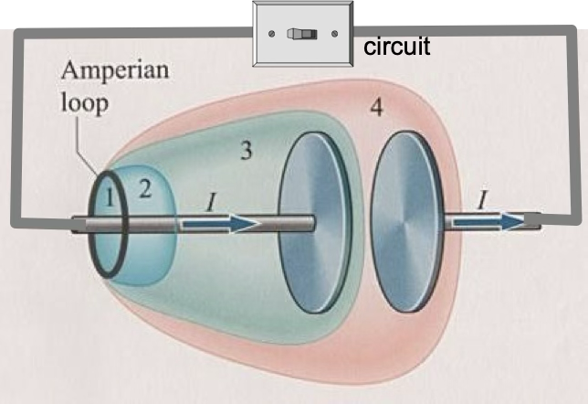
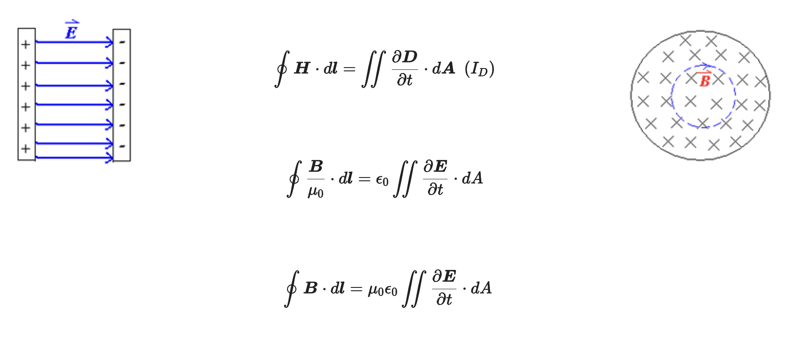
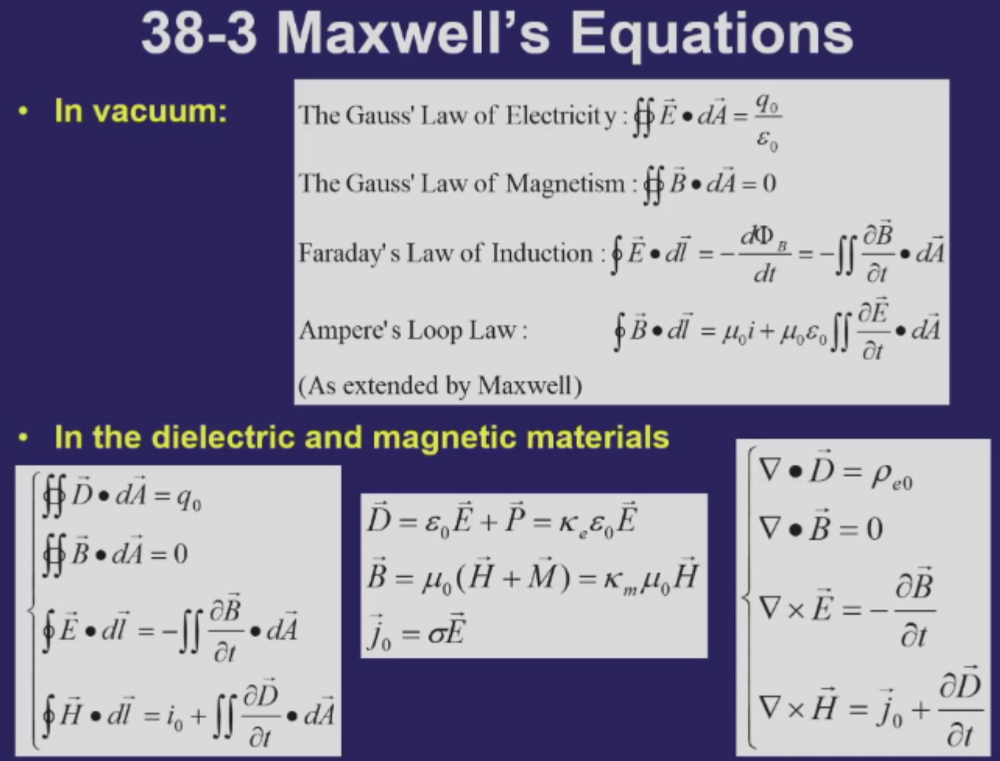

# Maxwell’s Equations

## 电磁学基本方程

四个方程(真空中):

- 电场高斯定理:

$$
\iint \vec{E} \cdot d \vec{A} = \frac{q_{0}}{\epsilon_{0}}
$$

- 磁场高斯定理:

$$
\iint \vec{B} \cdot d \vec{A} = 0\notag
$$

- 法拉第电磁感应定律:

$$
\oint \vec{E} \cdot d \vec{l} = -\frac{d\phi_{B}}{dt} = -\iint \frac{\partial \vec{B}}{\partial t} \cdot d \vec{A}\notag
$$

- 安培环路定律:

$$
\oint \vec{B} \cdot d\vec{l} = \mu_{0}i\notag
$$

---

电介质中:

引入极化强度矢量$\vec{P}$,电位移矢量$\vec{D}$,介电常数$\kappa_{e}$,电流密度$\vec{J}$,磁感应强度$\vec{B}$,磁场强度$\vec{H}$,磁化强度$\vec{M}$.它们有如下的关系:

$$
\vec{D} = \epsilon_{0} \vec{E} + \vec{P} = (1 + \chi_{e})\epsilon_{0} \vec{E} = \kappa_{e} \epsilon_{0} \vec{E}
\vec{J_{0}} = \sigma \vec{E}(欧姆定律微分形式)\notag
$$

$$
\vec{H} = \frac{\vec{B}}{\mu_{0}} - \vec{M}
$$

$$
\vec{M} = \chi_{m}\vec{H}
\Rightarrow
\vec{B} = \mu_{0}(\vec{H} + \vec{M}) = \mu_{0}(1 + \chi_{m})\vec{H} = \mu_{0}\kappa_{m}\vec{H}\notag
$$

从而引入新方程:

$$
\iint \vec{D} \cdot d\vec{A} = q_{0}
$$

$$
\iint \vec{B} \cdot d \vec{A} = 0
$$

$$
\oint \vec{E} \cdot d \vec{l} = - \iint \frac{\partial \vec{B}}{\partial t} \cdot d \vec{A}
$$

$$
\oint \vec{H} \cdot d \vec{l} = \iint \vec{J} \cdot d \vec{A}\notag
$$

把它变成微分形式:

$$
\left\{
\begin{matrix}
\nabla \cdot \vec{D} = \rho_{e0} \\
\nabla \cdot \vec{B} = 0 \\
\nabla \times \vec{E} = -\frac{\partial \vec{B}}{\partial t} \\
\nabla \times \vec{H} = \vec{j_{0}}
\end{matrix}
\right.\notag
$$

---

对称性原则:科学家希望世界是对称的,磁场和电场也一样

所以科学家引入磁荷$q_{m}$对方程修正

$$
\left \{
\begin{matrix}
\iint \vec{B} \cdot d \vec{A} = 0 \\
\oint \vec{E} \cdot d \vec{l} = - \iint \frac{\partial \vec{B}}{\partial t} \cdot d \vec{A}
\end{matrix}
\right.
\rightarrow
\left \{
\begin{matrix}
\iint \vec{B} \cdot d \vec{A} = q_{m} \\
\oint \vec{E} \cdot d \vec{l} = \frac{dq
_{m}}{dt} - \iint \frac{\partial \vec{B}}{\partial t} \cdot d \vec{A}
\end{matrix}
\right.\notag
$$

## Stokez公式与麦克斯韦方程

先用电场的环路定理,然后用斯托克斯公式变成面积分

$$
\oint \vec{H} \cdot d \vec{l} = i_{0} = \iint_{S_{2}} \vec{j_{0}} \cdot d \vec{A} 
$$

$$
\iint_{S_{1}} \vec{j_{0}} \cdot d \vec{A} = \iint_{S_{2}} \vec{j_{0}} \cdot \vec{A} = i_{0}
$$

$$
\iint_{S} \vec{j_{0}} \cdot \vec{A} = \iint_{S_{1}} \vec{j_{0}} \cdot d \vec{A} + \iint_{S_{2}} \vec{j_{0}} \cdot d \vec{A} = 0\notag
$$

!!! note 
    第二个式子是分别对两个曲面用环路定理,都等于$i_{0}$,然后把左边的关于$s_{1}$的积分移到右边去,相当于两个半个面合并为一个闭合曲面,最终结果等于零.

只要任何一个闭合曲面的积分,电流流进去和流出来的相等,那我任意取面,上边的公式都是成立的.

但是这个结论对于电容器充电过程并不成立.

!!! warning
    对于上边的电容器充电过程,电流从左边流入,右边流出.对于$(1,2),(1,4)$构成的曲面,流进去和流出来是相等的,曲面积分为0.但是由于电容器两极板间没有电流,所以$(1,3)$构成的曲面,流入流出的电流并不相等,曲面积分不为0,不好.

所以自然引入位移电流$i_{D}$

$$
\oint \vec{H} \cdot d \vec{l} = I_{0} + I_{D}\notag
$$

我们想要知道$I_{D}$到底是什么,从曲面积分出发

对于$(1,3)$曲面,记为$S$,电流只进不出

$$
\iint_{S} \vec{J} \cdot d \vec{A} = -\frac{dq}{dt} (电流定义)
$$

$$
\iint_{S} \vec{D} \cdot d \vec{A} = q (高斯定律)
$$

$$
对q微分 \\ \Rightarrow
\frac{dq}{dt} = \frac{d}{dt} \iint_{S} \vec{D} \cdot d \vec{A} = \iint_{S} \frac{\partial \vec{D}}{\partial t} \cdot d \vec{A}\notag
$$

带回第一个式子

$$
\iint_{S} \vec{J} \cdot d \vec{A} = - \iint_{S} \frac{\partial \vec{D}}{\partial t} \cdot d \vec{A}
$$

$$
\iint_{S}(\vec{j_{0}} + \frac{\partial \vec{D}}{\partial t}) \cdot d \vec{A} =0
$$

$$
- \iint_{S_{1}}(\vec{j_{0}} + \frac{\partial \vec{D}}{\partial t}) \cdot d \vec{A} = \iint_{S_{3}}(\vec{j_{0}} + \frac{\partial \vec{D}}{\partial t}) \cdot d \vec{A}\notag
$$

我们发现$j_{0} + \frac{\partial D}{\partial t}$在这个过程中进出是相等的,1曲面没有位移电流,3曲面没有自由电流,位移电流$I_{D} = I_{0}$

引入三个物理量

$$
\left\{
\begin{matrix}
\Phi_{D} = \iint \vec{D} \cdot d \vec{A} \ electric \ displacement \ flux \ 电位移通量 \\
i_D = \frac{d\Phi_{D}}{dt} = \iint \frac{\partial \vec{D}}{\partial t} \cdot d \vec{A} \ displacement \ current \ 位移电流 \\
\vec{j_{D}} = \frac{\partial \vec{D}}{\partial t} \ displacement \ current \ density \ 位移电流密度
\end{matrix}
\right.\notag
$$

所以我们就得到了新的安培环路定理:

$$
\oint \vec{H} \cdot d \vec{l} = i_{0} + i_{D} = \iint(\vec{j_{0}} + \frac{\partial \vec{D}}{\partial t}) \cdot d \vec{A}\notag
$$

考虑下图的电容器充电,两极板间有位移电流$I_{D}$,外边电路有自由电流$I_{0}$,我们想证明$I_{D} = I_{0}$

!!! note
    电容器之间电场$E = \frac{\sigma_{e}}{\epsilon_{0}} = \frac{q}{\epsilon_{0}A}$,$\sigma_{e}$是面电荷密度,等于$\frac{q}{A}$

    $q = \epsilon_{0}AE = \epsilon_{0} \Phi_{E} = AD$

    (我们知道$D = \epsilon_{0} \vec{E} + \vec{P}$,电介质没有介质时,$\vec{P} = 0$,所以$D = \epsilon_{0}E = \Phi_{E}$)

    $$
    \Rightarrow i_{0} = \frac{dq}{dt} = \epsilon_{0} \frac{d\Phi_{E}}{dt} = \frac{d\Phi_{D}}{dt} = i_{D}
    $$

    我们就证明了$i_{D} = i_{0}$

如果电容器充满电,$i_{0} = i_{D} = 0$

变化的电场产生磁场,变化的磁场产生电场,这就是麦克斯韦方程.

最后可以得到:

$$
\oint \vec{H} \cdot d\vec{l} = \iint \vec{J} \cdot d \vec{S} + \iint \frac{\partial \vec{D}}{\partial t} \cdot d\vec{S} \\
\nabla \times \vec{H} = \vec{J} + \frac{\partial D}{\partial t}\notag
$$

最终得到麦克斯韦方程组:

