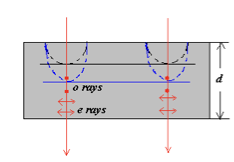

!!! note "可见光波长"
    - 可见光波长:$400 nm - 700nm$
    - 频率:$4 \times 10^{14}Hz - 7 \times 10^{14}Hz$
    - $c=\lambda f$
    - 波长越长,频率越低,能量越低.故红光能量最低,紫光能量最高

## 多普勒效应

$$
f^{'} = \frac{v \pm v_0}{v \pm v_s}f \notag
$$

其中$v$是波在介质中传播的速度,$v_s$是波源的速度,$v_0$是观察者的速度,$f$是波的频率

### 红移

波源远离观察者,波长变长,频率变小,向红色移动

$$
f=f_0\sqrt{\frac{1-u/c}{1+u/c}} \notag
$$

### 蓝移

波源接近观察者,波长变短,频率变高,向蓝色移动

$$
f=f_0\sqrt{\frac{1+u/c}{1-u/c}} \notag
$$

## 几何光学

- mirrors:反射镜
- lenses:透镜
- prisms:棱镜
- reflection:反射
- refraction:折射
- interference:干涉
- diffraction:衍射
- polarization:偏振

### 几何光学三定律

1. 光沿直线传播
2. 反射定律:入射角等于反射角
3. 折射定律:$n_1\sin{\theta_1} = n_2\sin{\theta_2}$

### 色散

由于光的折射率不同,发生不同程度的偏折

### 棱镜

如图所示的棱镜,改变$i_1$,求$\delta$的最小值

$$
\begin{align*}
首先有 \\
\delta &= (i_1 - i_2) + (i_1^{'} - i_2^{'}) \\
&= (i_1 + i_1^{'}) - (i_2 + i_2^{'})\\
由几何关系可得 \\
\alpha &= i_2 + i_2^{'} \\
\Rightarrow  
\delta &= (i_1 + i_1^{'}) - \alpha \\
要使\delta最小,就是\frac{d\delta}{di_1} = 0 \\
而 \frac{d\delta}{di_1} = \frac{d(i_1 + i_1^{'}) - \alpha}{di_1} &= 1 + \frac{di_1^{'}}{di_1} = 0 \\
我们可以推导出如下结论: \\
\frac{di_1^{'}}{di_1} &= 0 \ 即i_1 = i_1^{'} \\
此时\delta 最小,我们还可以通过这种办法求折射率\\
n &= \frac{\sin_{(\frac{\alpha + \delta_{min}}{2})}}{\sin{\frac{\alpha}{2}}}
\end{align*}
$$

### 惠更斯原理

!!! note "惠更斯原理"
    波前上的每一个点都可以看作是新的球面波（次波）源，这些次波相干叠加后形成了波的传播方向和波前.

!!! example "用惠更斯原理证明波的折射与反射"

    

    
    

    #### 反射

    证明三角形全等,运用等角互余

    $$
    A_1C_1 = A_nB_n = V_1t_n
    $$

    $$
    \Delta A_1C_1B_n \cong \Delta B_nA_nA_1
    $$

    $$
    \therefore \angle A_nA_1B_n = \angle C_1B_nA_1
    $$

    $$
    \Rightarrow i_1^{'} = i_1 \notag
    $$

    #### 折射

    $$
    \angle D_1B_nA_1 = i_2
    $$

    $$
    \sin{i_2} = \frac{A_1D_1}{A_1B_n}
    $$

    $$
    \sin{i_1} = \frac{A_nB_n}{A_1B_n}
    $$

    $$
    \therefore \frac{\sin{i_1}}{\sin{i_2}} = \frac{A_nB_n}{A_1D_1} = \frac{v_1t}{V_2t} = \frac{v_1}{v_2}
    $$

    $$
    又\because v = \frac{c}{n}
    $$

    $$
    代入得\ \frac{\sin{i_1}}{\sin{i_2}} = \frac{n_2}{n_1}
    $$

### 费马原理

#### 光程(The Optical Path Length)

定义光程为$\sum_{i} n_{i}\Delta l_{i}$,如果折射率连续变化,那么光程是$\int_{Q}^{P} ndl$

#### 费马原理

在光线传播过程中,如果可以成像,那么光程的变分为0(对某一个变量求偏导为0),即:

$$
\delta \int ndl = 0 \notag
$$

!!! example "费马原理证明反射和折射"

    #### 反射

    

    
    

    $$
    L = \sqrt{a^2 + x^2} + \sqrt{b^2 + (d-x)^2}
    $$

    $$
    \frac{dL}{dx} = \frac{1}{2} \frac{2x}{\sqrt{a^2 + x^2}} - \frac{1}{2} \frac{2(d-x)}{\sqrt{b^2 + (d-x)^2}} = 0
    $$

    $$
    \frac{x}{\sqrt{a^2 + x^2}} = \frac{d-x}{\sqrt{b^2 + (d-x)^2}}
    $$

    $$
    \Rightarrow \sin{\theta_1} = \sin{\theta_{1}^{'}} \Rightarrow \theta_1 = \theta_{1}^{'}
    $$

    #### 折射

    

    
    

    $$
    L = n_1 \sqrt{a^2 + x^2} + n_2 \sqrt{b^2 + (d-x)^2}
    $$

    $$
    \frac{dL}{dx} = \frac{1}{2} n_1 \frac{2x}{\sqrt{a^2 + x^2}} - \frac{1}{2} n_2 \frac{2(d-x)}{\sqrt{b^2 + (d-x)^2}} = 0
    $$

    $$
    n_1\frac{x}{\sqrt{a^2 + x^2}} = n_2\frac{d-x}{\sqrt{b^2 + (d-x)^2}}
    $$

    $$
    \Rightarrow n_1\sin{\theta_1} = n_2\sin{\theta_{1}^{'}} \notag
    $$

### 成像

成像的基本原则是等光程

左边称为物方,右边称为像方

#### 球面镜成像

C为球心,r为球半径

$$
\frac{n^{'}}{i} + \frac{n}{o} = \frac{n^{'}-n}{r} \notag
$$

其中$n^{'}$为球面镜折射率,$i$为像距,$o$为物距,$r$为球半径

而当

$$
\left \{
\begin{matrix}
i \rightarrow \infty, o = f = \frac{n}{n^{'} - n}r \ (第一焦距,对应成像在无穷远) \\
o \rightarrow \infty, i = f^{'} = \frac{n^{'}}{n^{'} - n}r \ (第二焦距,对应平行光入射)
\end{matrix}
\right.
\notag
$$

所以我们有

$$
\frac{f}{f^{'}} = \frac{n}{n^{'}},\frac{f}{o} + \frac{f^{'}}{i} = 1 \notag
$$

!!! note "符号约定"
    - o,实为+,虚为-(Q点相对于球面,在左为+,在右为-)
    - i,实为+,虚为-($Q^{'}$,在左为+,在右为-)
    - r,凸为+,凹为-($C$,在左为-,在右为+)

    

    
    

    

    
    

#### 球面镜反射(把反射当作折射的特例)

$$
n\sin{\theta} = n^{'}\sin{\theta^{'}}\notag,if \ \theta >0,then \  \theta^{'}<0
$$

$$
n = -n^{'}
$$

$$
f = \frac{n}{n^{'} - n}r = -\frac{r}{2}
$$

$$
f^{'} = \frac{n^{'}}{n^{'}-n}r = \frac{1}{2}r
$$

代入折射公式:

$$
\Rightarrow \frac{1}{o} + \frac{1}{i} = -\frac{2}{r}\notag
$$

如果是平面镜,那么$r \to \infty$,成虚像;

#### 放大倍数

首先,由旁轴近似

$$
n\sin{\theta} = n^{'}\sin{\theta ^{'}} \Rightarrow n\theta = n^{'}\theta^{'} \notag
$$

$$
y^{'} < 0
$$

$$
y \approx o \cdot \theta, -y^{'} = i \cdot \theta^{'}
$$

$$
\therefore m = \frac{y^{'}}{y} = -\frac{i\theta^{'}}{o\theta} =- \frac{n\cdot i}{n^{'}\cdot o} \notag
$$

如果$n = n^{'}$,则$m = -\frac{i}{o}$,负号表示倒像

#### 薄透镜成像

首先对于$n$和$n_{L}$,$n_L$和$n^{'}$,分别使用球面镜成像公式

$$
\begin{cases} \frac{f_1'}{i_1} + \frac{f_1}{o_1} = 1 \\ \frac{f_2'}{i_2} + \frac{f_2}{o_2} = 1 \tag{2} \end{cases} \notag
$$

其中

$$
\begin{align*}
f_1 &= \frac{n}{n_L - n}r_1 , \ f_1^{'} = \frac{n_L}{n_L - n}r_1 \\
f_2 &= \frac{n_L}{n^{'}-n_L}r_2 , \ f_2^{'}= \frac{n^{'}}{n^{'}-n_L}r_2
\end{align*}
$$

最终得到:

$$
\frac{f^{'}}{i} +\frac fo = 1 \notag
$$

其中,令

$$
f^{'} = \frac{f_1^{'}f_2^{'}}{f_1^{'} + f_2^{'}}
$$

$$
f= \frac{f_1f_2}{f_1+ f_2}
$$

##### 磨镜者公式(Lens Maker's Equation)

$$
f^{'} = \frac{f_1^{'}f_2^{'}}{f_1^{'} + f_2^{'}} = \frac{n^{'}}{\frac{n_L-n}{r_1}+\frac{n^{'}-n_L}{r_2}}
$$

$$
f = \frac{f_1f_2}{f_1+ f_2} = \frac{n}{\frac{n_L-n}{r_1}+\frac{n^{'}-n_L}{r_2}}
$$

所以

$$
\frac{f^{'}}{f} = \frac{n^{'}}{n}
$$

如果$n=n^{'}=1$,则$f^{'}=f$

$$
f= f^{'} =\frac{1}{(n_L-1)(\frac{1}{r_1}-\frac{1}{r_2})}
$$

如果$f^{'}$和$f$都为正,则透镜为凸透镜,反之$f,f^{'}$为负,则为凹透镜

##### 符号约定

- 如果Q在F左侧,$x > 0$
- 如果Q在F右侧,$x <0$
- 如果$Q^{'}$在$F^{'}$左侧,$x^{'} < 0$
- 如果$Q^{'}$在$F^{'}$右侧,$x^{'} > 0$

$$
o = f+x
$$

$$
i= f^{'} + x^{'}
$$

$$
\frac{1}{f+x} + \frac{1}{f^{'}+x^{'}}=\frac{1}{f}
$$

可以化简为

$$
xx^{'}=ff^{'}(牛顿成像公式)
$$

##### 横向放大倍数与屈光度

定义屈光度

$$
D =\frac{1}{f}
$$

#### 人眼成像

人眼最近可以看清的距离为25cm,最远可以看清无穷远

$$
\frac{1}{250mm}+\frac{1}{25mm} = \frac{1}{f}\notag
$$

此时$f = 22.7mm$

看无穷远时,$d_0=\infty,d_i = 25mm$,此时$f=25mm$

??? note "近视眼和远视眼"
    如果同时有近视眼和远视眼,二者不能抵消,只会让人近的也看不清,远的也看不清

##### 放大镜

如果原本在距离$N$的地方有一个小物体,高度为$d_0$

$$
\tan{\theta} = \frac{d_0}{N} \sim \theta = \frac{d_0}{N}\notag
$$

利用放大镜

$$
对比裸眼: \ \theta = \frac{h_0}{N},\theta^{'} = \frac{h_i}{d_i} =\frac{h_0}{d_0}\notag
$$

那么可以计算出放大倍数

$$
M = \frac{\theta^{'}}{\theta} = \frac{h_0/d_0}{h_0/N} = \frac{N}{d_0} \notag
$$

对于该放大镜

$$
\frac{1}{d_0}+\frac{1}{d_i} =\frac{1}{f} \Rightarrow \frac{1}{d_0} = \frac1f-\frac1d_i
$$

我们要把像成在N处,$d_i$是虚像,所以$-d_i=N$,即

$$
\frac1d_0 = \frac1f+\frac1N
$$

得到放大倍数为

$$
M =\frac {N}{d_0}=N(\frac1f + \frac1N) = \frac Nf +1
$$

## 波动光学

### 光的干涉(Interference)

光的干涉的前提:$\lambda \approx d$

我们研究光波,实际上是研究电场,因为在之前的麦克斯韦方程组中,我们解出了$E = \frac Bc$的方程,只要把电场研究明白了,磁场很容易解决.

#### 定态波

定态波的振幅和相位与时间无关

$U(P,t)=A(P)\cos{\omega t-\phi(P)}$,$A(P),\phi{(P)}$都是只与空间$P$点的位置有关,与时间无关

- 定态平面波:

$$
\left\{
\begin{matrix}
A(P) = constant,independent \ of \ (x,y,z)\\
\phi(t) = \vec{k}\cdot \vec{r}+\phi_0 = k_xx+k_yy+k_zz+\phi_0\\
\end{matrix}
\right.\notag
\\k=\frac{2\pi}{\lambda},\vec{r} = x\vec i+y \vec j+z \vec k
$$

- 定态球面波:

$$
\left\{
\begin{matrix}
A(P)=\frac ar\\
\phi(P)=kr+\phi_0
\end{matrix}
\right.\notag
$$

光波(EM wave)

$$
\vec{E(P,t)}= \vec{E_0(P)}\cos{(\omega t-\phi(P))}\\
\vec{H(P,t)}= \vec{H_0(P)}\cos{(\omega t-\phi(P))}
$$

如果有一个波可以写为

$$
U(P,t)=A(P)\cos{(\omega t-\phi(P))}\notag
$$

那么使用欧拉定理把它转为复数形式

$$
\tilde{U}(P,t)=A(P)e^{\pm i\phi(P)}\cdot e^{-i\omega t}\notag\\
\Rightarrow \tilde{U}(P)=A(P)e^{i\phi(P)}
$$

我们就得到了复振幅只与空间有关

那么对于:

1. 平面波:它的$A$是一个常数,$\tilde{U}(P)=Ae^{i\phi(P)}=Ae^{i(k_xx+k_yy+k_zz+\phi_0)}$
2. 球面波:$\tilde{U}(P)=\frac ar e^{i(kr+\phi_0)}$

波的强度(振幅的平方)=$[A(P)]^2=\tilde{U}^*(P)\cdot \tilde{U}(P)$,其中$\tilde{U}^*(P)$是它的共轭形式

#### 波的叠加和干涉

线性叠加

如果我现在有两列波1和2,它们可以写为如下的形式:

$$
\tilde{U}_1(P,t)=A_1e^{i\phi_1(P)}\cdot e^{-i\omega t}
$$

$$
\tilde{U}_2(P,t)=A_2e^{i\phi_2(P)}\cdot e^{-i\omega t}
$$

那么根据线性叠加原则,叠加之后的波:

$$
\tilde{U}(P,t)=\tilde{U}_1(P,t)+\tilde{U}_2(P,t)=[A_1e^{i\phi_1(P)}+A_2e^{i\phi_2(P)}]e^{-i\omega t}
$$

波的强度(假设波的强度$I_1=A_1^2(P),I_2=A_2^2(P)$)

$$
\begin{align*}
I&=\tilde{U}^*(P)\cdot \tilde{U}(P) \\
&=A_1^2+A_2^2+2A_1A_2\cos{(\phi_1-\phi_2)}\\
&=I_1(P)+I_2(P)+2\sqrt{I_1(P)I_2(P)}\cos{(\phi_1-\phi_2)}
\end{align*}
$$

说明两个波相遇之后,它们虽然可以线性叠加,但是他们的强度并不是简单的线性相加,后边还多了一项(多出来的这一项刚好就是干涉效应)

> 两个波遇到一起,它们的强度发生了重新分布,这就是干涉效应

??? note "对$\delta(p)=\phi_1-\phi_2$进行讨论"
    - 如果$\delta(p)=\phi_1-\phi_2$不稳定(相位随着时间变化),那么我们有$\overline{\cos{\delta(P)}}=\overline{\cos{(\phi_1-\phi_2)}}=0$,不会发生干涉
    - 如果这两个波是矢量波,那它们一定要有平行分量,否则不会发生干涉.

    $$
    \vec{U}_1(P,t) \perp \vec{U}_2(P,t)
    $$

    $$
    \vec{U}(P,t)=\vec{U}_1(P,t)+\vec{U}_2(P,t)
    $$

    $$
    U^2(P,t)=U_1^2(P,t)+U_2^2(P,t)
    $$

    - 我们发现没有干涉多出来的那一项,就不会发生干涉

    - 如果$\omega_1 \neq \omega_2$

    $$
    \begin{align*}
    \tilde{U}(P,t)&=A_1e^{i\phi_1(P)}\cdot e^{-i\omega_1 t}+A_2e^{i\phi_2(P)}\cdot e^{-i\omega_2 t}\\
    I&=\tilde{U}^*(P)\cdot \tilde{U}(P) \\
    &=A_1^2+A_2^2+2A_1A_2\cos{[(\phi_1-\phi_2)-(\omega_1-\omega_2)t]}
    \end{align*}
    $$

    $\omega_1 \neq \omega_2\Rightarrow \cos{[(\phi_1-\phi_2)-(\omega_1-\omega_2)t]}=0 \Rightarrow I(p)=I_1(P)+I_2(P)$,没有干涉

    从而可以推出产生干涉的条件:

    - $\omega_1=\omega_2=\omega$
    - $\vec{U_1} \ || \ \vec{U_2}$(有平行分量)
    - $\phi_1-\phi_2$相位稳定

- 如果两列波频率相同并且同相位(in phase),那么它们会发生相长干涉(constructive interference),$I=A_1^2+A_2^2=I_1+I_2$
- 如果频率相同,相位相差为$\pi,3\pi,5\pi,\dots$(out of phase),发生相消干涉(destructive interference),$I=A_1^2-A_2^2=I_1-I_2$
- 如果频率不相等,不可能产生光波的干涉,可以产生声波的干涉

#### 相干性(coherence)

一个原子从高能级向下跃迁,会发出一束波列.波列的长度与原子呆在高能级的时间成正比$c\Delta t$.

不同原子之间发出的波列没有固定相位,因为它们是完全无序的,也就不会产生干涉.那我们只有把同一个波分成两路,才会产生干涉.

波列越长,产生的相干性越好,就是激光(laser)(但是激光的波列也才厘米或米的量级,量子通信要达到千米量级,被虎哥认为是胡扯:laughing:)

#### 光的干涉

如图在左下角光源发出球面波,一列波直接到红点处,另一列通过反射之后再到红点处,它们之间由于是同一列波发出的,相位是稳定的,所以在这个位置有可能发生干涉

如何实现这种效果呢?

- 双缝.两列波通过双缝到达屏上同一点,它们只有路程不同
- 薄膜干涉.同一个波到薄膜表面,一部分发生反射,一部分折射进入薄膜,到下表面反射,再到上表面折射,最终两束平行光经过透镜到同一点,发生干涉
- 衍射.同一个波面经过衍射,每个波前都可以看作新的波面,它们相位稳定,在屏上相遇发生干涉

#### 两列波的干涉

如图所示的两列波,在屏上相遇发生干涉.设两列波分别为$I_1,I_2$

根据前边的结论:

$$
I(P)=I_1(P)+I_2(P)+2\sqrt{I_1(P)I_2(P)}\cos{\delta(P)}\notag
$$

我们假设两列波源之间距离$d$很近,那么波源到屏上距离$r_1,r_2$,就有$r_1\gg d,r_2\gg d$,然而对于球面波,$A(P)=\frac ar$,近似认为$r_1 = r_2\Rightarrow A_1(P) \approx A_2(P)=A$

那么波的强度:

$$
\begin{align*}
I(P)&=A^2+A^2+2A^2\cos{\delta (P)} \\
&=2A^2[1+\cos{\delta (P)}]\\
&=4A^2\cos^2{\frac{\delta(P)}{2}}\notag\\
而\ \delta (P)&=\phi_1(P)-\phi_2(P)\\
\phi_1(P)&=\phi_{10}+kr_1=\phi_{10}+\frac{2\pi}{\lambda}r_1\\
\phi_2(P)&=\phi_{20}+kr_2=\phi_{20}+\frac{2\pi}{\lambda}r_2\\
\Rightarrow\delta(P)&=\phi_{10}-\phi_{20}+\frac{2\pi}{\lambda}(r_1-r_2)\\
假设初始相位相同(同时发出),那么\\
\phi_{10}-\phi_{20}&=0\\
\delta(P)&=\frac{2\pi}{\lambda}(r_1-r_2)\\
\end{align*}
$$

又由于$I(P)\propto \cos{\delta(P)} \propto (r_1-r_2)$,那么我们可以记$\Delta L=r_1-r_2$

对于$\Delta L$进行如下讨论:

- $\Delta L=r_1-r_2=m\lambda$,那么$I(P)$可以取到最大值$4A^2$
- $\Delta L=r_1-r_2=(m+\frac 12)\lambda$,那么$I(P)$取最小值$0$
  - $m=0,\pm1,\pm2,\dots$
- 所以我们在光屏上可以看见明暗相间的条纹,这就是我们所熟知的杨氏双缝实验

#### 杨氏双缝干涉实验

根据费马原理,如果能成像,那么光程是相等的,我们假设垂线是一个物体,那么它要在屏上成像为一个点,这两段的光程必须相等,那么干涉的光程差就是标红段$d\sin{\theta}$,我们要求$\sin{\theta}$很小,那么$\sin\theta\approx\theta$,并且$\lambda < d$

- 我们记双缝间距离为$d$,缝到光屏距离为$L$,光的波长为$\lambda$

- 亮条纹:$d\sin{\theta}=m\lambda\Rightarrow d\theta = m\lambda$;

$$
第m级亮条纹:d\theta_1=m\lambda
$$

$$
第m+1级亮条纹:d\theta_2=(m+1)\lambda
$$

$$
d\Delta\theta=\lambda\Rightarrow \Delta\theta=\frac{\lambda}{d}
$$

$$
又由于小角近似,\Delta\theta \approx \sin\theta \Rightarrow \Delta\theta\cdot L=\sin\theta \cdot L=\Delta x = \frac{L\lambda}{d}\notag
$$

  - 我们就得到了相邻亮条纹之间的距离$\Delta x = \frac{L\lambda}{d}$

- 暗条纹:$d\sin{\theta}=(m+\frac 12)\lambda\Rightarrow d\theta = (m+\frac12)\lambda$

    - 结论跟亮条纹一样的,这里不赘述

- $m=0,1,2,\dots$

#### 薄膜干涉

如图所示,薄膜上方为空气,折射率$n_0=1.0$;中间为薄膜,折射率为$n_1$,薄膜厚度为$t$;再下边为另一种介质,折射率为$n_2$

一束光经过如图所示的过程之后,变成两束平行光,然后用透镜成像(人眼),两束光聚到一起,发生干涉.

对于太阳光,有的$\lambda$是相消,有的$\lambda$是相长,到人眼之后看见不同的颜色,所以人眼看薄膜(肥皂泡,蝴蝶翅膀,光盘)会是彩色的.注意肥皂泡由于重力原因会往下掉,所以彩色条纹并不是均匀的,呈现出“上宽下窄”的形状.

##### 半波损失(Phase Shifts)

如图所示,光从一个介质照进另一个介质,**发生反射**,如果**$n_1<n_2$,即从光疏到光密**.那么反射光会发生半波损失,即多走了一个$\frac{\lambda}{2}$,相位改变$\pi$.(实际上是电场反向)

??? tip "半波损失例题"
    

    
    

    我有一个光源发出两束光,一束直接找到屏上$P$点,另一束通过镜子反射再照到$P$点,按道理说光程差应该等于0,$P$点应该是亮条纹,但是实验发现是暗条纹,说明发生了半波损失

#### 等倾干涉

两束光,一束反射到$P$点(不考虑半波损失),一束折射再反射再折射到$P$点.它们的光程差$\Delta L=(ARC-AB)$

$$
\begin{align*}
\Delta L&=ARC-AB\\
&=2n(\frac{h}{\cos{i}})-n_1(AC)\sin{i_1}\\
&=2n(\frac{h}{\cos{i}})-2n_1h\tan{i}\sin{i_1}\\
&=2h(\frac{n}{\cos{i}}-n_1\tan{i}\sin{i_1})\\
&=2h(\frac{n}{\cos{i}}-n_1\frac{\sin_{i_1}\sin{i}}{\cos{i}})\\
&=2nh(\frac{1}{\cos{i}}-\frac{\sin^2{i}}{\cos{i}}) \ 因为[n_1\sin{i_1}=n\sin{i}]\\
&=2nh\cos{i}
\end{align*}\notag
$$

我们就得到了

- $\Delta L=2nh\cos{i}=m\lambda$,这是干涉条纹强度最大(明条纹)
- $\Delta L=2nh\cos{i}=(m+\frac12)\lambda$,暗条纹
- 同时通过公式可以观察到,$i$越小,$m$越大,干涉条纹级数越大.
    - 垂直入射时,$i=0$,$m$最大,干涉条纹级数最大
    - 随着$i$的增大,干涉条纹级数逐渐减小

最后在屏上成像的等倾干涉条纹(每个圆上对应的倾角相同)如图所示.

- 图中最中央的条纹是$m$级条纹,依次往外递减

- 相邻条纹间距

$$
\Delta r_m=r_{m+1}-r_m=f(i_{m+1}-i_m)=-\frac{f\lambda}{2nh\sin{i_m}}\notag
$$

  - $f$为透镜的焦距

- 通过间距公式可以看出,$\Delta r_m$与$\sin{i_m}$成反比,而越往外对应的$i$越大,故$\Delta r_m$越小

- 同时注意$\Delta r_m$的符号是负号,意味着里边是高级,外边是低级

##### 迈克尔逊干涉仪

> 证明以太不存在;证明引力波存在

$$
\Delta L_m=2d=m\lambda \notag
$$

最终得到的干涉条纹和等倾干涉一样

#### 等厚干涉

$$
\begin{align*}
\Delta L&=(QABP)-(QP)\\
&=(QA)-(QP)+(ABP)\notag \\
(QA)-(QP)&=-(CP)=-n_1(AP)\sin{i_1}\\
&=-n(AP)\sin{i}\\
&=-n(2h\tan{i})\sin i\\
&=-2nh\frac{\sin^2 i}{\cos i}\\
(ABP) \approx 2(AB)&\approx \frac{2nh}{\cos i}\\
\Rightarrow \Delta L&= 2nh(\frac{1}{\cos i}-\frac{\sin^2i}{\cos i})=2nh\cos i
\end{align*}
$$

!!! note "等厚干涉"
    虽然图上我们画的$A,P$两点隔得很远,但实际上可以把它们认为在同一个位置,所以上边我们的近似是成立的.

我们发现结论跟等倾干涉是一样的.但是与等倾干涉不同的是,我们这里的$i$是不变的,只有$h$在变.

$$
2nh=m\lambda
$$

$$
2n(h+\Delta h)=(m+1)\lambda
$$

$$
\Delta h=\frac{\lambda}{2n}\notag
$$

假设条纹间距为$\Delta x$,那我们有$\Delta x=\frac{\lambda}{2\theta}\Rightarrow\theta=\frac{\lambda}{2\Delta x}$

如果条纹是弯曲的,意味着玻璃板不平,朝哪边弯说明跟哪边等厚,进而检测工件的厚度.

!!! tip "判断凹凸"
    如果向下弯,说明这个地方跟下边是等厚的,那么这个地方就是凹的.

#### 牛顿环

光程差:

$$
\Delta L=2h+\frac{\lambda}{2}\\
=\left\{
\begin{matrix}
m\lambda, \ maximum\\
(2m+1)\frac{\lambda}{2}, \ minimum
\end{matrix}
\notag
\right.
$$

正中间的点本来应该光程差为0,是亮点,但是最终观察到暗点,说明发生了半波损失(从空气到玻璃板).

!!! note "如何测量半径?"
    我们能够通过显微镜测出圆环的半径,然后有以下公式:
    $$
    r_m=\sqrt{m\lambda R}\notag
    $$
    测出了$r_m$,就可以算出$R$

### 衍射(diffraction)与光栅

光在传播过程中遇到障碍物时,会绕过障碍物继续传播的现象,称为衍射.

!!! note "两种衍射"
    - 夫琅禾费衍射:一束平行光,在焦平面上相遇
    - 菲涅耳衍射:点光源发出一束光,在焦平面上相遇(目前的vjf水平算不出来)
    - 因此我们只讨论夫琅禾费衍射

#### 单缝衍射

如图所示一束平行光,照在宽度为$a$的缝上,对于某个$\theta$,会有一束光聚集在光屏上某一点.最终光屏上出现明暗相间的条纹,==中心0级最大==

把$a$均分为$n$份(即把原来的缝切成$n$个缝),每个缝都会发出光,其中就包含很多束平行光,那么光屏上这一点的电场强度就是每个缝电场强度的叠加

!!! note "电场强度"
    在前边我们知道,电场强度$E=E_me^{i\phi_m},\Delta \phi=\frac{2\pi}{\lambda}\Delta x$.

    那么每隔一条缝,光就要多走$\Delta x=\frac aN\sin{\theta}$,而相位$\Delta \phi=\frac{2\pi}{\lambda}\Delta x$,所以我们可以推导出一系列光的电场强度:

    $$
    E_1=E_0e^{i0}
    $$

    $$
    E_2=E_0e^{i\Delta \phi}
    $$  

    $$
    E_3=E_0e^{i\Delta 2\phi}
    $$

    $$
    \dots
    $$

    $$
    E_N=E_0e^{i\Delta (N-1)\phi}
    $$

    在复平面中,可以有如下表示($\phi$是与$x$轴的夹角)

    

    
    

    矢量求和,直接首尾相接($\vec{MN}$)

    我们的任务就变成了求弦长$MN$

    

    
    

    $$
    E_{\theta}=\overline{MN}=2R\sin{\alpha}
    $$

    $$
    \delta = N\Delta \phi=\frac{2\pi}{\lambda}a\sin{\theta}
    $$

    $$
    \Rightarrow \alpha = \frac{\delta}{2}=\frac{\pi a\sin{\theta}}{\lambda}
    $$

    如果$n\to\infty$,那么可以把上边的图看作圆弧,$R=\frac{\mathop{MN}\limits^{\frown}}{2\alpha}$

    所以$E_\theta=\mathop{MN}\limits^{\frown}\frac{\sin{\alpha}}{\alpha}=E_m\frac{\sin{\alpha}}{\alpha},这里\mathop{MN}\limits^{\frown}=E_m,E_m就是中心的电场(\theta =0)$

    从而我们就求出了波的强度:

    $$
    I_\theta=E_\theta^2=I_m(\frac{\sin\alpha}{\alpha})^2
    $$

    

    
    

    - 如果$\alpha=\frac{\pi a\sin{\theta}}{\lambda}=m\pi(m=\pm1,\pm2,\dots)$,那么

    $$
    I_\theta=0 \ minimun(暗条纹)
    $$

    $$
    a\sin\theta = m\lambda
    $$

    $$
    m=1对应一级暗条纹
    $$

    $$
    m=2对应二级暗条纹
    $$

    - 如果$\theta=0,\alpha=\frac{\pi a \sin\theta}{\lambda}\to 0,\lim_{a\to 0}{\frac{\sin\alpha}{\alpha}}=1$

    $$
    I_{\theta=0}=I_m,零级最大
    $$

    - 如何求一级最大?

    $$
    \alpha=\frac{\pi a\sin{\theta}}{\lambda}=(m+\frac12)\pi=\frac12\pi
    $$

    $$
    \frac{I_1}{I_m}=0.045
    $$

    然而根据表达式计算$\frac{d}{da}(\frac{\sin\alpha}{\alpha})=0,\alpha=\tan{\alpha}$,得到$\alpha=\pm1.43\pi,\pm2.46\pi,\pm3.47\pi,\dots$,会有偏差

    - 我们还关注中间亮条纹的宽度,定义半角宽度$\Delta \theta$(光强降到最大值一半时的角度)

    - 从0度到一级最小,角度为$\Delta\theta^{'}$
 
    $$      a\sin\theta^{'}=\lambda,\sin\theta^{'}\approx\frac \lambda a 
    $$
    
    则

    $$
    \Delta y\approx f\cdot\Delta \theta^{'}=f\cdot \frac \lambda a
    $$

    - $a$越大,宽度越小

    - $\Delta \theta\approx\Delta \theta^{'}$

    > 

##### 半波片

我对单缝换一种切法,我不均匀切,而是让每个缝和上一个缝的光程差为$\frac{\lambda}{2}$,那么相邻两束光照到同一个点上会消掉,出现暗条纹.

- 那么如果我最终切了偶数个缝,光屏上就是暗条纹;
- 如果是奇数个缝,最终有一个消不掉,就是亮条纹.

强度分布

#### 夫琅禾费圆孔衍射

光强$I(\theta)=I_0(\frac{2J_1(x)}{x})^2,x=\frac{2\pi a \sin \theta}{\lambda}$,$a$是圆孔半径,$J_1(x)$是一阶贝塞尔函数

$第一级暗纹的衍射角\Delta \theta=0.61\frac \lambda a=1.22\frac \lambda D$($D$是圆孔直径)

#### 瑞利判据

如图,两个等光强的非相干物点在光屏上成像,从上到下依次为:可以分辨,刚好能分辨,不能分辨.

刚好能分辨时,爱里斑重叠部分的光强为爱里斑中心光强的$80\%$

$\theta_R=1.22\frac{\lambda}{D},R=\frac{1}{\theta_R}$称为分辨本领

#### 光栅和光谱

假设光栅有$N$个缝,缝的宽度为$a$,缝与缝之间的距离$d=a+b$

光程差$\Delta L=d\sin\theta$,只看某一个缝,发生单缝衍射

$$
E_\theta=E_m\frac{\sin\alpha}{\alpha},\alpha=\frac{\pi a \sin\theta}{\lambda}
$$

$$
I=I_\theta=E^2_m(\frac{\sin\alpha}{\alpha})^2=I_m(\frac{\sin\alpha}{\alpha})^2
$$

现在考虑多个缝在光屏上某点发生干涉,计算跟之前单缝衍射是相似
的

$$
E_\theta = E_1\frac{\sin{N\beta}}{\sin\beta}
$$

$$
I_\theta=I_m(\frac{\sin\alpha}{\alpha})^2(\frac{\sin{N\beta}}{{\sin\beta}})^2
$$

其中$\beta=\frac{\pi d \sin\theta}{\lambda}$

$\frac{\sin\alpha}{\alpha}$对应单缝衍射,$\frac{\sin{N\beta}}{{\sin\beta}}$对应干涉

在两个主极大之间,有$N-1$个极小,$N-2$个次极大.比如中间和右边两个主极大之间,有四个凹下去的,对应极小;有三个凸出来的,对应次极大.

!!! tip "光栅衍射"
    

    
    

    上图对应衍射的波形,也就是$\frac{\sin{\alpha}}{\alpha}$

    

    
    

    上图对应干涉波形,即$\frac{\sin{N\beta}}{\sin\beta}$

    

    
    

    把两个图进行合成,得到最终的图

    

    
    

- 当$\beta=m\pi(m=0,\pm1,\pm2,\dots)$,$I_\theta=N^2I_m$,主极大
- 主极大的半角宽度$\Delta \theta=\frac{\lambda}{Nd}$

##### 光栅的缺级

指光栅中不同单缝衍射互相干涉的主极大位置于单缝衍射的暗纹位置重合,导致光栅衍射的明纹消失.

即:

$$
d\sin\theta=\pm k\lambda\\
a\sin\theta=\pm k^{'}\lambda\notag
$$

当$\frac ad=\frac{k^{'}}{k}$时,光栅衍射的明纹消失.

如果第一个缺级出现在$k=2(k^{'}=1)$,这说明$d=2a=a+b$,即$b=a$

上图展示了$d=3a$的情况.

##### 色散(dispersion)和分辨本领

根据公式$d\sin\theta=m\lambda$,不同的光波长对应不同的$\theta$,在光屏上不同位置显示不同的颜色,发生色散.

一个白光通过光栅之后,在0级最大的位置永远是白光

!!! note "色散本领与分辨本领"
    如果不同波长的光在光屏上被分开,它们之间的距离越大,越容易分辨,我们就称色散本领越高.

    定义色散本领$D=\frac{\Delta \theta}{\Delta \lambda}=\frac{m}{d\cos\theta}$.

    - 分辨本领

    $$
    \Delta \theta_w=\frac{\lambda}{Nd\cos\theta}
    $$

    $$
    \Delta \theta=\frac{\Delta \theta_w}{D_\theta}=\frac{d\cos\theta}{m}\cdot\frac{\lambda}{Nd\cos\theta}=\frac{\lambda}{Nm}
    $$

    $$
    定义分辨本领 \ R=\frac{\lambda}{\Delta \lambda}=Nm \ (与d无关)\notag
    $$

#### X光衍射

光程差$\Delta L=2d\sin\theta$.

### 光的偏振

在自然光中,光波的电场在任意时刻和任意位置的方向都是随机的,这种光称为非偏振光.而在某些情况下,光波的电场在某一方向上振动,而在另一方向上的振动为零,这种光称为偏振光.

#### 线偏振光

自然光通过偏振片之后,只有在某一个方向上的电场振动,这种光称为线偏振光.只有与偏振片的缝垂直的电场才能过;其他的电场会被吸收.

假设自然光的电场为$E_0$,那么经过偏振片之后的电场为$\frac{E_0}{\sqrt2}$.光强为$\frac{I_0}{2}$.

!!! note "马隆定律"

    

    光波经过第一片偏振片,电场方向变为垂直,$I_1=\frac{I_0}{2}$,再经过第二个偏振片,$I_2=I_1\cos^2{\theta}$.

    相当于把$E_1$投影到第二个偏振片的$TA$方向,$E_2=E_1\cos\theta$,从而得到$I_2$.

#### 其他偏振态

##### 圆偏振光

- 右旋(RCP)

- RCP=CW 

- $$
  E_x=E_0\sin{(kz-\omega t+\frac{\pi}{2})}\\
  E_y=E_0\sin{(kz-\omega t)}\notag
  $$

---

- 左旋

- LCP=CCW

- $$
  E_x=E_0\sin{(kz-\omega t-\frac{\pi}{2})}\\
  E_y=E_0\sin{(kz-\omega t)}\notag
  $$

- 由相位超前的向相位落后的旋转(由先到达最大的向后到达最大的旋转)

##### 椭圆偏振光

两束线偏振光不等强,或者相位差不是$k\frac{\pi}{2}$时,合成的光为椭圆偏振光

##### 部分偏振光

按比例的含有自然光和偏振光的光.振动方向是随机变化的,在其中一个方向上的振动是最强的.

部分偏振光可以分解为两束振动方向相互垂直的,不等幅的,不相干的线偏振光

!!! tip "偏振度"

    $$
    P=\frac{I_{max}-I_{min}}{I_{max}+I_{min}}
    $$

    - 线偏振光的偏振度:$I_{min}=0,P=1$
    - 自然光:$I_{max}=I_{min},P=0$.

#### Brewster角

当自然光以某一角度入射时(反射角和折射角之和为90度),反射光为线偏振光

$$
\left\{
\begin{matrix}
\theta_p+\theta_r=90^{\circ}\\
n_1\sin{\theta_p}=n_2\sin{\theta_r}\\
\end{matrix}
\right.
$$

$$
n_1\sin\theta_p=n_2\sin(90^\circ-\theta_p)=n_2\cos\theta_p
$$

$$
\therefore \tan\theta_p=\frac{n_2}{n_1}\notag
$$

#### 双折射

双折射现象是指当光线通过某些各向异性介质(如方解石晶体)时,会分裂成两束偏振方向互相垂直的光线.这两束光线分别称为普通光(o光)和非常光(e光)

- o光遵循折射定律,称为普通光
- e光不遵循.

对于o光来说,其在介质的四面八方的折射率相同,速度恒等于$v_0$,对e光来说,其在介质的四面八方的折射率不同,其速度在不同方向上从$v_e$到$v_0$变化.

称$n_0=\frac{c}{v_0},n_e=\frac{c}{v_e}$为主折射率.

!!! note "快慢轴"

    对e光而言,不同方向的传播速度不同,但是光的频率不变,所以波长发生变化;

    对于传播速度快的,有

    $$
    v_{fast}=f\lambda_{fast}
    $$

    对于传播速度慢的,有

    $$
    v_{slow}=f\lambda_{slow}\notag
    $$

##### 光轴

- 负晶体($CaCO_3$,方解石)

  - $v_e>v_o,n_e<n_o$

- 正晶体($SiO_2$,石英,水晶)

  - $v_e<v_o,n_e>n_o$

我们定义o光和e光传播速度相同的连线叫做光轴

!!! tip "光轴"

    对于负晶体而言,e光在光轴方向传播速度最慢,与o光相同,因此光轴为慢轴

    对于正晶体,光轴为快轴

把光轴和光传播方向构成的平面称为主平面

- o光:振动方向垂直主平面
- e光:振动方向平行主平面

#### 波片

如图所示,o光和e光的光程不同

$$
L_o=n_od\\
L_e=n_ed\notag
$$

光程差$\Delta L=(n_o-n_e)d$.相位差$\Delta \phi=\frac{2\pi}{\lambda}\Delta L$

如果$(n_o-n_e)d=\pm\frac14\lambda,\Delta \phi=\pm\frac \pi 2$,那就是四分之一波片(Quarter-wave plate,QWP,$\frac14 \lambda$),可以把圆偏振光变成线偏振光,也可以把线偏振光变成圆偏振光;

如果$(n_o-n_e)d=\pm\frac12\lambda,\Delta \phi=\pi$,那就是半波片(Half-wave plate,HWP,$\frac12 \lambda$);

如果$(n_o-n_e)d=\pm\frac12\lambda,\Delta \phi=\pm\pi\ or \ 2\pi$,那就是全波片(Full-wave plate,FWP,$ \lambda$);
